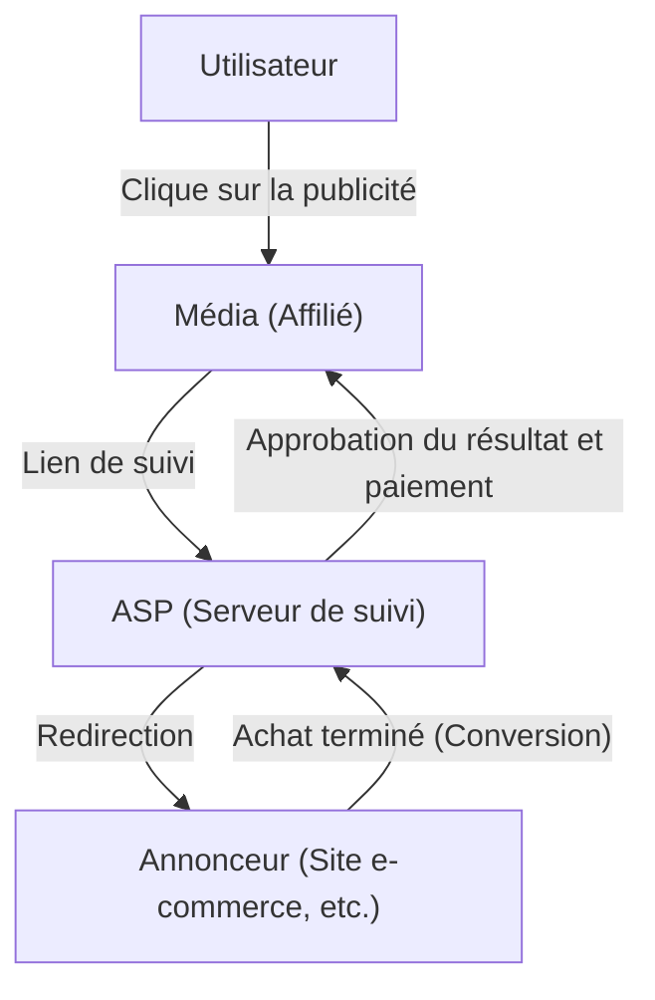
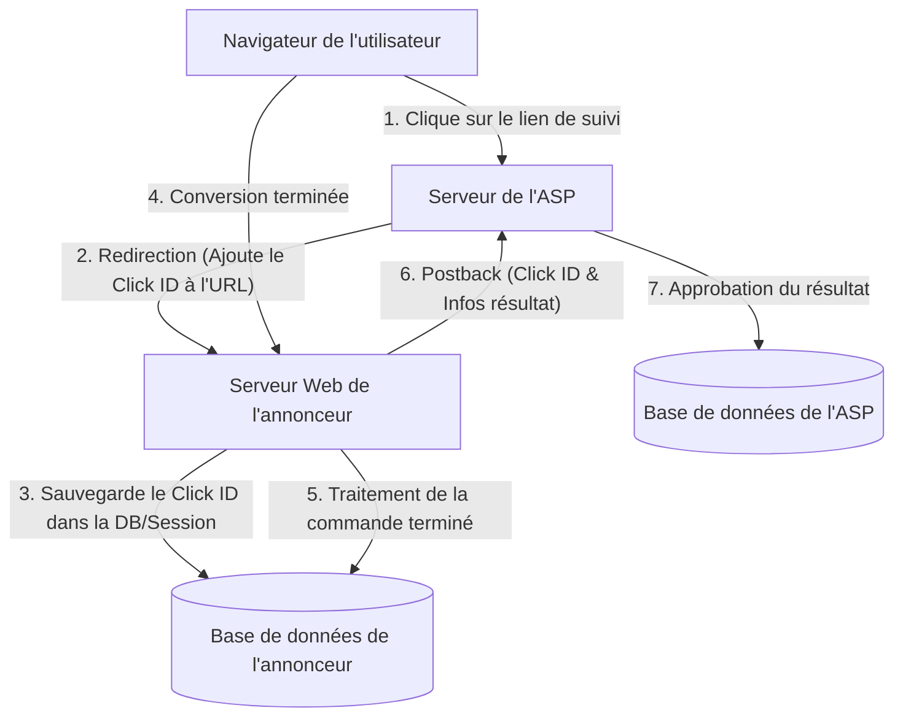

# Le mécanisme du marketing d'affiliation : les coulisses techniques du suivi et de la conversion

Sur le marché de la publicité sur Internet, la publicité au résultat (marketing d'affiliation) joue un rôle extrêmement important. Les annonceurs (marchands) ne paient des commissions que pour les "résultats" réels, tels que les ventes ou l'acquisition de leads, ce qui est largement reconnu comme une méthode de marketing très rentable.

Cependant, en coulisses, des technologies de suivi complexes et avancées sont à l'œuvre pour suivre avec précision le comportement des utilisateurs et déterminer quel média (affilié) est à l'origine du résultat.

Dans cet article, nous expliquerons de manière approfondie les coulisses techniques de l'affiliation, du rôle de l'ASP (Affiliate Service Provider), qui est au cœur du système d'affiliation, au mécanisme des URL de suivi utilisant des redirections, aux technologies de suivi côté client utilisant des cookies et LocalStorage, jusqu'au suivi côté serveur (S2S) comme contre-mesure à l'ITP (Intelligent Tracking Prevention) qui a récemment attiré l'attention.

## 1. Vue d'ensemble de l'écosystème de l'affiliation

Le marketing d'affiliation est principalement composé des quatre parties prenantes suivantes :

1. **Utilisateur (consommateur)** : Consulte les médias, clique sur les publicités et achète/s'inscrit à des produits.
2. **Média (affilié/éditeur)** : Présente des produits sur son propre site Web ou sur les réseaux sociaux pour générer du trafic.
3. **ASP (Affiliate Service Provider)** : Plateforme qui fait le lien entre les annonceurs et les médias, et gère le suivi, la mesure des résultats et le paiement des commissions.
4. **Annonceur (marchand)** : Propose des produits ou services et paie des frais publicitaires à l'ASP.

Dans cet écosystème, l'ASP est le hub technique le plus important.

L'ASP fonctionne comme une gigantesque infrastructure de données qui traite un trafic massif en temps réel, enregistrant avec une précision de la milliseconde "qui" a cliqué sur "quelle publicité" et "quand", et "quand" cela a conduit à "quel résultat".

## 2. Le mécanisme de base du suivi (côté client)

Historiquement, le suivi de l'affiliation a fortement dépendu des technologies côté client (navigateur). Ici, nous allons décomposer et expliquer le flux de suivi standard traditionnel.

### 2.1. URL de suivi et redirection

Les liens publicitaires que les affiliés placent sur leurs propres sites ne pointent pas directement vers le site de l'annonceur. Il s'agit toujours d'une "URL de suivi" qui passe d'abord par le serveur de l'ASP.

Exemple : `https://click.example-asp.com/track?aff_id=12345&campaign_id=67890`

Lorsqu'un utilisateur clique sur ce lien, le processus suivant se produit :

1. **Enregistrement du clic** : Le serveur de l'ASP enregistre dans la base de données l'adresse IP de l'utilisateur, l'User-Agent, l'horodatage, ainsi que l'identifiant de l'affilié (`aff_id`) et l'identifiant de la campagne (`campaign_id`) inclus dans l'URL.
2. **Génération du Click ID** : Un "Click ID" (identifiant de clic) est généré pour identifier de manière unique cet événement de clic.
3. **Attribution d'un Cookie** : L'ASP émet un cookie de son propre domaine (tiers) vers le navigateur de l'utilisateur et y enregistre le Click ID.
4. **Redirection** : Dès que le traitement est terminé, il renvoie une réponse HTTP 302 (Found) ou 301 (Moved Permanently) et redirige l'utilisateur vers la page de destination (LP) de l'annonceur. À ce moment, le Click ID peut également être ajouté en tant que paramètre de l'URL.

### 2.2. Le rôle des Cookies et de LocalStorage

L'utilisateur qui atteint le site de l'annonceur navigue sur le site et finit par réaliser une "conversion" (CV), comme l'achat d'un produit ou l'inscription en tant que membre.

Dans le suivi traditionnel, un code JavaScript ou une balise d'image appelée "balise de conversion (CV)" fournie par l'ASP est intégrée à la page où la conversion est terminée (page de remerciement).

Lorsque la balise de conversion est chargée, le traitement suivant est effectué :

- **Lecture du Cookie** : Le Click ID est lu à partir du cookie de l'ASP stocké dans le navigateur.
- **Envoi du résultat** : Le Click ID lu et les informations de résultat (montant de l'achat, numéro de commande, etc.) sont envoyés au serveur de l'ASP.

De plus, en prévision de l'expiration ou de la suppression des cookies, la méthode consistant à sauvegarder le Click ID dans `LocalStorage` ou `SessionStorage` de l'API Web Storage de HTML5 a également été largement utilisée.

## 3. La vague de protection de la vie privée : l'impact de l'ITP

Bien que le suivi côté client soit facile à mettre en œuvre, il présentait un problème majeur : le "suivi excessif des utilisateurs par des cookies tiers".

Face aux préoccupations croissantes en matière de confidentialité concernant la collecte de l'historique de navigation sur plusieurs sites à l'insu de l'utilisateur, les fournisseurs de navigateurs ont commencé à introduire de fortes restrictions de suivi, à commencer par l'**ITP (Intelligent Tracking Prevention)** intégrée au navigateur Safari d'Apple.

### L'impact de l'ITP sur l'affiliation

Avec l'introduction de l'ITP, l'industrie de l'affiliation a subi les effets dévastateurs suivants :

1. **Blocage total des cookies tiers** : Les cookies émis par l'ASP (cookies d'un domaine différent de celui de l'annonceur) sont désormais bloqués par défaut. Par conséquent, le suivi via les balises CV traditionnelles a cessé de fonctionner.
2. **Réduction de la durée de vie des cookies propriétaires** : Même s'il s'agit d'un cookie émis par le domaine de l'annonceur (cookie propriétaire), s'il est défini par JavaScript (`document.cookie`) via un paramètre d'URL (ex: `?click_id=...`), sa durée de validité a été réduite à un maximum de 24 heures (ou 7 jours).
3. **Restrictions sur LocalStorage** : Tout comme pour les cookies, l'accès et la durée de conservation dans des stockages tels que LocalStorage sont devenus strictement limités.

En conséquence, il est devenu impossible de mesurer des résultats avec un long délai de réalisation, comme "l'utilisateur achète quelques jours après avoir cliqué sur la publicité", ce qui a entraîné une perte d'opportunités de rémunération pour les affiliés et une détérioration du ROI (retour sur investissement) pour les annonceurs.

## 4. L'essor du suivi côté serveur (S2S) et du Postback

Alors que le stockage des données et la communication côté client (navigateur) sont limités, l'industrie de l'affiliation se tourne vers le **suivi côté serveur (Server-to-Server / S2S)**, également connu sous le nom de méthode **Postback**, comme solution.

### Architecture du suivi S2S

Dans le suivi S2S, le serveur de l'annonceur et le serveur de l'ASP communiquent directement (via API), sans dépendre des cookies du navigateur ni des balises JavaScript.

1. **Clic et redirection** : Comme auparavant, l'utilisateur clique sur le lien de l'ASP. L'ASP génère un `Click ID` unique et le transmet au site de l'annonceur en tant que paramètre d'URL lors de la redirection (ex : `https://shop.example.com/?click_id=abcde12345`).
2. **Sauvegarde côté serveur** : À la réception de la requête, le serveur Web de l'annonceur extrait le `click_id` du paramètre d'URL et l'enregistre dans une session côté serveur, une base de données, ou en tant que véritable cookie propriétaire via les en-têtes HTTP (Set-Cookie) (cela contourne facilement les restrictions ITP car cela n'implique pas JavaScript).
3. **Postback lors de la conversion** : Au moment où l'utilisateur termine son achat et que le traitement de la commande est confirmé sur le serveur de l'annonceur, ce dernier envoie directement une requête HTTP (GET ou POST) au point de terminaison spécifié (Postback URL) de l'ASP.

### Avantages du suivi S2S

- **Pas affecté par l'ITP** : Permet une mesure fiable des résultats en contournant les restrictions du navigateur.
- **Amélioration de la sécurité** : Comme la balise CV n'est pas exposée côté client, il est plus facile d'empêcher l'envoi de faux résultats (Ad Fraud).
- **Amélioration de la précision des données** : Il n'y a pas d'omissions de chargement de la balise CV dues à des erreurs réseau ou à des abandons de navigateur par l'utilisateur.

### Défis du suivi S2S

Le plus grand défi est la "barrière technique de mise en œuvre". Contrairement au simple collage d'une balise JavaScript traditionnelle en HTML, l'annonceur doit développer son système (réception des paramètres, sauvegarde en DB, traitement des requêtes API depuis le backend), ce qui augmente les coûts d'intégration pour les petits annonceurs.

Par conséquent, les ASP s'efforcent ces dernières années de réduire les obstacles à l'introduction du suivi S2S en proposant des plugins pour les principales plateformes telles que Shopify et WordPress.

## 5. Technologies de suivi de nouvelle génération

En plus du suivi S2S, l'écosystème dans son ensemble continue d'évoluer.

### 5.1. Fingerprinting (Identification alternative)
C'est une technologie qui identifie l'utilisateur de manière unique à partir d'une combinaison de son environnement de navigation (User-Agent, résolution d'écran, polices installées, adresse IP, etc.), sans dépendre des cookies ou des paramètres. Cependant, en raison des problèmes d'atteinte à la vie privée, les navigateurs prennent des mesures contre cela, ce qui en fait une méthode de moins en moins fiable.

### 5.2. Data Clean Room et GTM côté serveur
En utilisant les "Data Clean Rooms" proposées par les grandes plateformes ou les conteneurs côté serveur de Google Tag Manager (GTM), les annonceurs mettent en place des mécanismes pour lier en toute sécurité leurs données propriétaires (First-Party Data) aux ASP et aux plateformes publicitaires. Cela permet une analyse avancée de l'attribution tout en protégeant la vie privée des utilisateurs.

## Conclusion

Dans les coulisses du marketing d'affiliation, l'évolution technologique et la vague de protection de la vie privée s'entrechoquent violemment, et les mécanismes de suivi subissent des changements spectaculaires.

La transition d'un simple suivi côté client basé sur les cookies à un suivi côté serveur (S2S) plus robuste et sécurisé est désormais inévitable. Les annonceurs, les affiliés et les ASP doivent constamment se tenir au courant des dernières tendances technologiques et des réglementations légales (comme le RGPD et le CCPA) et construire des systèmes permettant de mesurer les résultats avec précision tout en respectant la vie privée des utilisateurs.

Comprendre l'architecture système de la publicité au résultat deviendra de plus en plus crucial à l'avenir pour tous les ingénieurs et spécialistes du marketing impliqués dans le marketing Web.
