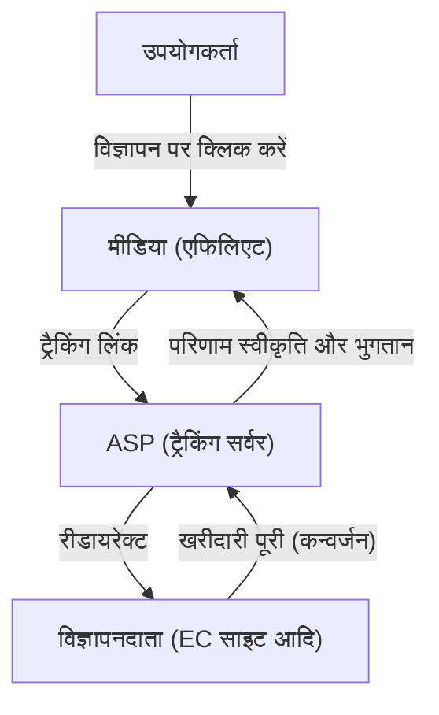
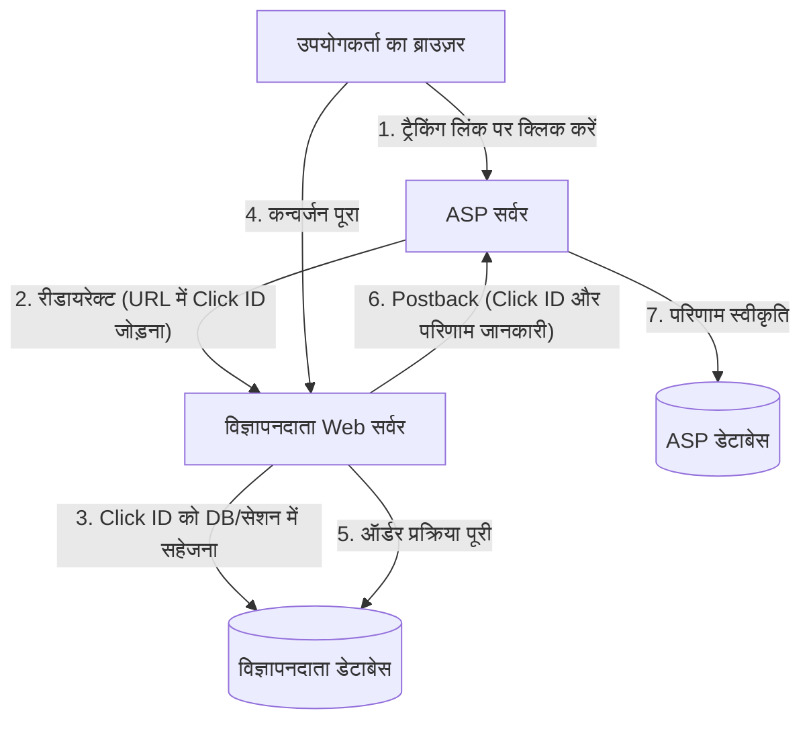

# एफिलिएट की कार्यप्रणाली: ट्रैकिंग और कन्वर्जन के तकनीकी पहलू

इंटरनेट विज्ञापन बाज़ार में, प्रदर्शन-आधारित विज्ञापन (एफिलिएट मार्केटिंग) एक अत्यंत महत्वपूर्ण भूमिका निभाते हैं। विज्ञापनदाता (मर्चेंट) केवल वास्तविक बिक्री या लीड जनरेशन जैसे 'परिणामों' के लिए ही भुगतान करते हैं, इसलिए इसे व्यापक रूप से एक लागत-प्रभावी मार्केटिंग रणनीति माना जाता है।

हालाँकि, इसके पीछे उपयोगकर्ता के व्यवहार को सटीक रूप से ट्रैक करने और यह निर्धारित करने के लिए कि किस मीडिया (एफिलिएट) के रेफरल से परिणाम प्राप्त हुआ है, उन्नत और जटिल ट्रैकिंग तकनीकें काम कर रही हैं।

इस लेख में, हम एफिलिएट सिस्टम के मूल में ASP (एफिलिएट सर्विस प्रोवाइडर) की भूमिका से लेकर, रीडायरेक्ट का उपयोग करने वाले ट्रैकिंग URL के तंत्र, कुकीज़ और लोकल स्टोरेज (LocalStorage) का उपयोग करने वाली क्लाइंट-साइड ट्रैकिंग तकनीक, और हाल ही में ITP (Intelligent Tracking Prevention) उपायों के रूप में ध्यान आकर्षित कर रहे सर्वर-साइड ट्रैकिंग (S2S) तक, एफिलिएट के तकनीकी पहलुओं की विस्तार से व्याख्या करेंगे।

## 1. एफिलिएट इकोसिस्टम का समग्र दृश्य

एफिलिएट मार्केटिंग में मुख्य रूप से निम्नलिखित 4 हितधारक (स्टेकहोल्डर्स) शामिल होते हैं।

1. **उपयोगकर्ता (उपभोक्ता)**: मीडिया ब्राउज़ करते हैं, विज्ञापनों पर क्लिक करते हैं और उत्पादों की खरीदारी या आवेदन करते हैं।
2. **मीडिया (एफिलिएट / पब्लिशर)**: अपनी वेबसाइटों या SNS पर उत्पादों का प्रचार करते हैं और ट्रैफ़िक उत्पन्न करते हैं।
3. **ASP (एफिलिएट सर्विस प्रोवाइडर)**: एक प्लेटफ़ॉर्म जो विज्ञापनदाताओं और मीडिया के बीच मध्यस्थ के रूप में कार्य करता है, और ट्रैकिंग, परिणाम मापन और पारिश्रमिक भुगतान का प्रबंधन करता है।
4. **विज्ञापनदाता (मर्चेंट)**: उत्पाद या सेवाएँ प्रदान करते हैं और ASP को विज्ञापन शुल्क का भुगतान करते हैं।

इस इकोसिस्टम में, सबसे तकनीकी केंद्र ASP होता है।

ASP भारी ट्रैफ़िक को वास्तविक समय (रियल-टाइम) में संसाधित करता है और 'किसने', 'किस विज्ञापन पर', 'कब' क्लिक किया, और यह 'कब' 'किस परिणाम' में बदल गया, इसे मिलीसेकंड की सटीकता के साथ रिकॉर्ड करने वाले एक विशाल डेटा बेस के रूप में कार्य करता है।

## 2. ट्रैकिंग का मूल तंत्र (क्लाइंट साइड)

ऐतिहासिक रूप से, एफिलिएट ट्रैकिंग क्लाइंट-साइड (ब्राउज़र) तकनीकों पर बहुत अधिक निर्भर रही है। यहाँ हम पारंपरिक मानक ट्रैकिंग फ्लो को विभाजित करके समझाते हैं।

### 2.1. ट्रैकिंग URL और रीडायरेक्ट

एफिलिएट्स द्वारा अपनी साइटों पर पोस्ट किए गए विज्ञापन लिंक सीधे विज्ञापनदाता की साइट की ओर इशारा नहीं करते हैं। वे हमेशा 'ट्रैकिंग URL' होते हैं जो पहले ASP के सर्वर से होकर गुज़रते हैं।

उदाहरण: `https://click.example-asp.com/track?aff_id=12345&campaign_id=67890`

जब कोई उपयोगकर्ता इस लिंक पर क्लिक करता है, तो निम्नलिखित प्रक्रिया होती है:

1. **क्लिक रिकॉर्ड करना**: ASP का सर्वर एक्सेस करने वाले उपयोगकर्ता का IP पता, User-Agent, टाइमस्टैम्प, और URL में शामिल एफिलिएट ID (`aff_id`) या कैंपेन ID (`campaign_id`) को डेटाबेस में रिकॉर्ड करता है।
2. **क्लिक ID जनरेट करना**: इस क्लिक इवेंट की विशिष्ट रूप से पहचान करने के लिए एक 'क्लिक ID' (Click ID) उत्पन्न की जाती है।
3. **कुकी प्रदान करना**: ASP उपयोगकर्ता के ब्राउज़र को अपने डोमेन (थर्ड-पार्टी) की कुकी जारी करता है और उसमें क्लिक ID को सहेजता है।
4. **रीडायरेक्ट**: प्रक्रिया पूरी होते ही, यह HTTP 302 (Found) या 301 (Moved Permanently) रिस्पॉन्स देता है और उपयोगकर्ता को विज्ञापनदाता के लैंडिंग पेज (LP) पर रीडायरेक्ट करता है। इस समय, URL पैरामीटर के रूप में क्लिक ID को भी जोड़ा जा सकता है।

### 2.2. कुकीज़ और लोकल स्टोरेज की भूमिका

विज्ञापनदाता की साइट पर पहुँचने वाला उपयोगकर्ता साइट को ब्राउज़ करता है, और अंततः उत्पाद खरीदने या सदस्य के रूप में पंजीकरण करने जैसे 'कन्वर्जन (CV)' तक पहुँचता है।

पारंपरिक ट्रैकिंग में, उस पेज पर (थैंक यू पेज) जहाँ कन्वर्जन पूरा होता है, ASP द्वारा प्रदान किया गया JavaScript या इमेज टैग जिसे 'कन्वर्जन टैग (CV टैग)' कहा जाता है, एम्बेडेड होता है।

जब कन्वर्जन टैग लोड होता है, तो निम्नलिखित प्रक्रियाएँ निष्पादित होती हैं:

- **कुकी पढ़ना**: यह ब्राउज़र में सहेजी गई ASP की कुकी से क्लिक ID पढ़ता है।
- **परिणाम भेजना**: यह पढ़ी गई क्लिक ID और परिणाम की जानकारी (खरीद राशि, ऑर्डर संख्या, आदि) ASP के सर्वर को भेजता है।

इसके अलावा, कुकी की समाप्ति या उसे हटाए जाने की स्थिति में, HTML5 के Web Storage API, `LocalStorage` या `SessionStorage` में क्लिक ID को बैकअप के रूप में सहेजने की विधि का भी व्यापक रूप से उपयोग किया जाता रहा है।

## 3. गोपनीयता संरक्षण की लहर: ITP का प्रभाव

क्लाइंट-साइड ट्रैकिंग को लागू करना आसान है, लेकिन इसमें एक बड़ी समस्या थी। वह है 'थर्ड-पार्टी कुकीज़ के माध्यम से अत्यधिक उपयोगकर्ता ट्रैकिंग'।

बिना उपयोगकर्ता की जानकारी के कई साइटों पर व्यवहार के इतिहास को एकत्र किए जाने के कारण गोपनीयता संबंधी चिंताएँ बढ़ गईं, और Apple के Safari ब्राउज़र में शामिल **ITP (Intelligent Tracking Prevention)** सहित विभिन्न ब्राउज़र वेंडरों ने सख्त ट्रैकिंग प्रतिबंध लागू करना शुरू कर दिया।

### ITP का एफिलिएट पर प्रभाव

ITP के लागू होने से एफिलिएट उद्योग पर निम्नलिखित विनाशकारी प्रभाव पड़े:

1. **थर्ड-पार्टी कुकीज़ का पूर्ण ब्लॉक**: ASP द्वारा जारी की जाने वाली कुकीज़ (विज्ञापनदाता के डोमेन से अलग डोमेन की कुकीज़) अब डिफ़ॉल्ट रूप से ब्लॉक कर दी गई हैं। इसके परिणामस्वरूप, पारंपरिक CV टैग द्वारा ट्रैकिंग ने काम करना बंद कर दिया।
2. **फर्स्ट-पार्टी कुकीज़ की वैधता अवधि का छोटा होना**: भले ही यह विज्ञापनदाता के डोमेन (फर्स्ट-पार्टी कुकी) से जारी की गई कुकी हो, यदि इसे URL पैरामीटर (उदाहरण: `?click_id=...`) के माध्यम से JavaScript (`document.cookie`) द्वारा सेट किया गया है, तो इसकी वैधता अवधि अधिकतम 24 घंटे (या 7 दिन) तक कम कर दी गई।
3. **LocalStorage पर प्रतिबंध**: कुकीज़ की तरह, LocalStorage जैसे स्टोरेज तक पहुँच और सहेजने की अवधि को भी सख्ती से प्रतिबंधित कर दिया गया।

इसके परिणामस्वरूप, ऐसे परिणामों को मापना असंभव हो गया जहाँ लीड टाइम लंबा हो, जैसे कि 'उपयोगकर्ता विज्ञापन पर क्लिक करने के कई दिनों बाद खरीदारी करता है', जिससे एफिलिएट्स को राजस्व के अवसरों का नुकसान हुआ और विज्ञापनदाताओं के ROI (निवेश पर प्रतिफल) में गिरावट आई।

## 4. सर्वर-साइड ट्रैकिंग (S2S) और पोस्टबैक का उदय

क्लाइंट-साइड (ब्राउज़र) पर डेटा संग्रहण और संचार प्रतिबंधित होने के बीच, एफिलिएट उद्योग एक समाधान के रूप में **सर्वर-साइड ट्रैकिंग (Server-to-Server / S2S)**, जिसे **पोस्टबैक (Postback) विधि** के रूप में भी जाना जाता है, की ओर बढ़ रहा है।

### S2S ट्रैकिंग का आर्किटेक्चर

S2S ट्रैकिंग में, ब्राउज़र की कुकीज़ या JavaScript टैग पर निर्भर किए बिना, विज्ञापनदाता का सर्वर और ASP का सर्वर सीधे (API के माध्यम से) संवाद करते हैं।

1. **क्लिक और रीडायरेक्ट**: हमेशा की तरह, उपयोगकर्ता ASP के लिंक पर क्लिक करता है। ASP एक विशिष्ट `Click ID` उत्पन्न करता है और इसे रीडायरेक्ट के समय URL पैरामीटर के रूप में विज्ञापनदाता की साइट पर भेजता है (उदाहरण: `https://shop.example.com/?click_id=abcde12345`)।
2. **सर्वर-साइड पर सहेजना**: जब विज्ञापनदाता का Web सर्वर अनुरोध प्राप्त करता है, तो वह URL पैरामीटर से `click_id` निकालता है और इसे सर्वर-साइड सेशन या डेटाबेस में, या HTTP हेडर (Set-Cookie) का उपयोग करके एक सच्चे फर्स्ट-पार्टी कुकी के रूप में सहेजता है (चूँकि यह JavaScript के माध्यम से नहीं होता है, इसलिए यह ITP प्रतिबंधों के प्रति कम संवेदनशील है)।
3. **कन्वर्जन के समय पोस्टबैक**: जब उपयोगकर्ता खरीदारी पूरी कर लेता है और विज्ञापनदाता के सर्वर पर ऑर्डर की पुष्टि हो जाती है, तो विज्ञापनदाता के सर्वर से सीधे ASP द्वारा निर्दिष्ट एंडपॉइंट (Postback URL) पर एक HTTP अनुरोध (GET या POST) भेजा जाता है।

### S2S ट्रैकिंग के लाभ

- **ITP से अप्रभावित**: चूँकि ब्राउज़र के प्रतिबंधों से बचा जा सकता है, इसलिए विश्वसनीय परिणाम मापन संभव है।
- **सुरक्षा में सुधार**: चूँकि CV टैग क्लाइंट साइड पर उजागर नहीं होते हैं, इसलिए फर्जी परिणाम प्रस्तुतियों (एड फ्रॉड) को रोकना आसान हो जाता है।
- **डेटा सटीकता में सुधार**: नेटवर्क त्रुटियों या उपयोगकर्ताओं द्वारा ब्राउज़र छोड़ने के कारण CV टैग लोड होने से चूकने जैसी समस्याएँ नहीं होती हैं।

### S2S ट्रैकिंग की चुनौतियाँ

सबसे बड़ी चुनौती 'कार्यान्वयन की तकनीकी बाधा' है। HTML में पारंपरिक JavaScript टैग चिपकाने के काम की तुलना में, विज्ञापनदाता पक्ष पर सिस्टम विकास (पैरामीटर प्राप्त करना, DB में सहेजना, बैकएंड से API अनुरोधों को संसाधित करना) की आवश्यकता होती है, जिससे छोटे विज्ञापनदाताओं के लिए कार्यान्वयन की लागत अधिक हो जाती है।

इसलिए, हाल के वर्षों में, ASPs Shopify और WordPress जैसे प्रमुख प्लेटफ़ॉर्म के लिए प्लगइन्स प्रदान करके S2S ट्रैकिंग के लिए कार्यान्वयन की बाधाओं को कम करने का प्रयास कर रहे हैं।

## 5. अगली पीढ़ी की ट्रैकिंग तकनीकें

S2S ट्रैकिंग के अलावा, पूरे इकोसिस्टम में और भी प्रगति हो रही है।

### 5.1. फ़िंगरप्रिंटिंग (वैकल्पिक पहचान)
यह एक ऐसी तकनीक है जो कुकीज़ या मापदंडों पर भरोसा किए बिना, उपयोगकर्ता के ब्राउज़र परिवेश (User-Agent, स्क्रीन रिज़ॉल्यूशन, इंस्टॉल किए गए फ़ॉन्ट, IP पता, आदि) के संयोजन से उपयोगकर्ताओं की विशिष्ट पहचान करती है। हालाँकि, गोपनीयता उल्लंघन के दृष्टिकोण से ब्राउज़र पक्ष पर भी इसका मुकाबला किया जा रहा है, और अब इसे पूरी तरह से विश्वसनीय तरीका नहीं माना जाता है।

### 5.2. डेटा क्लीन रूम और सर्वर-साइड GTM
प्रमुख प्लेटफ़ॉर्मर्स द्वारा प्रदान किए गए 'डेटा क्लीन रूम' या Google Tag Manager (GTM) के सर्वर-साइड कंटेनरों का उपयोग करके, विज्ञापनदाता ASPs और विज्ञापन प्लेटफ़ॉर्म के साथ अपने फर्स्ट-पार्टी डेटा को सुरक्षित रूप से लिंक करने के लिए सिस्टम बना रहे हैं। इससे उपयोगकर्ता की गोपनीयता की रक्षा करते हुए उन्नत एट्रिब्यूशन विश्लेषण (Attribution Analysis) संभव हो रहा है।

## निष्कर्ष

एफिलिएट मार्केटिंग के पीछे, तकनीकी प्रगति और गोपनीयता संरक्षण की लहरों के बीच तीव्र टकराव हो रहा है, और ट्रैकिंग तंत्र नाटकीय बदलावों के दौर से गुज़र रहे हैं।

सरल कुकी-आधारित क्लाइंट-साइड ट्रैकिंग से अधिक मज़बूत और सुरक्षित सर्वर-साइड ट्रैकिंग (S2S) की ओर बढ़ना अब अपरिहार्य हो गया है। विज्ञापनदाताओं, एफिलिएट्स और ASPs को लगातार नवीनतम तकनीकी रुझानों और कानूनी नियमों (जैसे GDPR और CCPA) के साथ अद्यतित रहना होगा, और ऐसे सिस्टम बनाने की आवश्यकता है जो उपयोगकर्ता की गोपनीयता का सम्मान करते हुए सटीक परिणाम मापन सुनिश्चित करें।

प्रदर्शन-आधारित विज्ञापनों के सिस्टम आर्किटेक्चर को समझना, वेब मार्केटिंग में शामिल सभी इंजीनियरों और मार्केटर्स के लिए भविष्य में और भी महत्वपूर्ण हो जाएगा।
