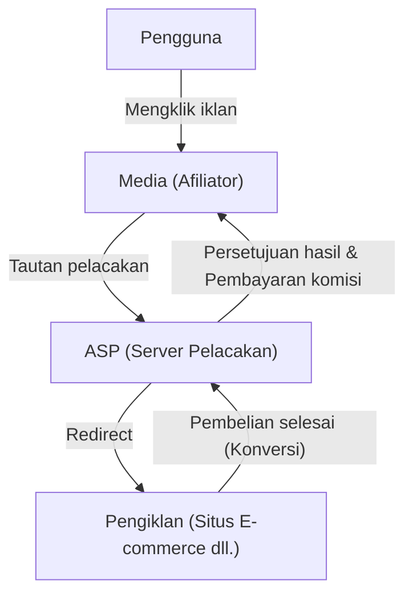
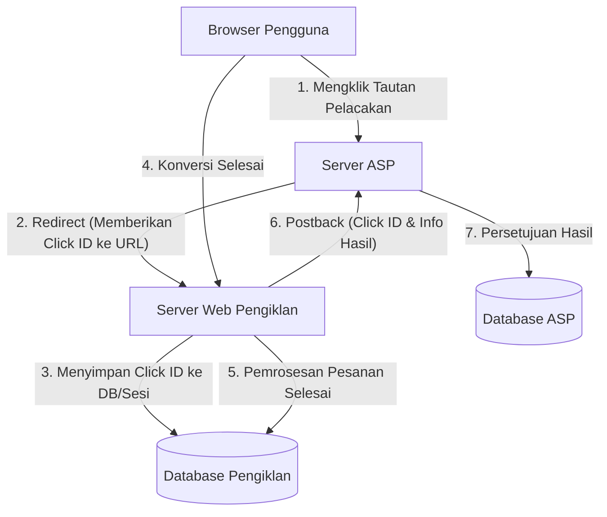

# Mekanisme Afiliasi: Di Balik Layar Teknologi Pelacakan dan Konversi

Di pasar periklanan internet, iklan berbasis kinerja (pemasaran afiliasi) memainkan peran yang sangat penting. Pengiklan (merchant) hanya membayar komisi untuk "hasil" yang nyata seperti penjualan atau perolehan prospek, sehingga dikenal luas sebagai metode pemasaran yang sangat hemat biaya.

Namun, di balik layar, terdapat teknologi pelacakan (tracking) yang canggih dan kompleks yang beroperasi untuk melacak perilaku pengguna secara akurat dan menentukan media (afiliator) mana yang menghasilkan rujukan tersebut.

Dalam artikel ini, kami akan menjelaskan secara menyeluruh tentang teknologi di balik afiliasi, mulai dari peran ASP (Affiliate Service Provider) sebagai inti dari sistem afiliasi, mekanisme URL pelacakan yang menggunakan pengalihan (redirect), teknologi pelacakan sisi klien menggunakan Cookie dan LocalStorage, hingga pelacakan sisi server (S2S) sebagai penanggulangan ITP (Intelligent Tracking Prevention) yang belakangan ini menarik banyak perhatian.

## 1. Gambaran Umum Ekosistem Afiliasi

Pemasaran afiliasi utamanya terdiri dari empat pemangku kepentingan berikut:

1. **Pengguna (Konsumen)**: Menelusuri media, mengklik iklan, serta membeli atau mendaftar untuk suatu produk.
2. **Media (Afiliator/Publisher)**: Memperkenalkan produk di situs web atau media sosial mereka sendiri untuk menghasilkan lalu lintas (traffic).
3. **ASP (Affiliate Service Provider)**: Platform yang menjembatani pengiklan dan media, serta mengelola pelacakan, pengukuran hasil, dan pembayaran komisi.
4. **Pengiklan (Merchant)**: Menyediakan produk atau layanan dan membayar biaya iklan kepada ASP.

Dalam ekosistem ini, pusat teknologi terpentingnya adalah ASP.

ASP berfungsi sebagai basis data raksasa yang memproses lalu lintas dalam jumlah sangat besar secara real-time, merekam dengan tingkat presisi milidetik mengenai "siapa" yang mengklik "iklan yang mana" dan "kapan", serta "kapan" dan "hasil apa" yang ditimbulkannya.

## 2. Mekanisme Dasar Pelacakan (Sisi Klien)

Secara historis, pelacakan afiliasi sangat bergantung pada teknologi sisi klien (browser). Di sini, kami akan membedah dan menjelaskan alur pelacakan standar konvensional.

### 2.1. URL Pelacakan dan Pengalihan (Redirect)

Tautan iklan yang dipasang afiliator di situs mereka tidak mengarah langsung ke situs pengiklan. Tautan tersebut selalu berupa "URL pelacakan" yang melewati server ASP terlebih dahulu.

Contoh: `https://click.example-asp.com/track?aff_id=12345&campaign_id=67890`

Ketika pengguna mengklik tautan ini, proses berikut terjadi:

1. **Perekaman Klik**: Server ASP mencatat alamat IP pengguna, User-Agent, stempel waktu, serta ID Afiliasi (`aff_id`) dan ID Kampanye (`campaign_id`) yang terdapat di URL ke dalam database.
2. **Pembuatan ID Klik (Click ID)**: Sebuah "ID Klik (Click ID)" dihasilkan untuk mengidentifikasi peristiwa klik ini secara unik.
3. **Pemberian Cookie**: ASP menerbitkan Cookie dari domain mereka sendiri (pihak ketiga) ke browser pengguna, dan menyimpan ID Klik di dalamnya.
4. **Pengalihan (Redirect)**: Begitu proses selesai, server mengembalikan respons HTTP 302 (Found) atau 301 (Moved Permanently) dan mengalihkan pengguna ke Halaman Landas (Landing Page/LP) pengiklan. Pada saat ini, ID Klik juga terkadang ditambahkan sebagai parameter URL.

### 2.2. Peran Cookie dan LocalStorage

Pengguna yang mencapai situs pengiklan akan menjelajahi situs tersebut dan pada akhirnya melakukan "Konversi (CV)" seperti pembelian produk atau pendaftaran anggota.

Pada pelacakan konvensional, halaman tempat konversi selesai (Thank You Page) ditanami tag JavaScript atau gambar yang disediakan oleh ASP, yang disebut "Tag Konversi (CV Tag)".

Ketika tag konversi dimuat, proses berikut berlangsung:

- **Pembacaan Cookie**: ID Klik dibaca dari Cookie ASP yang tersimpan di browser.
- **Pengiriman Hasil**: ID Klik yang telah dibaca beserta informasi hasil (jumlah pembelian, nomor pesanan, dll.) dikirim ke server ASP.

Selain itu, untuk mengantisipasi kadaluwarsa atau penghapusan Cookie, metode penyimpanan cadangan untuk ID Klik juga sering digunakan, seperti API Web Storage HTML5, yaitu `LocalStorage` atau `SessionStorage`.

## 3. Gelombang Perlindungan Privasi: Dampak ITP

Meskipun pelacakan sisi klien mudah diimplementasikan, hal itu menyimpan masalah besar. Masalah tersebut adalah "pelacakan pengguna yang berlebihan oleh Cookie pihak ketiga".

Seiring dengan meningkatnya kekhawatiran terkait privasi atas pengumpulan riwayat perilaku di berbagai situs tanpa sepengetahuan pengguna, para vendor browser mulai memberlakukan pembatasan pelacakan yang ketat, dipelopori oleh **ITP (Intelligent Tracking Prevention)** yang disematkan pada browser Safari milik Apple.

### Dampak ITP terhadap Afiliasi

Dengan diperkenalkannya ITP, industri afiliasi mengalami dampak yang sangat merusak sebagai berikut:

1. **Pemblokiran Total Cookie Pihak Ketiga**: Cookie yang diterbitkan oleh ASP (Cookie dari domain yang berbeda dari domain pengiklan) sekarang diblokir secara default. Akibatnya, pelacakan dengan tag CV konvensional tidak lagi berfungsi.
2. **Pemendekan Masa Berlaku Cookie Pihak Pertama**: Meskipun berupa Cookie yang diterbitkan dari domain pengiklan (Cookie Pihak Pertama), jika disetel melalui JavaScript (`document.cookie`) yang berasal dari parameter URL (misalnya: `?click_id=...`), masa berlakunya dipersingkat menjadi maksimal 24 jam (atau 7 hari).
3. **Pembatasan LocalStorage**: Sama seperti Cookie, akses ke penyimpanan seperti LocalStorage serta durasi penyimpanannya juga dibatasi secara ketat.

Akibatnya, hasil dengan jeda waktu panjang, seperti "pengguna mengklik iklan, lalu melakukan pembelian beberapa hari kemudian", tidak dapat lagi diukur, yang menyebabkan hilangnya peluang komisi bagi afiliator dan memburuknya ROI (Pengembalian Investasi) bagi pengiklan.

## 4. Kebangkitan Pelacakan Sisi Server (S2S) dan Postback

Di tengah pembatasan penyimpanan data dan komunikasi di sisi klien (browser), industri afiliasi mulai beralih ke solusi yang disebut **Pelacakan Sisi Server (Server-to-Server / S2S)**, atau sering juga disebut **Metode Postback**.

### Arsitektur Pelacakan S2S

Dalam pelacakan S2S, server pengiklan dan server ASP berkomunikasi secara langsung (melalui API) tanpa bergantung pada Cookie browser maupun tag JavaScript.

1. **Klik dan Pengalihan**: Seperti sebelumnya, pengguna mengklik tautan ASP. ASP menghasilkan `Click ID` unik dan meneruskannya ke situs pengiklan sebagai parameter URL saat pengalihan (misalnya: `https://shop.example.com/?click_id=abcde12345`).
2. **Penyimpanan di Sisi Server**: Saat menerima permintaan, server Web pengiklan mengekstrak `click_id` dari parameter URL dan menyimpannya di sesi server, database, atau sebagai Cookie pihak pertama sejati menggunakan header HTTP (Set-Cookie), sehingga terhindar dari pembatasan ITP karena tidak melewati JavaScript.
3. **Postback saat Konversi**: Saat pengguna menyelesaikan pembelian dan pesanan dikonfirmasi oleh server pengiklan, server pengiklan mengirimkan permintaan HTTP (GET atau POST) secara langsung ke titik akhir (Endpoint/Postback URL) yang telah ditentukan oleh ASP.

### Keuntungan Pelacakan S2S

- **Tidak Terpengaruh oleh ITP**: Karena dapat menghindari pembatasan browser, pengukuran hasil yang akurat dapat dipastikan.
- **Peningkatan Keamanan**: Karena tidak mengekspos tag CV ke sisi klien, pengiriman hasil yang curang (Ad Fraud) menjadi lebih mudah dicegah.
- **Peningkatan Presisi Data**: Tidak ada kegagalan pemuatan tag CV akibat kesalahan jaringan atau pengguna yang menutup browser lebih awal.

### Tantangan Pelacakan S2S

Tantangan terbesarnya adalah "rintangan teknologi dalam implementasi". Dibandingkan dengan pekerjaan sederhana seperti menempelkan tag JavaScript ke dalam HTML, metode ini memerlukan pengembangan sistem di pihak pengiklan (menerima parameter, menyimpan ke DB, pemrosesan permintaan API dari backend). Hal ini mengakibatkan biaya implementasi yang tinggi bagi pengiklan berskala kecil.

Oleh karena itu, beberapa tahun terakhir ASP telah berupaya menurunkan rintangan implementasi pelacakan S2S dengan menyediakan plugin untuk platform-platform utama seperti Shopify dan WordPress.

## 5. Teknologi Pelacakan Generasi Berikutnya

Selain pelacakan S2S, ekosistem periklanan juga terus berevolusi.

### 5.1. Fingerprinting (Identifikasi Alternatif)
Ini adalah teknologi untuk mengidentifikasi pengguna secara unik dari kombinasi lingkungan browser pengguna (User-Agent, resolusi layar, font yang diinstal, alamat IP, dll.) tanpa bergantung pada Cookie atau parameter. Namun, tindakan balasan dari pihak browser juga sedang berlangsung terkait masalah pelanggaran privasi, menjadikannya bukan lagi metode yang dapat diandalkan sepenuhnya.

### 5.2. Data Clean Room dan Server-Side GTM
Dengan memanfaatkan "Data Clean Room" yang ditawarkan oleh perusahaan platform besar, atau kontainer sisi server dari Google Tag Manager (GTM), pengiklan membangun mekanisme untuk mengintegrasikan data pihak pertama mereka dengan ASP maupun platform periklanan secara aman. Hal ini memungkinkan analisis atribusi tingkat lanjut sambil tetap melindungi privasi pengguna.

## Kesimpulan

Di balik layar pemasaran afiliasi, kemajuan teknologi dan gelombang perlindungan privasi bertabrakan dengan hebat, membuat mekanisme pelacakan mengalami perubahan yang dramatis.

Transisi dari pelacakan sisi klien berbasis Cookie yang sederhana ke pelacakan sisi server (S2S) yang lebih kuat dan aman sudah tidak dapat dihindari lagi. Pengiklan, afiliator, dan ASP harus selalu mengikuti tren teknologi dan regulasi hukum (seperti GDPR dan CCPA) terbaru guna membangun sistem yang mampu mewujudkan pengukuran hasil yang akurat sekaligus menghormati privasi pengguna.

Memahami arsitektur sistem iklan berbasis kinerja akan menjadi semakin penting bagi setiap insinyur dan pemasar yang terlibat dalam pemasaran web di masa mendatang.
