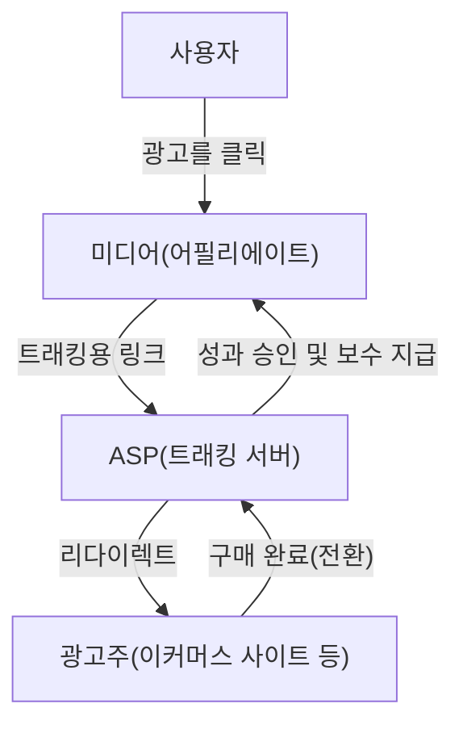
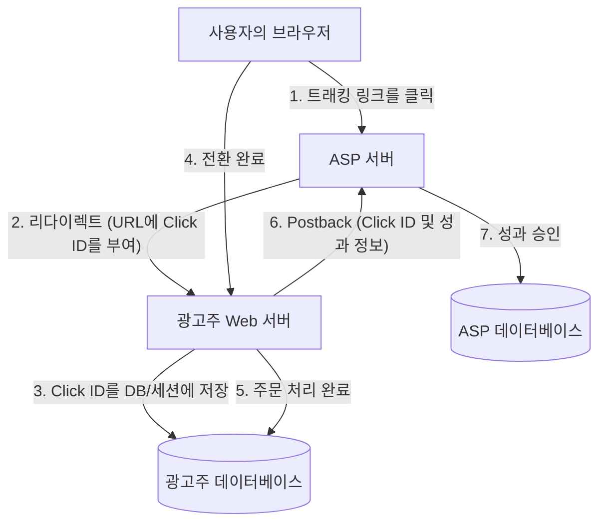

# 제휴 마케팅의 구조: 트래킹 및 전환의 기술적 이면

인터넷 광고 시장에서 성과 보상형 광고(제휴 마케팅)는 매우 중요한 역할을 수행하고 있습니다. 광고주(머천트)는 실제 매출이나 리드 획득과 같은 '성과'에 대해서만 보수를 지급하기 때문에 비용 대비 효과가 높은 마케팅 기법으로 널리 인식되고 있습니다.

하지만 그 이면에는 사용자의 행동을 정확하게 추적하고, 어떤 미디어(어필리에이트)의 소개를 통해 성과가 발생했는지를 판정하기 위한 고도화되고 복잡한 트래킹 기술이 작동하고 있습니다.

본 기사에서는 제휴 시스템의 핵심을 담당하는 ASP(어필리에이트 서비스 프로바이더)의 역할부터, 리다이렉트를 이용한 트래킹 URL의 구조, 쿠키(Cookie)나 로컬 스토리지(LocalStorage)를 활용한 클라이언트 사이드 추적 기술, 그리고 최근 주목받고 있는 ITP(Intelligent Tracking Prevention) 대책인 서버 사이드 트래킹(S2S)에 이르기까지, 제휴 마케팅의 기술적인 이면을 철저하게 해설합니다.

## 1. 제휴 마케팅 생태계의 전체적인 모습

제휴 마케팅은 주로 다음의 4가지 이해관계자로 구성되어 있습니다.

1. **사용자(소비자)**: 미디어를 열람하고 광고를 클릭하여 상품을 구매하거나 신청합니다.
2. **미디어(어필리에이트/퍼블리셔)**: 자신의 웹사이트나 SNS에 상품을 소개하고 트래픽을 창출합니다.
3. **ASP(어필리에이트 서비스 프로바이더)**: 광고주와 미디어를 중개하며, 트래킹, 성과 측정, 보수 지급 관리를 수행하는 플랫폼입니다.
4. **광고주(머천트)**: 상품이나 서비스를 제공하고 ASP에 광고비를 지불합니다.

이 생태계에서 기술적인 중심 허브 역할을 하는 것이 바로 ASP입니다.

ASP는 방대한 트래픽을 실시간으로 처리하며, '누가' '어떤 광고를' '언제' 클릭했고, 그것이 '언제' '어떤 성과'로 이어졌는지를 밀리초 단위의 정밀도로 기록하는 거대한 데이터 기반으로 기능하고 있습니다.

## 2. 트래킹의 기본 메커니즘(클라이언트 사이드)

제휴 트래킹은 역사적으로 클라이언트 사이드(브라우저) 기술에 크게 의존해 왔습니다. 여기서는 기존의 표준적인 트래킹 흐름을 분해하여 설명합니다.

### 2.1. 트래킹 URL과 리다이렉트

어필리에이트가 자신의 사이트에 게재하는 광고 링크는 직접적으로 광고주의 사이트를 가리키는 것이 아닙니다. 반드시 한 번은 ASP의 서버를 경유하는 '트래킹 URL'로 되어 있습니다.

예: `https://click.example-asp.com/track?aff_id=12345&campaign_id=67890`

사용자가 이 링크를 클릭하면 다음의 프로세스가 발생합니다.

1. **클릭 기록**: ASP 서버는 접속한 사용자의 IP 주소, User-Agent, 타임스탬프, 그리고 URL에 포함된 어필리에이트 ID(`aff_id`)나 캠페인 ID(`campaign_id`)를 데이터베이스에 기록합니다.
2. **클릭 ID 생성**: 이 클릭 이벤트를 고유하게 식별하기 위한 '클릭 ID(Click ID)'가 생성됩니다.
3. **쿠키 부여**: ASP는 사용자의 브라우저에 대해 자사 도메인(서드 파티)의 쿠키를 발행하고, 그곳에 클릭 ID를 저장합니다.
4. **리다이렉트**: 처리가 완료됨과 동시에 HTTP 302(Found) 또는 301(Moved Permanently) 응답을 반환하여, 광고주의 랜딩 페이지(LP)로 사용자를 리다이렉트 시킵니다. 이때 URL의 파라미터로 클릭 ID를 부여하기도 합니다.

### 2.2. 쿠키와 로컬 스토리지의 역할

광고주의 사이트에 도달한 사용자는 사이트 내부를 돌아다니다가, 최종적으로 상품 구매나 회원 가입 등의 '전환(CV)'에 이르게 됩니다.

기존의 트래킹에서는 전환이 완료된 페이지(감사 페이지)에 ASP가 제공하는 '전환 태그(CV 태그)'라고 불리는 JavaScript나 이미지 태그가 삽입되어 있습니다.

전환 태그가 로드되면 다음의 처리가 수행됩니다.

- **쿠키 읽기**: 브라우저에 저장되어 있는 ASP의 쿠키에서 클릭 ID를 읽어옵니다.
- **성과 전송**: 읽어온 클릭 ID와 성과 정보(구매 금액, 주문 번호 등)를 ASP 서버에 전송합니다.

또한, 쿠키의 만료나 삭제에 대비하여 HTML5의 Web Storage API인 `LocalStorage`나 `SessionStorage`에 클릭 ID를 백업으로 저장하는 기법도 널리 사용되어 왔습니다.

## 3. 개인정보 보호의 물결: ITP의 충격

클라이언트 사이드 트래킹은 구현이 용이한 반면, 큰 문제를 안고 있었습니다. 바로 '서드 파티 쿠키에 의한 과도한 사용자 추적'입니다.

사용자가 모르는 사이에 여러 사이트를 횡단하며 행동 이력이 수집되는 것에 대한 개인정보 보호 우려가 높아지면서, Apple의 Safari 브라우저에 탑재된 **ITP(Intelligent Tracking Prevention)**를 시작으로 각 브라우저 공급업체들이 강력한 트래킹 제한을 도입하기 시작했습니다.

### ITP가 제휴 마케팅에 미친 영향

ITP의 도입으로 인해 제휴 마케팅 업계는 다음과 같은 치명적인 영향을 받았습니다.

1. **서드 파티 쿠키의 전면 차단**: ASP가 발행하는 쿠키(광고주 도메인과는 다른 도메인의 쿠키)가 기본적으로 차단되게 되었습니다. 이로 인해 기존의 CV 태그를 통한 트래킹은 기능하지 않게 되었습니다.
2. **퍼스트 파티 쿠키의 유효 기간 단축**: 광고주 도메인에서 발행된 쿠키(퍼스트 파티 쿠키)라 할지라도, URL 파라미터(예: `?click_id=...`)를 경유하여 JavaScript(`document.cookie`)로 설정된 경우, 그 유효 기간이 최대 24시간(또는 7일)으로 단축되었습니다.
3. **로컬 스토리지 제한**: 쿠키와 마찬가지로 로컬 스토리지 등의 저장소에 대한 접근이나 저장 기간도 엄격하게 제한되게 되었습니다.

이로 인해 '사용자가 광고를 클릭한 후, 며칠 뒤에 구매한다'와 같이 리드 타임이 긴 성과를 측정할 수 없게 되어, 어필리에이트의 보수 기회 상실이나 광고주의 ROI(투자 대비 효과) 악화를 초래했습니다.

## 4. 서버 사이드 트래킹(S2S)과 포스트백의 부상

클라이언트 사이드(브라우저)에서의 데이터 저장 및 통신이 제한되는 가운데, 제휴 마케팅 업계가 해결책으로 전환을 추진하고 있는 것이 **서버 사이드 트래킹(Server-to-Server / S2S)**, 일명 **포스트백(Postback) 방식**입니다.

### S2S 트래킹의 아키텍처

S2S 트래킹에서는 브라우저의 쿠키나 JavaScript 태그에 의존하지 않고, 광고주의 서버와 ASP의 서버가 직접(API를 통해) 통신을 수행합니다.

1. **클릭 및 리다이렉트**: 기존과 동일하게 사용자는 ASP의 링크를 클릭합니다. ASP는 고유한 `Click ID`를 생성하여, 리다이렉트 시의 URL 파라미터로서 광고주 사이트에 전달합니다(예: `https://shop.example.com/?click_id=abcde12345`).
2. **서버 사이드에서의 저장**: 광고주의 Web 서버는 요청을 받으면 URL 파라미터에서 `click_id`를 추출하고, 서버 사이드의 세션이나 데이터베이스, 또는 HTTP 헤더(Set-Cookie)를 이용한 진정한 의미의 퍼스트 파티 쿠키로 저장합니다(JavaScript를 거치지 않기 때문에 ITP의 제한을 받기 어렵습니다).
3. **전환 시의 포스트백**: 사용자가 구매를 완료하고 광고주의 서버에서 주문 처리가 확정되는 시점에, 광고주의 서버에서 직접 ASP에 지정된 엔드포인트(Postback URL)로 HTTP 요청(GET 또는 POST)을 전송합니다.

### S2S 트래킹의 장점

- **ITP의 영향을 받지 않음**: 브라우저의 제한을 우회할 수 있기 때문에 확실한 성과 측정이 가능합니다.
- **보안 향상**: 클라이언트 사이드에 CV 태그를 노출시키지 않기 때문에 부정한 성과의 전송(애드 프라우드)을 방지하기 쉽습니다.
- **데이터 정확도 향상**: 네트워크 오류나 사용자의 브라우저 이탈로 인한 CV 태그 로드 누락이 발생하지 않습니다.

### S2S 트래킹의 과제

가장 큰 과제는 '도입의 기술적 장벽'입니다. 기존의 JavaScript 태그를 HTML에 붙여 넣기만 하면 되던 작업에 비해, 광고주 측에서 시스템 개발(파라미터 수신, DB 저장, 백엔드에서의 API 요청 처리)이 필요해지기 때문에 소규모 광고주에게는 도입 비용이 높아집니다.

그래서 ASP는 최근 Shopify나 WordPress 등의 주요 플랫폼을 위한 플러그인을 제공함으로써 S2S 트래킹의 도입 장벽을 낮추려는 노력을 하고 있습니다.

## 5. 차세대 트래킹 기술

S2S 트래킹에 더해, 생태계 전체에서 지속적인 진화가 이루어지고 있습니다.

### 5.1. 핑거프린팅(대체 식별)
쿠키나 파라미터에 의존하지 않고, 사용자의 브라우저 환경(User-Agent, 화면 해상도, 설치된 폰트, IP 주소 등)의 조합을 통해 사용자를 고유하게 식별하는 기술입니다. 하지만 이 역시 개인정보 침해 관점에서 브라우저 측의 대책이 마련되고 있어, 확실한 방법이라고는 할 수 없게 되고 있습니다.

### 5.2. 데이터 클린룸과 서버 사이드 GTM
대형 플랫폼 기업이 제공하는 '데이터 클린룸'이나, Google Tag Manager(GTM)의 서버 사이드 컨테이너를 활용함으로써, 광고주는 자사의 퍼스트 파티 데이터를 안전하게 ASP나 광고 플랫폼과 연동하는 시스템을 구축하고 있습니다. 이를 통해 사용자의 개인정보를 보호하면서 고도화된 어트리뷰션 분석이 가능해지고 있습니다.

## 결론

제휴 마케팅의 이면에서는 기술의 발전과 개인정보 보호의 흐름이 격렬하게 충돌하며, 트래킹 시스템은 극적인 변화를 겪고 있습니다.

단순한 쿠키 기반의 클라이언트 사이드 트래킹에서, 보다 견고하고 안전한 서버 사이드 트래킹(S2S)으로의 전환은 이제 피할 수 없는 길이 되었습니다. 광고주, 어필리에이트, 그리고 ASP는 항상 최신의 기술 동향과 법적 규제(GDPR, CCPA 등)를 파악하고, 사용자의 개인정보를 존중하면서도 정확한 성과 측정을 실현하는 시스템을 구축해 나가야 합니다.

성과 보상형 광고의 시스템 아키텍처를 이해하는 것은 웹 마케팅에 관련된 모든 엔지니어와 마케터에게 앞으로 더욱 중요해질 것입니다.
