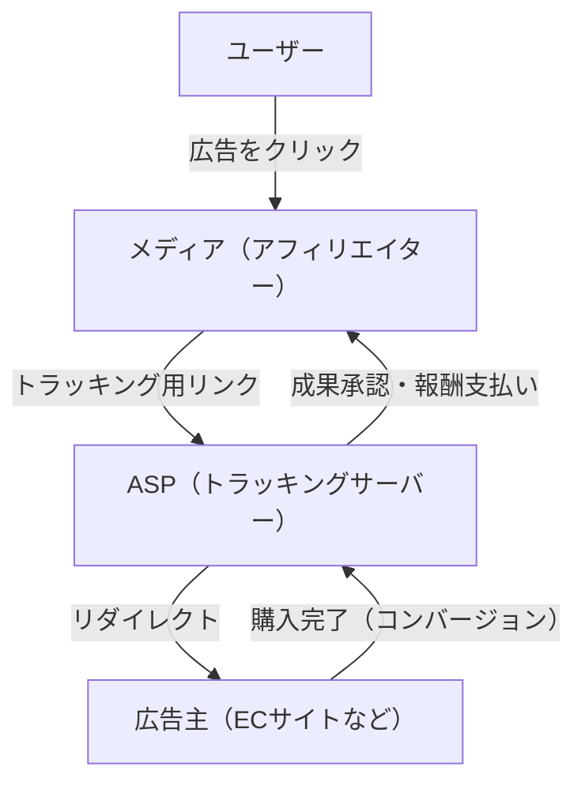
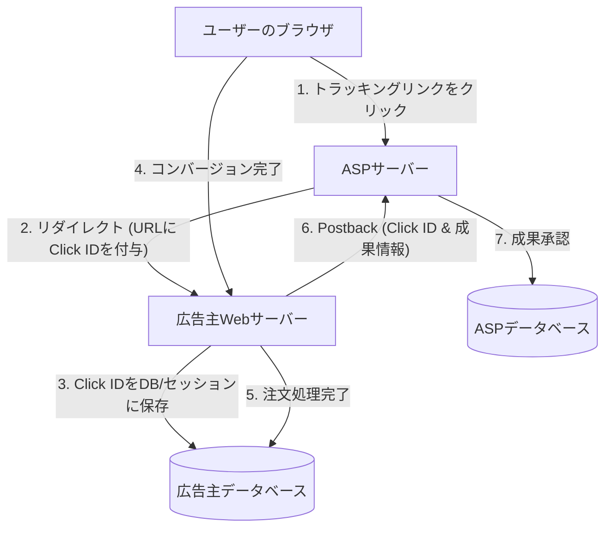

# アフィリエイトの仕組み：トラッキングとコンバージョンの技術的裏側

インターネット広告市場において、成果報酬型広告（アフィリエイト・マーケティング）は極めて重要な役割を果たしています。広告主（マーチャント）は、実際の売上やリード獲得といった「成果」に対してのみ報酬を支払うため、費用対効果の高いマーケティング手法として広く認知されています。

しかし、その裏側には、ユーザーの行動を正確に追跡し、どのメディア（アフィリエイター）の紹介によって成果が発生したのかを判定するための、高度で複雑なトラッキング技術が動いています。

本記事では、アフィリエイトシステムの中核を担うASP（アフィリエイト・サービス・プロバイダ）の役割から、リダイレクトを利用したトラッキングURLの仕組み、CookieやLocalStorageを用いたクライアントサイドの追跡技術、そして近年注目を集めるITP（Intelligent Tracking Prevention）対策としてのサーバーサイド・トラッキング（S2S）に至るまで、アフィリエイトの技術的裏側を徹底的に解説します。

## 1. アフィリエイト・エコシステムの全体像

アフィリエイト・マーケティングは、主に以下の4つのステークホルダーによって構成されています。

1. **ユーザー（消費者）**: メディアを閲覧し、広告をクリックして商品を購入・申し込む。
2. **メディア（アフィリエイター/パブリッシャー）**: 自身のウェブサイトやSNSで商品を紹介し、トラフィックを創出する。
3. **ASP（アフィリエイト・サービス・プロバイダ）**: 広告主とメディアを仲介し、トラッキング、成果計測、報酬の支払い管理を行うプラットフォーム。
4. **広告主（マーチャント）**: 商品やサービスを提供し、ASPに広告費を支払う。

このエコシステムにおいて、最も技術的なハブとなるのがASPです。

ASPは、膨大なトラフィックをリアルタイムで処理し、「誰が」「どの広告を」「いつ」クリックし、それが「いつ」「どの成果」に結びついたのかを、ミリ秒単位の精度で記録する巨大なデータ基盤として機能しています。

## 2. トラッキングの基本メカニズム（クライアントサイド）

アフィリエイトのトラッキングは、歴史的にクライアントサイド（ブラウザ）の技術に大きく依存してきました。ここでは、従来の標準的なトラッキングフローを分解して解説します。

### 2.1. トラッキングURLとリダイレクト

アフィリエイターが自身のサイトに掲載する広告リンクは、直接広告主のサイトを指しているわけではありません。必ず一度ASPのサーバーを経由する「トラッキングURL」となっています。

例：`https://click.example-asp.com/track?aff_id=12345&campaign_id=67890`

ユーザーがこのリンクをクリックすると、以下のプロセスが発生します。

1. **クリックの記録**: ASPのサーバーは、アクセスしてきたユーザーのIPアドレス、User-Agent、タイムスタンプ、そしてURLに含まれるアフィリエイトID（`aff_id`）やキャンペーンID（`campaign_id`）をデータベースに記録します。
2. **クリックIDの生成**: このクリックイベントを一意に識別するための「クリックID（Click ID）」が生成されます。
3. **Cookieの付与**: ASPは、ユーザーのブラウザに対して自社ドメイン（サードパーティ）のCookieを発行し、そこにクリックIDを保存します。
4. **リダイレクト**: 処理が完了すると同時に、HTTP 302（Found）または 301（Moved Permanently）レスポンスを返し、広告主のランディングページ（LP）へユーザーをリダイレクトさせます。この際、URLのパラメータとしてクリックIDを付与することもあります。

### 2.2. CookieとLocalStorageの役割

広告主のサイトに到達したユーザーは、サイト内を回遊し、最終的に商品の購入や会員登録などの「コンバージョン（CV）」に至ります。

従来のトラッキングでは、コンバージョンが完了したページ（サンクスページ）に、ASPが提供する「コンバージョンタグ（CVタグ）」と呼ばれるJavaScriptや画像タグが埋め込まれています。

コンバージョンタグが読み込まれると、以下の処理が行われます。

- **Cookieの読み取り**: ブラウザに保存されているASPのCookieから、クリックIDを読み取ります。
- **成果の送信**: 読み取ったクリックIDと、成果情報（購入金額、注文番号など）をASPのサーバーに送信します。

また、Cookieの有効期限切れや削除に備えて、HTML5のWeb Storage APIである `LocalStorage` や `SessionStorage` にクリックIDをバックアップとして保存する手法も広く用いられてきました。

## 3. プライバシー保護の波：ITPの衝撃

クライアントサイド・トラッキングは、実装が容易である反面、大きな問題を抱えていました。それが「サードパーティCookieによる過度なユーザー追跡」です。

ユーザーが知らない間に複数のサイトを横断して行動履歴が収集されることへのプライバシー上の懸念が高まり、AppleのSafariブラウザに搭載された**ITP（Intelligent Tracking Prevention）**をはじめ、各ブラウザベンダーが強力なトラッキング制限を導入し始めました。

### ITPがアフィリエイトに与えた影響

ITPの導入により、アフィリエイト業界は以下のような壊滅的な影響を受けました。

1. **サードパーティCookieの完全ブロック**: ASPが発行するCookie（広告主ドメインとは異なるドメインのCookie）がデフォルトでブロックされるようになりました。これにより、従来のCVタグによるトラッキングは機能しなくなりました。
2. **ファーストパーティCookieの有効期限短縮**: 広告主ドメインから発行されたCookie（ファーストパーティCookie）であっても、URLパラメータ（例: `?click_id=...`）経由でJavaScript（`document.cookie`）によってセットされた場合、その有効期限が最大24時間（または7日間）に短縮されました。
3. **LocalStorageの制限**: Cookieと同様に、LocalStorageなどのストレージへのアクセスや保存期間も厳しく制限されるようになりました。

これにより、「ユーザーが広告をクリックしてから、数日後に購入する」といった、リードタイムの長い成果が計測できなくなり、アフィリエイターの報酬機会の損失や、広告主のROI（投資対効果）の悪化を招きました。

## 4. サーバーサイド・トラッキング（S2S）とポストバックの台頭

クライアントサイド（ブラウザ）でのデータ保存と通信が制限される中、アフィリエイト業界が解決策として移行を進めているのが**サーバーサイド・トラッキング（Server-to-Server / S2S）**、別名**ポストバック（Postback）方式**です。

### S2Sトラッキングのアーキテクチャ

S2Sトラッキングでは、ブラウザのCookieやJavaScriptタグに依存せず、広告主のサーバーとASPのサーバーが直接（APIを介して）通信を行います。

1. **クリックとリダイレクト**: 従来通り、ユーザーはASPのリンクをクリックします。ASPは一意の `Click ID` を生成し、リダイレクト時のURLパラメータとして広告主サイトに渡します（例：`https://shop.example.com/?click_id=abcde12345`）。
2. **サーバーサイドでの保存**: 広告主のWebサーバーは、リクエストを受け取ると、URLパラメータから `click_id` を抽出し、サーバーサイドのセッションやデータベース、あるいは HTTP ヘッダー（Set-Cookie）を用いた真のファーストパーティCookieとして保存します（JavaScriptを介さないためITPの制限を受けにくい）。
3. **コンバージョン時のポストバック**: ユーザーが購入を完了し、広告主のサーバーで注文処理が確定したタイミングで、広告主のサーバーから直接ASPの指定されたエンドポイント（Postback URL）に対して、HTTPリクエスト（GETまたはPOST）を送信します。

### S2Sトラッキングのメリット

- **ITPの影響を受けない**: ブラウザの制限を回避できるため、確実な成果計測が可能です。
- **セキュリティの向上**: クライアントサイドにCVタグを露出させないため、不正な成果の送信（アドフラウド）を防ぎやすくなります。
- **データ精度の向上**: ネットワークエラーやユーザーのブラウザ離脱によるCVタグの読み込み漏れが発生しません。

### S2Sトラッキングの課題

最大の課題は「導入の技術的ハードル」です。従来のJavaScriptタグをHTMLに貼り付けるだけの作業に比べ、広告主側でシステム開発（パラメータの受け取り、DB保存、バックエンドからのAPIリクエスト処理）が必要となるため、小規模な広告主にとっては導入コストが高くなります。

そのため、ASPは近年、ShopifyやWordPressなどの主要なプラットフォーム向けのプラグインを提供することで、S2Sトラッキングの導入ハードルを下げる取り組みを行っています。

## 5. 次世代のトラッキング技術

S2Sトラッキングに加え、エコシステム全体でさらなる進化が続いています。

### 5.1. フィンガープリンティング（代替識別）
Cookieやパラメータに依存せず、ユーザーのブラウザ環境（User-Agent、画面解像度、インストールされているフォント、IPアドレスなど）の組み合わせから、ユーザーを一意に識別する技術です。しかし、これもプライバシー侵害の観点からブラウザ側で対策が進んでおり、確実な手法とは言えなくなりつつあります。

### 5.2. データクリーンルームとサーバーサイドGTM
大手プラットフォーマーが提供する「データクリーンルーム」や、Google Tag Manager（GTM）のサーバーサイドコンテナを利用することで、広告主は自社のファーストパーティデータを安全にASPや広告プラットフォームと連携する仕組みを構築しています。これにより、ユーザーのプライバシーを守りながら、高度なアトリビューション分析が可能になっています。

## まとめ

アフィリエイト・マーケティングの裏側では、技術の進化とプライバシー保護の波が激しく衝突し、トラッキングの仕組みは劇的な変化を遂げています。

単純なCookieベースのクライアントサイド・トラッキングから、より堅牢でセキュアなサーバーサイド・トラッキング（S2S）への移行は、もはや避けて通れない道です。広告主、アフィリエイター、そしてASPは、常に最新の技術動向と法規制（GDPRやCCPAなど）をキャッチアップし、ユーザーのプライバシーを尊重しながらも、正確な成果計測を実現するシステムを構築していく必要があります。

成果報酬型広告のシステムアーキテクチャを理解することは、ウェブマーケティングに関わるすべてのエンジニアとマーケターにとって、今後ますます重要になるでしょう。
