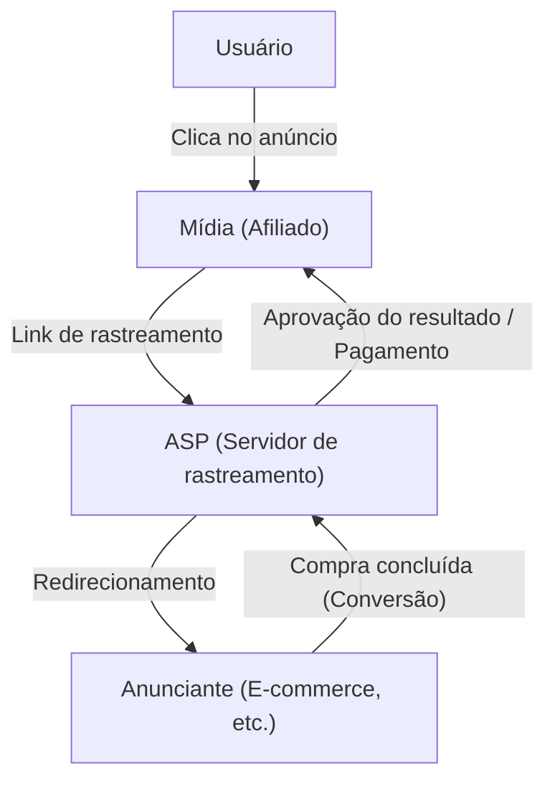
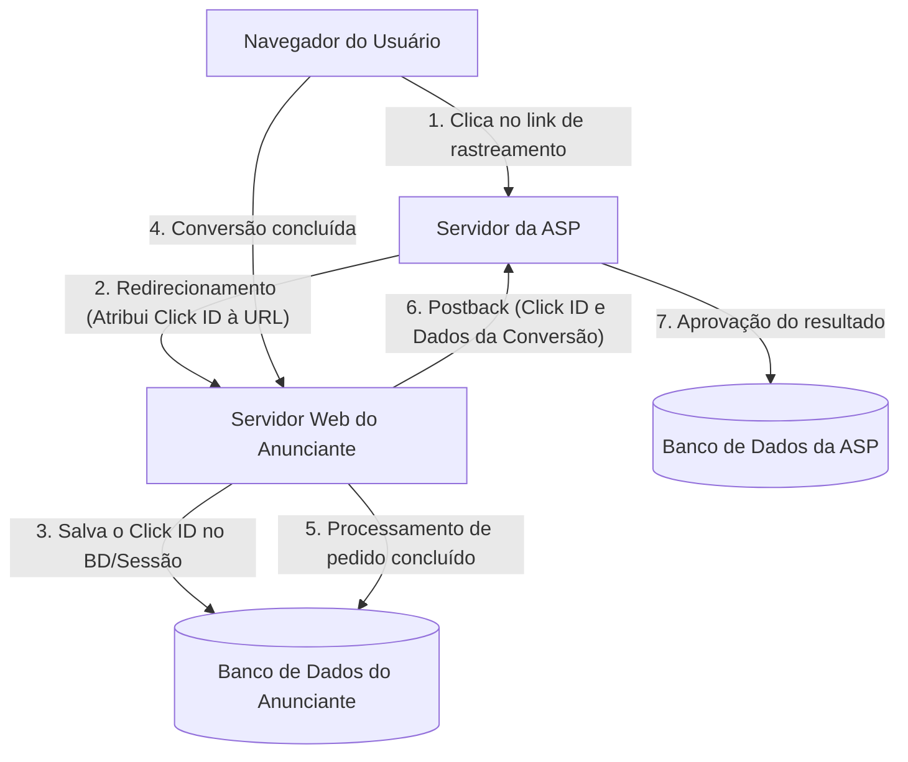

# O Mecanismo de Afiliados: Os Bastidores Técnicos do Rastreamento e Conversão

No mercado de publicidade na internet, a publicidade baseada em desempenho (marketing de afiliados) desempenha um papel fundamental. Como os anunciantes (comerciantes) pagam comissões apenas por "resultados" reais, como vendas ou geração de leads, ela é amplamente reconhecida como um método de marketing com excelente custo-benefício.

No entanto, nos bastidores, atuam tecnologias de rastreamento altamente avançadas e complexas para rastrear com precisão o comportamento do usuário e determinar a qual mídia (afiliado) o resultado gerado deve ser atribuído.

Neste artigo, explicaremos de forma abrangente os bastidores técnicos do sistema de afiliados, desde o papel das plataformas de afiliados (ASPs) que formam o núcleo do ecossistema, o mecanismo de URLs de rastreamento via redirecionamentos, tecnologias de rastreamento do lado do cliente utilizando cookies e LocalStorage, até o rastreamento do lado do servidor (S2S), que tem ganhado destaque recentemente como contramedida ao ITP (Intelligent Tracking Prevention).

## 1. Visão Geral do Ecossistema de Afiliados

O marketing de afiliados é composto principalmente por quatro stakeholders:

1. **Usuário (Consumidor)**: Acessa a mídia, clica nos anúncios e realiza compras ou inscrições.
2. **Mídia (Afiliado/Publisher)**: Apresenta produtos em seus sites ou redes sociais e gera tráfego.
3. **ASP (Provedor de Serviços de Afiliados)**: A plataforma que intermedia os anunciantes e a mídia, gerenciando o rastreamento, a medição de desempenho e o pagamento de comissões.
4. **Anunciante (Comerciante)**: Fornece os produtos ou serviços e paga as despesas de publicidade à ASP.

Neste ecossistema, o centro técnico mais importante é a ASP.

A ASP atua como uma gigantesca base de dados capaz de processar um enorme volume de tráfego em tempo real, registrando com precisão de milissegundos "quem" clicou em "qual anúncio" e "quando", e a qual "resultado" isso levou.

## 2. O Mecanismo Básico de Rastreamento (Lado do Cliente)

Historicamente, o rastreamento de afiliados tem dependido fortemente das tecnologias do lado do cliente (navegador). Aqui, desmembramos o fluxo padrão tradicional de rastreamento.

### 2.1. URL de Rastreamento e Redirecionamento

O link publicitário que o afiliado insere em seu site não aponta diretamente para o site do anunciante. Ele é sempre uma "URL de rastreamento" que passa primeiro pelo servidor da ASP.

Exemplo: `https://click.example-asp.com/track?aff_id=12345&campaign_id=67890`

Quando o usuário clica neste link, ocorrem os seguintes processos:

1. **Registro do clique**: O servidor da ASP registra o endereço IP, o User-Agent, o timestamp e dados da URL como o ID do afiliado (`aff_id`) e o ID da campanha (`campaign_id`) no banco de dados.
2. **Geração do ID de clique**: É gerado um "ID de clique" (Click ID) único para identificar este evento.
3. **Atribuição do Cookie**: A ASP emite um cookie do seu próprio domínio (cookie de terceiros) no navegador do usuário e armazena o Click ID nele.
4. **Redirecionamento**: Assim que o processo é concluído, o servidor retorna uma resposta HTTP 302 (Found) ou 301 (Moved Permanently), redirecionando o usuário para a página de destino (Landing Page) do anunciante. Muitas vezes, o Click ID é incluído como parâmetro na URL.

### 2.2. O Papel do Cookie e do LocalStorage

O usuário que chega ao site do anunciante navega por ele e, eventualmente, atinge uma "conversão (CV)", como a compra de um produto ou o registro de membro.

No rastreamento tradicional, a página onde a conversão é concluída (página de agradecimento) contém uma "Tag de Conversão" (CV tag) em formato de JavaScript ou imagem fornecida pela ASP.

Quando a tag de conversão é carregada, ocorrem os seguintes processamentos:

- **Leitura do Cookie**: O Click ID é lido a partir do cookie da ASP armazenado no navegador.
- **Envio do Resultado**: O Click ID lido e as informações do resultado (valor da compra, número do pedido, etc.) são enviados ao servidor da ASP.

Além disso, para se prevenir contra a expiração ou exclusão dos cookies, tornou-se comum salvar o Click ID como backup na `LocalStorage` ou `SessionStorage`, que são APIs do Web Storage do HTML5.

## 3. A Onda de Proteção da Privacidade: O Impacto do ITP

O rastreamento do lado do cliente era fácil de implementar, mas apresentava um grande problema: o "rastreamento excessivo do usuário por meio de cookies de terceiros".

Com o aumento da preocupação com a privacidade em relação à coleta de históricos de navegação através de múltiplos sites sem o conhecimento do usuário, os desenvolvedores de navegadores começaram a introduzir fortes restrições de rastreamento, sendo o **ITP (Intelligent Tracking Prevention)** do navegador Safari da Apple o pioneiro.

### O Impacto do ITP nos Afiliados

A introdução do ITP causou impactos devastadores na indústria de afiliados:

1. **Bloqueio Total de Cookies de Terceiros**: Os cookies emitidos pela ASP (cookies de domínios diferentes do anunciante) passaram a ser bloqueados por padrão. Com isso, o rastreamento via tags de conversão tradicionais deixou de funcionar.
2. **Redução da Validade dos Cookies Primários**: Mesmo para cookies emitidos a partir do domínio do anunciante (cookies primários), se forem definidos via JavaScript (`document.cookie`) por meio de parâmetros de URL (ex: `?click_id=...`), a validade máxima foi reduzida para 24 horas (ou 7 dias).
3. **Restrições no LocalStorage**: Assim como os cookies, o acesso e o período de armazenamento em recursos como o LocalStorage foram severamente restritos.

Com isso, tornou-se impossível medir resultados com longos prazos (ex: "o usuário clica no anúncio e compra alguns dias depois"), causando perdas de oportunidades de comissão para os afiliados e uma piora no ROI (Retorno sobre Investimento) dos anunciantes.

## 4. A Ascensão do Rastreamento do Lado do Servidor (S2S) e do Postback

Enquanto o armazenamento de dados e a comunicação no lado do cliente (navegador) enfrentam restrições, a indústria de afiliados tem feito a transição para o **rastreamento do lado do servidor (Server-to-Server / S2S)**, também conhecido como **método de Postback**, como solução.

### A Arquitetura do Rastreamento S2S

No rastreamento S2S, a comunicação não depende de cookies ou tags JavaScript no navegador; o servidor do anunciante e o servidor da ASP comunicam-se diretamente (via API).

1. **Clique e Redirecionamento**: Como antes, o usuário clica no link da ASP. A ASP gera um `Click ID` único e o passa como parâmetro de URL durante o redirecionamento para o site do anunciante (ex: `https://shop.example.com/?click_id=abcde12345`).
2. **Armazenamento no Lado do Servidor**: O servidor web do anunciante recebe a requisição, extrai o `click_id` do parâmetro de URL e o salva em uma sessão do servidor, em um banco de dados, ou como um verdadeiro cookie primário usando um cabeçalho HTTP (Set-Cookie) — o que é menos vulnerável às restrições do ITP, já que não passa por JavaScript.
3. **Postback no Momento da Conversão**: Quando o usuário conclui a compra e o processamento do pedido é finalizado no servidor do anunciante, o próprio servidor envia uma requisição HTTP (GET ou POST) diretamente ao endpoint especificado pela ASP (Postback URL).

### Vantagens do Rastreamento S2S

- **Imunidade ao ITP**: Como as restrições dos navegadores são evitadas, a medição dos resultados é confiável.
- **Melhoria da Segurança**: Como a tag de conversão não é exposta no lado do cliente, é mais fácil prevenir o envio de resultados fraudulentos (fraude de anúncios).
- **Maior Precisão dos Dados**: Evita-se falhas no carregamento de tags devido a erros de rede ou a saída rápida do usuário do navegador.

### Desafios do Rastreamento S2S

O maior desafio é a "barreira técnica para implementação". Em comparação com o trabalho de apenas inserir uma tag JavaScript no HTML, os anunciantes precisam realizar desenvolvimento em seus sistemas (recebimento de parâmetros, salvamento no banco de dados, processamento de requisições de API no backend), aumentando significativamente os custos de implementação, especialmente para os pequenos anunciantes.

Por essa razão, nos últimos anos, as ASPs têm feito esforços para diminuir a dificuldade de implementação do S2S, oferecendo plugins para as principais plataformas, como Shopify e WordPress.

## 5. Tecnologias de Rastreamento de Próxima Geração

Além do rastreamento S2S, o ecossistema continua evoluindo de outras formas.

### 5.1. Fingerprinting (Identificação Alternativa)
Uma tecnologia que identifica um usuário de forma única sem depender de cookies ou parâmetros, com base na combinação de características do ambiente do navegador do usuário (User-Agent, resolução de tela, fontes instaladas, endereço IP, etc.). No entanto, medidas contra isso também estão avançando no lado dos navegadores a partir da perspectiva de invasão de privacidade, de modo que já não é considerado um método totalmente confiável.

### 5.2. Data Clean Rooms e Server-Side GTM
Utilizando "Data Clean Rooms" fornecidos por grandes plataformas ou os contêineres server-side do Google Tag Manager (GTM), os anunciantes constroem mecanismos para integrar dados próprios (first-party) com ASPs e plataformas de anúncios de maneira segura. Isso possibilita análises avançadas de atribuição, enquanto protege a privacidade dos usuários.

## Conclusão

Nos bastidores do marketing de afiliados, os avanços tecnológicos e a onda de proteção à privacidade entram em conflito intenso, levando os mecanismos de rastreamento a passarem por mudanças drásticas.

A transição de um simples rastreamento do lado do cliente baseado em cookies para um rastreamento do lado do servidor (S2S) mais robusto e seguro é agora um caminho inevitável. Anunciantes, afiliados e ASPs precisam acompanhar constantemente as tendências tecnológicas e as regulamentações (como o GDPR e o CCPA) para construir sistemas que respeitem a privacidade do usuário enquanto mantêm a medição precisa de resultados.

Entender a arquitetura de sistemas da publicidade de desempenho será cada vez mais essencial para todos os engenheiros e profissionais de marketing envolvidos no marketing digital.
