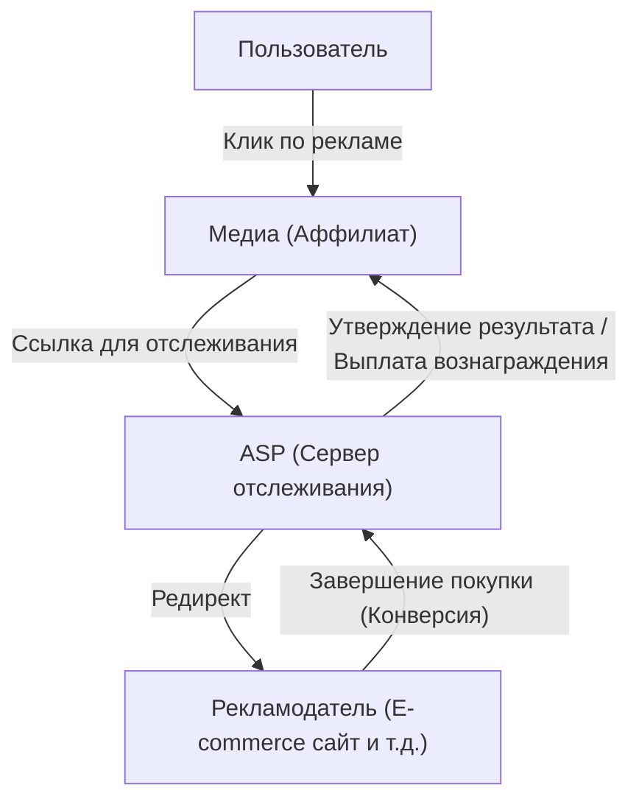
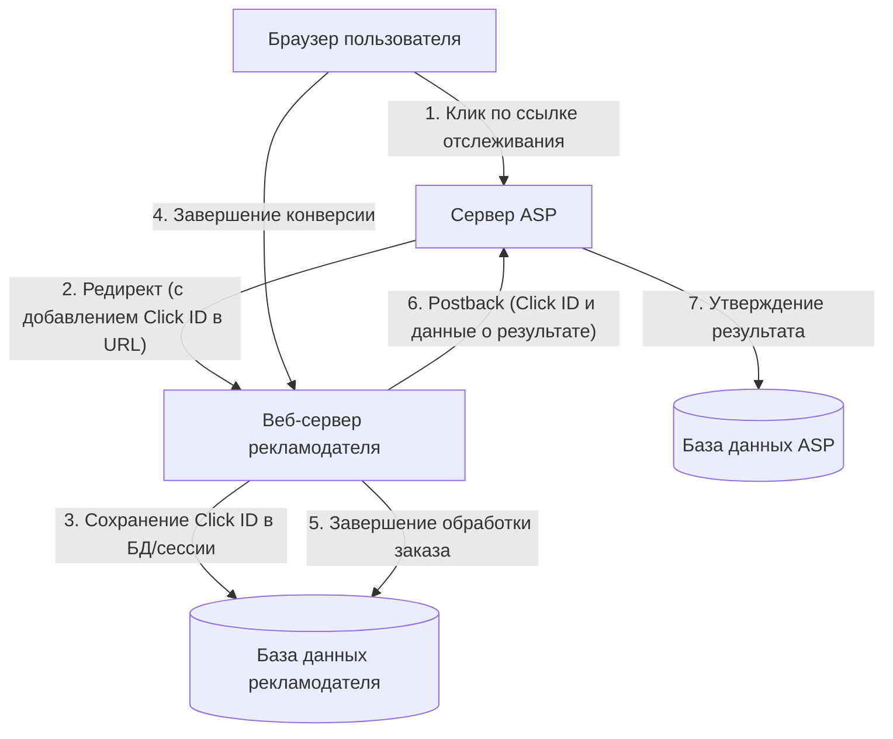

# Механизм партнерского маркетинга: Техническая сторона отслеживания и конверсии

На рынке интернет-рекламы реклама с оплатой за результат (партнерский маркетинг) играет исключительно важную роль. Рекламодатели (мерчанты) платят вознаграждение только за фактические "результаты", такие как реальные продажи или привлечение лидов, поэтому этот метод широко признан как экономически эффективный маркетинговый подход.

Однако за кулисами работают передовые и сложные технологии отслеживания, позволяющие точно отслеживать поведение пользователей и определять, благодаря какому медиа (аффилиату) был достигнут результат.

В этой статье мы подробно рассмотрим техническую сторону партнерского маркетинга: от роли ASP (провайдеров партнерских сервисов), которые являются ядром партнерской системы, до механизма URL-адресов отслеживания с использованием перенаправлений, технологий отслеживания на стороне клиента с использованием Cookie и LocalStorage, и, наконец, до набирающего популярность отслеживания на стороне сервера (S2S) как меры противодействия ITP (Intelligent Tracking Prevention).

## 1. Общая картина экосистемы партнерского маркетинга

Партнерский маркетинг в основном состоит из следующих четырех заинтересованных сторон:

1. **Пользователь (Потребитель)**: Просматривает медиа, кликает по рекламе и покупает/заказывает товары.
2. **Медиа (Аффилиат/Паблишер)**: Представляет товары на своих веб-сайтах или в социальных сетях и генерирует трафик.
3. **ASP (Провайдер партнерских сервисов)**: Платформа, выступающая посредником между рекламодателями и медиа, управляющая отслеживанием, измерением результатов и выплатами вознаграждений.
4. **Рекламодатель (Мерчант)**: Предоставляет товары и услуги и платит рекламные сборы ASP.

В этой экосистеме основным техническим узлом является ASP.

ASP функционирует как гигантская база данных, которая обрабатывает огромный трафик в режиме реального времени и с точностью до миллисекунды фиксирует, "кто", "по какой рекламе", "когда" кликнул, и "когда" это привело к "какому результату".

## 2. Базовые механизмы отслеживания (на стороне клиента)

Отслеживание в партнерском маркетинге исторически сильно зависело от технологий на стороне клиента (браузера). Здесь мы разберем и объясним традиционный стандартный процесс отслеживания.

### 2.1. URL-адреса отслеживания и перенаправления

Рекламные ссылки, которые аффилиаты размещают на своих сайтах, не ведут напрямую на сайт рекламодателя. Они всегда представляют собой "URL-адреса отслеживания", которые сначала проходят через сервер ASP.

Пример: `https://click.example-asp.com/track?aff_id=12345&campaign_id=67890`

Когда пользователь кликает по этой ссылке, происходит следующий процесс:

1. **Запись клика**: Сервер ASP записывает в базу данных IP-адрес, User-Agent, временную метку зашедшего пользователя, а также идентификатор аффилиата (`aff_id`) и идентификатор кампании (`campaign_id`), содержащиеся в URL.
2. **Генерация идентификатора клика**: Генерируется "Click ID" (идентификатор клика) для уникальной идентификации этого события клика.
3. **Присвоение Cookie**: ASP выдает браузеру пользователя Cookie своего домена (сторонний) и сохраняет в нем Click ID.
4. **Редирект**: Как только обработка завершается, сервер возвращает HTTP-ответ 302 (Found) или 301 (Moved Permanently) и перенаправляет пользователя на целевую страницу (LP) рекламодателя. При этом Click ID также может быть добавлен как параметр URL.

### 2.2. Роль Cookie и LocalStorage

Пользователь, попавший на сайт рекламодателя, перемещается по сайту и в конечном итоге достигает "конверсии (CV)", например, покупает товар или регистрируется.

При традиционном отслеживании на страницу завершения конверсии (страница благодарности) внедряется JavaScript или тег изображения, называемый "тегом конверсии (CV-тег)", предоставляемый ASP.

Когда загружается тег конверсии, происходит следующая обработка:

- **Чтение Cookie**: Из Cookie ASP, сохраненного в браузере, считывается Click ID.
- **Отправка результата**: Считанный Click ID и информация о результате (сумма покупки, номер заказа и т. д.) отправляются на сервер ASP.

Кроме того, для подстраховки на случай истечения срока действия или удаления Cookie широко использовался метод сохранения Click ID в `LocalStorage` или `SessionStorage` — Web Storage API HTML5.

## 3. Волна защиты конфиденциальности: Удар от ITP

Хотя отслеживание на стороне клиента было простым в реализации, оно имело серьезную проблему. Это "чрезмерное отслеживание пользователей с помощью сторонних Cookie".

Возросли опасения по поводу конфиденциальности в связи со сбором истории действий пользователей на нескольких сайтах без их ведома. В ответ на это браузеры начали вводить строгие ограничения на отслеживание, начиная с **ITP (Intelligent Tracking Prevention)**, встроенного в браузер Safari от Apple.

### Влияние ITP на партнерский маркетинг

Внедрение ITP оказало разрушительное воздействие на индустрию партнерского маркетинга:

1. **Полная блокировка сторонних Cookie**: Cookie, выдаваемые ASP (Cookie, домен которых отличается от домена рекламодателя), стали блокироваться по умолчанию. Из-за этого традиционное отслеживание с помощью CV-тегов перестало работать.
2. **Сокращение срока действия собственных Cookie**: Даже для Cookie, выданных доменом рекламодателя (собственные Cookie), если они установлены через JavaScript (`document.cookie`) через параметры URL (например, `?click_id=...`), срок их действия был сокращен максимум до 24 часов (или 7 дней).
3. **Ограничения LocalStorage**: Как и в случае с Cookie, доступ к хранилищам, таким как LocalStorage, и сроки их хранения стали строго ограничиваться.

В результате стало невозможным измерять результаты с длительным циклом, например, "пользователь кликает по рекламе, а покупает через несколько дней", что привело к потере возможностей заработка для аффилиатов и ухудшению ROI (возврата инвестиций) для рекламодателей.

## 4. Отслеживание на стороне сервера (S2S) и рост популярности постбэков

В условиях ограничений на хранение данных и связь на стороне клиента (в браузере), индустрия партнерского маркетинга переходит на **отслеживание на стороне сервера (Server-to-Server / S2S)**, также известное как **метод постбэка (Postback)** в качестве решения.

### Архитектура S2S-отслеживания

При S2S-отслеживании сервер рекламодателя и сервер ASP общаются напрямую (через API), не полагаясь на файлы cookie браузера или теги JavaScript.

1. **Клик и редирект**: Как и прежде, пользователь кликает по ссылке ASP. ASP генерирует уникальный `Click ID` и передает его на сайт рекламодателя как параметр URL при редиректе (например, `https://shop.example.com/?click_id=abcde12345`).
2. **Сохранение на стороне сервера**: Получив запрос, веб-сервер рекламодателя извлекает `click_id` из параметра URL и сохраняет его в серверной сессии, базе данных или в виде истинного собственного файла cookie с помощью HTTP-заголовка (Set-Cookie) (поскольку JavaScript не используется, на него в меньшей степени влияют ограничения ITP).
3. **Постбэк при конверсии**: В тот момент, когда пользователь завершает покупку и обработка заказа подтверждается на сервере рекламодателя, HTTP-запрос (GET или POST) отправляется напрямую с сервера рекламодателя на указанную конечную точку (URL постбэка) ASP.

### Преимущества S2S-отслеживания

- **Не подвержено влиянию ITP**: Поскольку ограничения браузера можно обойти, возможно надежное измерение результатов.
- **Повышенная безопасность**: Поскольку CV-теги не открыты на стороне клиента, легче предотвратить мошенническую отправку результатов (Ad Fraud).
- **Повышение точности данных**: Не происходит пропусков загрузки CV-тегов из-за сетевых ошибок или ухода пользователя со страницы браузера.

### Проблемы S2S-отслеживания

Самая большая проблема — "технический барьер для внедрения". По сравнению с традиционным процессом, когда нужно было просто вставить тег JavaScript в HTML, рекламодателю требуется системная разработка (получение параметров, сохранение в БД, обработка API-запросов из бэкенда), что делает стоимость внедрения высокой для мелких рекламодателей.

Поэтому в последние годы ASP стараются снизить барьер внедрения S2S-отслеживания, предоставляя плагины для основных платформ, таких как Shopify и WordPress.

## 5. Технологии отслеживания следующего поколения

Помимо S2S-отслеживания, дальнейшая эволюция продолжается во всей экосистеме.

### 5.1. Фигнерпринтинг (Альтернативная идентификация)
Это технология, которая не полагается на файлы cookie или параметры, а уникально идентифицирует пользователя на основе комбинации параметров среды его браузера (User-Agent, разрешение экрана, установленные шрифты, IP-адрес и т.д.). Однако браузеры принимают контрмеры и против этого с точки зрения нарушения конфиденциальности, и это уже нельзя назвать надежным методом.

### 5.2. Комнаты чистых данных (Data Clean Rooms) и серверный GTM
Используя "комнаты чистых данных", предоставляемые крупными платформами, и серверные контейнеры Google Tag Manager (GTM), рекламодатели создают механизмы для безопасного связывания своих собственных (first-party) данных с ASP и рекламными платформами. Это позволяет проводить глубокий анализ атрибуции, защищая конфиденциальность пользователей.

## Заключение

За кулисами партнерского маркетинга технологическая эволюция и волна защиты конфиденциальности жестко сталкиваются, а механизмы отслеживания претерпевают кардинальные изменения.

Переход от простого отслеживания на стороне клиента на основе файлов cookie к более надежному и безопасному отслеживанию на стороне сервера (S2S) — это путь, которого больше нельзя избежать. Рекламодатели, аффилиаты и ASP должны всегда быть в курсе последних технологических тенденций и правовых норм (таких как GDPR и CCPA) и создавать системы, которые обеспечивают точное измерение результатов при уважении конфиденциальности пользователей.

Понимание архитектуры систем рекламы с оплатой за результат будет становиться все более важным для всех инженеров и маркетологов, связанных с веб-маркетингом.
