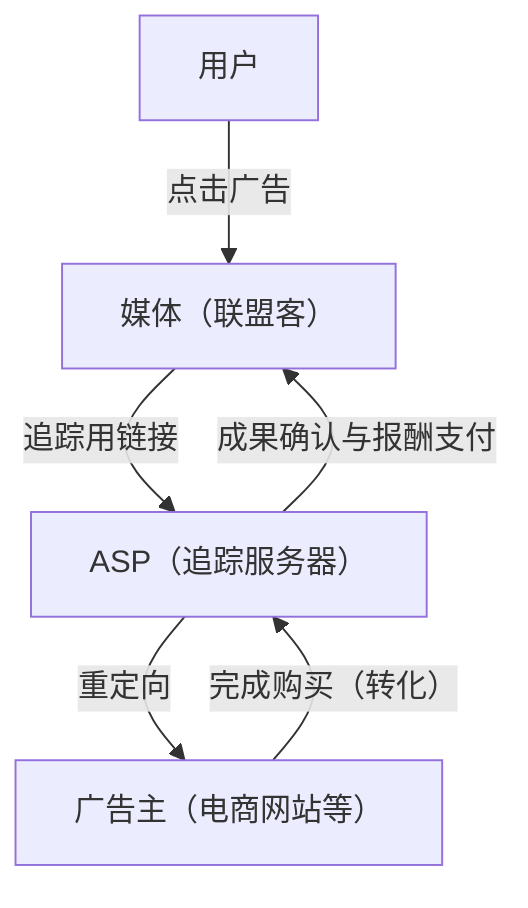
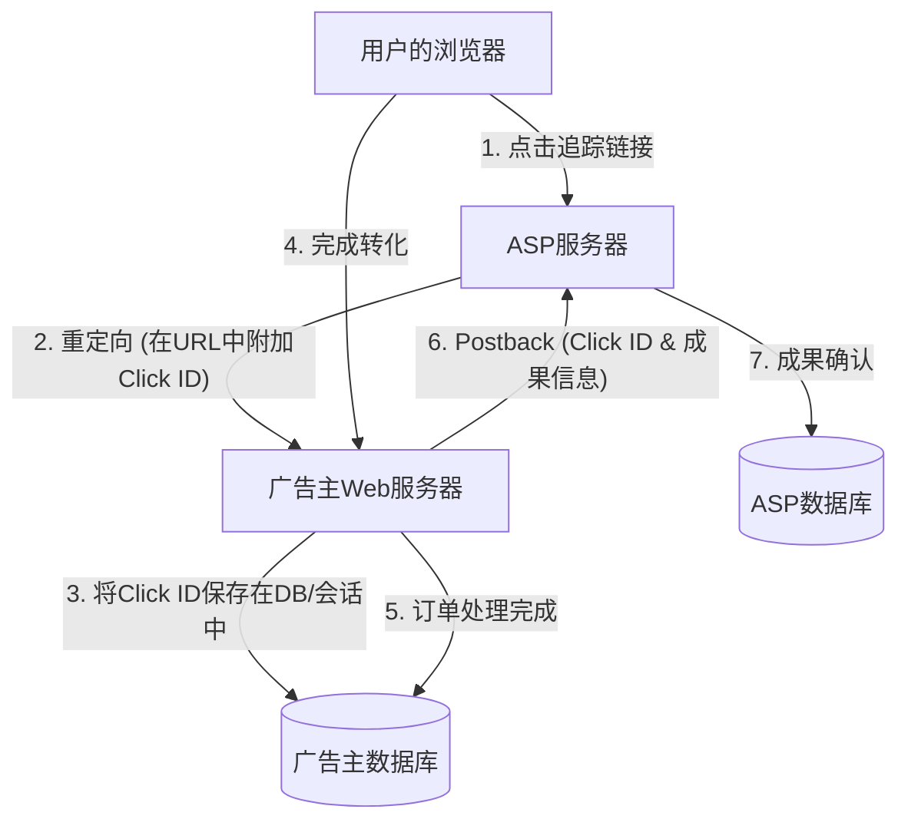

# 联盟营销机制：追踪与转化的技术内幕

在互联网广告市场中，按效果付费广告（联盟营销，Affiliate Marketing）发挥着极其重要的作用。由于广告主（Merchant）仅对实际销售额或获取潜在客户等“成果”支付报酬，它被广泛认为是高成本效益的营销手段。

然而，在其背后，运作着一套高度复杂的追踪技术，旨在准确追踪用户行为，并判定成果是由哪个媒体（联盟客，Affiliate）介绍产生的。

本文将彻底解析联盟营销的技术内幕，从作为联盟系统核心的ASP（联盟服务提供商，Affiliate Service Provider）的角色，到利用重定向的追踪URL机制，再到使用Cookie和LocalStorage的客户端追踪技术，以及作为近年来备受关注的应对ITP（Intelligent Tracking Prevention，智能防追踪）对策的服务端追踪（S2S）。

## 1. 联盟营销生态系统全景

联盟营销主要由以下四个利益相关者构成：

1. **用户（消费者）**: 浏览媒体，点击广告并购买或申请商品。
2. **媒体（联盟客/发布商）**: 在自己的网站或社交媒体上介绍商品，创造流量。
3. **ASP（联盟服务提供商）**: 作为广告主和媒体的桥梁，负责追踪、成果衡量及报酬支付管理的平台。
4. **广告主（商家）**: 提供商品或服务，向ASP支付广告费。

在这个生态系统中，ASP是最具技术性的枢纽。

ASP实时处理海量流量，作为一个巨大的数据基盘，以毫秒级的精度记录“谁”在“何时”点击了“哪个广告”，以及该点击在“何时”与“什么成果”相关联。

## 2. 追踪的基本机制（客户端）

从历史上看，联盟营销的追踪在很大程度上依赖于客户端（浏览器）技术。在此，我们将分解并解说传统的标准追踪流程。

### 2.1. 追踪URL与重定向

联盟客在自己的网站上发布的广告链接，并不直接指向广告主的网站。它必然是一个经过ASP服务器的“追踪URL”。

例如：`https://click.example-asp.com/track?aff_id=12345&campaign_id=67890`

当用户点击该链接时，会发生以下流程：

1. **记录点击**: ASP服务器会将访问用户的IP地址、User-Agent、时间戳，以及URL中包含的联盟ID（`aff_id`）和活动ID（`campaign_id`）记录到数据库中。
2. **生成点击ID**: 生成一个唯一标识该点击事件的“点击ID（Click ID）”。
3. **赋予Cookie**: ASP向用户的浏览器下发其自身域名（第三方）的Cookie，并将点击ID保存在其中。
4. **重定向**: 处理完成后，立即返回HTTP 302（Found）或301（Moved Permanently）响应，将用户重定向至广告主的落地页（LP）。此时，也有时会将点击ID作为URL参数附加。

### 2.2. Cookie与LocalStorage的作用

到达广告主网站的用户会在站内浏览，最终实现购买商品或注册会员等“转化（CV）”。

在传统的追踪中，完成转化的页面（感谢页）会嵌入ASP提供的称为“转化标签（CV标签）”的JavaScript或图像标签。

当转化标签被加载时，将执行以下处理：

- **读取Cookie**: 从保存在浏览器中的ASP Cookie里读取点击ID。
- **发送成果**: 将读取到的点击ID以及成果信息（购买金额、订单号等）发送到ASP服务器。

此外，为了防范Cookie过期或被删除，将点击ID作为备份保存在HTML5的Web Storage API（如`LocalStorage`或`SessionStorage`）中的方法也曾被广泛使用。

## 3. 隐私保护浪潮：ITP的冲击

客户端追踪虽然易于实现，但也存在重大问题。那就是“利用第三方Cookie过度追踪用户”。

用户对在不知情的情况下跨多个网站收集行为记录的隐私担忧日益加剧。以苹果Safari浏览器内置的**ITP（智能防追踪）**为首，各浏览器厂商开始引入强力的追踪限制。

### ITP对联盟营销的影响

ITP的引入给联盟营销行业带来了如下毁灭性的影响：

1. **完全拦截第三方Cookie**: ASP下发的Cookie（不同于广告主域名的Cookie）被默认拦截。由此，传统基于CV标签的追踪将失效。
2. **缩短第一方Cookie有效期**: 即使是由广告主域名下发的Cookie（第一方Cookie），如果通过URL参数（如：`?click_id=...`）经由JavaScript（`document.cookie`）设置，其有效期也会被缩短至最多24小时（或7天）。
3. **限制LocalStorage**: 与Cookie类似，访问LocalStorage等存储或其保存期限也受到了严格限制。

由此，诸如“用户点击广告后数日才购买”这种转化周期较长的成果便无法被衡量，导致联盟客错失报酬机会，并使广告主的ROI（投资回报率）恶化。

## 4. 服务端追踪（S2S）与回调机制的崛起

在客户端（浏览器）数据保存和通信受到限制的背景下，联盟营销行业正在向**服务端追踪（Server-to-Server / S2S）**（又称**回调（Postback）方式**）过渡，作为一种解决方案。

### S2S追踪的架构

在S2S追踪中，不再依赖浏览器的Cookie或JavaScript标签，而是由广告主的服务器与ASP的服务器直接（通过API）进行通信。

1. **点击与重定向**: 和传统一样，用户点击ASP的链接。ASP生成一个唯一的`Click ID`，并作为重定向时的URL参数传递给广告主网站（例：`https://shop.example.com/?click_id=abcde12345`）。
2. **服务端保存**: 广告主的Web服务器在接收到请求后，从URL参数中提取`click_id`，并使用服务端的会话、数据库，或通过HTTP头（Set-Cookie）作为真正的第一方Cookie进行保存（因不经过JavaScript，故不易受ITP限制）。
3. **转化时的回调（Postback）**: 当用户完成购买，且订单在广告主的服务器中确定处理时，广告主的服务器直接向ASP指定的端点（Postback URL）发送HTTP请求（GET或POST）。

### S2S追踪的优势

- **不受ITP影响**: 能够规避浏览器限制，从而实现可靠的成果衡量。
- **提升安全性**: 不会在客户端暴露CV标签，更易于防止发送虚假成果（广告欺诈）。
- **提高数据精度**: 不会因为网络错误或用户离开浏览器而导致漏载CV标签的情况。

### S2S追踪的挑战

最大的挑战在于“引入的技术门槛”。相较于过去只需将JavaScript标签粘贴在HTML中的工作，广告主端需要进行系统开发（接收参数、DB保存、来自后端的API请求处理等），因此对小规模广告主来说导入成本较高。

为此，近年来ASP通过为Shopify、WordPress等主流平台提供插件，致力于降低S2S追踪的导入门槛。

## 5. 下一代追踪技术

除了S2S追踪，整个生态系统的进一步演进仍在继续。

### 5.1. 指纹识别（替代识别）
这是一种不依赖Cookie或参数，而是通过组合用户的浏览器环境（User-Agent、屏幕分辨率、已安装字体、IP地址等）来唯一识别用户的技术。然而，出于侵犯隐私的考虑，浏览器方面也在推进对策，这一方法正变得不再可靠。

### 5.2. 数据无尘室与服务端GTM
通过利用大型平台提供商的“数据无尘室（Data Clean Room）”或Google Tag Manager (GTM) 的服务端容器，广告主正在构建能够安全地将其第一方数据与ASP及广告平台共享的机制。借助此机制，能够在保护用户隐私的同时，进行高级的归因分析。

## 总结

在联盟营销的背后，技术的演进与隐私保护浪潮正发生着激烈碰撞，追踪机制正在发生急剧的变化。

从简单的基于Cookie的客户端追踪，向更坚固且安全的服务端追踪（S2S）过渡，已成为不可避免的必然之路。广告主、联盟客以及ASP必须时刻跟进最新的技术动态与法律法规（如GDPR、CCPA等），在尊重用户隐私的同时，不断构建能够实现准确成果衡量的系统。

理解基于效果付费广告的系统架构，对于所有从事网络营销的工程师和营销人员来说，在未来将变得越发重要。
