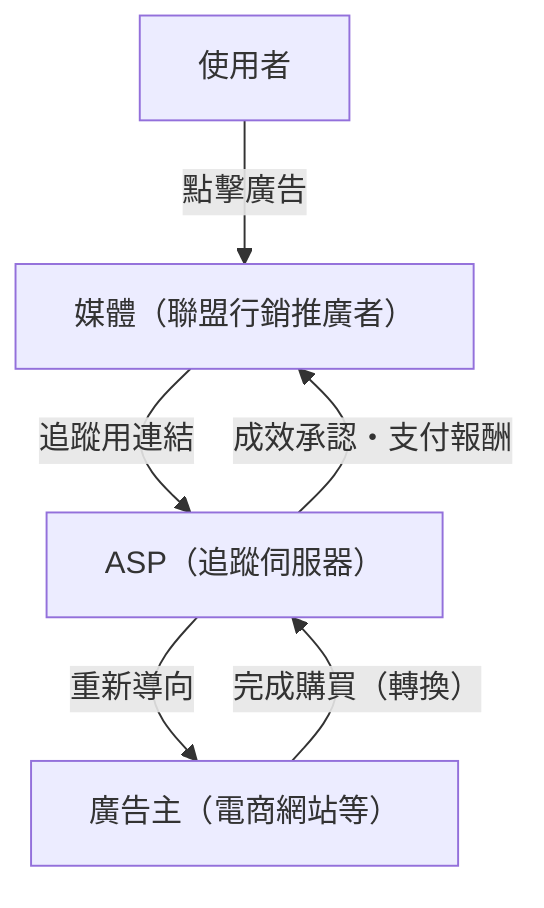
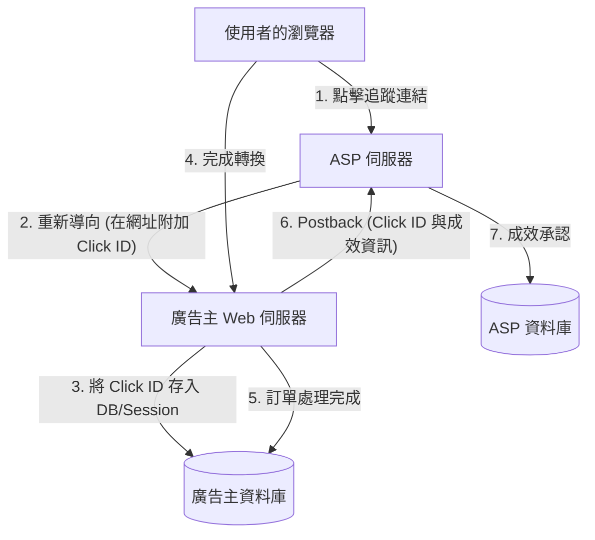

# 聯盟行銷的機制：追蹤與轉換的技術內幕

在網路廣告市場中，成效計費型廣告（聯盟行銷，Affiliate Marketing）扮演著極為重要的角色。因為廣告主 (Merchant) 僅針對實際的銷售或潛在客戶名單獲取等「成效」支付報酬，所以被廣泛認知為一種具備高成本效益的行銷手法。

然而，在其背後運作的，是為了準確追蹤使用者行為，並判定究竟是透過哪個媒體（聯盟行銷推廣者/Affiliate）的介紹才產生了成效，所仰賴的高度複雜追蹤技術。

本文將針對聯盟行銷系統中扮演核心角色的 ASP（聯盟行銷服務供應商/Affiliate Service Provider）的作用、利用重新導向 (Redirect) 的追蹤網址機制、使用 Cookie 與 LocalStorage 的客戶端 (Client-side) 追蹤技術，以及近年備受關注的針對 ITP（智慧防追蹤/Intelligent Tracking Prevention）對策的伺服器端追蹤（S2S/Server-to-Server），深入剖析聯盟行銷的技術內幕。

## 1. 聯盟行銷生態系統的全貌

聯盟行銷主要由以下四個利害關係人（Stakeholders）構成：

1. **使用者（消費者）**：瀏覽媒體，點擊廣告並購買商品或提交申請。
2. **媒體（聯盟行銷推廣者 / 發布商）**：在自己的網站或社群媒體上介紹商品，創造流量。
3. **ASP（聯盟行銷服務供應商）**：仲介廣告主與媒體，負責追蹤、成效計算及報酬支付管理的平台。
4. **廣告主（商家）**：提供商品或服務，並向 ASP 支付廣告費。

在這個生態系統中，最具技術樞紐地位的就是 ASP。

ASP 發揮著巨大數據基底的功能，即時處理龐大的流量，並以毫秒為單位的精準度記錄「誰」在「何時」點擊了「哪個廣告」，且該點擊又在「何時」轉化為「哪個成效」。

## 2. 追蹤的基本機制（客戶端）

在歷史上，聯盟行銷的追蹤曾高度依賴客戶端（瀏覽器）的技術。以下將拆解傳統標準的追蹤流程進行解說。

### 2.1. 追蹤網址與重新導向

聯盟推廣者放置在其網站上的廣告連結，並非直接指向廣告主的網站。這些連結必定會是一段先經過 ASP 伺服器的「追蹤網址」。

範例：`https://click.example-asp.com/track?aff_id=12345&campaign_id=67890`

當使用者點擊這個連結時，會發生以下流程：

1. **點擊記錄**：ASP 的伺服器會將前來存取的使用者 IP 位址、User-Agent、時間戳記，以及網址中包含的聯盟行銷 ID (`aff_id`) 和活動 ID (`campaign_id`) 記錄到資料庫中。
2. **生成 Click ID**：系統會生成一個用來唯一識別此次點擊事件的「點擊 ID（Click ID）」。
3. **賦予 Cookie**：ASP 會對使用者的瀏覽器發行自家網域（第三方）的 Cookie，並將 Click ID 儲存其中。
4. **重新導向**：在處理完成的同時，回傳 HTTP 302（Found）或 301（Moved Permanently）回應，將使用者重新導向至廣告主的登陸頁面（Landing Page, LP）。此時，也可能將 Click ID 作為網址參數附加在後。

### 2.2. Cookie 與 LocalStorage 的作用

抵達廣告主網站的使用者會在網站內瀏覽，並最終完成購買商品或註冊會員等「轉換（Conversion, CV）」。

在傳統的追蹤方式中，完成轉換的頁面（感謝頁面，Thanks Page）上會埋設由 ASP 提供的被稱為「轉換標籤（CV 標籤）」的 JavaScript 或圖片標籤。

當轉換標籤被載入時，會執行以下處理：

- **讀取 Cookie**：從儲存於瀏覽器中的 ASP Cookie 讀取 Click ID。
- **發送成效**：將讀取到的 Click ID 與成效資訊（購買金額、訂單編號等）發送至 ASP 的伺服器。

此外，為了防範 Cookie 過期或被刪除，廣泛採用的一種手法是將 Click ID 作為備份，儲存於 HTML5 的 Web Storage API（如 `LocalStorage` 或 `SessionStorage`）中。

## 3. 隱私保護的浪潮：ITP 的衝擊

雖然客戶端追蹤的實作相對容易，但也存在一個重大問題，那就是「利用第三方 Cookie 過度追蹤使用者」。

因為在使用者不知情的情況下橫跨多個網站收集其行為記錄，引發了強烈的隱私疑慮。以 Apple 的 Safari 瀏覽器所搭載的 **ITP（Intelligent Tracking Prevention，智慧防追蹤）**為首，各瀏覽器供應商開始導入強力的追蹤限制。

### ITP 對聯盟行銷造成的影響

ITP 的導入對聯盟行銷業界造成了如下的毀滅性影響：

1. **完全阻擋第三方 Cookie**：ASP 所發行的 Cookie（與廣告主網域不同的 Cookie）預設會被阻擋。這導致傳統透過 CV 標籤進行的追蹤失去作用。
2. **縮短第一方 Cookie 的有效期限**：即便是由廣告主網域所發行的 Cookie（第一方 Cookie），若是透過網址參數（例：`?click_id=...`）經由 JavaScript (`document.cookie`) 所設定，其有效期限最長也被縮短至 24 小時（或 7 天）。
3. **限制 LocalStorage**：如同 Cookie，對 LocalStorage 等儲存空間的存取及保存期限也開始受到嚴格限制。

如此一來，諸如「使用者點擊廣告後，過了幾天才購買」這類前置時間較長的成效將無法被計算，導致了聯盟推廣者喪失獲取報酬的機會，並造成廣告主投資報酬率（ROI）惡化。

## 4. 伺服器端追蹤（S2S）與 Postback 的崛起

在客戶端（瀏覽器）上的資料儲存與通訊受到限制的背景下，聯盟行銷業界正將解決方案轉向 **伺服器端追蹤（Server-to-Server / S2S）**，亦被稱為 **Postback（回傳）方式**。

### S2S 追蹤的架構

在 S2S 追蹤中，不再依賴瀏覽器的 Cookie 或 JavaScript 標籤，而是由廣告主的伺服器與 ASP 的伺服器直接（透過 API）進行通訊。

1. **點擊與重新導向**：如同以往，使用者點擊 ASP 的連結。ASP 生成唯一的 `Click ID`，並在重新導向時作為網址參數傳遞給廣告主網站（例：`https://shop.example.com/?click_id=abcde12345`）。
2. **伺服器端儲存**：廣告主的 Web 伺服器在接收到請求後，從網址參數中萃取 `click_id`，並將其儲存在伺服器端的 Session、資料庫，或是利用 HTTP 標頭（Set-Cookie）作為真正的第一方 Cookie 保存起來（因為不經過 JavaScript，所以較不易受到 ITP 的限制）。
3. **轉換時的 Postback**：當使用者完成購買，並在廣告主伺服器上確定了訂單處理的時間點，廣告主的伺服器會直接向 ASP 所指定的端點（Postback URL）發送 HTTP 請求（GET 或 POST）。

### S2S 追蹤的優勢

- **不受 ITP 影響**：因為可以避開瀏覽器的限制，所以能進行確實的成效計算。
- **提升安全性**：不會在客戶端暴露 CV 標籤，因此更容易防範惡意的成效發送（廣告詐欺，Ad Fraud）。
- **提高資料精準度**：不會發生因為網路錯誤或使用者關閉瀏覽器而導致 CV 標籤載入遺漏的問題。

### S2S 追蹤的挑戰

最大的挑戰在於「導入的技術門檻」。相比於過去只要將 JavaScript 標籤貼到 HTML 上的作業，現在需要廣告主端進行系統開發（接收參數、寫入 DB、後端的 API 請求處理），這對於小規模的廣告主而言，導入成本會相對較高。

為此，近年來 ASP 致力於提供適用於 Shopify 或 WordPress 等主流平台的擴充套件（Plugin），以降低 S2S 追蹤的導入門檻。

## 5. 次世代的追蹤技術

除了 S2S 追蹤之外，整個生態系統仍在持續進化中。

### 5.1. 數位指紋（替代性識別 / Fingerprinting）
不依賴 Cookie 或參數，而是藉由使用者瀏覽器環境（User-Agent、螢幕解析度、安裝的字型、IP 位址等）的組合特徵，來唯一識別使用者的技術。不過，基於侵犯隱私的疑慮，瀏覽器端也正針對此技術採取防堵措施，因此這已逐漸不再是個絕對可靠的方法。

### 5.2. 資料無塵室與 Server-side GTM
透過利用大型平台業者所提供的「資料無塵室（Data Clean Room）」或是 Google Tag Manager (GTM) 的伺服器端容器（Server-side Container），廣告主得建構出一套在保護使用者隱私的同時，能將自家的第一方數據安全地與 ASP 或廣告平台進行串接的機制。這使得在不侵犯隱私的前提下進行高階歸因分析（Attribution Analysis）成為可能。

## 總結

在聯盟行銷的背後，技術的演進與隱私保護的浪潮正激烈碰撞，追蹤機制的面貌也正經歷著戲劇性的轉變。

從單純以 Cookie 為基礎的客戶端追蹤，轉向更穩固且安全的伺服器端追蹤（S2S），已成為無可避免的道路。廣告主、聯盟推廣者以及 ASP 必須時刻掌握最新的技術趨勢與法規限制（如 GDPR 和 CCPA），建構出能在尊重使用者隱私的同時，實現精準成效計算的系統。

對於所有參與網站行銷的工程師與行銷人員而言，理解成效計費型廣告的系統架構，在未來將會變得日益重要。
