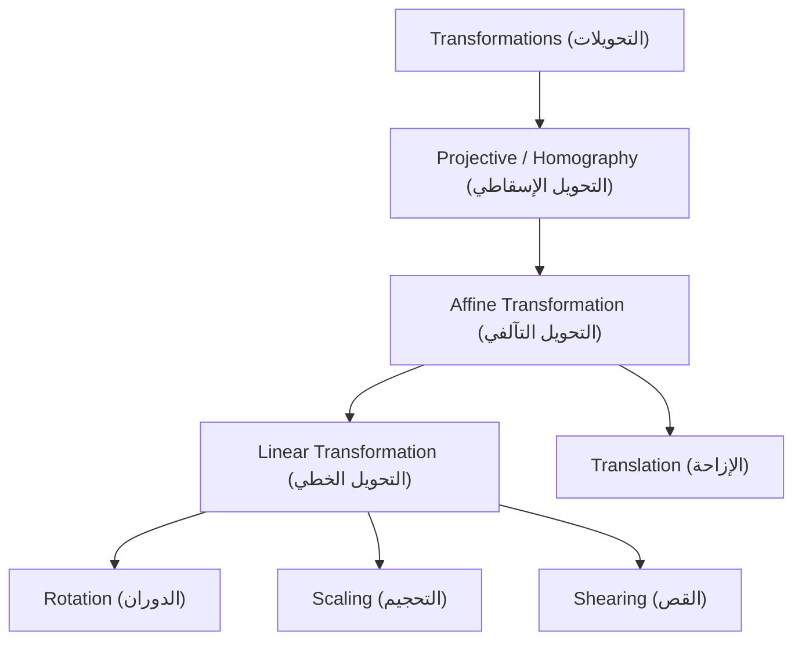
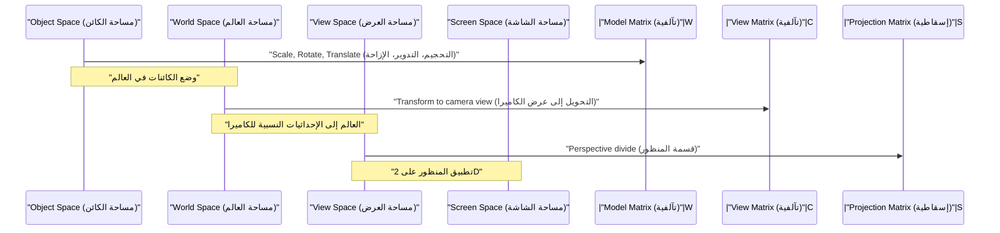

## 1. مقدمة

في تقنيات رسومات الحاسوب (CG) الحديثة، ومعالجة الصور، والرؤية الحاسوبية، تعتبر عمليات مثل تدوير الصور ثنائية الأبعاد أو إسقاط الأجسام ثلاثية الأبعاد على شاشة ثنائية الأبعاد عمليات لا غنى عنها. وراء هذه العمليات، تعمل نظريات قوية من الجبر الخطي والهندسة بنشاط. من بينها، تعد المفاهيم الأساسية والأكثر أهمية هي **التحويل التآلفي** (Affine Transformation) و **التحويل الإسقاطي** (Projective Transformation / Homography).

في هذه المقالة، سنستكشف بشكل منهجي وعميق الآليات الرياضية لهذين التحويلين، ولماذا يلزم وجود نظام إحداثيات خاص يسمى **الإحداثيات المتجانسة** (Homogeneous Coordinates)، وكيف يتم تطبيقها في العوالم العملية لرسومات الحاسوب والرؤية الحاسوبية.

## 2. مراجعة وقيود التحويلات الخطية

قبل التفكير في التحويلات، دعونا نراجع أولاً **التحويل الخطي** (Linear Transformation) الأساسي. يتم التعبير عن التحويل الخطي في الفضاء ثنائي الأبعاد باستخدام مصفوفة $2 \times 2$ على النحو التالي:

$$
\begin{pmatrix} x' \\ y' \end{pmatrix} = \begin{pmatrix} a & b \\ c & d \end{pmatrix} \begin{pmatrix} x \\ y \end{pmatrix}
$$

تتضمن التحويلات التي يمكن التعبير عنها بهذا التنسيق المصفوفي العمليات الهندسية التالية:

- **الدوران** (Rotation): عملية للدوران بزاوية $\theta$.
- **التحجيم** (Scaling): عملية لتغيير المقياس على طول محوري $x$ و $y$.
- **القص** (Shearing): عملية تشوه المستطيل إلى متوازي أضلاع.
- **الانعكاس** (Reflection): عملية للقلب عبر محور معين.

ومع ذلك، فإن هذه العمليات وحدها غير كافية لعرض رسومات حاسوب عملية. هنا نواجه مشكلة رئيسية واحدة: **الإزاحة** (Translation). الإزاحة التي تنقل نقطة الأصل إلى موقع آخر هي عملية إضافة متجه معين $(t_x, t_y)$، ويتم تمثيلها كالتالي:

$$
\begin{pmatrix} x' \\ y' \end{pmatrix} = \begin{pmatrix} x \\ y \end{pmatrix} + \begin{pmatrix} t_x \\ t_y \end{pmatrix}
$$

لا يمكن تمثيل هذه المعادلة ببساطة بواسطة "ضرب" المصفوفات. في عالم رسومات الحاسوب، من الضروري تطبيق الدورات والإزاحات باستمرار على ملايين الرؤوس. إذا كان علينا التبديل بين ضرب المصفوفات وجمع المتجهات لكل تحويل، فستصبح المعالجة الرياضية مرهقة للغاية، وسيصبح تنفيذ خطوط أنابيب الحساب والأجهزة معقدًا للغاية.

## 3. التحويلات التآلفية وإدخال الإحداثيات المتجانسة

لحل مشكلة الإزاحة هذه والتعامل بشكل موحد مع جميع التحويلات باستخدام ضرب المصفوفات فقط، ابتكر علماء الرياضيات والمهندسون **الإحداثيات المتجانسة** (Homogeneous Coordinates).

### 3.1. ما هي الإحداثيات المتجانسة؟

في الإحداثيات المتجانسة، يتم إلحاق بُعد وهمي (عادة $1$) بنهاية الإحداثيات ثنائية الأبعاد $(x, y)$ لتمثيلها كمتجه ثلاثي الأبعاد $(x, y, 1)$. بشكل عام، يتوافق الإحداثي المتجانس $(x, y, w)$ مع الإحداثي الديكارتي $(x/w, y/w)$ في الفضاء الحقيقي (بشرط أن $w \neq 0$).

### 3.2. بنية مصفوفة التحويل التآلفي

باستخدام نظام الإحداثيات المتجانسة هذا، يمكن تمثيل **التحويل التآلفي** ثنائي الأبعاد بشكل جميل كمصفوفة مربعة $3 \times 3$ على النحو التالي:

$$
\begin{pmatrix} x' \\ y' \\ 1 \end{pmatrix} = \begin{pmatrix} a & b & t_x \\ c & d & t_y \\ 0 & 0 & 1 \end{pmatrix} \begin{pmatrix} x \\ y \\ 1 \end{pmatrix}
$$

عند توسيع ضرب المصفوفة هذا، نحصل على ما يلي:

$$
x' = ax + by + t_x \\
y' = cx + dy + t_y \\
1 = 0 \cdot x + 0 \cdot y + 1
$$

بشكل رائع، تم دمج جزء التحويل الخطي ($a, b, c, d$) وجزء الإزاحة ($t_x, t_y$) في عملية ضرب مصفوفة واحدة. يُشار إلى هذا التحويل الكامل الذي يجمع بين التحويل الخطي والإزاحة باسم **التحويل التآلفي**.

### 3.3. الخصائص الهندسية للتحويلات التآلفية

الخاصية الهندسية الأكثر أهمية للتحويل التآلفي هي أن "**الخطوط المتوازية تظل متوازية بعد التحويل**". علاوة على ذلك، يتم الحفاظ أيضًا على "نسبة النقاط على مقطع خطي (مثل نقطة المنتصف)" قبل التحويل وبعده. لذلك، في حين أن تطبيق التحويل التآلفي على مربع قد يؤدي إلى متوازي أضلاع، فإنه لن يصبح أبدًا شبه منحرف.

## 4. التحويل الإسقاطي: التمثيل الرياضي للمنظور

في حين أن التحويلات التآلفية مريحة للغاية وكافية لعرض واجهة المستخدم أو الألعاب ثنائية الأبعاد البسيطة، إلا أنها لا تستطيع أن تمثل بشكل كامل الآلية التي تلتقط بها العيون البشرية أو الكاميرات العالم ثلاثي الأبعاد. في العالم الحقيقي، تبدو الأشياء البعيدة أصغر، وتبدو الخطوط المتوازية (مثل خطوط السكك الحديدية المستقيمة أو الممرات) متقاطعة في **نقطة التلاشي** (Vanishing Point) في المسافة. وهذا ما يعرف بالمنظور.

النمذجة الرياضية الصارمة لهذا المنظور هي **التحويل الإسقاطي** (Projective Transformation).

### 4.1. بنية مصفوفة التحويل الإسقاطي (التماثل / Homography)

يتم تمثيل التحويلات الإسقاطية بين الفضاءات ثنائية الأبعاد أيضًا بمصفوفة $3 \times 3$ باستخدام الإحداثيات المتجانسة. في مجال الرؤية الحاسوبية، تُسمى هذه المصفوفة أيضًا **مصفوفة التماثل** (Homography Matrix). الاختلاف الحاسم والأكبر هو أنه يمكن تعيين قيم عشوائية في الصف السفلي (الصف الثالث)، والذي كان دائمًا $0, 0, 1$ في التحويل التآلفي.

$$
\begin{pmatrix} X \\ Y \\ W \end{pmatrix} = \begin{pmatrix} h_{11} & h_{12} & h_{13} \\ h_{21} & h_{22} & h_{23} \\ h_{31} & h_{32} & h_{33} \end{pmatrix} \begin{pmatrix} x \\ y \\ 1 \end{pmatrix}
$$

بعد تطبيق هذا التحويل، لإعادة النتيجة إلى الإحداثيات ثنائية الأبعاد الفعلية $(x', y')$، من الضروري قسمة (تطبيع) المتجه بالكامل على $W$.

$$
x' = \frac{X}{W} = \frac{h_{11}x + h_{12}y + h_{13}}{h_{31}x + h_{32}y + h_{33}} \\
y' = \frac{Y}{W} = \frac{h_{21}x + h_{22}y + h_{23}}{h_{31}x + h_{32}y + h_{33}}
$$

لأن المقام يتضمن مصطلحات $x$ و $y$، فإن الإحداثيات بعد التحويل تتغير بشكل غير خطي. هذا التقسيم غير الخطي (التقسيم المنظوري) هو بالضبط الأساس الرياضي الذي ينتج تأثير المنظور حيث "يتم تكبير الأشياء القريبة، ويتم تصغير الأشياء البعيدة".

### 4.2. التسلسل الهرمي لفئات التحويلات

يمكن تنظيم علاقات التضمين لهذه التحويلات كهيكل هرمي. يتمتع التحويل الإسقاطي بأعلى درجة من الحرية، مع وجود التحويل التآلفي والتحويل الخطي كحالات خاصة له.

## 5. خط أنابيب التحويل في رسومات الحاسوب

في خط أنابيب التصيير ثلاثي الأبعاد (Rendering Pipeline)، يتم إجراء ضرب المصفوفات بشكل تسلسلي على مراحل لتحويل بيانات الرؤوس ثلاثية الأبعاد إلى إحداثيات شاشة ثنائية الأبعاد نهائية. لأن الفضاء هنا ثلاثي الأبعاد، يصبح نظام الإحداثيات المتجانسة رباعي الأبعاد $(x, y, z, 1)$، ويتم استخدام مصفوفات بحجم $4 \times 4$.

1. **تحويل النموذج** (Model Transform): يتم وضع نماذج ثلاثية الأبعاد فردية تم إنشاؤها حول نقطة مرجعية في مواضع مناسبة في عالم افتراضي واسع، مع تعديل اتجاهها وحجمها. هذا تحويل تآلفي خالص.
2. **تحويل العرض** (View Transform): يتم وضع كاميرا افتراضية، ويتم تحويل إحداثيات العالم بأكمله إلى "مواضع نسبية يتم عرضها من الكاميرا". هذا أيضًا مزيج من التحويلات التآلفية (بشكل رئيسي الدوران والإزاحة).
3. **تحويل الإسقاط** (Projection Transform): يتم إسقاط المشهد ثلاثي الأبعاد على شكل جذع رؤية (Frustum) ثنائي الأبعاد. هنا، يتم تطبيق مصفوفة تحويل إسقاطية $4 \times 4$ ذات مكونات في الصف السفلي، وأخيرًا، بالقسمة على العنصر $w$، يكتمل العرض بإحساس المنظور.

## 6. التطبيقات في الرؤية الحاسوبية ومعالجة الصور

التحويلات التآلفية والإسقاطية مهمة للغاية ليس فقط لرسم الصور من الصفر في رسومات الحاسوب ثلاثية الأبعاد ولكن أيضًا في مجال الرؤية الحاسوبية لمعالجة وتحليل الصور ومقاطع الفيديو الحالية.

### 6.1. تصحيح تشوه الصورة (Distortion Correction)
في الصور التي تنظر إلى مبنى قطريًا من الأسفل، يبدو أن الخطوط العريضة للمبنى تتناقص تدريجياً نحو الأعلى (مع منظور مرفق). هذا لأن الصورة مشوهة بتحويل إسقاطي عبر عدسة الكاميرا. من خلال حساب مصفوفة التماثل التي تقوم بتعيين إحداثيات الزوايا الأربع للصورة إلى إحداثيات مستطيل أصلي، وتطبيق التحويل العكسي باستخدام المصفوفة العكسية، يمكن تصحيح الصورة كما لو كانت قد تم التقاطها مباشرة من الأمام.

### 6.2. دمج الصور البانورامية (Image Stitching)
يشارك التحويل الإسقاطي أيضًا بعمق في تقنية خياطة صور متعددة معًا لإنشاء صورة بانورامية واسعة. ترتبط الصور التي تم التقاطها عن طريق تدوير الكاميرا في نفس المكان هندسيًا ببعضها البعض بحيث يمكن تحويلها بواسطة تحويل إسقاطي. من خلال استخراج النقاط المميزة (مثل الزوايا والتركيبات البارزة) بين الصور وتقدير مصفوفة التماثل التي تتداخل معها بأقل خطأ، يتم تحقيق توليف بانورامي سلس وطبيعي.

## 7. الخاتمة

بدءًا من عمليات المصفوفات الأساسية للجبر الخطي، ومن خلال إدخال الآلية الرياضية الأنيقة لنظام الإحداثيات المتجانسة - إلحاق بُعد في النهاية - يمكننا التعامل مع التحويلات التآلفية والإسقاطية كعملية ضرب مصفوفة موحدة.

- يعبر **التحويل التآلفي** عن التحويلات والتشوهات للجسم الصلب بما في ذلك الإزاحة، مع الحفاظ على التوازي.
- يعبر **التحويل الإسقاطي**، بالإضافة إلى ذلك، عن المنظور، مما يتيح إسقاطات غير خطية أقرب إلى الكاميرات الحقيقية.

أدى هذا الإطار إلى تبسيط تصميم دوائر الأجهزة داخل وحدات معالجة الرسومات (GPUs)، مما أدى إلى تحسين القدرة التعبيرية لرسومات الحاسوب بشكل كبير. في الوقت نفسه، أصبح الأساس الأساسي لخوارزميات التعرف على الصور والتصحيح المتقدمة في الرؤية الحاسوبية. من خلال الفهم العميق للمعاني الرياضية وراء ذلك، سيصبح سلوك برامج 3D وواجهات برمجة تطبيقات معالجة الصور التي تستخدمها عادةً أكثر وضوحًا بالتأكيد.
