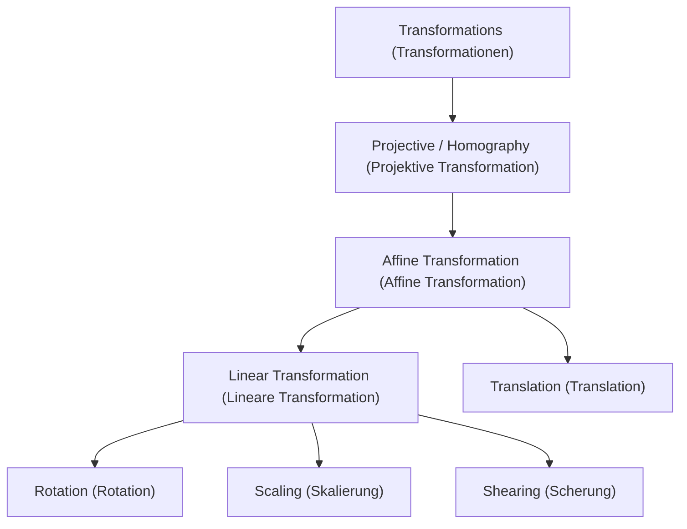
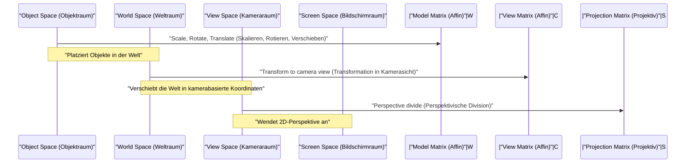

## 1. Einleitung

In modernen Technologien wie Computergrafik (CG), Bildverarbeitung und Computer Vision sind Prozesse wie die Rotation von 2D-Bildern oder die Projektion von Objekten eines 3D-Raums auf einen 2D-Bildschirm unerlässlich. Hinter diesen Prozessen wirken leistungsstarke Theorien der linearen Algebra und Geometrie. Die grundlegendsten und wichtigsten Konzepte hierbei sind die **Affine Transformation** (Affine Transformation) und die **Projektive Transformation** (Projective Transformation / Homography).

In diesem Artikel werden wir die mathematischen Mechanismen dieser beiden Transformationen systematisch und tiefgehend untersuchen, klären, warum ein spezielles Koordinatensystem namens **Homogene Koordinaten** (Homogeneous Coordinates) erforderlich ist, und wie sie in der praktischen Welt der Computergrafik und Computer Vision angewendet werden.

## 2. Rückblick und Grenzen linearer Transformationen

Bevor wir über komplexe Transformationen nachdenken, werfen wir zunächst einen Blick zurück auf die grundlegende **Lineare Transformation** (Linear Transformation). Eine lineare Transformation im 2D-Raum wird mithilfe einer $2 \times 2$-Matrix wie folgt dargestellt:

$$
\begin{pmatrix} x' \\ y' \end{pmatrix} = \begin{pmatrix} a & b \\ c & d \end{pmatrix} \begin{pmatrix} x \\ y \end{pmatrix}
$$

Zu den Transformationen, die in diesem Matrixformat ausgedrückt werden können, gehören folgende geometrische Operationen:

- **Rotation** (Rotation): Eine Operation, um um einen Winkel $\theta$ zu drehen.
- **Skalierung** (Scaling): Eine Operation, um den Maßstab entlang der $x$- und $y$-Achse zu ändern.
- **Scherung** (Shearing): Eine Operation, die ein Rechteck zu einem Parallelogramm verzerrt.
- **Spiegelung** (Reflection): Eine Operation, um entlang einer bestimmten Achse zu spiegeln.

Diese Operationen allein reichen jedoch nicht aus, um praktische CG zu rendern. Hier stehen wir vor einem großen Problem: der **Translation** (Translation). Die Translation, die den Ursprung an einen anderen Ort verschiebt, ist eine Operation, bei der ein bestimmter Vektor $(t_x, t_y)$ addiert wird, was folgendermaßen dargestellt wird:

$$
\begin{pmatrix} x' \\ y' \end{pmatrix} = \begin{pmatrix} x \\ y \end{pmatrix} + \begin{pmatrix} t_x \\ t_y \end{pmatrix}
$$

Diese Gleichung kann nicht durch einfache Matrix-"Multiplikation" dargestellt werden. In der Welt der CG ist es notwendig, kontinuierlich Rotationen und Translationen auf Millionen von Eckpunkten anzuwenden. Wenn man bei jeder Transformation zwischen Matrixmultiplikation und Vektoraddition wechseln müsste, würde die mathematische Handhabung sehr umständlich werden, und die Implementierung von Berechnungspipelines und Hardware wäre extrem komplex.

## 3. Affine Transformationen und die Einführung homogener Koordinaten

Um dieses Translationsproblem zu lösen und alle Transformationen einheitlich nur mit Matrixmultiplikationen abzuwickeln, haben Mathematiker und Ingenieure **Homogene Koordinaten** (Homogeneous Coordinates) entwickelt.

### 3.1. Was sind homogene Koordinaten?

Bei homogenen Koordinaten wird dem Ende der 2D-Koordinaten $(x, y)$ eine Dummy-Dimension (normalerweise $1$) hinzugefügt, sodass sie als 3D-Vektor $(x, y, 1)$ dargestellt werden. Im Allgemeinen entspricht die homogene Koordinate $(x, y, w)$ den kartesischen Koordinaten $(x/w, y/w)$ im realen Raum (vorausgesetzt $w \neq 0$).

### 3.2. Struktur der affinen Transformationsmatrix

Mithilfe dieses homogenen Koordinatensystems lässt sich eine 2D **Affine Transformation** wunderschön mit einer $3 \times 3$-Matrix wie folgt darstellen:

$$
\begin{pmatrix} x' \\ y' \\ 1 \end{pmatrix} = \begin{pmatrix} a & b & t_x \\ c & d & t_y \\ 0 & 0 & 1 \end{pmatrix} \begin{pmatrix} x \\ y \\ 1 \end{pmatrix}
$$

Wenn diese Matrixmultiplikation ausmultipliziert wird, erhalten wir Folgendes:

$$
x' = ax + by + t_x \\
y' = cx + dy + t_y \\
1 = 0 \cdot x + 0 \cdot y + 1
$$

Auf brillante Weise wurden der Teil der linearen Transformation ($a, b, c, d$) und der Teil der Translation ($t_x, t_y$) in eine einzige Matrixmultiplikation integriert. Die gesamte Transformation, die lineare Transformation und Translation kombiniert, wird als **Affine Transformation** bezeichnet.

### 3.3. Geometrische Eigenschaften affiner Transformationen

Die wichtigste geometrische Eigenschaft einer affinen Transformation ist, dass „**parallele Linien nach der Transformation parallel bleiben**“. Darüber hinaus bleibt „das Verhältnis von Punkten auf einem Liniensegment (z. B. dem Mittelpunkt)“ erhalten. Obwohl ein Quadrat nach einer affinen Transformation zu einem Parallelogramm werden kann, wird es niemals zu einem Trapez.

## 4. Projektive Transformation: Mathematische Darstellung der Perspektive

Obwohl die affine Transformation sehr praktisch und ausreichend für das Zeichnen von UIs oder einfachen 2D-Spielen ist, kann sie den Mechanismus, durch den menschliche Augen oder Kameras die dreidimensionale Welt erfassen, nicht vollständig darstellen. In der realen Welt erscheinen entfernte Objekte kleiner, und parallele Linien (wie Eisenbahnschienen oder Korridore) scheinen sich in einem **Fluchtpunkt** (Vanishing Point) in der Ferne zu schneiden. Dies nennt man Perspektive.

Die strikte mathematische Modellierung dieser Perspektive ist die **Projektive Transformation** (Projective Transformation).

### 4.1. Struktur der projektiven Transformationsmatrix (Homographie)

Die projektive Transformation zwischen 2D-Räumen wird ebenfalls durch eine $3 \times 3$-Matrix mit homogenen Koordinaten dargestellt. Im Bereich Computer Vision wird diese Matrix auch als **Homographiematrix** (Homography Matrix) bezeichnet. Der größte und entscheidende Unterschied besteht darin, dass in der untersten Zeile (der 3. Zeile), die bei der affinen Transformation immer $0, 0, 1$ war, beliebige Werte festgelegt werden können.

$$
\begin{pmatrix} X \\ Y \\ W \end{pmatrix} = \begin{pmatrix} h_{11} & h_{12} & h_{13} \\ h_{21} & h_{22} & h_{23} \\ h_{31} & h_{32} & h_{33} \end{pmatrix} \begin{pmatrix} x \\ y \\ 1 \end{pmatrix}
$$

Nach Anwendung dieser Transformation muss der gesamte Vektor durch $W$ dividiert (normalisiert) werden, um das Ergebnis auf die tatsächlichen 2D-Koordinaten $(x', y')$ zurückzuführen.

$$
x' = \frac{X}{W} = \frac{h_{11}x + h_{12}y + h_{13}}{h_{31}x + h_{32}y + h_{33}} \\
y' = \frac{Y}{W} = \frac{h_{21}x + h_{22}y + h_{23}}{h_{31}x + h_{32}y + h_{33}}
$$

Indem die Terme $x$ und $y$ in den Nenner einbezogen werden, ändern sich die Koordinaten nach der Transformation nichtlinear. Diese nichtlineare Division (perspektivische Division) ist genau die mathematische Grundlage, die den perspektivischen Effekt erzeugt, dass "Nahes größer und Fernes kleiner skaliert wird".

### 4.2. Klassenhierarchie der Transformationen

Die Inklusionsbeziehungen dieser Transformationen können als hierarchische Struktur organisiert werden. Die projektive Transformation weist den höchsten Freiheitsgrad auf, wobei die affine Transformation und die lineare Transformation als Spezialfälle davon existieren.

## 5. Die Transformationspipeline in der CG

In der 3DCG-Rendering-Pipeline werden Matrixmultiplikationen sukzessive und kontinuierlich durchgeführt, um 3D-Vertex-Daten in finale 2D-Bildschirmkoordinaten umzuwandeln. Da der Raum hier dreidimensional ist, wird das homogene Koordinatensystem 4-dimensional $(x, y, z, 1)$ und es werden Matrizen der Größe $4 \times 4$ verwendet.

1. **Modelltransformation** (Model Transform): Platziert einzelne 3D-Modelle, die anhand von Referenzpunkten erstellt wurden, an geeigneten Positionen in der riesigen virtuellen Welt und passt deren Ausrichtung und Größe an. Dies ist eine reine affine Transformation.
2. **View-Transformation** (View Transform): Platziert eine virtuelle Kamera und transformiert die Koordinaten der gesamten Welt in „relative Positionen, die von der Kamera aus gesehen werden“. Auch dies ist eine Kombination aus affinen Transformationen (hauptsächlich Rotation und Translation).
3. **Projektionstransformation** (Projection Transform): Projiziert die 3D-Szene auf ein 2D-Sichtvolumen (Frustum). Hier wird die projektive $4 \times 4$-Transformationsmatrix mit Komponenten in der untersten Zeile angewendet, und schließlich schließt die Division durch das $w$-Element das Rendern mit einem Gefühl von Perspektive ab.

## 6. Anwendungen in Computer Vision und Bildverarbeitung

Affine und projektive Transformationen sind nicht nur entscheidend für das Zeichnen in 3DCG von Grund auf, sondern auch äußerst wichtig im Bereich der Computer Vision für die Verarbeitung und Analyse von vorhandenen Fotos und Videos.

### 6.1. Korrektur von Bildverzerrungen (Distortion Correction)
Bei Fotos, die von unten schräg nach oben auf ein Gebäude aufgenommen wurden, scheinen die Umrisse des Gebäudes nach oben hin schmaler zu werden (mit Perspektive). Dies liegt daran, dass das Bild durch die projektive Transformation durch das Kameraobjektiv verzerrt wurde. Durch die Berechnung der Homographiematrix, die die Koordinaten der vier Ecken des Bildes den Koordinaten eines ursprünglichen Rechtecks zuordnet, und die Anwendung einer inversen Transformation mit der inversen Matrix kann das Bild so korrigiert werden, als wäre es frontal aufgenommen worden.

### 6.2. Zusammenfügen von Panoramabildern (Image Stitching)
Die projektive Transformation ist auch tief in die Technologie des Zusammenfügens mehrerer Fotos zu einem weiten Panoramabild involviert. Bilder, die durch Drehen einer Kamera auf derselben Stelle aufgenommen wurden, sind geometrisch so miteinander verbunden, dass sie durch eine projektive Transformation ineinander transformiert werden können. Durch Extrahieren von Merkmalspunkten (wie Ecken oder markante Texturen) zwischen den Bildern und das Schätzen der Homographiematrix, die sie mit dem geringstmöglichen Fehler überlagert, wird eine nahtlose, natürliche Panoramasysnthese erreicht.

## 7. Fazit

Ausgehend von den grundlegenden Matrixoperationen der linearen Algebra und durch die Einführung des genialen mathematischen Mechanismus der homogenen Koordinaten (Hinzufügen einer Dimension am Ende) können wir sowohl die affine als auch die projektive Transformation als einheitliche Matrixmultiplikationen behandeln.

- Die **Affine Transformation** drückt Deformationen und Transformationen von starren Körpern aus, einschließlich Translation, wobei die Parallelität erhalten bleibt.
- Die **Projektive Transformation** stellt darüber hinaus die Perspektive dar und ermöglicht eine nichtlineare Projektion, die viel näher an echten Kameras liegt.

Dieser Rahmen vereinfachte das Design von Hardwareschaltungen innerhalb von GPUs und erhöhte die Ausdruckskraft von Computergrafiken enorm. Gleichzeitig wurde er zur grundlegenden Basis für fortschrittliche Bilderkennungs- und Korrekturalgorithmen in der Computer Vision. Ein tiefes Verständnis der mathematischen Bedeutungen dahinter wird sicherlich die Funktionsweise von 3D-Software und Bildverarbeitungs-APIs, die Sie normalerweise verwenden, klarer machen.
