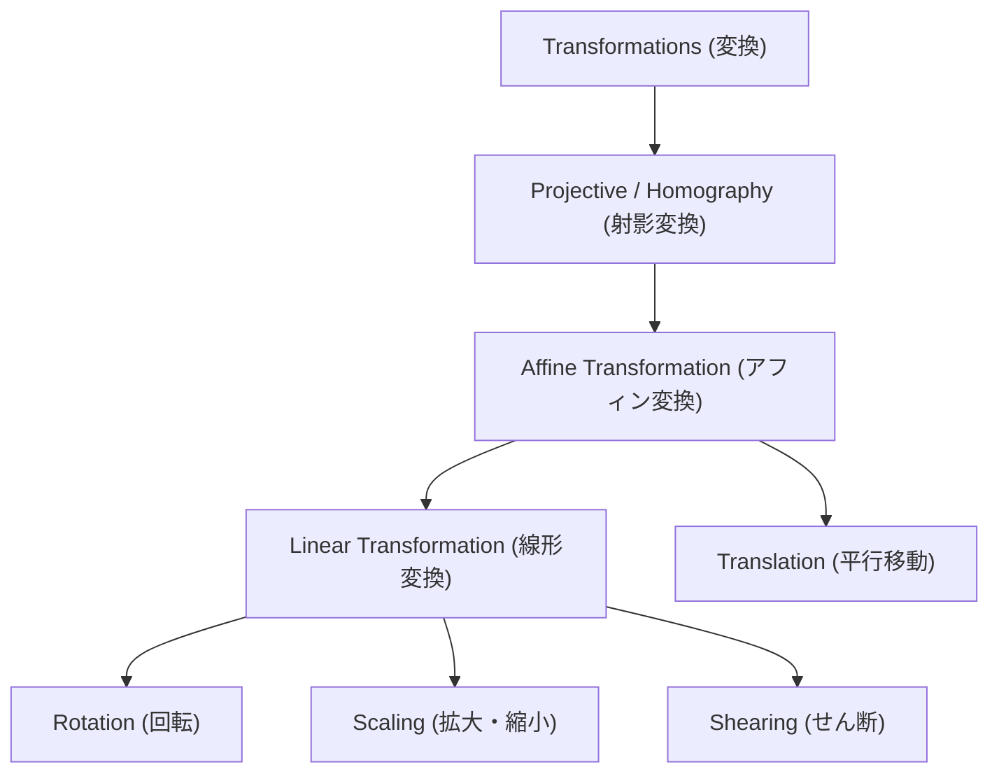
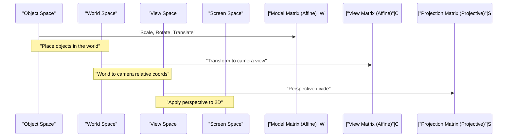

## 1. Introduction

In modern Computer Graphics (CG), image processing, and computer vision technologies, rotating 2D images or projecting 3D objects onto a 2D screen are indispensable operations. Behind these processes, powerful theories from linear algebra and geometry are actively at work. Among them, the most fundamental and crucial concepts are **Affine Transformation** and **Projective Transformation** (or Homography).

In this article, we will systematically and deeply explore the mathematical mechanisms of these two transformations, why a special coordinate system called **Homogeneous Coordinates** is required, and how they are applied in the practical realms of CG and computer vision.

## 2. Review and Limitations of Linear Transformations

Before diving into complex transformations, let us first look back at basic **Linear Transformations**. A linear transformation in a 2D space is expressed using a $2 \times 2$ matrix as follows:

$$
\begin{pmatrix} x' \\ y' \end{pmatrix} = \begin{pmatrix} a & b \\ c & d \end{pmatrix} \begin{pmatrix} x \\ y \end{pmatrix}
$$

Transformations that can be expressed in this matrix format include the following geometric operations:

- **Rotation**: An operation to rotate by an angle $\theta$.
- **Scaling**: An operation to change the scale along the $x$-axis and $y$-axis.
- **Shearing**: An operation that distorts a rectangle into a parallelogram.
- **Reflection**: An operation to flip across a specific axis.

However, these operations alone are insufficient for rendering practical CG. Here we face one major problem: **Translation**. A translation that moves the origin to another location is an operation of adding a specific vector $(t_x, t_y)$, which is represented as follows:

$$
\begin{pmatrix} x' \\ y' \end{pmatrix} = \begin{pmatrix} x \\ y \end{pmatrix} + \begin{pmatrix} t_x \\ t_y \end{pmatrix}
$$

This equation cannot be represented merely by matrix "multiplication". In the world of CG, it is necessary to sequentially apply rotations and translations to millions of vertices. If we had to switch between matrix multiplication and vector addition for every transformation, the mathematical handling would become cumbersome, and the implementation of computation pipelines and hardware would become exceedingly complex.

## 3. Affine Transformations and the Introduction of Homogeneous Coordinates

To solve this translation problem and uniformly handle all transformations using only matrix multiplication, mathematicians and engineers devised **Homogeneous Coordinates**.

### 3.1. What are Homogeneous Coordinates?

In homogeneous coordinates, one dummy dimension (usually $1$) is appended to the end of the 2D coordinates $(x, y)$ to represent it as a 3D vector $(x, y, 1)$. In general, the homogeneous coordinate $(x, y, w)$ corresponds to the Cartesian coordinate $(x/w, y/w)$ in real space (provided $w \neq 0$).

### 3.2. Structure of the Affine Transformation Matrix

Using this homogeneous coordinate system, a 2D **Affine Transformation** can be beautifully represented as a $3 \times 3$ square matrix as follows:

$$
\begin{pmatrix} x' \\ y' \\ 1 \end{pmatrix} = \begin{pmatrix} a & b & t_x \\ c & d & t_y \\ 0 & 0 & 1 \end{pmatrix} \begin{pmatrix} x \\ y \\ 1 \end{pmatrix}
$$

Expanding this matrix multiplication yields the following:

$$
x' = ax + by + t_x \\
y' = cx + dy + t_y \\
1 = 0 \cdot x + 0 \cdot y + 1
$$

Brilliantly, the linear transformation part ($a, b, c, d$) and the translation part ($t_x, t_y$) have been integrated into a single matrix multiplication. The entire transformation combining a linear transformation with translation is referred to as an **Affine Transformation**.

### 3.3. Geometric Properties of Affine Transformations

The most important geometric property of an affine transformation is that "**parallel lines remain parallel after transformation**". Furthermore, "the ratio of points on a line segment (e.g., the midpoint)" is also preserved before and after the transformation. Therefore, while applying an affine transformation to a square may result in a parallelogram, it will never become a trapezoid.

## 4. Projective Transformation: Mathematical Representation of Perspective

While affine transformations are extremely convenient and sufficient for rendering UI or simple 2D games, they cannot completely represent the mechanism by which human eyes or cameras capture the 3D world. In the real world, distant objects appear smaller, and parallel lines (like straight railway tracks or corridors) appear to intersect at a distant **Vanishing Point**. This is known as perspective.

The mathematical and rigorous modeling of this perspective is the **Projective Transformation**.

### 4.1. Structure of the Projective Transformation Matrix (Homography)

Projective transformations between 2D spaces are also represented by a $3 \times 3$ matrix using homogeneous coordinates. In the field of computer vision, this matrix is also called the **Homography Matrix**. The decisive difference is that arbitrary values can be set in the bottom row (the 3rd row), which was always $0, 0, 1$ in an affine transformation.

$$
\begin{pmatrix} X \\ Y \\ W \end{pmatrix} = \begin{pmatrix} h_{11} & h_{12} & h_{13} \\ h_{21} & h_{22} & h_{23} \\ h_{31} & h_{32} & h_{33} \end{pmatrix} \begin{pmatrix} x \\ y \\ 1 \end{pmatrix}
$$

After applying this transformation, to revert the result back to actual 2D coordinates $(x', y')$, it is necessary to divide (normalize) the entire vector by $W$.

$$
x' = \frac{X}{W} = \frac{h_{11}x + h_{12}y + h_{13}}{h_{31}x + h_{32}y + h_{33}} \\
y' = \frac{Y}{W} = \frac{h_{21}x + h_{22}y + h_{23}}{h_{31}x + h_{32}y + h_{33}}
$$

Because the denominator includes terms of $x$ and $y$, the coordinates after transformation change non-linearly. This non-linear division (perspective division) is precisely the mathematical foundation that produces the perspective effect where "near objects are scaled larger, and distant objects are scaled smaller."

### 4.2. Class Hierarchy of Transformations

The inclusion relationships of these transformations can be organized as a hierarchical structure. Projective transformation has the highest degree of freedom, with affine transformations and linear transformations existing as its special cases.

## 5. Transformation Pipeline in CG

In the 3DCG rendering pipeline, matrix multiplication is performed sequentially in stages to transform 3D vertex data into final 2D screen coordinates. Because the space is 3-dimensional here, the homogeneous coordinate system becomes 4-dimensional $(x, y, z, 1)$, and matrices of size $4 \times 4$ are used.

1. **Model Transform**: Individual 3D models created around a reference point are placed at appropriate positions in a vast virtual world, adjusting their orientation and size. This is a pure affine transformation.
2. **View Transform**: A virtual camera is placed, and the coordinates of the entire world are transformed into "relative positions viewed from the camera". This is also a combination of affine transformations (mainly rotation and translation).
3. **Projection Transform**: The 3D scene is projected onto a 2D viewing frustum. Here, a $4 \times 4$ projective transformation matrix with bottom row components is applied, and finally, by dividing by the $w$ element, rendering with a sense of perspective is completed.

## 6. Applications in Computer Vision and Image Processing

Affine and projective transformations are extremely important not only for drawing pictures from scratch in 3DCG but also in the field of computer vision for processing and analyzing existing photos and videos.

### 6.1. Image Distortion Correction
In photos looking up at a building diagonally from below, the outline of the building appears to taper towards the top (with perspective attached). This is because the image is distorted by a projective transformation through the camera lens. By calculating the homography matrix that maps the coordinates of the four corners of the image to the coordinates of an original rectangle, and applying the inverse transformation using the inverse matrix, the image can be corrected as if it were taken directly from the front.

### 6.2. Panorama Image Stitching
Projective transformation is also deeply involved in the technology of stitching multiple photos together to create a vast panorama image. Images taken by rotating a camera on the spot are geometrically related to each other such that they can be converted by a projective transformation. By extracting feature points (distinct points like corners and textures) between the images and estimating the homography matrix that overlays them with the least error, a seamless and natural panorama synthesis is realized.

## 7. Conclusion

Starting from the basic matrix operations of linear algebra, by introducing the elegant mathematical device of the homogeneous coordinate system—appending a dimension at the end—we can handle affine and projective transformations as a unified matrix multiplication.

- **Affine Transformation** expresses rigid transformations and deformations including translation, preserving parallelism.
- **Projective Transformation**, in addition to this, expresses perspective, enabling non-linear projections closer to real cameras.

This framework simplified the design of hardware circuits inside GPUs, dramatically improving the expressive power of computer graphics. At the same time, it has become the fundamental bedrock for advanced image recognition and correction algorithms in computer vision. By deeply understanding the mathematical meanings behind these, the behavior of the 3D software and image processing APIs you normally use will surely become clearer.
