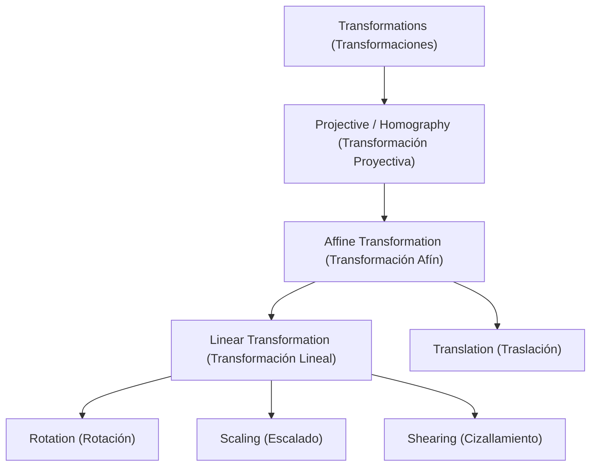
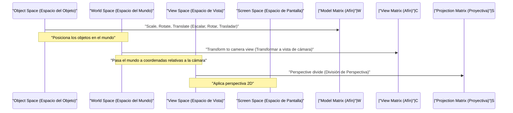

## 1. Introducción

En los gráficos por computadora (CG) modernos, el procesamiento de imágenes y las tecnologías de visión por computadora, procesos como rotar imágenes en 2D o proyectar objetos de un espacio 3D en una pantalla 2D son indispensables. Detrás de estos procesos, actúan poderosas teorías de álgebra lineal y geometría. Entre ellas, los conceptos más fundamentales y cruciales son la **Transformación Afín** (Affine Transformation) y la **Transformación Proyectiva** (Projective Transformation / Homography).

En este artículo, exploraremos de manera sistemática y profunda los mecanismos matemáticos de estas dos transformaciones, por qué es necesario un sistema de coordenadas especial llamado **Coordenadas Homogéneas** (Homogeneous Coordinates), y cómo se aplican en los mundos prácticos de los CG y la visión por computadora.

## 2. Repaso y Limitaciones de las Transformaciones Lineales

Antes de pensar en transformaciones, primero revisemos la **Transformación Lineal** (Linear Transformation) básica. Una transformación lineal en el espacio 2D se expresa usando una matriz $2 \times 2$ de la siguiente manera:

$$
\begin{pmatrix} x' \\ y' \end{pmatrix} = \begin{pmatrix} a & b \\ c & d \end{pmatrix} \begin{pmatrix} x \\ y \end{pmatrix}
$$

Las transformaciones que pueden expresarse en este formato matricial incluyen las siguientes operaciones geométricas:

- **Rotación** (Rotation): Operación para rotar un ángulo $\theta$.
- **Escalado** (Scaling): Operación para cambiar la escala en los ejes $x$ e $y$.
- **Cizallamiento** (Shearing): Operación que distorsiona un rectángulo en un paralelogramo.
- **Reflexión** (Reflection): Operación para invertir a lo largo de un eje específico.

Sin embargo, estas operaciones por sí solas son insuficientes para renderizar CG prácticos. Aquí enfrentamos un gran problema: la **Traslación** (Translation). La traslación que mueve el origen a otra ubicación es una operación de sumar un vector específico $(t_x, t_y)$, y se representa así:

$$
\begin{pmatrix} x' \\ y' \end{pmatrix} = \begin{pmatrix} x \\ y \end{pmatrix} + \begin{pmatrix} t_x \\ t_y \end{pmatrix}
$$

Esta ecuación no se puede representar simplemente mediante una "multiplicación" matricial. En el mundo del CG, es necesario aplicar continuamente rotaciones y traslaciones a millones de vértices. Si tuviéramos que usar multiplicaciones de matrices y sumas de vectores de forma alternada en cada transformación, el manejo matemático sería muy engorroso y la implementación de las canalizaciones computacionales y el hardware se volvería extremadamente compleja.

## 3. Transformaciones Afines y la Introducción de las Coordenadas Homogéneas

Para resolver este problema de traslación y manejar unificadamente todas las transformaciones únicamente con multiplicaciones matriciales, matemáticos e ingenieros idearon las **Coordenadas Homogéneas** (Homogeneous Coordinates).

### 3.1. ¿Qué son las Coordenadas Homogéneas?

En las coordenadas homogéneas, se añade una dimensión ficticia (generalmente $1$) al final de las coordenadas 2D $(x, y)$, representándose como un vector 3D $(x, y, 1)$. En general, la coordenada homogénea $(x, y, w)$ corresponde a las coordenadas ortogonales $(x/w, y/w)$ en el espacio real (siempre que $w \neq 0$).

### 3.2. Estructura de la Matriz de Transformación Afín

Utilizando este sistema de coordenadas homogéneas, una **Transformación Afín** 2D se puede representar maravillosamente con una matriz cuadrada $3 \times 3$ de la siguiente manera:

$$
\begin{pmatrix} x' \\ y' \\ 1 \end{pmatrix} = \begin{pmatrix} a & b & t_x \\ c & d & t_y \\ 0 & 0 & 1 \end{pmatrix} \begin{pmatrix} x \\ y \\ 1 \end{pmatrix}
$$

Al expandir esta multiplicación matricial, obtenemos lo siguiente:

$$
x' = ax + by + t_x \\
y' = cx + dy + t_y \\
1 = 0 \cdot x + 0 \cdot y + 1
$$

Magníficamente, la parte de transformación lineal ($a, b, c, d$) y la parte de traslación ($t_x, t_y$) se han integrado en una sola multiplicación matricial. A toda esta transformación que combina transformación lineal y traslación se le llama **Transformación Afín**.

### 3.3. Propiedades Geométricas de las Transformaciones Afines

La propiedad geométrica más importante de una transformación afín es que "**las líneas paralelas siguen siendo paralelas después de la transformación**". Además, "la proporción de los puntos sobre un segmento de línea (por ejemplo, el punto medio)" también se conserva. Por lo tanto, aunque un cuadrado se convierta en un paralelogramo al aplicarle una transformación afín, nunca se convertirá en un trapecio.

## 4. Transformación Proyectiva: Representación Matemática de la Perspectiva

Aunque la transformación afín es muy conveniente y suficiente para dibujar interfaces gráficas (UI) o en juegos 2D simples, no puede representar completamente el mecanismo por el cual los ojos humanos o las cámaras capturan el mundo tridimensional. En el mundo real, los objetos distantes se ven más pequeños, y las líneas paralelas (como vías de tren o pasillos) parecen cruzarse en un **Punto de Fuga** (Vanishing Point) a lo lejos. A esto se le llama perspectiva.

El modelado matemático estricto de esta perspectiva es la **Transformación Proyectiva** (Projective Transformation).

### 4.1. Estructura de la Matriz de Transformación Proyectiva (Homografía)

La transformación proyectiva entre espacios 2D también se representa mediante una matriz $3 \times 3$ utilizando coordenadas homogéneas. En el campo de la visión por computadora, a esta matriz también se le llama **Matriz de Homografía** (Homography Matrix). La mayor y decisiva diferencia es que la fila inferior (la 3.ª fila), que en la transformación afín siempre era $0, 0, 1$, puede establecerse en valores arbitrarios.

$$
\begin{pmatrix} X \\ Y \\ W \end{pmatrix} = \begin{pmatrix} h_{11} & h_{12} & h_{13} \\ h_{21} & h_{22} & h_{23} \\ h_{31} & h_{32} & h_{33} \end{pmatrix} \begin{pmatrix} x \\ y \\ 1 \end{pmatrix}
$$

Después de aplicar esta transformación, para devolver el resultado a las coordenadas reales en 2D $(x', y')$, es necesario dividir (normalizar) todo el vector por $W$.

$$
x' = \frac{X}{W} = \frac{h_{11}x + h_{12}y + h_{13}}{h_{31}x + h_{32}y + h_{33}} \\
y' = \frac{Y}{W} = \frac{h_{21}x + h_{22}y + h_{23}}{h_{31}x + h_{32}y + h_{33}}
$$

Al incluir los términos de $x$ e $y$ en el denominador, las coordenadas tras la transformación cambian de forma no lineal. Esta división no lineal (división de perspectiva) es precisamente el fundamento matemático que genera el efecto de perspectiva de "escalar más grande lo que está cerca y más pequeño lo que está lejos".

### 4.2. Jerarquía de Clases de Transformaciones

Las relaciones de inclusión de estas transformaciones pueden organizarse en una estructura jerárquica. La transformación proyectiva es la que tiene mayor grado de libertad, existiendo la transformación afín y la transformación lineal como casos especiales suyos.

## 5. La Canalización de Transformación en CG

En la canalización de renderizado de 3DCG, para transformar los datos de los vértices tridimensionales a coordenadas 2D finales en pantalla, se realizan multiplicaciones matriciales de forma progresiva y continua. Dado que aquí el espacio es tridimensional, el sistema de coordenadas homogéneas será de 4 dimensiones $(x, y, z, 1)$ y se utilizarán matrices de tamaño $4 \times 4$.

1. **Transformación de Modelo** (Model Transform): Sitúa los modelos 3D individuales creados en puntos de referencia en posiciones adecuadas dentro del inmenso mundo virtual, ajustando su orientación y tamaño. Esta es una transformación afín pura.
2. **Transformación de Vista** (View Transform): Se sitúa una cámara virtual y se transforma las coordenadas de todo el mundo a "posiciones relativas vistas desde la cámara". Esta también es una combinación de transformaciones afines (principalmente rotación y traslación).
3. **Transformación de Proyección** (Projection Transform): Proyecta la escena 3D sobre el tronco de visión 2D (viewing frustum). Aquí se aplica la matriz de transformación proyectiva de $4 \times 4$ que tiene componentes en la última fila, y finalmente, al dividir por el elemento $w$, se completa el renderizado con sensación de perspectiva.

## 6. Aplicaciones en Visión por Computadora y Procesamiento de Imágenes

Las transformaciones afines y proyectivas no solo son vitales para dibujar en 3DCG desde cero, sino que también son sumamente importantes en el área de la visión por computadora para el procesamiento y análisis de fotografías y vídeos existentes.

### 6.1. Corrección de Distorsión de Imágenes (Distortion Correction)
En las fotografías de edificios tomadas desde abajo en diagonal, los contornos de los edificios aparecen encogidos en la parte superior (en perspectiva). Esto se debe a que la imagen se distorsiona por la transformación proyectiva que atraviesa la lente de la cámara. Calculando la matriz de homografía que asocie las coordenadas de las cuatro esquinas de la imagen a las coordenadas de un rectángulo original, y aplicando una transformación inversa usando la matriz inversa, se puede corregir la imagen como si se hubiera tomado de frente.

### 6.2. Unión de Imágenes Panorámicas (Image Stitching)
La transformación proyectiva también está profundamente involucrada en la tecnología de unir múltiples fotografías para crear una amplia imagen panorámica. Entre las imágenes capturadas rotando una cámara desde el mismo sitio, existe una relación geométrica que permite transformarlas entre sí mediante transformaciones proyectivas. Extrayendo los puntos característicos (esquinas o puntos de textura notables) de las imágenes, y estimando la matriz de homografía que las superpone con el menor error posible, se consigue una síntesis de panorámica natural y sin uniones aparentes.

## 7. Conclusión

Partiendo de las operaciones básicas de matrices del álgebra lineal, y al introducir el ingenioso mecanismo matemático de las coordenadas homogéneas (añadir una dimensión al final), podemos tratar tanto la transformación afín como la proyectiva como multiplicaciones de matrices unificadas.

- La **Transformación Afín** expresa deformaciones y transformaciones de cuerpos rígidos, incluida la traslación, conservando el paralelismo.
- La **Transformación Proyectiva** además de eso representa la perspectiva, permitiendo una proyección no lineal mucho más cercana a las cámaras reales.

Este marco de trabajo simplificó el diseño de circuitos de hardware dentro de las GPU, incrementando enormemente la capacidad expresiva de los gráficos por computadora. Paralelamente, se ha convertido en la base esencial para algoritmos avanzados de reconocimiento y corrección de imágenes en el campo de la visión por computadora. Comprender profundamente los significados matemáticos que hay detrás seguramente hará mucho más nítido el funcionamiento de los API de procesamiento de imágenes y software 3D que utilizas habitualmente.
