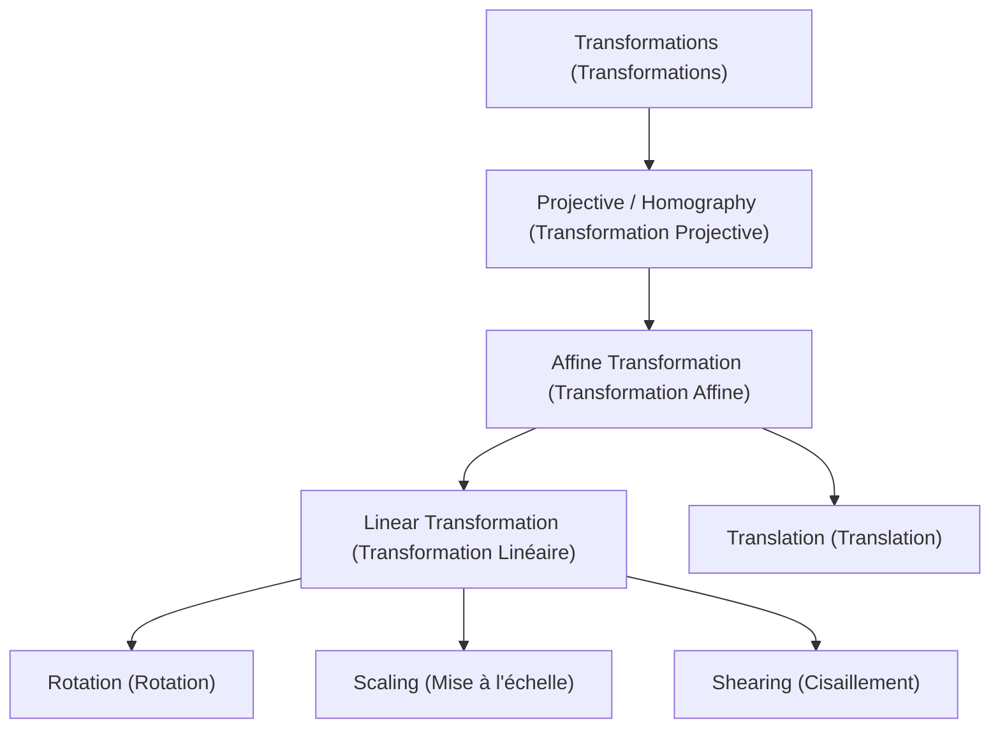
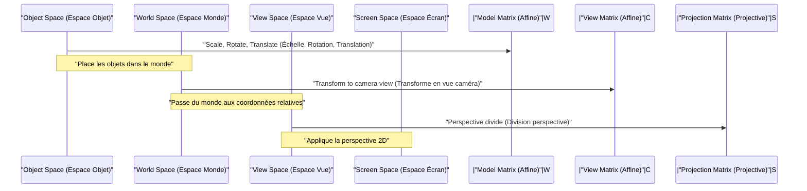

## 1. Introduction

Dans les technologies modernes de l'infographie (CG), du traitement d'images et de la vision par ordinateur, des processus tels que la rotation d'images 2D ou la projection d'objets tridimensionnels sur un écran 2D sont indispensables. Derrière ces processus opèrent les puissantes théories de l'algèbre linéaire et de la géométrie. Parmi elles, les concepts les plus fondamentaux et cruciaux sont la **Transformation Affine** (Affine Transformation) et la **Transformation Projective** (Projective Transformation / Homography).

Dans cet article, nous explorerons de manière systématique et approfondie les mécanismes mathématiques de ces deux transformations, pourquoi un système de coordonnées spécial appelé **Coordonnées Homogènes** (Homogeneous Coordinates) est nécessaire, et comment elles sont appliquées dans les mondes pratiques de l'infographie et de la vision par ordinateur.

## 2. Rappel et Limites des Transformations Linéaires

Avant de réfléchir aux transformations, passons d'abord en revue la **Transformation Linéaire** (Linear Transformation) de base. Une transformation linéaire dans un espace 2D est exprimée en utilisant une matrice $2 \times 2$ de la manière suivante :

$$
\begin{pmatrix} x' \\ y' \end{pmatrix} = \begin{pmatrix} a & b \\ c & d \end{pmatrix} \begin{pmatrix} x \\ y \end{pmatrix}
$$

Les transformations qui peuvent être exprimées sous cette forme matricielle incluent les opérations géométriques suivantes :

- **Rotation** (Rotation) : Opération de rotation d'un angle $\theta$.
- **Mise à l'échelle** (Scaling) : Opération de modification de l'échelle selon les axes $x$ et $y$.
- **Cisaillement** (Shearing) : Opération qui déforme un rectangle en un parallélogramme.
- **Réflexion** (Reflection) : Opération d'inversion par rapport à un axe spécifique.

Cependant, ces opérations seules sont insuffisantes pour rendre de la 3D (CG) pratique. Ici, nous faisons face à un problème majeur : la **Translation** (Translation). La translation, qui déplace l'origine vers un autre emplacement, est une opération d'addition d'un vecteur spécifique $(t_x, t_y)$, et est représentée ainsi :

$$
\begin{pmatrix} x' \\ y' \end{pmatrix} = \begin{pmatrix} x \\ y \end{pmatrix} + \begin{pmatrix} t_x \\ t_y \end{pmatrix}
$$

Cette équation ne peut pas être représentée par une simple « multiplication » matricielle. Dans le monde de la CG, il est nécessaire d'appliquer en continu des rotations et des translations à des millions de sommets. S'il fallait alterner entre la multiplication de matrices et l'addition de vecteurs à chaque transformation, le traitement mathématique deviendrait très fastidieux et l'implémentation des pipelines de calcul et du matériel deviendrait extrêmement complexe.

## 3. Transformations Affines et Introduction des Coordonnées Homogènes

Pour résoudre ce problème de translation et gérer de manière unifiée toutes les transformations uniquement avec des multiplications matricielles, les mathématiciens et les ingénieurs ont conçu les **Coordonnées Homogènes** (Homogeneous Coordinates).

### 3.1. Que sont les Coordonnées Homogènes ?

Dans les coordonnées homogènes, on ajoute une dimension factice (généralement $1$) à la fin des coordonnées 2D $(x, y)$, les représentant comme un vecteur 3D $(x, y, 1)$. En général, la coordonnée homogène $(x, y, w)$ correspond aux coordonnées cartésiennes $(x/w, y/w)$ dans l'espace réel (à condition que $w \neq 0$).

### 3.2. Structure de la Matrice de Transformation Affine

En utilisant ce système de coordonnées homogènes, une **Transformation Affine** 2D peut être magnifiquement représentée avec une matrice carrée $3 \times 3$ de la manière suivante :

$$
\begin{pmatrix} x' \\ y' \\ 1 \end{pmatrix} = \begin{pmatrix} a & b & t_x \\ c & d & t_y \\ 0 & 0 & 1 \end{pmatrix} \begin{pmatrix} x \\ y \\ 1 \end{pmatrix}
$$

En développant cette multiplication matricielle, nous obtenons ce qui suit :

$$
x' = ax + by + t_x \\
y' = cx + dy + t_y \\
1 = 0 \cdot x + 0 \cdot y + 1
$$

De manière brillante, la partie de transformation linéaire ($a, b, c, d$) et la partie de translation ($t_x, t_y$) ont été intégrées dans une seule multiplication matricielle. L'ensemble de cette transformation combinant transformation linéaire et translation est appelé **Transformation Affine**.

### 3.3. Propriétés Géométriques des Transformations Affines

La propriété géométrique la plus importante d'une transformation affine est que « **les lignes parallèles restent parallèles après la transformation** ». De plus, « la proportion des points sur un segment de droite (par exemple, le point médian) » est également conservée. Par conséquent, bien qu'un carré puisse devenir un parallélogramme après une transformation affine, il ne deviendra jamais un trapèze.

## 4. Transformation Projective : Représentation Mathématique de la Perspective

Bien que la transformation affine soit très pratique et suffisante pour dessiner des interfaces graphiques (UI) ou des jeux 2D simples, elle ne peut pas représenter complètement le mécanisme par lequel l'œil humain ou les caméras capturent le monde tridimensionnel. Dans le monde réel, les objets lointains apparaissent plus petits, et les lignes parallèles (comme des voies ferrées ou des couloirs) semblent se croiser en un **Point de Fuite** (Vanishing Point) au loin. C'est ce qu'on appelle la perspective.

La modélisation mathématique stricte de cette perspective est la **Transformation Projective** (Projective Transformation).

### 4.1. Structure de la Matrice de Transformation Projective (Homographie)

La transformation projective entre les espaces 2D est également représentée par une matrice $3 \times 3$ utilisant des coordonnées homogènes. Dans le domaine de la vision par ordinateur, cette matrice est aussi appelée **Matrice d'Homographie** (Homography Matrix). La différence majeure et décisive est que la ligne inférieure (la 3ème ligne), qui dans la transformation affine était toujours $0, 0, 1$, peut être définie avec des valeurs arbitraires.

$$
\begin{pmatrix} X \\ Y \\ W \end{pmatrix} = \begin{pmatrix} h_{11} & h_{12} & h_{13} \\ h_{21} & h_{22} & h_{23} \\ h_{31} & h_{32} & h_{33} \end{pmatrix} \begin{pmatrix} x \\ y \\ 1 \end{pmatrix}
$$

Après avoir appliqué cette transformation, pour ramener le résultat aux véritables coordonnées 2D $(x', y')$, il est nécessaire de diviser (normaliser) tout le vecteur par $W$.

$$
x' = \frac{X}{W} = \frac{h_{11}x + h_{12}y + h_{13}}{h_{31}x + h_{32}y + h_{33}} \\
y' = \frac{Y}{W} = \frac{h_{21}x + h_{22}y + h_{23}}{h_{31}x + h_{32}y + h_{33}}
$$

En incluant les termes $x$ et $y$ dans le dénominateur, les coordonnées après transformation changent de façon non linéaire. Cette division non linéaire (division perspective) est précisément le fondement mathématique qui génère l'effet de perspective où « ce qui est proche est agrandi et ce qui est loin est réduit ».

### 4.2. Hiérarchie des Classes de Transformations

Les relations d'inclusion de ces transformations peuvent être organisées dans une structure hiérarchique. La transformation projective possède le plus haut degré de liberté, la transformation affine et la transformation linéaire existant en tant que cas particuliers de celle-ci.

## 5. Le [Pipeline](https://kenji.blog/fr/p/cicd-pipeline-github-actions-best-practices/) de Transformation en CG

Dans le pipeline de rendu 3DCG, afin de transformer les données des sommets 3D en coordonnées d'écran 2D finales, des multiplications matricielles sont effectuées de manière progressive et continue. L'espace étant ici tridimensionnel, le système de coordonnées homogènes devient en 4 dimensions $(x, y, z, 1)$ et des matrices de taille $4 \times 4$ sont utilisées.

1. **Transformation de Modèle** (Model Transform) : Positionne les modèles 3D individuels créés avec un point de référence à des positions appropriées dans un immense monde virtuel, ajustant leur orientation et leur taille. C'est une pure transformation affine.
2. **Transformation de Vue** (View Transform) : Place une caméra virtuelle et transforme les coordonnées du monde entier en « positions relatives vues depuis la caméra ». Il s'agit également d'une combinaison de transformations affines (principalement rotation et translation).
3. **Transformation de Projection** (Projection Transform) : Projette la scène 3D sur un volume de vue 2D (frustum). Ici, la matrice de transformation projective de $4 \times 4$ contenant les composants de la ligne inférieure est appliquée, et enfin, la division par l'élément $w$ permet de compléter le rendu avec une sensation de perspective.

## 6. Applications en Vision par Ordinateur et Traitement d'Images

Les transformations affines et projectives ne sont pas seulement vitales pour dessiner en 3DCG à partir de zéro, elles sont également très importantes dans le domaine de la vision par ordinateur pour le traitement et l'analyse de photographies et vidéos existantes.

### 6.1. Correction de Distorsion d'Images (Distortion Correction)
Dans les photographies de bâtiments prises de biais par le bas, les contours des bâtiments semblent rétrécir vers le haut (avec de la perspective). Cela est dû au fait que l'image est déformée par la transformation projective à travers l'objectif de l'appareil photo. En calculant la matrice d'homographie qui mappe les coordonnées des quatre coins de l'image aux coordonnées d'un rectangle d'origine, et en appliquant une transformation inverse avec la matrice inverse, l'image peut être corrigée comme si elle avait été prise de face.

### 6.2. Assemblage d'Images Panoramiques (Image Stitching)
La transformation projective est aussi profondément impliquée dans la technologie d'assemblage de multiples photographies pour créer une large image panoramique. Les images prises en faisant pivoter un appareil photo depuis le même endroit sont géométriquement liées de manière à pouvoir se transformer l'une l'autre via une transformation projective. En extrayant les points caractéristiques (comme des coins ou des textures notables) entre les images, et en estimant la matrice d'homographie qui les superpose avec la plus petite marge d'erreur possible, une synthèse panoramique naturelle et sans coupures est réalisée.

## 7. Conclusion

En partant des opérations matricielles basiques de l'algèbre linéaire, et en introduisant le mécanisme mathématique astucieux des coordonnées homogènes (l'ajout d'une dimension à la fin), nous pouvons traiter à la fois la transformation affine et la transformation projective comme des multiplications matricielles unifiées.

- La **Transformation Affine** exprime des déformations et des transformations de corps rigides, y compris la translation, tout en conservant le parallélisme.
- La **Transformation Projective** exprime en plus la perspective, permettant une projection non linéaire bien plus proche des véritables appareils photo.

Ce cadre a simplifié la conception des circuits matériels à l'intérieur des GPU, augmentant considérablement la capacité expressive de l'infographie. En parallèle, cela est devenu la base essentielle des algorithmes avancés de reconnaissance et de correction d'images en vision par ordinateur. Comprendre profondément les significations mathématiques derrière tout cela rendra sûrement plus clair le fonctionnement des logiciels 3D et des API de traitement d'images que vous utilisez habituellement.

