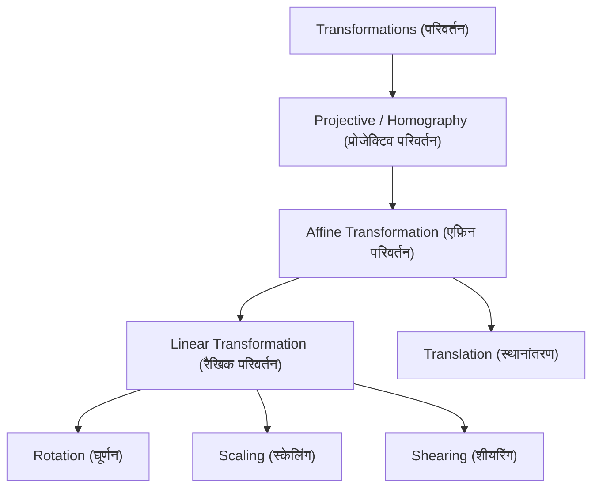
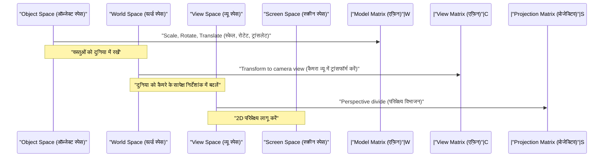

## 1. परिचय

आधुनिक कंप्यूटर ग्राफिक्स (CG), छवि प्रसंस्करण (Image Processing), और कंप्यूटर विज़न (Computer Vision) तकनीकों में, 2D छवियों को घुमाना (Rotate) या 3D स्पेस की वस्तुओं को 2D स्क्रीन पर प्रोजेक्ट करना अपरिहार्य प्रक्रियाएं हैं। इन प्रक्रियाओं के पीछे, रैखिक बीजगणित (Linear Algebra) और ज्यामिति (Geometry) के शक्तिशाली सिद्धांत सक्रिय रूप से कार्य कर रहे हैं। इनमें, सबसे बुनियादी और महत्वपूर्ण अवधारणाएं **एफ़िन ट्रांसफॉर्मेशन** (Affine Transformation) और **प्रोजेक्टिव ट्रांसफॉर्मेशन** (Projective Transformation / Homography) हैं।

इस लेख में, हम व्यवस्थित और गहराई से इन दोनों परिवर्तनों के गणितीय तंत्र का पता लगाएंगे, क्यों एक विशेष समन्वय प्रणाली जिसे **समरूप निर्देशांक** (Homogeneous Coordinates) कहा जाता है, आवश्यक है, और कैसे वे CG और कंप्यूटर विज़न के व्यावहारिक दुनिया में लागू होते हैं।

## 2. रैखिक परिवर्तनों की समीक्षा और सीमाएं

परिवर्तनों (Transformations) के बारे में सोचने से पहले, आइए हम बुनियादी **रैखिक परिवर्तन** (Linear Transformation) की समीक्षा करें। 2D स्पेस में एक रैखिक परिवर्तन को $2 \times 2$ मैट्रिक्स का उपयोग करके इस प्रकार व्यक्त किया जाता है:

$$
\begin{pmatrix} x' \\ y' \end{pmatrix} = \begin{pmatrix} a & b \\ c & d \end{pmatrix} \begin{pmatrix} x \\ y \end{pmatrix}
$$

इस मैट्रिक्स प्रारूप में व्यक्त किए जा सकने वाले परिवर्तनों में निम्नलिखित ज्यामितीय संचालन (Geometric Operations) शामिल हैं:

- **घूर्णन** (Rotation): कोण $\theta$ द्वारा घुमाने के लिए एक ऑपरेशन।
- **स्केलिंग** (Scaling): $x$-अक्ष और $y$-अक्ष के साथ स्केल बदलने के लिए एक ऑपरेशन।
- **शीयरिंग** (Shearing): एक ऑपरेशन जो एक आयत को समानांतर चतुर्भुज में विकृत करता है।
- **प्रतिबिंब** (Reflection): एक विशिष्ट अक्ष के पार पलटने के लिए एक ऑपरेशन।

हालाँकि, ये ऑपरेशन अकेले व्यावहारिक CG प्रस्तुत करने के लिए अपर्याप्त हैं। यहाँ हम एक बड़ी समस्या का सामना करते हैं: **स्थानांतरण** (Translation)। स्थानांतरण जो मूल बिंदु (Origin) को दूसरे स्थान पर ले जाता है, वह एक विशिष्ट वेक्टर $(t_x, t_y)$ जोड़ने का एक ऑपरेशन है, और इसे इस प्रकार दर्शाया जाता है:

$$
\begin{pmatrix} x' \\ y' \end{pmatrix} = \begin{pmatrix} x \\ y \end{pmatrix} + \begin{pmatrix} t_x \\ t_y \end{pmatrix}
$$

इस समीकरण को केवल मैट्रिक्स "गुणन (Multiplication)" द्वारा प्रस्तुत नहीं किया जा सकता है। CG की दुनिया में, लाखों शीर्षों (Vertices) पर घूर्णन और स्थानांतरण को लगातार लागू करना आवश्यक है। यदि हमें प्रत्येक परिवर्तन पर मैट्रिक्स गुणन और वेक्टर जोड़ के बीच स्विच करना पड़े, तो गणितीय संचालन बहुत बोझिल हो जाएगा, और गणना पाइपलाइनों और हार्डवेयर का कार्यान्वयन बेहद जटिल हो जाएगा।

## 3. एफ़िन परिवर्तन और समरूप निर्देशांक का परिचय

इस स्थानांतरण समस्या को हल करने और केवल मैट्रिक्स गुणन का उपयोग करके सभी परिवर्तनों को समान रूप से संभालने के लिए, गणितज्ञों और इंजीनियरों ने **समरूप निर्देशांक** (Homogeneous Coordinates) तैयार किए।

### 3.1. समरूप निर्देशांक क्या हैं?

समरूप निर्देशांक में, 2D निर्देशांक $(x, y)$ के अंत में एक डमी आयाम (आमतौर पर $1$) जोड़ा जाता है, ताकि इसे 3D वेक्टर $(x, y, 1)$ के रूप में प्रस्तुत किया जा सके। सामान्य तौर पर, समरूप निर्देशांक $(x, y, w)$ वास्तविक स्पेस में कार्टेशियन निर्देशांक $(x/w, y/w)$ से मेल खाता है (बशर्ते $w \neq 0$ हो)।

### 3.2. एफ़िन ट्रांसफॉर्मेशन मैट्रिक्स की संरचना

इस समरूप निर्देशांक प्रणाली का उपयोग करते हुए, 2D **एफ़िन ट्रांसफॉर्मेशन** को खूबसूरती से $3 \times 3$ वर्ग मैट्रिक्स (Square Matrix) के रूप में दर्शाया जा सकता है:

$$
\begin{pmatrix} x' \\ y' \\ 1 \end{pmatrix} = \begin{pmatrix} a & b & t_x \\ c & d & t_y \\ 0 & 0 & 1 \end{pmatrix} \begin{pmatrix} x \\ y \\ 1 \end{pmatrix}
$$

इस मैट्रिक्स गुणन का विस्तार करने पर निम्नलिखित प्राप्त होता है:

$$
x' = ax + by + t_x \\
y' = cx + dy + t_y \\
1 = 0 \cdot x + 0 \cdot y + 1
$$

शानदार ढंग से, रैखिक परिवर्तन भाग ($a, b, c, d$) और स्थानांतरण भाग ($t_x, t_y$) को एक ही मैट्रिक्स गुणन में एकीकृत किया गया है। रैखिक परिवर्तन और स्थानांतरण को मिलाने वाले इस संपूर्ण परिवर्तन को **एफ़िन ट्रांसफॉर्मेशन** कहा जाता है।

### 3.3. एफ़िन परिवर्तन के ज्यामितीय गुण

एक एफ़िन परिवर्तन का सबसे महत्वपूर्ण ज्यामितीय गुण यह है कि "**परिवर्तन के बाद भी समानांतर रेखाएं समानांतर रहती हैं**"। इसके अलावा, "एक रेखा खंड (Line Segment) पर बिंदुओं का अनुपात (जैसे कि मध्य बिंदु)" भी परिवर्तन से पहले और बाद में संरक्षित रहता है। इसलिए, एक एफ़िन परिवर्तन लागू करने के बाद एक वर्ग समानांतर चतुर्भुज बन सकता है, लेकिन यह कभी समलम्ब (Trapezoid) नहीं बनेगा।

## 4. प्रोजेक्टिव परिवर्तन: परिप्रेक्ष्य (Perspective) का गणितीय प्रतिनिधित्व

हालाँकि एफ़िन परिवर्तन UI खींचने या सरल 2D गेम्स के लिए बहुत सुविधाजनक और पर्याप्त है, लेकिन यह उस तंत्र का पूरी तरह से प्रतिनिधित्व नहीं कर सकता है जिसके द्वारा मानव आँखें या कैमरे 3D दुनिया को पकड़ते हैं। वास्तविक दुनिया में, दूर की वस्तुएं छोटी दिखाई देती हैं, और समानांतर रेखाएं (जैसे सीधी रेलवे पटरियां या गलियारे) दूर एक **लुप्त बिंदु** (Vanishing Point) पर मिलती हुई प्रतीत होती हैं। इसे परिप्रेक्ष्य (Perspective) कहा जाता है।

इस परिप्रेक्ष्य का सख्त गणितीय मॉडलिंग **प्रोजेक्टिव ट्रांसफॉर्मेशन** (Projective Transformation) है।

### 4.1. प्रोजेक्टिव ट्रांसफॉर्मेशन मैट्रिक्स (होमोग्राफी) की संरचना

2D स्थानों के बीच प्रोजेक्टिव परिवर्तन को समरूप निर्देशांक का उपयोग करके $3 \times 3$ मैट्रिक्स द्वारा भी दर्शाया जाता है। कंप्यूटर विज़न के क्षेत्र में, इस मैट्रिक्स को **होमोग्राफी मैट्रिक्स** (Homography Matrix) भी कहा जाता है। सबसे बड़ा और निर्णायक अंतर यह है कि सबसे निचली पंक्ति (तीसरी पंक्ति), जो एफ़िन परिवर्तन में हमेशा $0, 0, 1$ थी, मनमाने मानों (Arbitrary Values) के साथ सेट की जा सकती है।

$$
\begin{pmatrix} X \\ Y \\ W \end{pmatrix} = \begin{pmatrix} h_{11} & h_{12} & h_{13} \\ h_{21} & h_{22} & h_{23} \\ h_{31} & h_{32} & h_{33} \end{pmatrix} \begin{pmatrix} x \\ y \\ 1 \end{pmatrix}
$$

इस परिवर्तन को लागू करने के बाद, परिणाम को वास्तविक 2D निर्देशांक $(x', y')$ पर वापस लाने के लिए, पूरे वेक्टर को $W$ से विभाजित (सामान्यीकृत) करना आवश्यक है।

$$
x' = \frac{X}{W} = \frac{h_{11}x + h_{12}y + h_{13}}{h_{31}x + h_{32}y + h_{33}} \\
y' = \frac{Y}{W} = \frac{h_{21}x + h_{22}y + h_{23}}{h_{31}x + h_{32}y + h_{33}}
$$

चूँकि हर (Denominator) में $x$ और $y$ के पद शामिल हैं, परिवर्तन के बाद निर्देशांक गैर-रैखिक (Non-linearly) रूप से बदलते हैं। यह गैर-रैखिक विभाजन (परिप्रेक्ष्य विभाजन) ठीक वही गणितीय आधार है जो परिप्रेक्ष्य प्रभाव (Perspective Effect) पैदा करता है जहाँ "पास की वस्तुएं बड़ी हो जाती हैं, और दूर की वस्तुएं छोटी हो जाती हैं"।

### 4.2. परिवर्तनों का पदानुक्रम (Class Hierarchy)

इन परिवर्तनों के समावेशन संबंधों को एक पदानुक्रमित संरचना के रूप में व्यवस्थित किया जा सकता है। प्रोजेक्टिव परिवर्तन में स्वतंत्रता की उच्चतम डिग्री (Highest degree of freedom) होती है, जिसके विशेष मामलों के रूप में एफ़िन परिवर्तन और रैखिक परिवर्तन मौजूद होते हैं।

## 5. CG में परिवर्तन पाइपलाइन (Transformation Pipeline)

3DCG रेंडरिंग पाइपलाइन में, 3D वर्टेक्स डेटा को अंतिम 2D स्क्रीन निर्देशांक में बदलने के लिए, मैट्रिक्स गुणन क्रमिक रूप से चरणों में किया जाता है। चूँकि यहाँ स्पेस 3-आयामी है, इसलिए समरूप समन्वय प्रणाली 4-आयामी $(x, y, z, 1)$ हो जाती है, और $4 \times 4$ आकार के मैट्रिक्स का उपयोग किया जाता है।

1. **मॉडल ट्रांसफॉर्म** (Model Transform): एक संदर्भ बिंदु के चारों ओर बनाए गए व्यक्तिगत 3D मॉडलों को उनकी दिशा और आकार को समायोजित करते हुए, एक विशाल आभासी दुनिया में उचित स्थानों पर रखा जाता है। यह एक शुद्ध एफ़िन परिवर्तन है।
2. **व्यू ट्रांसफॉर्म** (View Transform): एक आभासी कैमरा रखा जाता है, और पूरी दुनिया के निर्देशांक "कैमरे से देखे गए सापेक्ष स्थान" में परिवर्तित हो जाते हैं। यह भी एफ़िन परिवर्तनों (मुख्य रूप से घूर्णन और स्थानांतरण) का एक संयोजन है।
3. **प्रोजेक्शन ट्रांसफॉर्म** (Projection Transform): 3D दृश्य को 2D व्यूइंग फ्रस्टम (Viewing Frustum) पर प्रोजेक्ट किया जाता है। यहाँ, निचले पंक्ति घटकों के साथ $4 \times 4$ प्रोजेक्टिव ट्रांसफॉर्मेशन मैट्रिक्स लागू किया जाता है, और अंत में, $w$ तत्व (Element) से विभाजित करके, परिप्रेक्ष्य की भावना के साथ रेंडरिंग पूरी हो जाती है।

## 6. कंप्यूटर विज़न और इमेज प्रोसेसिंग में अनुप्रयोग

एफ़िन और प्रोजेक्टिव ट्रांसफॉर्मेशन न केवल 3DCG में खरोंच से चित्र बनाने के लिए महत्वपूर्ण हैं, बल्कि मौजूदा तस्वीरों और वीडियो के प्रसंस्करण और विश्लेषण के लिए कंप्यूटर विज़न के क्षेत्र में भी अत्यंत महत्वपूर्ण हैं।

### 6.1. छवि विकृति सुधार (Distortion Correction)
नीचे से तिरछे रूप से देखे गए भवन की तस्वीरों में, भवन की रूपरेखा शीर्ष की ओर सिकुड़ती हुई दिखाई देती है (परिप्रेक्ष्य संलग्न के साथ)। ऐसा इसलिए है क्योंकि छवि कैमरा लेंस के माध्यम से प्रोजेक्टिव परिवर्तन से विकृत हो गई है। होमोग्राफी मैट्रिक्स की गणना करके जो छवि के चारों कोनों के निर्देशांक को मूल आयत के निर्देशांक में मैप करता है, और व्युत्क्रम मैट्रिक्स (Inverse Matrix) का उपयोग करके व्युत्क्रम परिवर्तन (Inverse Transformation) लागू करता है, छवि को ऐसे सुधारा जा सकता है जैसे कि उसे सीधे सामने से लिया गया हो।

### 6.2. पैनोरमा छवि सिलाई (Image Stitching)
एक विस्तृत पैनोरमा छवि बनाने के लिए कई तस्वीरों को एक साथ सिलाई (Stitching) करने की तकनीक में प्रोजेक्टिव ट्रांसफॉर्मेशन भी गहराई से शामिल है। एक ही स्थान पर कैमरे को घुमाकर ली गई छवियां ज्यामितीय रूप से एक-दूसरे से संबंधित होती हैं ताकि उन्हें प्रोजेक्टिव परिवर्तन द्वारा एक-दूसरे में बदला जा सके। छवियों के बीच फीचर पॉइंट (जैसे कोनों और ध्यान देने योग्य बनावट) को निकालकर और सबसे कम त्रुटि के साथ उन्हें ओवरले करने वाले होमोग्राफी मैट्रिक्स का अनुमान लगाकर, एक निर्बाध और प्राकृतिक पैनोरमा संश्लेषण प्राप्त किया जाता है।

## 7. निष्कर्ष

रैखिक बीजगणित के मूल मैट्रिक्स संचालन से शुरू होकर, समरूप समन्वय प्रणाली - अंत में एक आयाम जोड़ना - के सुरुचिपूर्ण गणितीय उपकरण को पेश करके, हम एफ़िन और प्रोजेक्टिव दोनों परिवर्तनों को एक एकीकृत मैट्रिक्स गुणन के रूप में संभाल सकते हैं।

- **एफ़िन ट्रांसफॉर्मेशन** स्थानांतरण सहित कठोर शरीर परिवर्तनों और विकृतियों को व्यक्त करता है, जबकि समानांतरता बनाए रखता है।
- **प्रोजेक्टिव ट्रांसफॉर्मेशन** इसके अलावा परिप्रेक्ष्य को व्यक्त करता है, जिससे गैर-रैखिक अनुमान वास्तविक कैमरों के बहुत करीब संभव हो जाते हैं।

इस ढांचे ने GPU के अंदर हार्डवेयर सर्किट के डिजाइन को सरल बना दिया, जिससे कंप्यूटर ग्राफिक्स की अभिव्यंजक शक्ति में नाटकीय रूप से वृद्धि हुई। साथ ही, यह कंप्यूटर विज़न में उन्नत छवि पहचान और सुधार एल्गोरिदम का मौलिक आधार बन गया है। इनके पीछे के गणितीय अर्थों को गहराई से समझने से, आपके द्वारा आमतौर पर उपयोग किए जाने वाले 3D सॉफ़्टवेयर और इमेज प्रोसेसिंग API का व्यवहार निश्चित रूप से अधिक स्पष्ट हो जाएगा।
