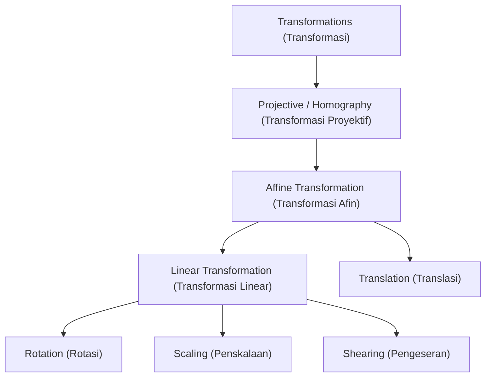
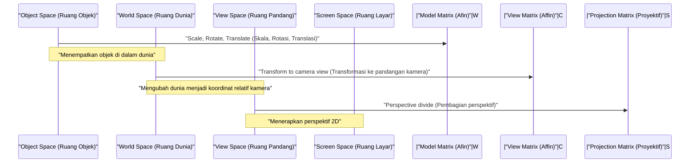

## 1. Pendahuluan

Dalam Grafik Komputer (CG) modern, pemrosesan gambar, dan teknologi visi komputer, proses seperti memutar gambar 2D atau memproyeksikan objek ruang 3D ke layar 2D adalah hal yang sangat diperlukan. Di balik proses-proses ini, teori-teori kuat dari aljabar linear dan geometri bekerja secara aktif. Di antara teori-teori tersebut, konsep yang paling mendasar dan krusial adalah **Transformasi Afin** (Affine Transformation) dan **Transformasi Proyektif** (Projective Transformation / Homography).

Dalam artikel ini, kita akan secara sistematis dan mendalam mengeksplorasi mekanisme matematika dari kedua transformasi ini, mengapa sistem koordinat khusus yang disebut **Koordinat Homogen** (Homogeneous Coordinates) diperlukan, dan bagaimana penerapannya di dunia praktis CG dan visi komputer.

## 2. Tinjauan dan Keterbatasan Transformasi Linear

Sebelum memikirkan tentang transformasi, mari kita tinjau kembali **Transformasi Linear** (Linear Transformation) dasar. Sebuah transformasi linear dalam ruang 2D diekspresikan menggunakan matriks $2 \times 2$ sebagai berikut:

$$
\begin{pmatrix} x' \\ y' \end{pmatrix} = \begin{pmatrix} a & b \\ c & d \end{pmatrix} \begin{pmatrix} x \\ y \end{pmatrix}
$$

Transformasi yang dapat diekspresikan dalam format matriks ini mencakup operasi geometris berikut:

- **Rotasi** (Rotation): Operasi untuk memutar sebesar sudut $\theta$.
- **Penskalaan** (Scaling): Operasi untuk mengubah skala sepanjang sumbu $x$ dan $y$.
- **Pengeseran** (Shearing): Operasi yang mendistorsi persegi panjang menjadi jajaran genjang.
- **Pemantulan** (Reflection): Operasi untuk membalik melalui sumbu tertentu.

Akan tetapi, operasi-operasi ini saja tidak cukup untuk merender CG praktis. Di sini kita menghadapi satu masalah besar: **Translasi** (Translation). Translasi yang memindahkan titik asal ke lokasi lain adalah operasi menambahkan vektor tertentu $(t_x, t_y)$, yang direpresentasikan sebagai berikut:

$$
\begin{pmatrix} x' \\ y' \end{pmatrix} = \begin{pmatrix} x \\ y \end{pmatrix} + \begin{pmatrix} t_x \\ t_y \end{pmatrix}
$$

Persamaan ini tidak dapat direpresentasikan hanya dengan "perkalian" matriks. Dalam dunia CG, kita perlu secara berkesinambungan menerapkan rotasi dan translasi pada jutaan verteks. Jika kita harus beralih antara perkalian matriks dan penjumlahan vektor pada setiap transformasi, penanganan matematika akan menjadi sangat merepotkan, dan implementasi dari alur komputasi serta perangkat keras akan menjadi sangat kompleks.

## 3. Transformasi Afin dan Pengenalan Koordinat Homogen

Untuk menyelesaikan masalah translasi ini dan menangani semua transformasi secara seragam hanya menggunakan perkalian matriks, para matematikawan dan insinyur merancang **Koordinat Homogen** (Homogeneous Coordinates).

### 3.1. Apa itu Koordinat Homogen?

Dalam koordinat homogen, satu dimensi palsu (biasanya $1$) ditambahkan pada akhir koordinat 2D $(x, y)$, untuk merepresentasikannya sebagai vektor 3D $(x, y, 1)$. Secara umum, koordinat homogen $(x, y, w)$ berkorespondensi dengan koordinat Kartesius $(x/w, y/w)$ dalam ruang nyata (dengan syarat $w \neq 0$).

### 3.2. Struktur Matriks Transformasi Afin

Dengan menggunakan sistem koordinat homogen ini, **Transformasi Afin** 2D dapat direpresentasikan dengan indah sebagai matriks persegi $3 \times 3$ sebagai berikut:

$$
\begin{pmatrix} x' \\ y' \\ 1 \end{pmatrix} = \begin{pmatrix} a & b & t_x \\ c & d & t_y \\ 0 & 0 & 1 \end{pmatrix} \begin{pmatrix} x \\ y \\ 1 \end{pmatrix}
$$

Mengekspansi perkalian matriks ini akan menghasilkan hal berikut:

$$
x' = ax + by + t_x \\
y' = cx + dy + t_y \\
1 = 0 \cdot x + 0 \cdot y + 1
$$

Secara brilian, bagian transformasi linear ($a, b, c, d$) dan bagian translasi ($t_x, t_y$) telah terintegrasi menjadi satu perkalian matriks. Seluruh transformasi yang menggabungkan transformasi linear dan translasi ini disebut sebagai **Transformasi Afin**.

### 3.3. Sifat Geometris Transformasi Afin

Sifat geometris paling penting dari transformasi afin adalah bahwa "**garis-garis sejajar tetap sejajar setelah transformasi**". Selain itu, "rasio titik-titik pada sebuah segmen garis (misalnya titik tengah)" juga dipertahankan. Oleh karena itu, meskipun sebuah persegi dapat berubah menjadi jajaran genjang setelah transformasi afin, bentuknya tidak akan pernah menjadi trapesium.

## 4. Transformasi Proyektif: Representasi Matematika dari Perspektif

Walaupun transformasi afin sangat praktis dan cukup untuk menggambar UI atau game 2D sederhana, transformasi ini tidak mampu merepresentasikan sepenuhnya mekanisme mata manusia atau kamera dalam menangkap dunia 3D. Di dunia nyata, objek yang jauh tampak lebih kecil, dan garis sejajar (seperti rel kereta api lurus atau lorong) seolah-olah berpotongan pada sebuah **Titik Hilang** (Vanishing Point) di kejauhan. Inilah yang dinamakan perspektif.

Pemodelan matematika yang ketat dari perspektif ini adalah **Transformasi Proyektif** (Projective Transformation).

### 4.1. Struktur Matriks Transformasi Proyektif (Homografi)

Transformasi proyektif antara ruang 2D juga direpresentasikan oleh matriks $3 \times 3$ menggunakan koordinat homogen. Dalam bidang visi komputer, matriks ini juga disebut **Matriks Homografi** (Homography Matrix). Perbedaan terbesar dan paling menentukan adalah bahwa pada baris terbawah (baris ke-3), yang pada transformasi afin selalu bernilai $0, 0, 1$, di sini dapat diatur dengan nilai acak apa pun.

$$
\begin{pmatrix} X \\ Y \\ W \end{pmatrix} = \begin{pmatrix} h_{11} & h_{12} & h_{13} \\ h_{21} & h_{22} & h_{23} \\ h_{31} & h_{32} & h_{33} \end{pmatrix} \begin{pmatrix} x \\ y \\ 1 \end{pmatrix}
$$

Setelah menerapkan transformasi ini, untuk mengembalikan hasilnya ke koordinat 2D nyata $(x', y')$, keseluruhan vektor perlu dibagi (dinormalisasi) dengan $W$.

$$
x' = \frac{X}{W} = \frac{h_{11}x + h_{12}y + h_{13}}{h_{31}x + h_{32}y + h_{33}} \\
y' = \frac{Y}{W} = \frac{h_{21}x + h_{22}y + h_{23}}{h_{31}x + h_{32}y + h_{33}}
$$

Karena penyebut memuat komponen $x$ dan $y$, koordinat setelah transformasi akan berubah secara non-linear. Pembagian non-linear (pembagian perspektif) inilah yang secara tepat menjadi dasar matematika terciptanya efek perspektif di mana "benda dekat diskalakan lebih besar, dan benda jauh diskalakan lebih kecil".

### 4.2. Hierarki Kelas Transformasi

Hubungan inklusi dari transformasi-transformasi ini dapat diatur dalam struktur hierarkis. Transformasi proyektif memiliki tingkat kebebasan tertinggi, di mana transformasi afin dan transformasi linear hadir sebagai kasus khususnya.

## 5. Alur Transformasi dalam CG

Pada alur rendering 3DCG, untuk mentransformasikan data verteks 3D menjadi koordinat layar 2D final, perkalian matriks dilakukan secara bertahap dan berkelanjutan. Karena ruangnya di sini adalah tiga dimensi, sistem koordinat homogennya menjadi 4 dimensi $(x, y, z, 1)$, dan matriks berukuran $4 \times 4$ yang digunakan.

1. **Transformasi Model** (Model Transform): Menempatkan tiap-tiap model 3D yang dibuat pada titik referensi ke posisi yang sesuai di dalam dunia virtual yang luas, serta menyesuaikan orientasi dan ukurannya. Ini merupakan murni transformasi afin.
2. **Transformasi Pandang** (View Transform): Meletakkan sebuah kamera virtual dan mentransformasikan seluruh koordinat dunia menjadi "posisi relatif dilihat dari kamera". Ini juga merupakan gabungan dari transformasi afin (terutama rotasi dan translasi).
3. **Transformasi Proyeksi** (Projection Transform): Memproyeksikan adegan 3D pada bidang potong (frustum) 2D. Di sinilah matriks transformasi proyektif berukuran $4 \times 4$ yang berisi komponen di baris bawah diterapkan, dan akhirnya, membaginya dengan elemen $w$ menyelesaikan proses rendering dan memberikan kesan kedalaman perspektif.

## 6. Penerapan dalam Visi Komputer dan Pemrosesan Gambar

Transformasi afin dan proyektif sangat penting bukan hanya dalam menggambar 3DCG dari awal, melainkan juga di bidang visi komputer untuk mengolah dan menganalisis foto serta video yang ada.

### 6.1. Koreksi Distorsi Gambar (Distortion Correction)
Pada foto bangunan yang dipotret miring dari bawah, kontur bangunan terlihat meruncing di bagian atas (efek perspektif). Hal ini disebabkan karena gambar didistorsi oleh transformasi proyektif melalui lensa kamera. Dengan menghitung matriks homografi yang memetakan titik koordinat keempat sudut gambar ke koordinat persegi panjang awal, dan menggunakan matriks invers untuk menerapkan transformasi sebaliknya, gambar dapat diperbaiki hingga terlihat seperti dipotret langsung dari depan.

### 6.2. Penyambungan Gambar Panorama (Image Stitching)
Transformasi proyektif juga memegang peranan erat dalam teknologi menyatukan banyak foto menjadi satu gambar panorama yang luas. Gambar yang diambil sambil memutar kamera di tempat yang sama, secara geometris saling terhubung melalui hubungan transformasi proyektif. Dengan mengekstrak titik-titik ciri (seperti sudut tajam atau pola tekstur) di antara gambar dan mengestimasi matriks homografi dengan kesalahan tumpang tindih terkecil, hasil sambungan yang mulus dan natural dapat tercapai.

## 7. Kesimpulan

Beranjak dari operasi matriks linear aljabar dasar, dan mengadopsi struktur matematika sistem koordinat homogen yang elegan — yaitu dengan menambahkan satu dimensi tambahan pada akhirnya — kita bisa memproses baik transformasi afin maupun proyektif sebagai bentuk tunggal perkalian matriks.

- **Transformasi Afin** digunakan untuk mewakili transformasi wujud dan pergeseran benda tanpa mengubah titik paralel.
- **Transformasi Proyektif** ditambahkan padanya untuk mengekspresikan efek perspektif non-linear yang menyerupai cara kerja lensa kamera asli.

Sistem ini memudahkan rancang bangun sirkuit perangkat keras di dalam GPU, sehingga secara luar biasa meningkatkan kapasitas grafis komputer dalam merepresentasikan sesuatu. Di saat yang sama, ini mendasari kemunculan algoritma koreksi serta rekognisi visual modern. Memahami rahasia makna matematis di balik fungsi software 3D atau peranti grafis lainnya bakal memberikan Anda wawasan yang lebih jernih ke depannya.

