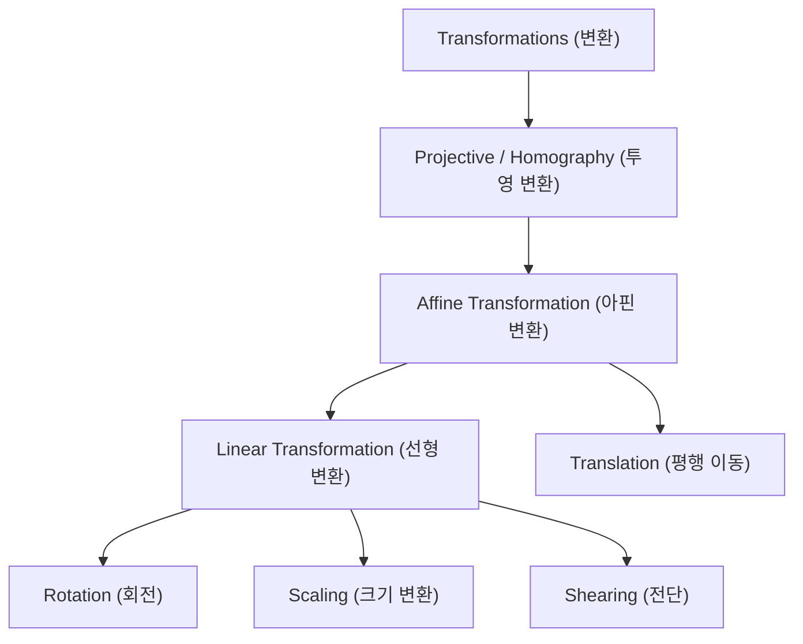
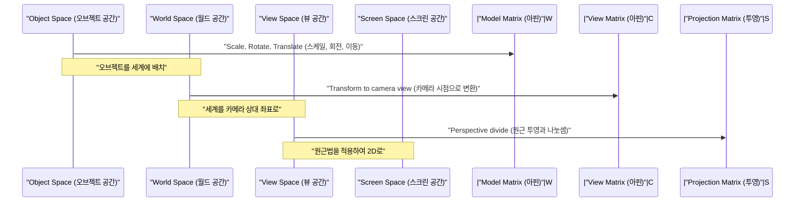

## 1. 서론

현대의 컴퓨터 그래픽스(CG)나 이미지 처리, 그리고 컴퓨터 비전 기술에 있어서 2차원 이미지를 회전시키거나 3차원 공간의 물체를 2차원 스크린에 투영하는 처리는 필수 불가결합니다. 이러한 처리의 이면에는 선형대수와 기하학의 강력한 이론이 활약하고 있습니다. 그중에서도 가장 근본적이고 중요한 개념이 **아핀 변환** (Affine Transformation) 과 **투영 변환** (Projective Transformation / Homography) 입니다.

본 기사에서는 이 두 가지 변환의 수학적 구조부터 시작하여 왜 **동차 좌표계** (Homogeneous Coordinates) 라는 특수한 좌표계가 필요한지, 그리고 실제 CG나 컴퓨터 비전 세계에서 어떻게 응용되고 있는지에 대해 체계적이고 깊이 있게 해설합니다.

## 2. 선형 변환의 복습과 한계

변환에 대해 생각하기 전에, 우선 기본적인 **선형 변환** (Linear Transformation) 을 되돌아보겠습니다. 2차원 공간에서의 선형 변환은 $2 \times 2$ 행렬을 사용하여 다음과 같이 표현됩니다.

$$
\begin{pmatrix} x' \\ y' \end{pmatrix} = \begin{pmatrix} a & b \\ c & d \end{pmatrix} \begin{pmatrix} x \\ y \end{pmatrix}
$$

이 행렬 형식으로 표현할 수 있는 변환에는 다음과 같은 기하학적 조작이 포함됩니다.

- **회전** (Rotation): 각도 $\theta$ 만큼 회전시키는 조작.
- **크기 변환** (Scaling): $x$ 축 방향과 $y$ 축 방향으로 스케일을 변경하는 조작.
- **전단** (Shearing): 직사각형을 평행사변형으로 왜곡시키는 조작.
- **반사** (Reflection): 특정 축을 기준으로 반전시키는 조작.

그러나 이러한 조작만으로는 실용적인 CG를 그리기에는 불충분합니다. 여기서 하나의 큰 문제에 직면하게 됩니다. 바로 **평행 이동** (Translation) 입니다. 원점을 다른 위치로 이동시키는 평행 이동은 특정 벡터 $(t_x, t_y)$ 를 더하는 조작이며, 다음과 같이 표현됩니다.

$$
\begin{pmatrix} x' \\ y' \end{pmatrix} = \begin{pmatrix} x \\ y \end{pmatrix} + \begin{pmatrix} t_x \\ t_y \end{pmatrix}
$$

이 식은 행렬의 '곱셈'만으로는 표현할 수 없습니다. CG의 세계에서는 수백만 개의 정점에 대해 회전이나 평행 이동을 연속해서 적용해야 합니다. 만약 변환할 때마다 행렬의 곱셈과 벡터의 덧셈을 구별해서 사용해야 한다면 수학적 취급이 번거로워지고 계산 파이프라인이나 하드웨어의 구현이 매우 복잡해질 것입니다.

## 3. 아핀 변환과 동차 좌표계의 도입

이 평행 이동의 문제를 해결하고, 모든 변환을 행렬의 곱셈만으로 통일성 있게 다루기 위해 수학자와 엔지니어들이 고안해 낸 것이 **동차 좌표계** (Homogeneous Coordinates) 입니다.

### 3.1. 동차 좌표계란 무엇인가

동차 좌표계에서는 2차원 좌표 $(x, y)$ 의 끝에 더미 차원(일반적으로 $1$)을 하나 추가하여 3차원 벡터 $(x, y, 1)$ 로 표현합니다. 일반적으로 동차 좌표 $(x, y, w)$ 는 실제 공간에서의 직교 좌표 $(x/w, y/w)$ 에 대응합니다(단 $w \neq 0$).

### 3.2. 아핀 변환 행렬의 구조

이 동차 좌표계를 사용하면, 2차원의 **아핀 변환** 은 $3 \times 3$ 의 정방 행렬로 다음과 같이 아름답게 표현할 수 있습니다.

$$
\begin{pmatrix} x' \\ y' \\ 1 \end{pmatrix} = \begin{pmatrix} a & b & t_x \\ c & d & t_y \\ 0 & 0 & 1 \end{pmatrix} \begin{pmatrix} x \\ y \\ 1 \end{pmatrix}
$$

이 행렬의 곱셈을 전개하면 다음과 같이 됩니다.

$$
x' = ax + by + t_x \\
y' = cx + dy + t_y \\
1 = 0 \cdot x + 0 \cdot y + 1
$$

훌륭하게도 선형 변환 부분($a, b, c, d$)과 평행 이동 부분($t_x, t_y$)이 하나의 행렬 곱셈으로 통합되었습니다. 이처럼 선형 변환에 평행 이동을 결합한 변환 전체를 가리켜 **아핀 변환** 이라고 부릅니다.

### 3.3. 아핀 변환의 기하학적 성질

아핀 변환이 가지는 가장 중요한 기하학적 성질은 "**평행선은 변환 후에도 평행하게 유지된다**"는 점입니다. 게다가 "선분 위 점들의 비율(예를 들어 중점)"도 변환 전후로 보존됩니다. 따라서 정사각형을 아핀 변환하면 평행사변형이 될 수는 있어도 결코 사다리꼴이 되지는 않습니다.

## 4. 투영 변환: 원근법의 수학적 표현

아핀 변환은 매우 편리하며 UI를 그리거나 단순한 2D 게임 등에서는 이것으로 충분합니다. 하지만 인간의 눈이나 카메라가 3차원 세계를 포착하는 구조를 완벽하게 표현할 수는 없습니다. 현실 세계에서는 멀리 있는 것은 작게 보이고, 평행한 선(예를 들어 곧은 선로나 복도)은 멀리 떨어진 **소실점** (Vanishing Point) 에서 만나는 것처럼 보입니다. 이것이 이른바 원근법(퍼스펙티브)입니다.

이 원근법을 수학적으로 엄밀하게 모델링한 것이 **투영 변환** (Projective Transformation) 입니다.

### 4.1. 투영 변환 행렬(호모그래피)의 구조

2차원 공간 간의 투영 변환도 동차 좌표계를 사용하여 $3 \times 3$ 행렬로 표현됩니다. 이 행렬은 컴퓨터 비전 분야에서는 **호모그래피 행렬** (Homography Matrix) 이라고도 불립니다. 아핀 변환에서는 항상 $0, 0, 1$ 이었던 맨 아래 행(제3행)에 임의의 값을 설정할 수 있다는 점이 가장 큰 결정적인 차이입니다.

$$
\begin{pmatrix} X \\ Y \\ W \end{pmatrix} = \begin{pmatrix} h_{11} & h_{12} & h_{13} \\ h_{21} & h_{22} & h_{23} \\ h_{31} & h_{32} & h_{33} \end{pmatrix} \begin{pmatrix} x \\ y \\ 1 \end{pmatrix}
$$

이 변환을 적용한 후 결과를 실제 2차원 좌표 $(x', y')$ 로 되돌리기 위해서는 벡터 전체를 $W$ 로 나눌(정규화할) 필요가 있습니다.

$$
x' = \frac{X}{W} = \frac{h_{11}x + h_{12}y + h_{13}}{h_{31}x + h_{32}y + h_{33}} \\
y' = \frac{Y}{W} = \frac{h_{21}x + h_{22}y + h_{23}}{h_{31}x + h_{32}y + h_{33}}
$$

분모에 $x$ 나 $y$ 의 항이 포함됨으로써 변환 후의 좌표가 비선형적으로 변합니다. 이 비선형적인 나눗셈(투영 나눗셈)이야말로 "가까운 것은 크게, 먼 것은 작게 스케일링된다"는 원근 효과를 만들어내는 수학적 근거인 것입니다.

### 4.2. 변환의 클래스 계층

이러한 변환의 포함 관계는 계층 구조로 정리할 수 있습니다. 투영 변환은 가장 자유도가 높으며, 그 특수한 경우로서 아핀 변환이나 선형 변환이 존재합니다.

## 5. CG에서의 변환 파이프라인

3DCG의 렌더링 파이프라인에서는 3차원 정점 데이터를 최종적인 2차원 스크린 좌표로 변환하기 위해 행렬의 곱셈이 단계적이고 연속적으로 수행됩니다. 여기서는 공간이 3차원이므로 동차 좌표계는 4차원 $(x, y, z, 1)$ 이 되며, 행렬은 $4 \times 4$ 크기가 사용됩니다.

1. **모델 변환** (Model Transform): 기준점으로 만들어진 개별 3D 모델을 거대한 가상 세계의 적절한 위치에 배치하고 방향이나 크기를 조정합니다. 이것은 순수한 아핀 변환입니다.
2. **뷰 변환** (View Transform): 가상의 카메라를 배치하고 세계 전체의 좌표를 '카메라에서 본 상대적인 위치'로 변환합니다. 이것도 아핀 변환(주로 회전과 평행 이동)의 조합입니다.
3. **투영 변환** (Projection Transform): 3D 장면을 2차원의 시야 절두체에 투영합니다. 여기서 맨 아래 행 성분을 가지는 $4 \times 4$ 투영 변환 행렬이 적용되며, 마지막으로 $w$ 요소로 나눔으로써 원근감 있는 그리기가 완성됩니다.

## 6. 컴퓨터 비전과 이미지 처리에서의 응용

아핀 변환이나 투영 변환은 3DCG에서 처음부터 그림을 그려내는 것뿐만 아니라, 기존의 사진이나 영상을 가공·분석하는 컴퓨터 비전 분야에서도 매우 중요합니다.

### 6.1. 이미지 왜곡 보정 (Distortion Correction)
건물을 대각선 아래에서 올려다보며 촬영한 사진에서는 건물의 윤곽이 위를 향해 좁아지는 것처럼 찍힙니다(원근감이 생긴 상태). 이것은 카메라 렌즈를 통한 투영 변환에 의해 이미지가 왜곡되어 있기 때문입니다. 이미지 네 모서리의 좌표를 원래 직사각형의 좌표에 대응시키는 호모그래피 행렬을 계산하고, 역행렬을 이용하여 역변환을 적용함으로써 마치 정면에서 촬영한 것 같은 이미지로 보정할 수 있습니다.

### 6.2. 파노라마 합성 (Image Stitching)
여러 장의 사진을 이어 붙여 광활한 파노라마 이미지를 만드는 기술에도 투영 변환이 깊이 관여하고 있습니다. 제자리에서 카메라를 회전시키며 촬영한 이미지들 사이에는 기하학적으로 투영 변환을 통해 서로 변환할 수 있는 관계가 있습니다. 이미지 사이에서 특징점(모서리나 텍스처가 눈에 띄는 점)을 추출하고, 그것들을 가장 오차 없이 겹치게 하는 호모그래피 행렬을 추정함으로써 이음새 없이 자연스러운 파노라마 합성이 실현됩니다.

## 7. 결론

선형대수의 기초적인 행렬 연산에서 출발하여, 끝에 차원을 추가한다는 동차 좌표계의 우아한 수학적 아이디어를 도입함으로써, 아핀 변환과 투영 변환을 통일된 행렬의 곱셈으로 다룰 수 있습니다.

- **아핀 변환** 은 평행 이동을 포함한 강체 변환이나 변형을 표현하며 평행성을 보존합니다.
- **투영 변환** 은 거기에 더해 원근법을 표현하여 보다 실제 카메라에 가까운 비선형적인 투영을 가능하게 합니다.

이 프레임워크는 GPU 내부 하드웨어 회로의 설계를 단순하게 만들어 컴퓨터 그래픽스의 표현력을 비약적으로 향상시켰습니다. 또한 동시에 컴퓨터 비전에서의 고도화된 이미지 인식이나 보정 알고리즘의 기초 기반이 되기도 합니다. 이면의 수학적인 의미를 깊이 이해함으로써 평소에 사용하는 3D 소프트웨어나 이미지 처리 API의 동작이 더욱 선명하게 보이게 될 것입니다.

