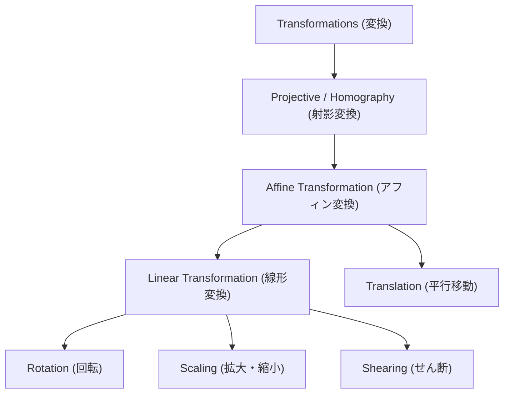
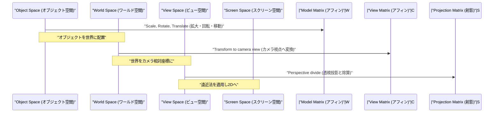

## 1. はじめに

現代のコンピュータ[グラフ](https://kenji.blog/p/tree-graph-data-structures-search-dfs-bfs-dijkstra/)ィックス（CG）や画像処理、そしてコンピュータビジョン技術において、2次元の画像を回転させたり、3次元空間の物体を2次元のスクリーンに投影したりする処理は不可欠です。これらの処理の裏側では、線形代数と幾何学の強力な理論が活躍しています。その中で最も根本的かつ重要な概念が、 **アフィン変換** (Affine Transformation) と **射影変換** (Projective Transformation / Homography) です。

本記事では、これら二つの変換の数学的な仕組みから、なぜ **同次座標系** (Homogeneous Coordinates) という特殊な座標系が必要となるのか、そして実際のCGやコンピュータビジョンの世界でどのように応用されているのかについて、体系的かつ深く解説します。

## 2. 線形変換の復習と限界

変換について考える前に、まずは基本的な **線形変換** (Linear Transformation) を振り返ってみましょう。2次元空間における線形変換は、$2 \times 2$ の行列を用いて次のように表されます。

$$
\begin{pmatrix} x' \\ y' \end{pmatrix} = \begin{pmatrix} a & b \\ c & d \end{pmatrix} \begin{pmatrix} x \\ y \end{pmatrix}
$$

この行列形式で表現できる変換には、以下のような幾何学的な操作が含まれます。

- **回転** (Rotation): 角度 $\theta$ だけ回転させる操作。
- **拡大・縮小** (Scaling): $x$ 軸方向と $y$ 軸方向にスケールを変更する操作。
- **せん断** (Shearing): 長方形を平行四辺形に歪ませる操作。
- **鏡映** (Reflection): 特定の軸を基準に反転させる操作。

しかし、これらの操作だけでは、実践的なCGを描画するには不十分です。ここで一つの大きな問題に直面します。それは **平行移動** (Translation) です。原点を別の場所に移動させる平行移動は、特定のベクトル $(t_x, t_y)$ を加算する操作であり、次のように表されます。

$$
\begin{pmatrix} x' \\ y' \end{pmatrix} = \begin{pmatrix} x \\ y \end{pmatrix} + \begin{pmatrix} t_x \\ t_y \end{pmatrix}
$$

この式は、行列の「乗算」だけでは表現できません。CGの世界では、何百万もの頂点に対して回転や平行移動を連続して適用する必要があります。もし変換のたびに行列の乗算とベクトルの加算を使い分けなければならないとしたら、数学的な取り扱いが煩雑になり、計算[パイプライン](https://kenji.blog/p/cicd-pipeline-github-actions-best-practices/)やハードウェアの実装が非常に複雑になってしまいます。

## 3. アフィン変換と同次座標系の導入

この平行移動の問題を解決し、あらゆる変換を行列の乗算のみで統一的に扱うために数学者やエンジニアが考案したのが **同次座標系** (Homogeneous Coordinates) です。

### 3.1. 同次座標系とは何か

同次座標系では、2次元の座標 $(x, y)$ の末尾にダミーの次元（通常は $1$）を一つ追加し、3次元のベクトル $(x, y, 1)$ として表現します。一般に、同次座標 $(x, y, w)$ は、実空間における直交座標 $(x/w, y/w)$ に対応します（ただし $w \neq 0$）。

### 3.2. アフィン変換行列の構造

この同次座標系を用いると、2次元の **アフィン変換** は $3 \times 3$ の正方行列で次のように美しく表すことができます。

$$
\begin{pmatrix} x' \\ y' \\ 1 \end{pmatrix} = \begin{pmatrix} a & b & t_x \\ c & d & t_y \\ 0 & 0 & 1 \end{pmatrix} \begin{pmatrix} x \\ y \\ 1 \end{pmatrix}
$$

この行列の乗算を展開すると、以下のようになります。

$$
x' = ax + by + t_x \\
y' = cx + dy + t_y \\
1 = 0 \cdot x + 0 \cdot y + 1
$$

見事に、線形変換部分（$a, b, c, d$）と平行移動部分（$t_x, t_y$）が、一つの行列の乗算として統合されました。このような、線形変換に平行移動を組み合わせた変換全体を指して **アフィン変換** と呼びます。

### 3.3. アフィン変換の幾何学的性質

アフィン変換が持つ最も重要な幾何学的性質は、「 **平行線は変換後も平行のままである** 」という点です。さらに、「線分上の点の比率（例えば中点）」も変換前後で保存されます。したがって、正方形をアフィン変換すると平行四辺形になることはあっても、台形になることは決してありません。

## 4. 射影変換：遠近法の数学的表現

アフィン変換は非常に便利であり、UIの描画や単純な2Dゲームなどではこれで十分です。しかし、人間の目やカメラが3次元の世界を捉える仕組みを完全に表現することはできません。現実世界では、遠くにあるものは小さく見え、平行な線（例えばまっすぐな線路や廊下）は遠くの **消失点** (Vanishing Point) で交わるように見えます。これがいわゆる遠近法（パースペクティブ）です。

この遠近法を数学的に厳密にモデル化したのが **射影変換** (Projective Transformation) です。

### 4.1. 射影変換行列（ホモ[グラフ](https://kenji.blog/p/tree-graph-data-structures-search-dfs-bfs-dijkstra/)ィ）の構造

2次元空間同士の射影変換も、同次座標系を用いて $3 \times 3$ の行列で表されます。この行列はコンピュータビジョンの分野では **ホモグラフィ行列** (Homography Matrix) とも呼ばれます。アフィン変換では常に $0, 0, 1$ だった最下行（第3行）に、任意の値を設定できる点が最大の決定的な違いです。

$$
\begin{pmatrix} X \\ Y \\ W \end{pmatrix} = \begin{pmatrix} h_{11} & h_{12} & h_{13} \\ h_{21} & h_{22} & h_{23} \\ h_{31} & h_{32} & h_{33} \end{pmatrix} \begin{pmatrix} x \\ y \\ 1 \end{pmatrix}
$$

この変換を適用した後、結果を実際の2次元座標 $(x', y')$ に戻すためには、ベクトル全体を $W$ で割る（正規化する）必要があります。

$$
x' = \frac{X}{W} = \frac{h_{11}x + h_{12}y + h_{13}}{h_{31}x + h_{32}y + h_{33}} \\
y' = \frac{Y}{W} = \frac{h_{21}x + h_{22}y + h_{23}}{h_{31}x + h_{32}y + h_{33}}
$$

分母に $x$ や $y$ の項が含まれることで、変換後の座標が非線形に変化します。この非線形な除算（パースペクティブ除算）こそが、「近くのものは大きく、遠くのものは小さくスケーリングされる」という遠近効果を生み出す数学的根拠なのです。

### 4.2. 変換のクラス階層

これらの変換の包含関係は、階層構造として整理することができます。射影変換は最も自由度が高く、その特殊なケースとしてアフィン変換や線形変換が存在します。

## 5. CGにおける変換[パイプライン](https://kenji.blog/p/cicd-pipeline-github-actions-best-practices/)

3DCGのレンダリングパイプラインでは、3次元の頂点データを最終的な2次元スクリーン座標に変換するために、行列の乗算が段階的かつ連続的に行われます。ここでは空間が3次元であるため、同次座標系は4次元 $(x, y, z, 1)$ となり、行列は $4 \times 4$ のサイズが使われます。

1. **モデル変換** (Model Transform): 基準点で作られた個々の3Dモデルを、巨大な仮想世界の適切な位置に配置し、向きやサイズを調整します。これは純粋なアフィン変換です。
2. **ビュー変換** (View Transform): 仮想のカメラを配置し、世界全体の座標を「カメラから見た相対的な位置」に変換します。これもアフィン変換（主に回転と平行移動）の組み合わせです。
3. **プロジェクション変換** (Projection Transform): 3Dのシーンを2次元の視錐台に投影します。ここで最下行成分を持つ $4 \times 4$ の射影変換行列が適用され、最後に $w$ 要素で割ることで、遠近感のある描画が完成します。

## 6. コンピュータビジョンと画像処理への応用

アフィン変換や射影変換は、3DCGでゼロから絵を描き出すだけでなく、既存の写真や映像を加工・解析するコンピュータビジョンの分野でも極めて重要です。

### 6.1. 画像の歪み補正 (Distortion Correction)
建物を斜め下から見上げて撮影した写真では、建物の輪郭が上に向かってすぼまるように写ります（パースがついた状態）。これはカメラのレンズを通した射影変換によって画像が歪んでいるためです。画像の四隅の座標を本来の長方形の座標に対応付けるホモ[グラフ](https://kenji.blog/p/tree-graph-data-structures-search-dfs-bfs-dijkstra/)ィ行列を計算し、逆行列を用いて逆変換を適用することで、まるで正面から撮影したかのような画像に補正することができます。

### 6.2. パノラマ合成 (Image Stitching)
複数の写真を繋ぎ合わせて広大なパノラマ画像を作成する技術にも、射影変換が深く関わっています。カメラをその場で回転させながら撮影した画像同士は、幾何学的に射影変換で互いに変換可能な関係にあります。画像間から特徴点（角やテクスチャの目立つ点）を抽出し、それらを最も誤差なく重ね合わせるホモグラフィ行列を推定することで、つなぎ目のない自然なパノラマ合成が実現します。

## 7. まとめ

線形代数の基礎的な行列演算から出発し、末尾に次元を追加するという同次座標系のエレガントな数学的工夫を導入することで、アフィン変換と射影変換を統一された行列の乗算として扱うことができます。

- **アフィン変換** は、平行移動を含む剛体変換や変形を表現し、平行性を保存します。
- **射影変換** は、それに加えて遠近法を表現し、より現実のカメラに近い非線形な投影を可能にします。

この枠組みは、GPU内部のハードウェア回路の設計をシンプルにし、コンピュータグラフィックスの表現力を飛躍的に向上させました。また同時に、コンピュータビジョンにおける高度な画像認識や補正アルゴリズムの基礎基盤ともなっています。背後にあるこれらの数学的な意味を深く理解することで、普段使っている3Dソフトウェアや画像処理APIの動作が、より鮮明に見えてくることでしょう。

