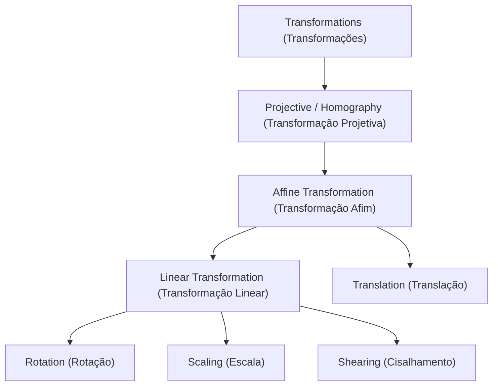
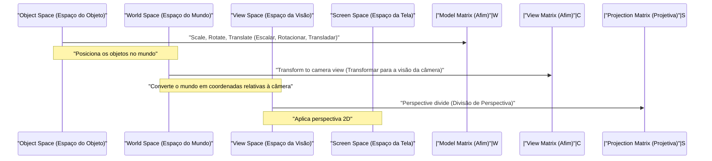

## 1. Introdução

Nas tecnologias modernas de Computação Gráfica (CG), processamento de imagens e visão computacional, processos como a rotação de imagens 2D ou a projeção de objetos tridimensionais em uma tela 2D são indispensáveis. Por trás desses processos, poderosas teorias da álgebra linear e da geometria estão atuando. Dentre elas, os conceitos mais fundamentais e cruciais são a **Transformação Afim** (Affine Transformation) e a **Transformação Projetiva** (Projective Transformation / Homography).

Neste artigo, exploraremos de forma sistemática e profunda os mecanismos matemáticos dessas duas transformações, o motivo pelo qual um sistema de coordenadas especial chamado **Coordenadas Homogêneas** (Homogeneous Coordinates) é necessário e como elas são aplicadas nos mundos práticos da CG e da visão computacional.

## 2. Revisão e Limitações das Transformações Lineares

Antes de pensarmos nas transformações, vamos primeiro revisar a **Transformação Linear** (Linear Transformation) básica. Uma transformação linear no espaço 2D é expressa usando uma matriz $2 \times 2$ da seguinte maneira:

$$
\begin{pmatrix} x' \\ y' \end{pmatrix} = \begin{pmatrix} a & b \\ c & d \end{pmatrix} \begin{pmatrix} x \\ y \end{pmatrix}
$$

As transformações que podem ser expressas neste formato matricial incluem as seguintes operações geométricas:

- **Rotação** (Rotation): Uma operação para rotacionar em um ângulo $\theta$.
- **Escala** (Scaling): Uma operação para alterar a escala ao longo dos eixos $x$ e $y$.
- **Cisalhamento** (Shearing): Uma operação que distorce um retângulo, transformando-o em um paralelogramo.
- **Reflexão** (Reflection): Uma operação para inverter através de um eixo específico.

No entanto, apenas essas operações são insuficientes para renderizar a CG prática. Aqui enfrentamos um grande problema: a **Translação** (Translation). A translação, que move a origem para outro local, é uma operação de adição de um vetor específico $(t_x, t_y)$, e é representada da seguinte forma:

$$
\begin{pmatrix} x' \\ y' \end{pmatrix} = \begin{pmatrix} x \\ y \end{pmatrix} + \begin{pmatrix} t_x \\ t_y \end{pmatrix}
$$

Esta equação não pode ser representada apenas por "multiplicação" de matriz. No mundo da CG, é necessário aplicar continuamente rotações e translações a milhões de vértices. Se tivéssemos que alternar entre a multiplicação de matrizes e a adição de vetores a cada transformação, o manuseio matemático se tornaria muito complicado e a implementação de pipelines de computação e hardware se tornaria extremamente complexa.

## 3. Transformações Afins e a Introdução de Coordenadas Homogêneas

Para resolver este problema de translação e lidar de forma unificada com todas as transformações utilizando apenas multiplicações de matrizes, matemáticos e engenheiros criaram as **Coordenadas Homogêneas** (Homogeneous Coordinates).

### 3.1. O que são Coordenadas Homogêneas?

Nas coordenadas homogêneas, uma dimensão fictícia (geralmente $1$) é anexada ao final das coordenadas 2D $(x, y)$, sendo representadas como um vetor 3D $(x, y, 1)$. Em geral, a coordenada homogênea $(x, y, w)$ corresponde às coordenadas cartesianas $(x/w, y/w)$ no espaço real (desde que $w \neq 0$).

### 3.2. Estrutura da Matriz de Transformação Afim

Usando este sistema de coordenadas homogêneas, uma **Transformação Afim** 2D pode ser representada de maneira elegante com uma matriz quadrada $3 \times 3$ da seguinte forma:

$$
\begin{pmatrix} x' \\ y' \\ 1 \end{pmatrix} = \begin{pmatrix} a & b & t_x \\ c & d & t_y \\ 0 & 0 & 1 \end{pmatrix} \begin{pmatrix} x \\ y \\ 1 \end{pmatrix}
$$

Ao expandir esta multiplicação de matriz, obtemos o seguinte:

$$
x' = ax + by + t_x \\
y' = cx + dy + t_y \\
1 = 0 \cdot x + 0 \cdot y + 1
$$

De forma brilhante, a parte da transformação linear ($a, b, c, d$) e a parte da translação ($t_x, t_y$) foram integradas em uma única multiplicação de matriz. A toda esta transformação que combina a transformação linear e a translação dá-se o nome de **Transformação Afim**.

### 3.3. Propriedades Geométricas das Transformações Afins

A propriedade geométrica mais importante de uma transformação afim é que "**as linhas paralelas permanecem paralelas após a transformação**". Além disso, "a proporção dos pontos em um segmento de reta (por exemplo, o ponto médio)" também é preservada. Portanto, embora um quadrado possa se tornar um paralelogramo após uma transformação afim, ele nunca se tornará um trapézio.

## 4. Transformação Projetiva: A Representação Matemática da Perspectiva

Embora a transformação afim seja muito conveniente e suficiente para desenhar UI ou jogos 2D simples, ela não consegue representar completamente o mecanismo através do qual os olhos humanos ou as câmeras capturam o mundo tridimensional. No mundo real, objetos distantes parecem menores, e as linhas paralelas (como trilhos de trem ou corredores retos) parecem se encontrar em um **Ponto de Fuga** (Vanishing Point) à distância. A isso se chama perspectiva.

A modelagem matemática rigorosa dessa perspectiva é a **Transformação Projetiva** (Projective Transformation).

### 4.1. Estrutura da Matriz de Transformação Projetiva (Homografia)

A transformação projetiva entre os espaços 2D também é representada por uma matriz $3 \times 3$ usando coordenadas homogêneas. No campo da visão computacional, essa matriz também é chamada de **Matriz de Homografia** (Homography Matrix). A diferença maior e decisiva é que a linha inferior (a 3ª linha), que na transformação afim era sempre $0, 0, 1$, pode ser definida com valores arbitrários.

$$
\begin{pmatrix} X \\ Y \\ W \end{pmatrix} = \begin{pmatrix} h_{11} & h_{12} & h_{13} \\ h_{21} & h_{22} & h_{23} \\ h_{31} & h_{32} & h_{33} \end{pmatrix} \begin{pmatrix} x \\ y \\ 1 \end{pmatrix}
$$

Após aplicar esta transformação, para retornar o resultado às coordenadas 2D reais $(x', y')$, é necessário dividir (normalizar) todo o vetor por $W$.

$$
x' = \frac{X}{W} = \frac{h_{11}x + h_{12}y + h_{13}}{h_{31}x + h_{32}y + h_{33}} \\
y' = \frac{Y}{W} = \frac{h_{21}x + h_{22}y + h_{23}}{h_{31}x + h_{32}y + h_{33}}
$$

Ao incluir os termos $x$ e $y$ no denominador, as coordenadas mudam de maneira não linear após a transformação. Essa divisão não linear (divisão de perspectiva) é justamente o fundamento matemático que gera o efeito de perspectiva, onde "o que está perto é ampliado e o que está longe é reduzido".

### 4.2. Hierarquia das Classes de Transformação

As relações de inclusão dessas transformações podem ser organizadas numa estrutura hierárquica. A transformação projetiva possui o maior grau de liberdade, sendo a transformação afim e a transformação linear casos especiais dela.

## 5. O [Pipeline](https://kenji.blog/pt/p/cicd-pipeline-github-actions-best-practices/) de Transformação em CG

No pipeline de renderização da 3DCG, para transformar dados de vértices 3D nas coordenadas finais da tela 2D, as multiplicações de matriz são realizadas progressiva e continuamente. Como o espaço aqui é tridimensional, o sistema de coordenadas homogêneas torna-se em 4 dimensões $(x, y, z, 1)$ e são utilizadas matrizes de tamanho $4 \times 4$.

1. **Transformação de Modelo** (Model Transform): Posiciona modelos 3D individuais criados através de pontos de referência em posições adequadas dentro de um vasto mundo virtual, ajustando sua orientação e tamanho. Esta é uma transformação afim pura.
2. **Transformação de Visão** (View Transform): Uma câmera virtual é posicionada e transforma as coordenadas de todo o mundo em "posições relativas vistas da câmera". Essa também é uma combinação de transformações afins (principalmente rotação e translação).
3. **Transformação de Projeção** (Projection Transform): Projeta a cena 3D sobre um volume de visão 2D (frustum). Aqui, aplica-se a matriz de transformação projetiva de $4 \times 4$ contendo os componentes da última linha, e finalmente, ao dividir pelo elemento $w$, completa-se a renderização com uma sensação de perspectiva.

## 6. Aplicações em Visão Computacional e Processamento de Imagens

As transformações afins e projetivas não são vitais apenas para desenhar em 3DCG do zero, mas também são extremamente importantes no campo da visão computacional, no que diz respeito ao processamento e análise de fotos e vídeos existentes.

### 6.1. Correção de Distorção de Imagens (Distortion Correction)
Nas fotografias de edifícios tiradas de baixo em diagonal, os contornos dos edifícios parecem se estreitar na parte superior (com perspectiva). Isso ocorre porque a imagem é distorcida pela transformação projetiva através das lentes da câmera. Calculando a matriz de homografia que mapeia as coordenadas dos quatro cantos da imagem com as coordenadas do retângulo original, e aplicando uma transformação inversa usando a matriz inversa, a imagem pode ser corrigida como se tivesse sido tirada de frente.

### 6.2. Emenda de Imagens Panorâmicas (Image Stitching)
A transformação projetiva também está profundamente envolvida na tecnologia de costura de várias fotos para criar uma ampla imagem panorâmica. As imagens capturadas ao se rotacionar uma câmera no mesmo local têm uma relação geométrica que permite transformá-las umas nas outras por meio de transformações projetivas. Extraindo pontos característicos (como cantos ou texturas notáveis) entre as imagens, e estimando a matriz de homografia que as sobrepõe com a menor taxa de erro possível, consegue-se uma síntese panorâmica contínua e natural.

## 7. Conclusão

Partindo das operações matriciais básicas da álgebra linear, e ao introduzir o engenhoso mecanismo matemático das coordenadas homogêneas (a adição de uma dimensão no final), podemos tratar tanto a transformação afim quanto a projetiva como multiplicações matriciais unificadas.

- A **Transformação Afim** expressa deformações e transformações de corpos rígidos, incluindo a translação, preservando o paralelismo.
- A **Transformação Projetiva** expressa a perspectiva, permitindo uma projeção não linear muito mais próxima da de câmeras reais.

Esta estrutura simplificou o design de circuitos de hardware no interior das GPUs, aumentando drasticamente a capacidade expressiva da computação gráfica. Paralelamente, converteu-se na base essencial dos algoritmos avançados de reconhecimento e correção de imagens no campo da visão computacional. Uma compreensão mais aprofundada dos significados matemáticos subjacentes tornará, sem dúvida, o funcionamento dos softwares 3D e APIs de processamento de imagens que você normalmente utiliza muito mais claro.
