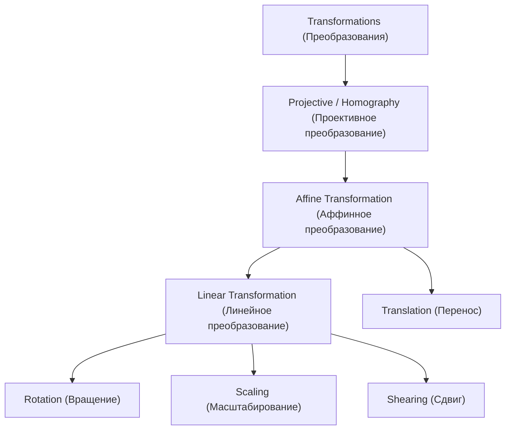
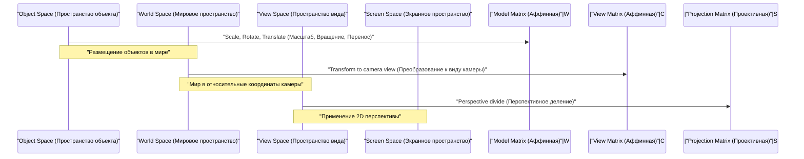

## 1. Введение

В современных технологиях компьютерной графики (CG), обработки изображений и компьютерного зрения такие процессы, как вращение 2D-изображений или проецирование объектов 3D-пространства на 2D-экран, являются незаменимыми. За этими процессами стоят мощные теории линейной алгебры и геометрии. Среди них наиболее фундаментальными и ключевыми концепциями являются **Аффинное преобразование** (Affine Transformation) и **Проективное преобразование** (Projective Transformation / Homography).

В этой статье мы систематически и глубоко исследуем математические механизмы этих двух преобразований, почему требуется специальная система координат, называемая **Однородными координатами** (Homogeneous Coordinates), и как они применяются в практическом мире CG и компьютерного зрения.

## 2. Обзор и ограничения линейных преобразований

Прежде чем думать о преобразованиях, давайте сначала вспомним базовое **Линейное преобразование** (Linear Transformation). Линейное преобразование в 2D-пространстве выражается с помощью матрицы $2 \times 2$ следующим образом:

$$
\begin{pmatrix} x' \\ y' \end{pmatrix} = \begin{pmatrix} a & b \\ c & d \end{pmatrix} \begin{pmatrix} x \\ y \end{pmatrix}
$$

Преобразования, которые можно выразить в этом матричном формате, включают следующие геометрические операции:

- **Вращение** (Rotation): Операция вращения на угол $\theta$.
- **Масштабирование** (Scaling): Операция изменения масштаба вдоль осей $x$ и $y$.
- **Сдвиг** (Shearing): Операция, искажающая прямоугольник в параллелограмм.
- **Отражение** (Reflection): Операция зеркального отражения относительно определенной оси.

Однако этих операций самих по себе недостаточно для рендеринга практичной CG. Здесь мы сталкиваемся с одной серьезной проблемой: **Перенос** (Translation). Перенос, который перемещает начало координат в другое место, представляет собой операцию прибавления определенного вектора $(t_x, t_y)$ и представляется следующим образом:

$$
\begin{pmatrix} x' \\ y' \end{pmatrix} = \begin{pmatrix} x \\ y \end{pmatrix} + \begin{pmatrix} t_x \\ t_y \end{pmatrix}
$$

Это уравнение нельзя представить просто "умножением" матриц. В мире CG необходимо непрерывно применять вращения и переносы к миллионам вершин. Если бы нам приходилось чередовать умножение матриц и сложение векторов при каждом преобразовании, математическая обработка стала бы очень громоздкой, а реализация вычислительных конвейеров и аппаратного обеспечения стала бы чрезвычайно сложной.

## 3. Аффинные преобразования и введение однородных координат

Чтобы решить эту проблему переноса и единообразно обрабатывать все преобразования, используя только умножения матриц, математики и инженеры изобрели **Однородные координаты** (Homogeneous Coordinates).

### 3.1. Что такое однородные координаты?

В однородных координатах фиктивное измерение (обычно $1$) добавляется в конец 2D-координат $(x, y)$, чтобы представить их как 3D-вектор $(x, y, 1)$. В общем, однородная координата $(x, y, w)$ соответствует декартовой координате $(x/w, y/w)$ в реальном пространстве (при условии $w \neq 0$).

### 3.2. Структура матрицы аффинного преобразования

Используя эту систему однородных координат, 2D **Аффинное преобразование** можно красиво представить в виде квадратной матрицы $3 \times 3$ следующим образом:

$$
\begin{pmatrix} x' \\ y' \\ 1 \end{pmatrix} = \begin{pmatrix} a & b & t_x \\ c & d & t_y \\ 0 & 0 & 1 \end{pmatrix} \begin{pmatrix} x \\ y \\ 1 \end{pmatrix}
$$

Раскрыв это матричное умножение, мы получим следующее:

$$
x' = ax + by + t_x \\
y' = cx + dy + t_y \\
1 = 0 \cdot x + 0 \cdot y + 1
$$

Блестящим образом часть линейного преобразования ($a, b, c, d$) и часть переноса ($t_x, t_y$) были интегрированы в одно матричное умножение. Все это преобразование, объединяющее линейное преобразование и перенос, называется **Аффинным преобразованием**.

### 3.3. Геометрические свойства аффинных преобразований

Важнейшим геометрическим свойством аффинного преобразования является то, что "**параллельные линии остаются параллельными после преобразования**". Кроме того, также сохраняется "отношение точек на отрезке линии (например, средней точки)". Следовательно, хотя квадрат и может превратиться в параллелограмм после аффинного преобразования, он никогда не станет трапецией.

## 4. Проективное преобразование: Математическое представление перспективы

Хотя аффинное преобразование очень удобно и его достаточно для рисования UI или простых 2D-игр, оно не может полностью передать механизм, с помощью которого человеческий глаз или камеры фиксируют трехмерный мир. В реальном мире отдаленные объекты кажутся меньше, а параллельные линии (например, прямые железнодорожные пути или коридоры) кажутся пересекающимися в **Точке схода** (Vanishing Point) вдалеке. Это называется перспективой.

Строгим математическим моделированием этой перспективы является **Проективное преобразование** (Projective Transformation).

### 4.1. Структура матрицы проективного преобразования (Гомография)

Проективное преобразование между 2D-пространствами также представляется матрицей $3 \times 3$ с использованием однородных координат. В области компьютерного зрения эта матрица также называется **Матрицей гомографии** (Homography Matrix). Самым большим и решающим отличием является то, что в нижнем ряду (3-й ряд), который в аффинном преобразовании всегда был $0, 0, 1$, можно установить произвольные значения.

$$
\begin{pmatrix} X \\ Y \\ W \end{pmatrix} = \begin{pmatrix} h_{11} & h_{12} & h_{13} \\ h_{21} & h_{22} & h_{23} \\ h_{31} & h_{32} & h_{33} \end{pmatrix} \begin{pmatrix} x \\ y \\ 1 \end{pmatrix}
$$

После применения этого преобразования, чтобы вернуть результат к фактическим 2D-координатам $(x', y')$, необходимо разделить (нормализовать) весь вектор на $W$.

$$
x' = \frac{X}{W} = \frac{h_{11}x + h_{12}y + h_{13}}{h_{31}x + h_{32}y + h_{33}} \\
y' = \frac{Y}{W} = \frac{h_{21}x + h_{22}y + h_{23}}{h_{31}x + h_{32}y + h_{33}}
$$

Поскольку в знаменатель включены члены $x$ и $y$, координаты после преобразования меняются нелинейно. Это нелинейное деление (перспективное деление) — именно та математическая основа, которая создает эффект перспективы, когда "близкие объекты увеличиваются, а далекие уменьшаются".

### 4.2. Иерархия классов преобразований

Отношения включения этих преобразований можно организовать в виде иерархической структуры. Проективное преобразование имеет наивысшую степень свободы, при этом аффинное преобразование и линейное преобразование существуют как его частные случаи.

## 5. Конвейер преобразований в CG

В конвейере рендеринга 3DCG, чтобы преобразовать данные 3D-вершин в конечные 2D-координаты экрана, матричные умножения выполняются последовательно и непрерывно. Поскольку пространство здесь трехмерное, система однородных координат становится 4-мерной $(x, y, z, 1)$, и используются матрицы размером $4 \times 4$.

1. **Модельное преобразование** (Model Transform): Отдельные 3D-модели, созданные вокруг базовой точки, размещаются в соответствующих позициях в огромном виртуальном мире, при этом корректируются их ориентация и размер. Это чистое аффинное преобразование.
2. **Преобразование вида** (View Transform): Размещается виртуальная камера, и координаты всего мира преобразуются в "относительные позиции с точки зрения камеры". Это также комбинация аффинных преобразований (в основном вращения и переноса).
3. **Проективное преобразование** (Projection Transform): 3D-сцена проецируется на 2D-усеченную пирамиду видимости. Здесь применяется проективная матрица преобразования $4 \times 4$ с компонентами нижней строки, и, наконец, деление на элемент $w$ завершает рендеринг с ощущением перспективы.

## 6. Применения в компьютерном зрении и обработке изображений

Аффинные и проективные преобразования чрезвычайно важны не только для рисования в 3DCG с нуля, но и в области компьютерного зрения для обработки и анализа существующих фотографий и видео.

### 6.1. Коррекция искажений изображений (Distortion Correction)
На фотографиях зданий, снятых снизу по диагонали, контуры зданий кажутся сужающимися кверху (из-за перспективы). Это связано с тем, что изображение искажается проективным преобразованием через объектив камеры. Вычислив матрицу гомографии, которая сопоставляет координаты четырех углов изображения координатам исходного прямоугольника, и применив обратное преобразование с использованием обратной матрицы, изображение можно скорректировать так, как если бы оно было снято прямо спереди.

### 6.2. Сшивка панорамных изображений (Image Stitching)
Проективное преобразование также глубоко связано с технологией сшивки множества фотографий вместе для создания обширного панорамного изображения. Изображения, снятые путем вращения камеры на одном месте, геометрически связаны друг с другом так, что они могут быть преобразованы друг в друга путем проективных преобразований. Путем извлечения характерных точек (например, углов или заметных текстур) между изображениями и оценки матрицы гомографии, которая накладывает их с наименьшей ошибкой, реализуется бесшовный и естественный синтез панорамы.

## 7. Заключение

Отталкиваясь от базовых матричных операций линейной алгебры, благодаря введению элегантного математического механизма системы однородных координат (добавлению измерения в конце), мы можем рассматривать как аффинное, так и проективное преобразования как единое матричное умножение.

- **Аффинное преобразование** выражает деформации и трансформации твердых тел, включая перенос, при этом сохраняя параллельность.
- **Проективное преобразование**, в дополнение к этому, выражает перспективу, обеспечивая нелинейные проекции, которые гораздо ближе к реальным камерам.

Эта структура упростила конструкцию аппаратных схем внутри графических процессоров (GPU), резко увеличив выразительность компьютерной графики. В то же время это стало фундаментальной основой для передовых алгоритмов распознавания изображений и коррекции в компьютерном зрении. Глубокое понимание стоящего за этим математического смысла наверняка сделает работу 3D-программ и API для обработки изображений, которые вы обычно используете, гораздо более понятной.
