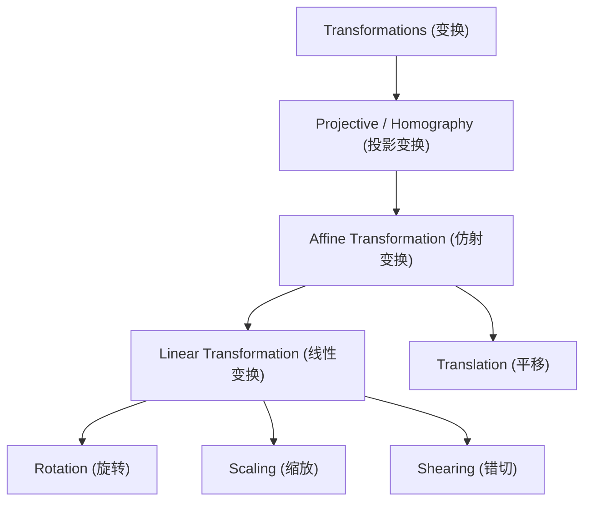
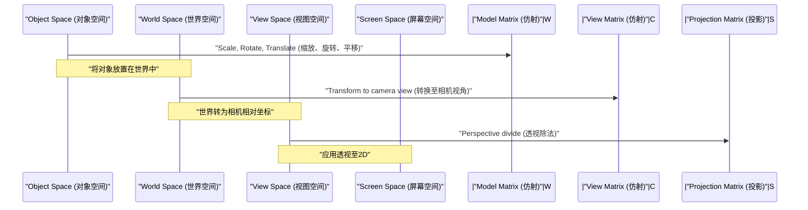

## 1. 引言

在现代计算机图形学（CG）、图像处理以及计算机视觉技术中，旋转二维图像或将三维空间中的物体投影到二维屏幕上的处理是不可或缺的。在这些处理的背后，线性代数与几何学的强大理论发挥着重要作用。其中最基础且最重要的概念就是 **仿射变换** (Affine Transformation) 和 **投影变换** (Projective Transformation / Homography)。

本文将从这两种变换的数学机制出发，系统而深入地讲解为什么需要 **齐次坐标系** (Homogeneous Coordinates) 这种特殊的坐标系，以及它们在实际的CG和计算机视觉世界中是如何被应用的。

## 2. 线性变换的复习与局限性

在思考变换之前，让我们先回顾一下基础的 **线性变换** (Linear Transformation)。二维空间中的线性变换使用 $2 \times 2$ 的矩阵表示如下：

$$
\begin{pmatrix} x' \\ y' \end{pmatrix} = \begin{pmatrix} a & b \\ c & d \end{pmatrix} \begin{pmatrix} x \\ y \end{pmatrix}
$$

可以用这种矩阵形式表示的变换包括以下几何操作：

- **旋转** (Rotation): 旋转角度 $\theta$ 的操作。
- **缩放** (Scaling): 在 $x$ 轴和 $y$ 轴方向改变比例的操作。
- **错切** (Shearing): 将矩形扭曲成平行四边形的操作。
- **反射** (Reflection): 以特定轴为基准进行翻转的操作。

然而，仅靠这些操作不足以绘制实用的CG。在此我们面临一个重大问题：**平移** (Translation)。将原点移动到其他位置的平移是加上特定向量 $(t_x, t_y)$ 的操作，表示如下：

$$
\begin{pmatrix} x' \\ y' \end{pmatrix} = \begin{pmatrix} x \\ y \end{pmatrix} + \begin{pmatrix} t_x \\ t_y \end{pmatrix}
$$

这个等式无法仅通过矩阵的“乘法”来表示。在CG的世界中，需要对数百万个顶点连续应用旋转和平移。如果在每次变换时都必须区分矩阵乘法和向量加法，数学处理将变得繁琐，计算管线和硬件的实现也会变得极其复杂。

## 3. 仿射变换与齐次坐标系的引入

为了解决这个平移问题，并仅用矩阵乘法统一处理所有变换，数学家和工程师们发明了 **齐次坐标系** (Homogeneous Coordinates)。

### 3.1. 什么是齐次坐标系

在齐次坐标系中，在二维坐标 $(x, y)$ 的末尾追加一个虚拟的维度（通常为 $1$），将其表示为三维向量 $(x, y, 1)$。一般来说，齐次坐标 $(x, y, w)$ 对应于真实空间中的直角坐标 $(x/w, y/w)$（前提是 $w \neq 0$）。

### 3.2. 仿射变换矩阵的结构

使用这种齐次坐标系，二维的 **仿射变换** 可以完美地用 $3 \times 3$ 的方阵表示如下：

$$
\begin{pmatrix} x' \\ y' \\ 1 \end{pmatrix} = \begin{pmatrix} a & b & t_x \\ c & d & t_y \\ 0 & 0 & 1 \end{pmatrix} \begin{pmatrix} x \\ y \\ 1 \end{pmatrix}
$$

展开这个矩阵乘法得到如下结果：

$$
x' = ax + by + t_x \\
y' = cx + dy + t_y \\
1 = 0 \cdot x + 0 \cdot y + 1
$$

令人惊叹的是，线性变换部分（$a, b, c, d$）和平移部分（$t_x, t_y$）被整合为一个矩阵的乘法。像这样将线性变换与平移结合在一起的变换整体被称为 **仿射变换**。

### 3.3. 仿射变换的几何性质

仿射变换拥有的最重要几何性质是：“**平行线在变换后依然保持平行**”。此外，“线段上点的比例（例如中点）”在变换前后也得以保留。因此，对正方形进行仿射变换可能会变成平行四边形，但绝对不会变成梯形。

## 4. 投影变换：透视的数学表示

仿射变换非常方便，对于绘制UI或简单的2D游戏来说已经足够。然而，它无法完全表示人类眼睛或相机捕捉三维世界的机制。在现实世界中，远处的物体看起来较小，平行的线（例如笔直的铁轨或走廊）在远处的 **消失点** (Vanishing Point) 看起来会相交。这就是所谓的透视（Perspective）。

在数学上严格建立这种透视模型的便是 **投影变换** (Projective Transformation)。

### 4.1. 投影变换矩阵（单应性）的结构

二维空间之间的投影变换同样使用齐次坐标系由 $3 \times 3$ 的矩阵表示。这个矩阵在计算机视觉领域也被称为 **单应性矩阵** (Homography Matrix)。与仿射变换中始终为 $0, 0, 1$ 的最底行（第3行）不同，它可以在此设置任意值，这是最大的决定性差异。

$$
\begin{pmatrix} X \\ Y \\ W \end{pmatrix} = \begin{pmatrix} h_{11} & h_{12} & h_{13} \\ h_{21} & h_{22} & h_{23} \\ h_{31} & h_{32} & h_{33} \end{pmatrix} \begin{pmatrix} x \\ y \\ 1 \end{pmatrix}
$$

应用此变换后，为了将结果恢复为实际的二维坐标 $(x', y')$，需要将整个向量除以 $W$（归一化）。

$$
x' = \frac{X}{W} = \frac{h_{11}x + h_{12}y + h_{13}}{h_{31}x + h_{32}y + h_{33}} \\
y' = \frac{Y}{W} = \frac{h_{21}x + h_{22}y + h_{23}}{h_{31}x + h_{32}y + h_{33}}
$$

由于分母中包含 $x$ 和 $y$ 的项，变换后的坐标会发生非线性变化。这种非线性的除法（透视除法）正是产生“近大远小”的透视效果的数学基础。

### 4.2. 变换的类层次结构

这些变换的包含关系可以整理为层次结构。投影变换的自由度最高，仿射变换和线性变换作为其特殊情况而存在。

## 5. CG中的变换管线

在3DCG的渲染管线中，为了将三维顶点数据转换为最终的二维屏幕坐标，会分阶段且连续地进行矩阵乘法。由于此处为三维空间，因此齐次坐标系变为四维 $(x, y, z, 1)$，矩阵大小为 $4 \times 4$。

1. **模型变换** (Model Transform): 将基于参考点创建的各个3D模型放置在巨大虚拟世界的适当位置，并调整方向和大小。这是纯粹的仿射变换。
2. **视图变换** (View Transform): 放置虚拟相机，将整个世界的坐标转换为“从相机看到的相对位置”。这同样是仿射变换（主要是旋转和平移）的组合。
3. **投影变换** (Projection Transform): 将3D场景投影到二维的视锥体上。在此应用包含底行成分的 $4 \times 4$ 投影变换矩阵，最后除以 $w$ 元素，完成具有透视感的渲染。

## 6. 计算机视觉与图像处理的应用

仿射变换和投影变换不仅在3DCG中从零开始绘图非常重要，在加工和分析现有照片及视频的计算机视觉领域也极为关键。

### 6.1. 图像畸变校正 (Distortion Correction)
在从斜下方仰视建筑物拍摄的照片中，建筑物的轮廓在照片上会向上收缩（带有透视的状态）。这是因为图像通过相机镜头的投影变换产生了畸变。通过计算将图像四个角的坐标对应于原始矩形坐标的单应性矩阵，并利用逆矩阵应用逆变换，就可以将图像校正得如同从正前方拍摄一般。

### 6.2. 全景图像拼接 (Image Stitching)
在将多张照片拼接在一起以创建广阔全景图像的技术中，投影变换也起着深远的作用。在原地旋转相机拍摄的图像之间，在几何上存在着可通过投影变换相互转换的关系。通过从图像之间提取特征点（如角点或明显的纹理点），并估计能够以最小误差将它们重叠在一起的单应性矩阵，就能实现无缝、自然的全景拼接。

## 7. 总结

从线性代数的基础矩阵运算出发，通过引入在末尾追加维度的齐次坐标系这种优雅的数学设计，我们可以将仿射变换和投影变换统一作为矩阵乘法来处理。

- **仿射变换** 表现包括平移在内的刚体变换和形变，并保留平行性。
- **投影变换** 在此基础上还表现透视，从而实现更接近真实相机的非线性投影。

这一框架简化了GPU内部硬件电路的设计，实现了计算机图形学表现力的飞跃提升。同时，它也成为了计算机视觉中高级图像识别与校正算法的基础。通过深入理解其背后的数学含义，你对日常使用的3D软件和图像处理API的运作方式必定会有更清晰的认识。

