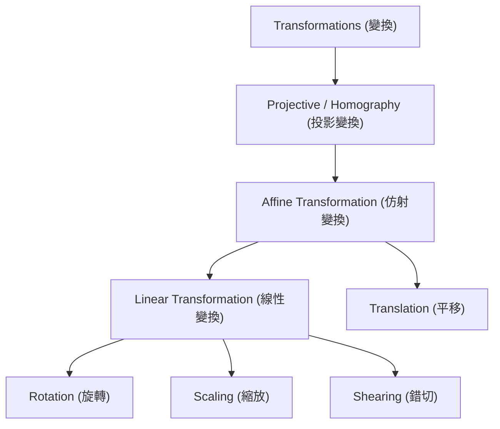
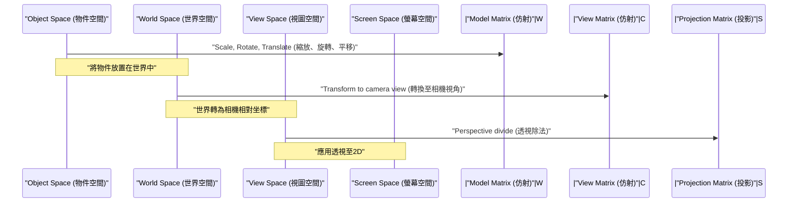

## 1. 引言

在現代電腦圖學（CG）、影像處理以及電腦視覺技術中，旋轉二維影像或將三維空間中的物體投影到二維螢幕上的處理是不可或缺的。在這些處理的背後，線性代數與幾何學的強大理論發揮著重要作用。其中最基礎且最重要的概念就是 **仿射變換** (Affine Transformation) 和 **投影變換** (Projective Transformation / Homography)。

本文將從這兩種變換的數學機制出發，系統而深入地講解為什麼需要 **齊次坐標系** (Homogeneous Coordinates) 這種特殊的坐標系，以及它們在實際的CG和電腦視覺世界中是如何被應用的。

## 2. 線性變換的複習與侷限性

在思考變換之前，讓我們先回顧一下基礎的 **線性變換** (Linear Transformation)。二維空間中的線性變換使用 $2 \times 2$ 的矩陣表示如下：

$$
\begin{pmatrix} x' \\ y' \end{pmatrix} = \begin{pmatrix} a & b \\ c & d \end{pmatrix} \begin{pmatrix} x \\ y \end{pmatrix}
$$

可以用這種矩陣形式表示的變換包括以下幾何操作：

- **旋轉** (Rotation): 旋轉角度 $\theta$ 的操作。
- **縮放** (Scaling): 在 $x$ 軸和 $y$ 軸方向改變比例的操作。
- **錯切** (Shearing): 將矩形扭曲成平行四邊形的操作。
- **反射** (Reflection): 以特定軸為基準進行翻轉的操作。

然而，僅靠這些操作不足以繪製實用的CG。在此我們面臨一個重大問題：**平移** (Translation)。將原點移動到其他位置的平移是加上特定向量 $(t_x, t_y)$ 的操作，表示如下：

$$
\begin{pmatrix} x' \\ y' \end{pmatrix} = \begin{pmatrix} x \\ y \end{pmatrix} + \begin{pmatrix} t_x \\ t_y \end{pmatrix}
$$

這個等式無法僅透過矩陣的「乘法」來表示。在CG的世界中，需要對數百萬個頂點連續應用旋轉和平移。如果在每次變換時都必須區分矩陣乘法和向量加法，數學處理將變得繁瑣，運算管線和硬體的實作也會變得極其複雜。

## 3. 仿射變換與齊次坐標系的引入

為了解決這個平移問題，並僅用矩陣乘法統一處理所有變換，數學家和工程師們發明了 **齊次坐標系** (Homogeneous Coordinates)。

### 3.1. 什麼是齊次坐標系

在齊次坐標系中，在二維坐標 $(x, y)$ 的末尾追加一個虛擬的維度（通常為 $1$），將其表示為三維向量 $(x, y, 1)$。一般來說，齊次坐標 $(x, y, w)$ 對應於真實空間中的直角坐標 $(x/w, y/w)$（前提是 $w \neq 0$）。

### 3.2. 仿射變換矩陣的結構

使用這種齊次坐標系，二維的 **仿射變換** 可以完美地用 $3 \times 3$ 的方陣表示如下：

$$
\begin{pmatrix} x' \\ y' \\ 1 \end{pmatrix} = \begin{pmatrix} a & b & t_x \\ c & d & t_y \\ 0 & 0 & 1 \end{pmatrix} \begin{pmatrix} x \\ y \\ 1 \end{pmatrix}
$$

展開這個矩陣乘法得到如下結果：

$$
x' = ax + by + t_x \\
y' = cx + dy + t_y \\
1 = 0 \cdot x + 0 \cdot y + 1
$$

令人驚嘆的是，線性變換部分（$a, b, c, d$）和平移部分（$t_x, t_y$）被整合為一個矩陣的乘法。像這樣將線性變換與平移結合在一起的變換整體被稱為 **仿射變換**。

### 3.3. 仿射變換的幾何性質

仿射變換擁有的最重要幾何性質是：「**平行線在變換後依然保持平行**」。此外，「線段上點的比例（例如中點）」在變換前後也得以保留。因此，對正方形進行仿射變換可能會變成平行四邊形，但絕對不會變成梯形。

## 4. 投影變換：透視的數學表示

仿射變換非常方便，對於繪製UI或簡單的2D遊戲來說已經足夠。然而，它無法完全表示人類眼睛或相機捕捉三維世界的機制。在現實世界中，遠處的物體看起來較小，平行的線（例如筆直的鐵軌或走廊）在遠處的 **消失點** (Vanishing Point) 看起來會相交。這就是所謂的透視（Perspective）。

在數學上嚴格建立這種透視模型的便是 **投影變換** (Projective Transformation)。

### 4.1. 投影變換矩陣（單應性）的結構

二維空間之間的投影變換同樣使用齊次坐標系由 $3 \times 3$ 的矩陣表示。這個矩陣在電腦視覺領域也被稱為 **單應性矩陣** (Homography Matrix)。與仿射變換中始終為 $0, 0, 1$ 的最底行（第3行）不同，可以在此設定任意值，這是最大的決定性差異。

$$
\begin{pmatrix} X \\ Y \\ W \end{pmatrix} = \begin{pmatrix} h_{11} & h_{12} & h_{13} \\ h_{21} & h_{22} & h_{23} \\ h_{31} & h_{32} & h_{33} \end{pmatrix} \begin{pmatrix} x \\ y \\ 1 \end{pmatrix}
$$

應用此變換後，為了將結果恢復為實際的二維坐標 $(x', y')$，需要將整個向量除以 $W$（正規化）。

$$
x' = \frac{X}{W} = \frac{h_{11}x + h_{12}y + h_{13}}{h_{31}x + h_{32}y + h_{33}} \\
y' = \frac{Y}{W} = \frac{h_{21}x + h_{22}y + h_{23}}{h_{31}x + h_{32}y + h_{33}}
$$

由於分母中包含 $x$ 和 $y$ 的項，變換後的坐標會發生非線性變化。這種非線性的除法（透視除法）正是產生「近大遠小」的透視效果的數學基礎。

### 4.2. 變換的類層次結構

這些變換的包含關係可以整理為層次結構。投影變換的自由度最高，仿射變換和線性變換作為其特殊情況而存在。

## 5. CG中的變換管線

在3DCG的渲染管線中，為了將三維頂點資料轉換為最終的二維螢幕坐標，會分階段且連續地進行矩陣乘法。由於此處為三維空間，因此齊次坐標系變為四維 $(x, y, z, 1)$，矩陣大小為 $4 \times 4$。

1. **模型變換** (Model Transform): 將基於參考點建立的各個3D模型放置在巨大虛擬世界的適當位置，並調整方向和大小。這是純粹的仿射變換。
2. **視圖變換** (View Transform): 放置虛擬相機，將整個世界的坐標轉換為「從相機看到的相對位置」。這同樣是仿射變換（主要是旋轉和平移）的組合。
3. **投影變換** (Projection Transform): 將3D場景投影到二維的視錐體上。在此應用包含底行成分的 $4 \times 4$ 投影變換矩陣，最後除以 $w$ 元素，完成具有透視感的渲染。

## 6. 電腦視覺與影像處理的應用

仿射變換和投影變換不僅在3DCG中從零開始繪圖非常重要，在加工和分析現有照片及影片的電腦視覺領域也極為關鍵。

### 6.1. 影像畸變校正 (Distortion Correction)
在從斜下方仰視建築物拍攝的照片中，建築物的輪廓在照片上會向上收縮（帶有透視的狀態）。這是因為影像透過相機鏡頭的投影變換產生了畸變。透過計算將影像四個角的坐標對應於原始矩形坐標的單應性矩陣，並利用逆矩陣應用逆變換，就可以將影像校正得如同從正前方拍攝一般。

### 6.2. 全景影像拼接 (Image Stitching)
在將多張照片拼接在一起以建立廣闊全景影像的技術中，投影變換也起著深遠的作用。在原地旋轉相機拍攝的影像之間，在幾何上存在著可透過投影變換相互轉換的關係。透過從影像之間擷取特徵點（如角點或明顯的紋理點），並估計能夠以最小誤差將它們重疊在一起的單應性矩陣，就能實現無縫、自然的全景拼接。

## 7. 總結

從線性代數的基礎矩陣運算出發，透過引入在末尾追加維度的齊次坐標系這種優雅的數學設計，我們可以將仿射變換和投影變換統一作為矩陣乘法來處理。

- **仿射變換** 表現包括平移在內的剛體變換和形變，並保留平行性。
- **投影變換** 在此基礎上還表現透視，從而實現更接近真實相機的非線性投影。

這一框架簡化了GPU內部硬體電路的設計，實現了電腦圖學表現力的飛躍提升。同時，它也成為了電腦視覺中高級影像識別與校正演算法的基礎。透過深入理解其背後的數學含義，你對日常使用的3D軟體和影像處理API的運作方式必定會有更清晰的認識。

