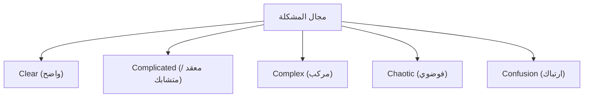
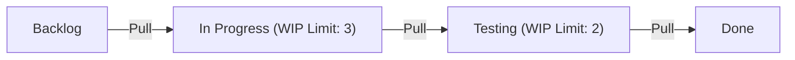

# التطوير الرشيق: احتضان التغيير في هندسة البرمجيات الحديثة

في تطوير البرمجيات الحديث، لا يمر يوم دون سماع كلمة "أجايل" (Agile) أو التطوير الرشيق. ومع ذلك، فإن الأجايل ليس مجرد مصطلح رائج، بل هو مفهوم ذو فلسفة عميقة يتقاطع فيها هندسة البرمجيات، وإدارة المشاريع، والسلوك التنظيمي البشري. في هذه المقالة، سنشرح بالتفصيل جوهر تطوير الأجايل: سكروم (Scrum)، وكانبان (Kanban)، وبيان تطوير البرمجيات الرشيقة، من منظور خلفيتها التاريخية إلى علم الأنظمة المعقدة.

## 1. الخلفية التاريخية لتطوير البرمجيات وحدود التايلورية

لفهم الأجايل، يجب علينا أولاً فهم ما قبل تاريخه. في أوائل القرن العشرين، أحدثت "الإدارة العلمية (التايلورية)" التي اقترحها فريدريك تايلور ثورة في الصناعة التحويلية. هذا النهج، الذي يقسم عمل العمال إلى عمليات يمكن قياسها والتنبؤ بها وإدارتها، حقق نتائج هائلة في إنتاج المصانع.

حتى في تطوير البرمجيات المبكر (من السبعينيات إلى التسعينيات)، تم تبني هذا النهج التايلوري. وهو ما يُعرف بـ "نموذج الشلال" (Waterfall Model). هذا النهج، الذي يتقدم في اتجاه واحد مثل شلال يتدفق إلى أسفل عبر مراحل مثل تعريف المتطلبات، والتصميم الأساسي، والتصميم التفصيلي، والتنفيذ، والاختبار، والتشغيل، كان من السهل فهمه كقياس على البناء والتصنيع.

ومع ذلك، فإن البرمجيات هي "نتاج الفكر" وليس لها كيان مادي. من الشائع أن تتغير المتطلبات أثناء البناء، وليس من غير المألوف ألا يتضح ما يريده المستخدمون حقًا إلا بعد اكتمالها. في عالم البرمجيات سريع التغير، أدى "فصل التخطيط عن التنفيذ" التايلوري إلى مأساة الجمود وإعادة العمل الهائلة.

## 2. ولادة بيان تطوير البرمجيات الرشيقة

في عام 2001، اجتمع 17 خبيرًا في عمليات ومنهجيات تطوير البرمجيات في منتجع تزلج في سنوبيرد، يوتا. وكرد فعل ضد العمليات الثقيلة والضخمة، ناقشوا طرق تطوير برمجيات أكثر خفة وقدرة على التكيف، وقاموا بصياغة بيان واحد. هذا هو "بيان تطوير البرمجيات الرشيقة" (Agile Manifesto).

يؤكد البيان على القيم الأربع التالية:

*   **الأفراد والتعامل فيما بينهم** فوق العمليات والأدوات
*   **برمجيات صالحة للاستعمال** فوق التوثيق الشامل
*   **تعاون العملاء** فوق التفاوض حول العقود
*   **الاستجابة للتغيير** فوق اتباع خطة عمل

(ملاحظة: على الرغم من أننا ندرك قيمة العناصر الموجودة على اليسار، إلا أننا نقدر العناصر الموجودة على اليمين بشكل أكبر)

أحدث هذا البيان نقلة نوعية، مشيرًا إلى أن تطوير البرمجيات ينطوي بطبيعته على "عدم يقين"، وأن التكيف بمرونة مع المواقف غير المتوقعة هو الأهم.

## 3. الأنظمة التكيفية المعقدة (Complex Adaptive Systems) وإطار عمل سينيفين (Cynefin)

لشرح فعالية الأجايل علميًا، يعتبر منظور علم الأنظمة المعقدة مفيدًا للغاية. يصنف "إطار عمل سينيفين" (Cynefin Framework) الذي اقترحه ديفيد سنودن طبيعة المشاكل إلى خمسة مجالات.

*   **Clear (واضح)**: حالة تكون فيها العلاقة بين السبب والنتيجة واضحة للجميع. أفضل الممارسات (Best Practices) تكون فعالة.
*   **Complicated (معقد / متشابك)**: حالة يمكن فهم العلاقة بين السبب والنتيجة من خلال التحليل. تتطلب ممارسات جيدة (Good Practices) من قبل الخبراء.
*   **Complex (مركب)**: حالة لا يمكن فيها معرفة السبب والنتيجة إلا بأثر رجعي. تتطلب التجربة والخطأ والممارسات الناشئة (Emergent Practice).
*   **Chaotic (فوضوي)**: حالة لا توجد فيها علاقة سببية. تتطلب استجابة سريعة من خلال اتخاذ إجراءات (Novel Practice).

ينتمي معظم تطوير البرمجيات إلى المجال "المركب" (Complex). نظرًا لأن العديد من المتغيرات مثل احتياجات السوق والتقدم التكنولوجي والتواصل داخل الفريق تتفاعل مع بعضها البعض، فإن التخطيط المسبق الدقيق (نموذج الشلال) لا ينجح. الأجايل هو إطار عمل للتكيف مع هذا المجال المركب من خلال تكرار "التجربة (Probe) ← الاستشعار (Sense) ← الاستجابة (Respond)" في دورات قصيرة.

## 4. سكروم (Scrum): إطار عمل قائم على التجريبية

أشهر إطار عمل لتنفيذ تطوير الأجايل هو "سكروم". يُشتق اسم سكروم من تشكيلة السكروم في لعبة الرجبي، ويعني أن الفريق يتحرك للأمام ككيان واحد.

يُدعم سكروم بثلاث ركائز للتجريبية: "الشفافية" (Transparency)، "الفحص" (Inspection)، و"التكيف" (Adaptation).

### أدوار سكروم (Accountabilities)

1.  **مالك المنتج (PO)**: مسؤول عن تعظيم قيمة المنتج. يقرر "ماذا" (What) سيتم بناؤه.
2.  **سيد سكروم (SM)**: قائد خادم يدعم الفريق لضمان فهم سكروم وتنفيذه بشكل صحيح.
3.  **المطورون (Developers)**: مجموعة من الخبراء الذين يقومون فعليًا بإنشاء الزيادة (جزء ذو قيمة من المنتج). يقررون "كيف" (How) سيتم البناء.

### أحداث سكروم

يستخدم سكروم وحدة زمنية ثابتة تسمى "سبرينت" (عادة من أسبوع إلى 4 أسابيع) كوحدة أساسية لتنفيذ الأحداث التالية:

*   **تخطيط السبرينت (Sprint Planning)**: يخطط لما سيتم إنجازه وكيف سيتم ذلك في السبرينت.
*   **سكروم اليومي (Daily Scrum)**: 15 دقيقة يوميًا يقوم فيها المطورون بمزامنة التقدم وتعديل الخطة.
*   **مراجعة السبرينت (Sprint Review)**: تقديم مخرجات السبرينت (الزيادة) لأصحاب المصلحة والحصول على ملاحظاتهم.
*   **استرجاع السبرينت (Sprint Retrospective)**: التفكير في عمليات وعلاقات الفريق وتحديد التدابير التحسينية (كايزن) للسبرينت التالي.

سكروم إطار عمل خفيف الوزن للغاية، ولكن يقال إنه "صعب الإتقان" (Hard to master). وذلك لأنه يتطلب تنظيماً ذاتياً وانضباطاً عالياً من الفريق، مما غالباً ما يتعارض مع ثقافة المؤسسات التقليدية من أعلى إلى أسفل.

## 5. كانبان (Kanban): تحسين التدفق

إلى جانب سكروم، من الأساليب الهامة الأخرى في ممارسات الأجايل هو "كانبان". وقد استُمد من "نظام كانبان" في نظام إنتاج تويوتا (TPS).

جوهر كانبان يكمن في "تصور سير العمل" (Visualizing workflow) و"الحد من العمل قيد التقدم" (WIP - Work In Progress).

بينما يؤكد سكروم على "التكرار" (Iteration) من خلال أطر زمنية (سبرينت)، يركز كانبان على "تدفق" (Flow) العمل. من خلال الحد من WIP، فإنه يمنع إدخال عمل يتجاوز سعة الفريق ويكشف عن الاختناقات. وبناءً على قانون ليتل (وقت التنفيذ = WIP / الإنتاجية)، فإنه يحقق تقليص وقت التنفيذ وتحسين الجودة.

## 6. التفوق التقني والبرمجة القصوى (XP)

غالبًا ما يُتحدث عن الأجايل كنهج إداري، لكن لا يمكن تحقيق الأجايل الحقيقي دون دعم تقني. وهنا تبرز أهمية "البرمجة القصوى (XP)".

التطوير القائم على الاختبار (TDD)، والبرمجة الزوجية، والتكامل المستمر (CI)، وإعادة الهيكلة (Refactoring)، وغيرها من الممارسات التي تعتبر ضرورية في هندسة البرمجيات الحديثة، تم تنظيم العديد منها بواسطة XP.

من أجل "توفير برمجيات صالحة للاستعمال بشكل مستمر"، يجب أن تكون الشيفرة المصدرية نظيفة دائمًا وآمنة للتغيير (مضمونة بالاختبارات). إذا قمت بتشغيل عملية سكروم مع إهمال "الدين التقني" (Technical Debt)، فقاعدة الشيفرة لن تتحمل سرعة التغيير في النهاية وسوف تنهار.

## الخلاصة: احتضان التغيير

تطوير البرمجيات الرشيقة لا يكتمل بمجرد تقديم عملية أو أداة معينة. إنها عقلية (Mindset) لاحترام الإنسانية، والتعلم المستمر، والاستمرار في التكيف في عالم غير مؤكد وسريع التغير.

مواجهة "الأنظمة المعقدة" المتمثلة في التغيرات السوقية، والتطور التكنولوجي، وقبل كل شيء الإبداع البشري، وعدم محاولة السيطرة عليها، بل التطور معها. هذا هو السبب الأهم الذي يجعل الأجايل أمرًا لا غنى عنه في هندسة البرمجيات الحديثة.
