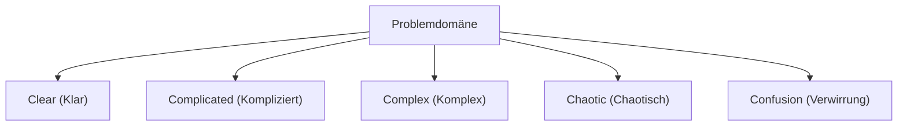
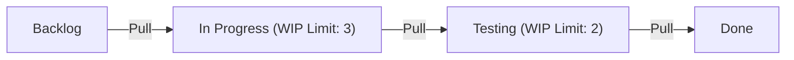

# Agile Softwareentwicklung: Die moderne Softwareentwicklung, die Veränderungen annimmt

In der modernen Softwareentwicklung gibt es keinen Tag, an dem man nicht das Wort "Agil" (Agile) hört. Agile ist jedoch nicht nur ein Buzzword, sondern ein tiefgründiges philosophisches Konzept, an dem sich Software Engineering, Projektmanagement und menschliches Organisationsverhalten kreuzen. In diesem Artikel werden wir die Essenz der agilen Entwicklung – Scrum, Kanban und das Agile Manifest – unter Einbeziehung des historischen Hintergrunds und der Perspektive der Wissenschaft komplexer Systeme im Detail erläutern.

## 1. Historischer Hintergrund der Softwareentwicklung und die Grenzen des Taylorismus

Um Agile zu verstehen, müssen wir zunächst seine Vorgeschichte verstehen. Anfang des 20. Jahrhunderts revolutionierte das von Frederick Taylor vorgeschlagene "Scientific Management (Taylorismus)" die Fertigungsindustrie. Diese Methode, die die Arbeit der Arbeiter unterteilt und als messbaren und vorhersehbaren Prozess verwaltet, hat in der Fabrikproduktion enorme Ergebnisse erzielt.

Auch in der frühen Softwareentwicklung (1970er bis 1990er Jahre) wurde dieser tayloristische Ansatz übernommen. Das ist das "Wasserfallmodell". Dieser Ansatz, bei dem Phasen wie Anforderungsdefinition, Basisdesign, Detaildesign, Implementierung, Test und Betrieb in einer Richtung wie ein fallender Wasserfall durchlaufen werden, war als Analogie zum Bau- oder Fertigungssektor leicht verständlich.

Software ist jedoch ein "Produkt des Denkens" ohne physische Substanz. Es ist nicht ungewöhnlich, dass sich Anforderungen während der Erstellung ändern, und oft wird erst nach der Fertigstellung klar, was der Benutzer wirklich wollte. Die tayloristische "Trennung von Planung und Ausführung" führte in der sich schnell verändernden Welt der Software zu einer Tragödie der Erstarrung und enormen Nacharbeiten.

## 2. Die Geburt des agilen Manifests für Softwareentwicklung

Im Jahr 2001 trafen sich 17 Experten für Prozesse und Methoden der Softwareentwicklung in einem Skigebiet in Snowbird, Utah. Aus einer Abneigung gegen schwerfällige Prozesse diskutierten sie über eine leichtgewichtigere und anpassungsfähigere Methode der Softwareentwicklung und fassten ein Manifest zusammen. Dies ist das "Manifest für Agile Softwareentwicklung (Agile Manifesto)".

Das Manifest betont die folgenden vier Werte:

*   **Individuen und Interaktionen** mehr als Prozesse und Werkzeuge
*   **Funktionierende Software** mehr als umfassende Dokumentation
*   **Zusammenarbeit mit dem Kunden** mehr als Vertragsverhandlung
*   **Reagieren auf Veränderung** mehr als das Befolgen eines Plans

(Anmerkung: Das heißt, obwohl wir die Werte auf der rechten Seite wichtig finden, schätzen wir die Werte auf der linken Seite höher ein.)

Dieses Manifest brachte einen Paradigmenwechsel mit sich, dass Softwareentwicklung von Natur aus mit "Unsicherheit" verbunden ist und dass es wichtig ist, sich flexibel an unvorhersehbare Situationen anzupassen.

## 3. Komplexe adaptive Systeme (Complex Adaptive Systems) und das Cynefin-Framework

Aus wissenschaftlicher Sicht ist die Perspektive der Komplexitätswissenschaft sehr nützlich, um die Wirksamkeit von Agile zu erklären. Das von David Snowden vorgeschlagene "Cynefin-Framework" unterteilt die Natur von Problemen in fünf Domänen.

*   **Clear (Klar)**: Ein Zustand, in dem die Beziehung zwischen Ursache und Wirkung für jeden offensichtlich ist. Best Practices sind anwendbar.
*   **Complicated (Kompliziert)**: Ein Zustand, in dem die Beziehung zwischen Ursache und Wirkung durch Analyse verstanden werden kann. Good Practices von Experten sind erforderlich.
*   **Complex (Komplex)**: Ein Zustand, in dem Ursache und Wirkung erst im Nachhinein verstanden werden können. Versuch und Irrtum sowie aufkommende Praktiken (Emergent Practice) sind erforderlich.
*   **Chaotic (Chaotisch)**: Ein Zustand, in dem es keinen Kausalzusammenhang zwischen Ursache und Wirkung gibt. Schnelles Handeln zur Reaktion (Novel Practice) ist erforderlich.

Ein Großteil der Softwareentwicklung fällt in die Domäne "Complex (Komplex)". Da viele Variablen wie Marktbedürfnisse, technologischer Fortschritt und die Kommunikation innerhalb des Teams interagieren, funktionieren detaillierte Vorausplanungen (Wasserfall) nicht. Agile ist ein Framework zur Anpassung an diese komplexe Domäne, indem der Zyklus von "Probe (Versuchen) -> Sense (Wahrnehmen) -> Respond (Reagieren)" in kurzen Zyklen wiederholt wird.

## 4. Scrum: Ein auf Empirie basierendes Framework

Das beliebteste Framework zur Umsetzung agiler Entwicklung ist "Scrum". Der Name Scrum stammt vom Gedränge (Scrum) im Rugby und bedeutet, dass das Team als Einheit voranschreitet.

Scrum stützt sich auf die drei Säulen der Empirie: "Transparenz (Transparency)", "Überprüfung (Inspection)" und "Anpassung (Adaptation)".

### Rollen in Scrum (Accountabilities)

1.  **Product Owner (PO)**: Verantwortlich für die Maximierung des Wertes des Produkts. Entscheidet, was (What) erstellt wird.
2.  **Scrum Master (SM)**: Ein Servant-Leader, der das Team dabei unterstützt, sicherzustellen, dass Scrum richtig verstanden und angewendet wird.
3.  **Entwickler (Developers)**: Eine Expertengruppe, die tatsächlich das Inkrement (einen wertvollen Teil des Produkts) erstellt. Entscheidet, wie (How) es erstellt wird.

### Scrum-Events

Scrum führt die folgenden Events durch, wobei eine Timebox namens "Sprint" (in der Regel 1 bis 4 Wochen) als Grundeinheit dient.

*   **Sprint Planning**: Plant, was im Sprint erreicht werden soll und wie.
*   **Daily Scrum**: Die Entwickler synchronisieren täglich in 15 Minuten ihren Fortschritt und passen den Plan an.
*   **Sprint Review**: Präsentiert die Ergebnisse des Sprints (Inkrement) den Stakeholdern und holt Feedback ein.
*   **Sprint Retrospective**: Reflektiert die Prozesse und Beziehungen des Teams und legt Verbesserungen (Kaizen) für den nächsten Sprint fest.

Scrum ist ein sehr leichtgewichtiges Framework, wird aber als "schwer zu meistern (Hard to master)" angesehen. Da es Selbstorganisation und hohe Disziplin vom Team fordert, kollidiert es oft mit traditionellen Top-Down-Organisationskulturen.

## 5. Kanban: Optimierung des Flusses

Ein weiteres wichtiges agiles Verfahren neben Scrum ist "Kanban". Dies leitet sich vom "Kanban-System" des Toyota-Produktionssystems (TPS) ab.

Der Kern von Kanban liegt in der "Visualisierung des Workflows" und der "Begrenzung von WIP (Work In Progress: laufende Arbeiten)".

Während Scrum "Iterationen" mit Timeboxen (Sprints) betont, konzentriert sich Kanban auf den "Fluss (Flow)" der Arbeit. Durch die Begrenzung des WIP wird verhindert, dass mehr Arbeit begonnen wird, als das Team bewältigen kann, wodurch Engpässe aufgedeckt werden. Basierend auf dem Gesetz von Little (Lead Time = WIP / Throughput) führt dies zu kürzeren Vorlaufzeiten und einer höheren Qualität.

## 6. Technische Exzellenz und XP (Extreme Programming)

Agile wird oft als Managementmethode diskutiert, aber wahre Agilität kann ohne technischen Rückhalt nicht erreicht werden. Hier wird "XP (Extreme Programming)" wichtig.

Viele der Praktiken, die im modernen Software-Engineering als wesentlich erachtet werden, wie testgetriebene Entwicklung (TDD), Pair Programming, Continuous Integration (CI) und Refactoring, wurden durch XP systematisiert.

Um "kontinuierlich funktionierende Software bereitzustellen", muss der Quellcode immer sauber und sicher gegenüber Änderungen sein (garantiert durch Tests). Wenn Sie nur den Scrum-Prozess durchlaufen und technische Schulden (Technical Debt) unbehandelt lassen, wird die Codebasis dem Tempo der Veränderungen irgendwann nicht mehr standhalten können und zusammenbrechen.

## Zusammenfassung: Veränderungen annehmen

Agile Softwareentwicklung ist nicht abgeschlossen, indem man einen bestimmten Prozess oder ein Werkzeug einführt. Es ist ein Mindset, um in einer unsicheren und sich schnell verändernden Welt die Menschlichkeit zu respektieren, kontinuierlich zu lernen und sich ständig anzupassen.

Sich den Veränderungen des Marktes, der technologischen Entwicklung und vor allem der "komplexen Systeme" der menschlichen Kreativität zu stellen und gemeinsam mit ihnen zu evolvieren, anstatt zu versuchen, sie zu kontrollieren. Genau aus diesem Grund ist Agile im modernen Software-Engineering unverzichtbar.
