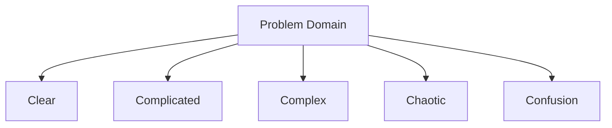
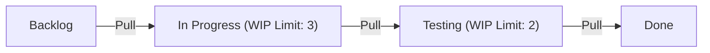

# Agile Development: Modern Software Engineering Embracing Change

In modern software development, not a day goes by without hearing the word "Agile". However, Agile is not just a buzzword, but a concept with a deep philosophy where software engineering, project management, and human organizational behavior intersect. In this article, we will explain the essence of Agile development—Scrum, Kanban, and the Agile Manifesto—in detail, including its historical background and the perspective of complex systems science.

## 1. Historical Background of Software Development and the Limits of Taylorism

To understand Agile, we must first understand its prehistory. In the early 20th century, the "Scientific Management" (Taylorism) advocated by Frederick Taylor revolutionized the manufacturing industry. This method of breaking down workers' tasks and managing them as a measurable and predictable process achieved tremendous results in factory production.

In early software development (1970s-1990s), this Taylorist approach was also adopted. That was the "Waterfall model". This method of proceeding one-way like a waterfall—requirements definition, basic design, detailed design, implementation, testing, operation—was easy to understand as an analogy to construction and manufacturing.

However, software is a "product of thought" that has no physical substance. It is common for requirements to change during construction, and it is not unusual for what users truly wanted to become clear only after completion. In the fast-changing world of software, the Taylorist "separation of planning and execution" resulted in the tragedy of rigidification and enormous rework.

## 2. The Birth of the Agile Manifesto

In 2001, 17 experts in software development processes and methodologies gathered at a ski resort in Snowbird, Utah. Out of rebellion against heavy-duty processes, they discussed lighter and more adaptable software development methods and put together a single declaration. This is the "Agile Manifesto".

The manifesto emphasizes the following four values:

*   **Individuals and interactions** over processes and tools
*   **Working software** over comprehensive documentation
*   **Customer collaboration** over contract negotiation
*   **Responding to change** over following a plan

(Note: That is, while there is value in the items on the right, we value the items on the left more.)

This declaration brought about a paradigm shift, stating that software development is inherently accompanied by "uncertainty," and that flexibly adapting to unpredictable situations is what is truly important.

## 3. Complex Adaptive Systems and the Cynefin Framework

To scientifically explain the effectiveness of Agile, the perspective of complex systems science is very useful. The "Cynefin Framework" advocated by David Snowden categorizes the nature of problems into five domains.

*   **Clear**: A state where the relationship between cause and effect is obvious to everyone. Best practices apply.
*   **Complicated**: A state that can be understood by analyzing the relationship between cause and effect. Good practices by experts are necessary.
*   **Complex**: A state where cause and effect are only known in retrospect. Trial and error and emergent practices are necessary.
*   **Chaotic**: A state where there is no cause-and-effect relationship. Rapid action (novel practice) is necessary.

Much of software development falls into the "Complex" domain. Because numerous variables interact with each other—market needs, technological progress, communication within the team, etc.—careful upfront planning (Waterfall) does not work. Agile is a framework for adapting to this complex domain by repeating short cycles of "Probe -> Sense -> Respond".

## 4. Scrum: An Empiricism-Based Framework

The most popular framework for practicing Agile development is "Scrum". Derived from a rugby scrum, it means the team moves forward as a single unit.

Scrum is supported by three pillars of empiricism: "Transparency", "Inspection", and "Adaptation".

### Scrum Accountabilities

1.  **Product Owner (PO)**: Responsible for maximizing the value of the product. Decides what to build.
2.  **Scrum Master (SM)**: A servant leader who helps the team understand and practice Scrum correctly.
3.  **Developers**: A group of experts who actually create the increment (a valuable piece of the product). Decides how to build it.

### Scrum Events

Scrum uses timeboxes called "Sprints" (usually 1-4 weeks) as the basic unit to conduct the following events:

*   **Sprint Planning**: Plans what to achieve and how to achieve it in the Sprint.
*   **Daily Scrum**: A 15-minute daily event where developers sync progress and adjust plans.
*   **Sprint Review**: Presents the outcome of the Sprint (increment) to stakeholders and gets feedback.
*   **Sprint Retrospective**: Reflects on the team's processes and relationships, and decides on improvements (Kaizen) for the next Sprint.

Scrum is a very lightweight framework, but it is considered "hard to master". Because it requires team self-organization and high discipline, it often conflicts with traditional top-down organizational cultures.

## 5. Kanban: Optimizing Flow

Along with Scrum, an important Agile practice is "Kanban". This is derived from the "Kanban method" of the Toyota Production System (TPS).

The core of Kanban lies in "visualizing the workflow" and "limiting WIP (Work In Progress)".

While Scrum emphasizes "iteration" through timeboxing (Sprints), Kanban emphasizes the "flow" of work. By limiting WIP, it prevents pushing work beyond the team's capacity and makes bottlenecks visible. This shortens lead time and improves quality based on Little's Law (Lead Time = WIP / Throughput).

## 6. Technical Excellence and XP (Extreme Programming)

Agile is often talked about as a management method, but true Agile cannot be realized without technical backing. This is where "XP (Extreme Programming)" becomes important.

Many of the practices considered essential in modern software engineering, such as Test-Driven Development (TDD), pair programming, Continuous Integration (CI), and refactoring, were systematized by XP.

To "continuously deliver working software", the source code must always be clean and safe against changes (guaranteed by testing). Even if you just run the Scrum process while leaving technical debt unaddressed, the codebase will eventually be unable to withstand the speed of change and will collapse.

## Conclusion: Embracing Change

Agile software development is not completed by introducing a specific process or tool. It is a mindset for respecting humanity, continuously learning, and constantly adapting in an uncertain and rapidly changing world.

Facing the "complex systems" of market changes, technological evolution, and above all, human creativity, and evolving together with them rather than trying to control them. That is the greatest reason why Agile is indispensable in modern software engineering.
