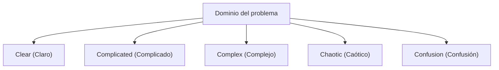

# Desarrollo Ágil: Abrazando el Cambio en la Ingeniería de Software Moderna

En el desarrollo de software moderno, no hay un solo día en que no escuchemos la palabra "Ágil" (Agile). Sin embargo, Ágil no es simplemente una palabra de moda, sino un concepto con una profunda filosofía donde convergen la ingeniería de software, la gestión de proyectos y el comportamiento organizacional humano. En este artículo, explicaremos en detalle la esencia del desarrollo ágil: Scrum, Kanban y el Manifiesto Ágil para el Desarrollo de Software, abarcando desde sus antecedentes históricos hasta la perspectiva de la ciencia de la complejidad.

## 1. Antecedentes Históricos del Desarrollo de Software y los Límites del Taylorismo

Para entender Ágil, primero debemos comprender su prehistoria. A principios del siglo XX, la "Administración Científica" (Taylorismo), propuesta por Frederick Taylor, revolucionó la industria manufacturera. Este enfoque, que dividía el trabajo de los obreros y lo gestionaba como un proceso medible y predecible, logró resultados extraordinarios en la producción en fábricas.

En el desarrollo de software inicial (décadas de 1970 a 1990), también se adoptó este enfoque taylorista. Así nació el "Modelo en Cascada" (Waterfall). Este método, que avanza unidireccionalmente como una cascada a través de fases como la definición de requisitos, el diseño básico, el diseño detallado, la implementación, las pruebas y la operación, era fácil de entender como una analogía de las industrias de la construcción y la manufactura.

Sin embargo, el software es un "producto del pensamiento" que no tiene una entidad física. Es común que los requisitos cambien durante la construcción, y no es raro que lo que el usuario realmente quería solo quede claro una vez que el producto está terminado. La "separación de la planificación y la ejecución" taylorista resultó en la tragedia de la rigidez y retrabajos masivos en el mundo del software, que cambia rápidamente.

## 2. El Nacimiento del Manifiesto Ágil para el Desarrollo de Software

En 2001, 17 expertos en procesos y metodologías de desarrollo de software se reunieron en la estación de esquí de Snowbird en Utah. Como reacción a los procesos pesados, discutieron métodos de desarrollo de software más ligeros y adaptables, y redactaron una declaración. Este es el "Manifiesto Ágil para el Desarrollo de Software" (Agile Manifesto).

El manifiesto enfatiza los siguientes 4 valores:

*   **Individuos e interacciones** sobre procesos y herramientas
*   **Software funcionando** sobre documentación exhaustiva
*   **Colaboración con el cliente** sobre negociación contractual
*   **Respuesta ante el cambio** sobre seguir un plan

(Nota: Aunque valoramos los elementos de la derecha, valoramos más los de la izquierda)

Este manifiesto provocó un cambio de paradigma, estableciendo que el desarrollo de software implica intrínsecamente "incertidumbre" y que adaptarse flexiblemente a situaciones impredecibles es lo verdaderamente importante.

## 3. Sistemas Adaptativos Complejos (Complex Adaptive Systems) y el Marco Cynefin

Al explicar científicamente la efectividad de Ágil, la perspectiva de la ciencia de la complejidad es muy útil. El "Marco Cynefin" (Cynefin Framework), propuesto por David Snowden, clasifica la naturaleza de los problemas en 5 dominios.

*   **Clear (Claro)**: Un estado donde la relación causa-efecto es obvia para todos. Se aplican las mejores prácticas (Best Practices).
*   **Complicated (Complicado)**: Un estado que se puede entender analizando la relación causa-efecto. Requiere buenas prácticas (Good Practices) por parte de expertos.
*   **Complex (Complejo)**: Un estado donde la causa y el efecto solo se conocen a posteriori. Requiere prueba y error, y prácticas emergentes (Emergent Practice).
*   **Chaotic (Caótico)**: Un estado donde no existe causalidad entre causa y efecto. Requiere una respuesta mediante una acción rápida (Novel Practice).

Gran parte del desarrollo de software pertenece al dominio "Complex (Complejo)". Debido a que numerosas variables, como las necesidades del mercado, los avances tecnológicos y la comunicación dentro del equipo, interactúan entre sí, la planificación meticulosa por adelantado (cascada) no funciona. Ágil es un marco para adaptarse a este dominio complejo mediante la repetición de ciclos cortos de "sondear (probe) -> percibir (sense) -> responder (respond)".

## 4. Scrum: Un Marco Basado en el Empirismo

El marco más popular para implementar el desarrollo ágil es "Scrum". Scrum deriva del scrum en el rugby, lo que significa que el equipo avanza al unísono.

Scrum se apoya en 3 pilares del empirismo: "Transparencia" (Transparency), "Inspección" (Inspection) y "Adaptación" (Adaptation).

### Roles en Scrum (Accountabilities)

1.  **Product Owner (PO)**: Responsable de maximizar el valor del producto. Decide qué (What) construir.
2.  **Scrum Master (SM)**: Un líder servicial (servant-leader) que apoya al equipo para que Scrum se entienda e implemente correctamente.
3.  **Desarrolladores (Developers)**: Un grupo de expertos que crean el incremento real (una parte valiosa del producto). Deciden cómo (How) construirlo.

### Eventos de Scrum

Scrum utiliza bloques de tiempo (timeboxes) llamados "Sprints" (generalmente de 1 a 4 semanas) como unidad básica y lleva a cabo los siguientes eventos:

*   **Sprint Planning (Planificación del Sprint)**: Planifica qué se logrará en el sprint y cómo.
*   **Daily Scrum (Scrum Diario)**: En 15 minutos diarios, los desarrolladores sincronizan su progreso y ajustan el plan.
*   **Sprint Review (Revisión del Sprint)**: Presenta el resultado del sprint (incremento) a las partes interesadas (stakeholders) y obtiene feedback.
*   **Sprint Retrospective (Retrospectiva del Sprint)**: Reflexiona sobre los procesos y relaciones del equipo, y decide mejoras (Kaizen) para el siguiente sprint.

Scrum es un marco muy ligero, pero se dice que es "difícil de dominar" (Hard to master). Esto se debe a que exige autoorganización y alta disciplina del equipo, lo que a menudo choca con la cultura organizacional tradicional vertical (top-down).

## 5. Kanban: Optimización del Flujo

Junto a Scrum, otra práctica ágil importante es "Kanban". Esto se deriva del "sistema Kanban" del Sistema de Producción de Toyota (TPS).

El núcleo de Kanban radica en la "visualización del flujo de trabajo" y la "limitación del WIP" (Work In Progress: Trabajo en progreso).

Mientras que Scrum enfatiza la "iteración" mediante bloques de tiempo (sprints), Kanban enfatiza el "flujo" (flow) del trabajo. Al limitar el WIP, se evita introducir trabajo que exceda la capacidad del equipo y se visibilizan los cuellos de botella. Esto permite reducir el tiempo de ciclo (lead time) y mejorar la calidad basándose en la Ley de Little (Lead Time = WIP / Throughput).

## 6. Excelencia Técnica y XP (Programación Extrema)

A menudo se habla de Ágil como una técnica de gestión, pero sin respaldo técnico no se puede lograr un Ágil verdadero. Aquí es donde cobra importancia "XP" (Extreme Programming).

Muchas de las prácticas consideradas esenciales en la ingeniería de software moderna, como el Desarrollo Guiado por Pruebas (TDD), la Programación en Parejas (Pair Programming), la Integración Continua (CI) y la Refactorización, fueron sistematizadas por XP.

Para "entregar software funcionando continuamente", el código fuente debe estar siempre limpio y ser seguro frente a los cambios (respaldado por pruebas). Si solo se ejecuta el proceso de Scrum dejando abandonada la deuda técnica (Technical Debt), la base de código eventualmente no podrá soportar la velocidad de los cambios y colapsará.

## Resumen: Abrazando el Cambio

El desarrollo ágil de software no se completa introduciendo un proceso o herramienta específica. Es una mentalidad (mindset) para respetar la humanidad, aprender continuamente y seguir adaptándose en un mundo incierto y en constante cambio.

Enfrentar los "sistemas complejos" de los cambios del mercado, la evolución tecnológica y, sobre todo, la creatividad humana, y evolucionar con ellos en lugar de intentar controlarlos. Esa es la razón principal por la que Ágil es indispensable en la ingeniería de software moderna.
