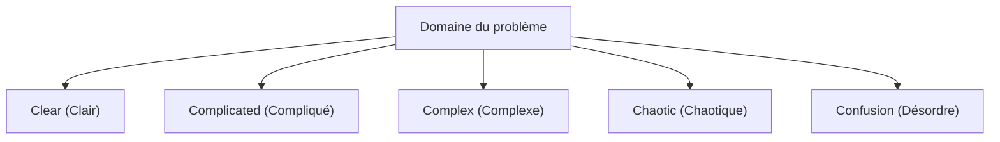

# Développement agile : l'ingénierie logicielle moderne qui embrasse le changement

Dans le développement logiciel moderne, il ne se passe pas un jour sans que l'on entende le mot « Agile ». Cependant, l'agile n'est pas qu'un simple mot à la mode, c'est un concept doté d'une philosophie profonde où se croisent l'ingénierie logicielle, la gestion de projet et le comportement organisationnel humain. Dans cet article, nous expliquerons en détail l'essence du développement agile à travers Scrum, Kanban et le Manifeste pour le développement agile de logiciels, en abordant à la fois le contexte historique et la perspective de la science de la complexité.

## 1. Contexte historique du développement logiciel et limites du taylorisme

Pour comprendre l'agile, il faut d'abord comprendre sa préhistoire. Au début du 20ème siècle, « l'organisation scientifique du travail (taylorisme) », proposée par Frederick Taylor, a révolutionné l'industrie manufacturière. Cette méthode, qui divise le travail des ouvriers et le gère comme un processus mesurable et prévisible, a donné d'excellents résultats dans la production en usine.

Dans les premiers jours du développement logiciel (des années 1970 aux années 1990), cette approche tayloriste a également été adoptée. C'est le « modèle en cascade (Waterfall) ». Cette méthode, qui fait avancer les étapes telles que la définition des exigences, la conception de base, la conception détaillée, l'implémentation, les tests et l'exploitation à sens unique comme une cascade, était facile à comprendre en tant qu'analogie de la construction ou de la fabrication.

Cependant, le logiciel est un « produit de la pensée » sans réalité physique. Il est courant que les exigences changent pendant la construction, et il n'est pas rare que ce que l'utilisateur voulait vraiment ne devienne clair qu'une fois le projet terminé. La « séparation de la planification et de l'exécution » tayloriste, dans le monde du logiciel en évolution rapide, a conduit à la tragédie de la rigidité et de retouches massives.

## 2. La naissance du Manifeste pour le développement agile de logiciels

En 2001, 17 experts en processus et méthodologies de développement logiciel se sont réunis dans une station de ski de Snowbird, dans l'Utah. En réaction aux processus lourds et rigides, ils ont discuté de méthodes de développement logiciel plus légères et adaptatives, et ont élaboré une déclaration. Il s'agit du « Manifeste pour le développement agile de logiciels (Agile Manifesto) ».

Le manifeste met en évidence les 4 valeurs suivantes :

*   **Les individus et leurs interactions** plus que les processus et les outils
*   **Des logiciels opérationnels** plus qu'une documentation exhaustive
*   **La collaboration avec les clients** plus que la négociation contractuelle
*   **L'adaptation au changement** plus que le suivi d'un plan

(Note : Bien qu'il y ait de la valeur dans les éléments sur la droite, nous valorisons davantage les éléments sur la gauche)

Cette déclaration a provoqué un changement de paradigme, affirmant que le développement logiciel implique intrinsèquement de « l'incertitude », et que s'adapter de manière flexible à des situations imprévisibles est ce qui compte le plus.

## 3. Les systèmes adaptatifs complexes (Complex Adaptive Systems) et le framework Cynefin

Pour expliquer scientifiquement l'efficacité de l'agile, la perspective de la science de la complexité est très utile. Le « Framework Cynefin (Cynefin Framework) », proposé par David Snowden, classe la nature des problèmes en 5 domaines.

*   **Clear (Clair)** : L'état où la relation de cause à effet est évidente pour tous. Les meilleures pratiques s'appliquent.
*   **Complicated (Compliqué)** : L'état qui peut être compris en analysant la relation de cause à effet. Les bonnes pratiques par des experts sont nécessaires.
*   **Complex (Complexe)** : L'état où la cause et l'effet ne sont connus qu'a posteriori. Les essais-erreurs et les pratiques émergentes (Emergent Practice) sont nécessaires.
*   **Chaotic (Chaotique)** : L'état où il n'existe pas de relation de cause à effet. Une réponse par une action rapide (Novel Practice) est nécessaire.

La majeure partie du développement logiciel appartient au domaine « Complex (Complexe) ». Comme de nombreuses variables interagissent, telles que les besoins du marché, les avancées technologiques et la communication au sein de l'équipe, une planification préalable minutieuse (en cascade) ne fonctionne pas. L'agile est un cadre pour s'adapter à ce domaine complexe en répétant des cycles courts de « Sonde (Probe) → Sens (Sense) → Réponse (Respond) ».

## 4. Scrum : un framework basé sur l'empirisme

Le framework le plus populaire pour la mise en pratique du développement agile est « Scrum ». Scrum vient de la mêlée au rugby, signifiant que l'équipe avance comme une seule unité.

Scrum repose sur les trois piliers de l'empirisme : la « Transparence (Transparency) », l'« Inspection (Inspection) » et l'« Adaptation (Adaptation) ».

### Les rôles Scrum (Accountabilities)

1.  **Product Owner (PO)** : Responsable de la maximisation de la valeur du produit. Décide de ce qu'il faut (What) créer.
2.  **Scrum Master (SM)** : Un leader-serviteur qui aide l'équipe pour s'assurer que Scrum est compris et mis en pratique correctement.
3.  **Développeurs (Developers)** : Un groupe d'experts qui crée réellement l'incrément (une partie du produit de valeur). Décide de comment (How) le créer.

### Les événements Scrum

Scrum utilise des blocs de temps appelés « Sprints » (généralement 1 à 4 semaines) comme unité de base pour réaliser les événements suivants :

*   **Planification du Sprint (Sprint Planning)** : Planifie ce qui sera accompli dans le sprint et comment.
*   **Mêlée quotidienne (Daily Scrum)** : 15 minutes par jour, les développeurs synchronisent leurs progrès et ajustent le plan.
*   **Revue de Sprint (Sprint Review)** : Présente les résultats du sprint (l'incrément) aux parties prenantes et recueille leurs retours.
*   **Rétrospective de Sprint (Sprint Retrospective)** : Réfléchit sur le processus et les relations de l'équipe, et décide des améliorations (Kaizen) pour le sprint suivant.

Scrum est un framework très léger, mais il est considéré comme « très difficile à maîtriser (Hard to master) ». En effet, parce qu'il exige l'auto-organisation et une grande discipline de la part de l'équipe, il a tendance à se heurter à la culture organisationnelle traditionnelle descendante (top-down).

## 5. Kanban : Optimisation du flux

Parallèlement à Scrum, « Kanban » est une méthode pratique agile importante. Elle est dérivée du « système Kanban » du système de production Toyota (TPS).

Le cœur de Kanban réside dans la « visualisation du flux de travail (workflow) » et la « limitation des travaux en cours (WIP : Work In Progress) ».

Alors que Scrum met l'accent sur les « itérations » à l'aide de blocs de temps (sprints), Kanban met l'accent sur le « flux » de travail. En limitant le WIP, on empêche l'introduction d'une quantité de travail qui dépasse la capacité de l'équipe et on rend les goulots d'étranglement visibles. Grâce à cela, basé sur la loi de Little (Lead Time = WIP / Throughput), on réalise une réduction des délais de livraison et une amélioration de la qualité.

## 6. L'excellence technique et XP (eXtreme Programming)

L'agile est souvent présenté comme une méthode de gestion, mais le véritable agile ne peut être atteint sans un soutien technique. C'est là que « XP (eXtreme Programming) » devient important.

De nombreuses pratiques considérées comme essentielles dans l'ingénierie logicielle moderne, telles que le développement piloté par les tests (TDD), la programmation en binôme, l'intégration continue (CI) et la refactorisation, ont été systématisées par XP.

Afin de « fournir continuellement des logiciels opérationnels », le code source doit toujours être propre et sûr face aux modifications (garanti par des tests). Même si vous vous contentez de faire tourner le processus Scrum tout en ignorant la dette technique (Technical Debt), la base de code finira par ne plus pouvoir supporter le rythme du changement, et le projet s'effondrera.

## Résumé : Embrasser le changement

Le développement de logiciels agiles ne s'achève pas en introduisant simplement un processus ou un outil spécifique. C'est un état d'esprit pour respecter l'humanité, apprendre de façon continue, et continuer à s'adapter dans un monde incertain et en évolution rapide.

Faire face au « système complexe » des changements du marché, de l'évolution technologique, et surtout de la créativité humaine, et co-évoluer avec eux, plutôt que d'essayer de les contrôler. C'est la principale raison pour laquelle l'agile est indispensable dans l'ingénierie logicielle moderne.
