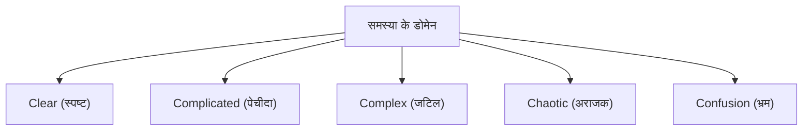

# एजाइल डेवलपमेंट: बदलाव को अपनाने वाली आधुनिक सॉफ्टवेयर इंजीनियरिंग

आधुनिक सॉफ्टवेयर डेवलपमेंट में ऐसा कोई दिन नहीं जाता जब हम "एजाइल (Agile)" शब्द न सुनें। हालाँकि, एजाइल केवल एक बज़वर्ड नहीं है; यह एक अवधारणा है जिसका एक गहरा दर्शन है जहाँ सॉफ्टवेयर इंजीनियरिंग, प्रोजेक्ट मैनेजमेंट और संगठनात्मक व्यवहार एक साथ मिलते हैं। इस लेख में, हम एजाइल डेवलपमेंट के सार के बारे में विस्तार से बताएंगे - स्क्रम, कानबन और एजाइल सॉफ्टवेयर डेवलपमेंट घोषणापत्र - इसके ऐतिहासिक संदर्भ से लेकर जटिल प्रणालियों के विज्ञान (complex systems science) के परिप्रेक्ष्य तक।

## 1. सॉफ्टवेयर डेवलपमेंट की ऐतिहासिक पृष्ठभूमि और टेलरवाद की सीमाएँ

एजाइल को समझने के लिए, हमें पहले इसके पूर्व-इतिहास को समझना होगा। 20वीं सदी की शुरुआत में फ्रेडरिक टेलर द्वारा प्रस्तावित "वैज्ञानिक प्रबंधन (टेलरवाद)" ने विनिर्माण उद्योग में क्रांति ला दी। कारखाने के उत्पादन में इस पद्धति ने बहुत अच्छे परिणाम दिए, जिसने श्रमिकों के कार्यों को मापने योग्य और अनुमानित प्रक्रियाओं के रूप में उप-विभाजित और प्रबंधित किया।

प्रारंभिक सॉफ्टवेयर डेवलपमेंट (1970 से 1990 के दशक) में भी इसी टेलरवादी दृष्टिकोण को अपनाया गया था। यह "वॉटरफॉल मॉडल" है। यह विधि, जो आवश्यकताओं की परिभाषा, बुनियादी डिज़ाइन, विस्तृत डिज़ाइन, कार्यान्वयन, परीक्षण और संचालन जैसे चरणों को एकतरफ़ा तरीके से आगे बढ़ाती है जैसे कि कोई झरना बह रहा हो, निर्माण और विनिर्माण उद्योगों के लिए एक सादृश्य के रूप में समझना आसान था।

हालाँकि, सॉफ्टवेयर "विचार का एक उत्पाद" है जिसकी कोई भौतिक इकाई नहीं होती है। निर्माण के दौरान आवश्यकताओं का बदलना आम बात है, और यह असामान्य नहीं है कि उत्पाद के पूरा होने के बाद ही यह स्पष्ट होता है कि उपयोगकर्ता वास्तव में क्या चाहते थे। तेजी से बदलते सॉफ्टवेयर की दुनिया में, टेलरवाद के "योजना और कार्यान्वयन के पृथक्करण" के परिणामस्वरूप कठोरता और बड़े पैमाने पर काम को फिर से करने की त्रासदी हुई।

## 2. एजाइल सॉफ्टवेयर डेवलपमेंट घोषणापत्र का जन्म

2001 में, 17 सॉफ्टवेयर डेवलपमेंट प्रक्रिया और कार्यप्रणाली विशेषज्ञ स्नोबर्ड, यूटा में एक स्की रिसॉर्ट में एकत्र हुए। भारी-भरकम प्रक्रियाओं के खिलाफ पीछे हटते हुए, उन्होंने अधिक हल्की और अधिक अनुकूलनीय सॉफ्टवेयर डेवलपमेंट विधियों पर चर्चा की और एक घोषणापत्र संकलित किया। यह "एजाइल सॉफ्टवेयर डेवलपमेंट घोषणापत्र (Agile Manifesto)" है।

यह घोषणापत्र निम्नलिखित चार मूल्यों पर जोर देता है:

*   प्रक्रियाओं और टूल से अधिक **व्यक्तियों और संवाद को**
*   विस्तृत दस्तावेज़ों से अधिक **काम करने वाले सॉफ़्टवेयर को**
*   अनुबंध की बातचीत से अधिक **ग्राहक सहयोग को**
*   योजना का पालन करने से अधिक **बदलाव पर प्रतिक्रिया देने को**

(ध्यान दें: हालांकि पहले बताई गई बातों का भी अपना मूल्य है, लेकिन हम बाद में बताई गई (बोल्ड) बातों को अधिक महत्व देते हैं।)

इस घोषणापत्र ने एक प्रतिमान विस्थापन (paradigm shift) लाया: सॉफ्टवेयर डेवलपमेंट स्वाभाविक रूप से "अनिश्चितता" के साथ जुड़ा हुआ है, और अप्रत्याशित स्थितियों के अनुकूल होना सबसे महत्वपूर्ण बात है।

## 3. कॉम्प्लेक्स अडैप्टिव सिस्टम्स (Complex Adaptive Systems) और सिनेफिन फ्रेमवर्क (Cynefin Framework)

एजाइल की प्रभावशीलता को वैज्ञानिक रूप से समझाने में कॉम्प्लेक्स सिस्टम्स साइंस का परिप्रेक्ष्य बहुत उपयोगी है। डेविड स्नोडेन द्वारा प्रस्तावित "सिनेफिन फ्रेमवर्क (Cynefin Framework)" समस्याओं की प्रकृति को 5 डोमेन में वर्गीकृत करता है।

*   **Clear (स्पष्ट)**: एक ऐसी स्थिति जहां कारण और प्रभाव के बीच का संबंध हर किसी को स्पष्ट होता है। इसमें बेस्ट प्रैक्टिस (Best Practices) काम आती हैं।
*   **Complicated (पेचीदा)**: एक ऐसी स्थिति जिसे कारण और प्रभाव के बीच के संबंध का विश्लेषण करके समझा जा सकता है। इसके लिए विशेषज्ञों द्वारा गुड प्रैक्टिस (Good Practices) की आवश्यकता होती है।
*   **Complex (जटिल)**: एक ऐसी स्थिति जहां कारण और प्रभाव का पता केवल पूर्वव्यापी रूप से (बाद में) लगाया जा सकता है। इसके लिए परीक्षण और त्रुटि (trial and error) तथा आकस्मिक अभ्यास (Emergent Practice) की आवश्यकता होती है।
*   **Chaotic (अराजक)**: ऐसी स्थिति जहां कारण और प्रभाव के बीच कोई कार्य-कारण संबंध मौजूद नहीं होता है। इसके लिए त्वरित कार्रवाई (Novel Practice) की आवश्यकता होती है।

अधिकांश सॉफ्टवेयर डेवलपमेंट "Complex (जटिल)" डोमेन में आते हैं। चूँकि बाज़ार की ज़रूरतें, तकनीकी प्रगति, और टीम के भीतर संचार जैसे कई चर (variables) एक-दूसरे के साथ परस्पर क्रिया करते हैं, इसलिए सावधानीपूर्वक अग्रिम योजना (वॉटरफॉल) काम नहीं करती है। एजाइल छोटे चक्रों में "जांच (Probe) → महसूस करना (Sense) → प्रतिक्रिया (Respond)" को दोहराकर इस जटिल डोमेन को अपनाने के लिए एक ढांचा है।

## 4. स्क्रम (Scrum): अनुभववाद पर आधारित एक फ्रेमवर्क

एजाइल डेवलपमेंट का अभ्यास करने के लिए सबसे लोकप्रिय फ्रेमवर्क "स्क्रम" है। स्क्रम रग्बी में स्क्रम से आता है और इसका अर्थ है कि टीम एक साथ मिलकर आगे बढ़ती है।

स्क्रम अनुभववाद (Empiricism) के तीन स्तंभों पर समर्थित है: "पारदर्शिता (Transparency)", "निरीक्षण (Inspection)", और "अनुकूलन (Adaptation)"।

### स्क्रम की भूमिकाएँ (Accountabilities)

1.  **प्रोडक्ट ओनर (PO)**: उत्पाद के मूल्य को अधिकतम करने की जिम्मेदारी रखता है। यह तय करता है कि क्या (What) बनाना है।
2.  **स्क्रम मास्टर (SM)**: एक सर्वेंट-लीडर जो टीम की मदद करता है ताकि यह सुनिश्चित हो सके कि स्क्रम को सही ढंग से समझा और अभ्यास किया जाए।
3.  **डेवलपर्स (Developers)**: पेशेवरों का एक समूह जो वास्तव में इंक्रीमेंट (मूल्यवान उत्पाद का एक हिस्सा) बनाते हैं। वे तय करते हैं कि इसे कैसे (How) बनाना है।

### स्क्रम के इवेंट्स (Events)

स्क्रम "स्प्रिंट" नामक टाइमबॉक्स (आमतौर पर 1-4 सप्ताह) को मूल इकाई के रूप में उपयोग करके निम्नलिखित इवेंट आयोजित करता है:

*   **स्प्रिंट प्लानिंग (Sprint Planning)**: योजना बनाना कि स्प्रिंट में क्या और कैसे हासिल करना है।
*   **डेली स्क्रम (Daily Scrum)**: प्रतिदिन 15 मिनट के लिए, डेवलपर्स प्रगति को सिंक करते हैं और अपनी योजनाओं को समायोजित करते हैं।
*   **स्प्रिंट रिव्यू (Sprint Review)**: हितधारकों (stakeholders) को स्प्रिंट के परिणाम (इंक्रीमेंट) प्रस्तुत करना और प्रतिक्रिया प्राप्त करना।
*   **स्प्रिंट रेट्रोस्पेक्टिव (Sprint Retrospective)**: टीम की प्रक्रियाओं और संबंधों पर विचार करना और अगले स्प्रिंट के लिए सुधारों (Kaizen) का निर्णय लेना।

हालांकि स्क्रम एक बहुत ही हल्का फ्रेमवर्क है, लेकिन इसे "महारत हासिल करना कठिन (Hard to master)" माना जाता है। ऐसा इसलिए है क्योंकि इसे टीम के स्व-संगठन (self-organization) और उच्च अनुशासन की आवश्यकता होती है, जो अक्सर पारंपरिक टॉप-डाउन संगठनात्मक संस्कृति के साथ टकराता है।

## 5. कानबन (Kanban): फ्लो का अनुकूलन

स्क्रम के साथ-साथ एक और महत्वपूर्ण एजाइल अभ्यास "कानबन" है। यह टोयोटा प्रोडक्शन सिस्टम (TPS) के "कानबन सिस्टम" से लिया गया है।

कानबन का मूल "वर्कफ़्लो का विज़ुअलाइज़ेशन (Visualization of workflow)" और "WIP (Work In Progress: कार्य प्रगति पर) को सीमित करने" में निहित है।

जबकि स्क्रम टाइमबॉक्स (स्प्रिंट) के माध्यम से "पुनरावृत्ति (Iteration)" पर जोर देता है, कानबन काम के "प्रवाह (Flow)" पर जोर देता है। WIP को सीमित करके, यह टीम की क्षमता से अधिक काम को शुरू होने से रोकता है और बाधाओं (bottlenecks) को उजागर करता है। नतीजतन, लिटिल के नियम (Lead Time = WIP / Throughput) के आधार पर, यह लीड टाइम को कम करता है और गुणवत्ता में सुधार करता है।

## 6. तकनीकी उत्कृष्टता और XP (एक्सट्रीम प्रोग्रामिंग)

एजाइल को अक्सर एक प्रबंधन तकनीक के रूप में बताया जाता है, लेकिन तकनीकी समर्थन के बिना वास्तविक एजाइल प्राप्त नहीं किया जा सकता है। यहीं पर "XP (एक्सट्रीम प्रोग्रामिंग)" महत्वपूर्ण हो जाता है।

टेस्ट-ड्रिवेन डेवलपमेंट (TDD), पेयर प्रोग्रामिंग, कंटीन्यूअस इंटीग्रेशन (CI) और रिफैक्टरिंग जैसी कई प्रथाएं, जो आधुनिक सॉफ्टवेयर इंजीनियरिंग में आवश्यक मानी जाती हैं, XP द्वारा व्यवस्थित की गई थीं।

लगातार "काम करने वाला सॉफ्टवेयर प्रदान करने" के लिए, सोर्स कोड हमेशा साफ (clean) और परिवर्तनों के लिए सुरक्षित (परीक्षण द्वारा गारंटीकृत) होना चाहिए। यदि आप तकनीकी ऋण (Technical Debt) को नजरअंदाज करते हुए केवल स्क्रम प्रक्रिया को चलाते हैं, तो कोडबेस अंततः परिवर्तन की गति का सामना करने में असमर्थ होगा और विफल हो जाएगा।

## निष्कर्ष: बदलाव को अपनाना

एजाइल सॉफ्टवेयर डेवलपमेंट एक ऐसी चीज नहीं है जो किसी विशिष्ट प्रक्रिया या टूल को लागू करने से पूरी हो जाती है। अनिश्चित और तेजी से बदलती दुनिया में मानवीय प्रकृति का सम्मान करने, लगातार सीखने और अनुकूलन करने के लिए यह एक मानसिकता (mindset) है।

बाज़ार में होने वाले बदलावों, तकनीकी प्रगति और सबसे बढ़कर मानव रचनात्मकता की "जटिल प्रणाली" का सामना करना, और उन्हें नियंत्रित करने की कोशिश करने के बजाय उनके साथ मिलकर विकसित होना। यही सबसे बड़ा कारण है कि आधुनिक सॉफ्टवेयर इंजीनियरिंग में एजाइल अपरिहार्य है।
