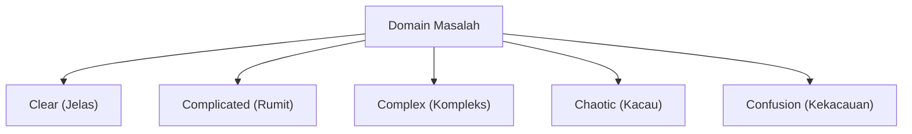
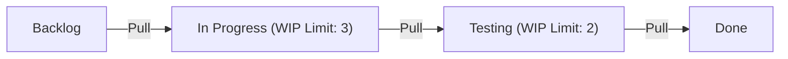

# Pengembangan Agile: Rekayasa Perangkat Lunak Modern yang Merangkul Perubahan

Dalam pengembangan perangkat lunak modern, tidak ada hari tanpa mendengar kata 'Agile'. Namun, Agile bukan sekadar kata kunci (buzzword), melainkan sebuah konsep dengan filosofi mendalam di mana rekayasa perangkat lunak, manajemen proyek, dan perilaku organisasi manusia bersinggungan. Pada artikel ini, kita akan membahas secara rinci esensi pengembangan Agile, yaitu Scrum, Kanban, dan Manifesto Pengembangan Perangkat Lunak Agile, dari latar belakang sejarahnya hingga perspektif sains sistem kompleks.

## 1. Latar Belakang Sejarah Pengembangan Perangkat Lunak dan Keterbatasan Taylorisme

Untuk memahami Agile, pertama-tama kita perlu memahami prasejarahnya. Pada awal abad ke-20, 'Manajemen Ilmiah (Taylorisme)' yang diusulkan oleh Frederick Taylor membawa revolusi ke industri manufaktur. Membagi pekerjaan pekerja menjadi tugas-tugas kecil dan mengelolanya sebagai proses yang dapat diukur dan diprediksi, metode ini mencapai hasil luar biasa dalam produksi pabrik.

Dalam pengembangan perangkat lunak awal (1970-an hingga 1990-an), pendekatan Tayloristik ini juga diadopsi. Itulah 'Model Waterfall'. Metode di mana proses seperti definisi persyaratan, desain dasar, desain rinci, implementasi, pengujian, dan operasi dilanjutkan dalam satu arah seperti air terjun yang jatuh, ini mudah dipahami sebagai analogi untuk industri konstruksi atau manufaktur.

Namun, perangkat lunak adalah 'produk pemikiran' yang tidak memiliki entitas fisik. Adalah hal biasa jika persyaratan berubah selama konstruksi, dan tidak jarang apa yang benar-benar diinginkan pengguna hanya menjadi jelas setelah produk selesai. Di dunia perangkat lunak yang cepat berubah, 'pemisahan perencanaan dan pelaksanaan' ala Taylorisme mengakibatkan tragedi berupa kekakuan dan pengulangan pekerjaan yang besar-besaran.

## 2. Kelahiran Manifesto Pengembangan Perangkat Lunak Agile

Pada tahun 2001, 17 pakar metodologi dan proses pengembangan perangkat lunak berkumpul di resor ski Snowbird di Utah. Karena penolakan terhadap proses yang berat dan ekstensif, mereka mendiskusikan metode pengembangan perangkat lunak yang lebih ringan dan adaptif, serta menyusun sebuah manifesto. Inilah 'Manifesto Pengembangan Perangkat Lunak Agile (Agile Manifesto)'.

Manifesto tersebut menekankan pada 4 nilai berikut:

*   **Individu dan interaksi** lebih dari proses dan alat
*   **Perangkat lunak yang berfungsi** lebih dari dokumentasi yang menyeluruh
*   **Kolaborasi dengan pelanggan** lebih dari negosiasi kontrak
*   **Merespons perubahan** lebih dari mengikuti rencana

(Catatan: Meskipun hal-hal di sebelah kanan memiliki nilai, kami lebih menghargai hal-hal di sebelah kiri)

Manifesto ini membawa perubahan paradigma bahwa pengembangan perangkat lunak secara inheren melibatkan 'ketidakpastian', dan bahwa adaptasi yang fleksibel terhadap situasi yang tidak terduga adalah hal yang paling penting.

## 3. Sistem Adaptif Kompleks (Complex Adaptive Systems) dan Framework Cynefin

Dalam menjelaskan efektivitas Agile secara ilmiah, perspektif sains sistem kompleks sangat berguna. 'Framework Cynefin (Cynefin Framework)' yang diusulkan oleh David Snowden, mengklasifikasikan sifat masalah ke dalam 5 domain.

*   **Clear (Jelas)**: Keadaan di mana hubungan sebab dan akibat diketahui oleh semua orang. Praktik terbaik (best practice) berlaku.
*   **Complicated (Rumit)**: Keadaan di mana hubungan sebab dan akibat dapat dipahami melalui analisis. Memerlukan praktik yang baik (good practice) dari para ahli.
*   **Complex (Kompleks)**: Keadaan di mana sebab dan akibat hanya dapat diketahui setelah kejadian. Memerlukan uji coba (trial and error) dan praktik yang muncul (Emergent Practice).
*   **Chaotic (Kacau)**: Keadaan di mana tidak ada hubungan sebab akibat. Membutuhkan tindakan cepat (Novel Practice).

Sebagian besar pengembangan perangkat lunak termasuk dalam domain 'Complex (Kompleks)'. Karena banyak variabel, seperti kebutuhan pasar, kemajuan teknologi, dan komunikasi dalam tim yang saling memengaruhi, perencanaan terperinci sebelumnya (Waterfall) tidak akan berhasil. Agile adalah sebuah framework untuk beradaptasi dengan domain kompleks ini dengan mengulangi 'Probe (Uji) -> Sense (Rasakan) -> Respond (Tanggapi)' dalam siklus yang pendek.

## 4. Scrum: Framework Berbasis Empirisme

Framework paling populer untuk mempraktikkan pengembangan Agile adalah 'Scrum'. Scrum berasal dari formasi scrum dalam rugby, yang berarti tim bergerak maju sebagai satu kesatuan.

Scrum didukung oleh 3 pilar empirisme: 'Transparansi (Transparency)', 'Inspeksi (Inspection)', dan 'Adaptasi (Adaptation)'.

### Peran dalam Scrum (Accountabilities)

1.  **Product Owner (PO)**: Bertanggung jawab untuk memaksimalkan nilai produk. Menentukan apa (What) yang akan dibuat.
2.  **Scrum Master (SM)**: Seorang pemimpin yang melayani (servant leader) yang membantu tim agar Scrum dipahami dan dipraktikkan dengan benar.
3.  **Developers (Pengembang)**: Sekelompok ahli yang benar-benar membuat Increment (bagian dari produk yang bernilai). Menentukan bagaimana (How) membuatnya.

### Acara Scrum

Scrum menggunakan batasan waktu (timebox) yang disebut 'Sprint' (biasanya 1 hingga 4 minggu) sebagai unit dasar, dan menjalankan acara-acara berikut:

*   **Sprint Planning**: Merencanakan apa dan bagaimana hal itu akan dicapai dalam sprint.
*   **Daily Scrum**: 15 menit setiap hari, pengembang menyinkronkan kemajuan dan menyesuaikan rencana.
*   **Sprint Review**: Mempresentasikan hasil dari sprint (Increment) kepada pemangku kepentingan untuk mendapatkan umpan balik.
*   **Sprint Retrospective**: Meninjau kembali proses dan hubungan tim, serta memutuskan langkah-langkah perbaikan (Kaizen) untuk sprint berikutnya.

Scrum adalah kerangka kerja yang sangat ringan, tetapi dikatakan 'sangat sulit untuk dikuasai (Hard to master)'. Ini karena ia menuntut pengorganisasian mandiri dan disiplin tim yang tinggi, yang seringkali berbenturan dengan budaya organisasi top-down tradisional.

## 5. Kanban: Optimalisasi Alur

Penting bersama Scrum, metode praktik Agile lainnya adalah 'Kanban'. Ini berasal dari 'Sistem Kanban' pada Sistem Produksi Toyota (TPS).

Inti dari Kanban adalah 'visualisasi alur kerja (workflow)' dan 'pembatasan WIP (Work In Progress: pekerjaan dalam proses)'.

Sementara Scrum menekankan 'iterasi' melalui timebox (Sprint), Kanban menekankan 'alur (flow)' pekerjaan. Dengan membatasi WIP, Kanban mencegah masuknya pekerjaan yang melebihi kapasitas tim dan menyoroti bottleneck (hambatan). Berdasarkan Hukum Little (Lead Time = WIP / Throughput), ini mewujudkan pengurangan lead time dan peningkatan kualitas.

## 6. Keunggulan Teknis dan XP (Extreme Programming)

Agile sering dibicarakan sebagai teknik manajemen, namun Agile sejati tidak dapat diwujudkan tanpa dukungan teknis. Di sinilah 'XP (Extreme Programming)' menjadi penting.

Banyak praktik yang dianggap penting dalam rekayasa perangkat lunak modern, seperti Test-Driven Development (TDD), Pair Programming, Continuous Integration (CI), dan Refactoring, disistematisasikan oleh XP.

Untuk 'secara terus-menerus memberikan perangkat lunak yang berfungsi', kode sumber (source code) harus selalu bersih dan aman terhadap perubahan (dijamin dengan pengujian). Bahkan jika proses Scrum dijalankan sementara technical debt (utang teknis) dibiarkan, basis kode pada akhirnya tidak akan mampu bertahan terhadap kecepatan perubahan dan akan gagal.

## Kesimpulan: Merangkul Perubahan

Pengembangan perangkat lunak Agile bukanlah sesuatu yang selesai hanya dengan mengadopsi proses atau alat tertentu. Itu adalah sebuah pola pikir (mindset) untuk menghormati nilai kemanusiaan, terus belajar, dan beradaptasi di dunia yang penuh ketidakpastian dan perubahan yang cepat.

Berhadapan dengan 'sistem kompleks' perubahan pasar, evolusi teknologi, dan yang terpenting kreativitas manusia, dan bukan mencoba mengendalikannya, melainkan berevolusi bersamanya. Itulah alasan terbesar mengapa Agile sangat diperlukan dalam rekayasa perangkat lunak modern.
