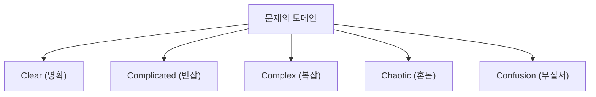
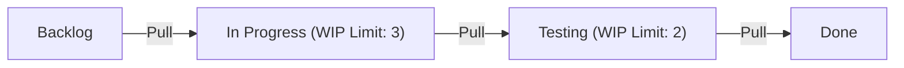

# 애자일 개발: 변화를 수용하는 현대 소프트웨어 엔지니어링

현대 소프트웨어 개발에서 '애자일(Agile)'이라는 단어를 듣지 않는 날이 없습니다. 하지만 애자일은 단순한 유행어가 아니라 소프트웨어 공학, 프로젝트 관리, 그리고 인간의 조직 행동학이 교차하는 깊은 철학을 가진 개념입니다. 이 글에서는 애자일 개발의 정수인 스크럼, 칸반, 그리고 애자일 소프트웨어 개발 선언에 대해 역사적 배경부터 복잡계 과학의 관점까지 곁들여 상세히 해설합니다.

## 1. 소프트웨어 개발의 역사적 배경과 테일러주의의 한계

애자일을 이해하려면 먼저 그 전사를 이해해야 합니다. 20세기 초, 프레더릭 테일러가 제창한 '과학적 관리법(테일러주의)'은 제조업에 혁명을 일으켰습니다. 노동자의 작업을 세분화하고, 측정 가능하고 예측 가능한 프로세스로 관리하는 이 방식은 공장 생산에서 절대적인 성과를 거두었습니다.

초기 소프트웨어 개발(1970년대~1990년대)에서도 이 테일러주의적인 접근 방식이 채택되었습니다. 그것이 바로 '워터폴(폭포수) 모델'입니다. 요구사항 정의, 기본 설계, 상세 설계, 구현, 테스트, 운영이라는 공정을 폭포수가 떨어지듯 일방통행으로 진행하는 이 방식은 건설업이나 제조업의 비유로서는 이해하기 쉬운 것이었습니다.

하지만 소프트웨어는 물리적인 실체가 없는 '사고의 산물'입니다. 구축 중에 요구사항이 변하는 것은 당연하며, 완성하고 나서야 비로소 사용자가 진정으로 원했던 것이 밝혀지는 일도 드물지 않습니다. 테일러주의적인 '계획과 실행의 분리'는 변화가 극심한 소프트웨어 세계에서는 경직화와 막대한 재작업이라는 비극을 낳게 되었습니다.

## 2. 애자일 소프트웨어 개발 선언의 탄생

2001년, 유타주 스노우버드의 스키 리조트에 17명의 소프트웨어 개발 프로세스 및 방법론 전문가들이 모였습니다. 이들은 무겁고 방대한 프로세스에 대한 반발에서 출발하여 더 가볍고 적응력이 뛰어난 소프트웨어 개발 방식에 대해 논의했고, 하나의 선언문을 완성했습니다. 이것이 바로 '애자일 소프트웨어 개발 선언(Agile Manifesto)'입니다.

선언문은 다음 네 가지 가치관을 강조하고 있습니다:

* 프로세스나 도구보다 **개인과 상호작용을**
* 포괄적인 문서보다 **작동하는 소프트웨어를**
* 계약 협상보다 **고객과의 협력을**
* 계획을 따르기보다 **변화에 대응하기를**

(참고: 왼쪽의 항목에 가치가 있음을 인정하면서도, 우리는 오른쪽 항목에 더 높은 가치를 둔다)

이 선언은 소프트웨어 개발이 본질적으로 '불확실성'을 수반하는 것이며, 예측 불가능한 사태에 유연하게 적응해 나가는 것이야말로 중요하다는 패러다임 전환을 가져왔습니다.

## 3. 복잡적응계(Complex Adaptive Systems)와 커네빈 프레임워크

애자일의 유효성을 과학적으로 설명할 때 복잡계 과학의 관점은 매우 유용합니다. 데이비드 스노든이 제창한 '커네빈 프레임워크(Cynefin Framework)'는 문제의 성질을 5가지 도메인으로 분류합니다.

* **Clear(명확)**: 원인과 결과의 관계를 누구나 알 수 있는 상태. 모범 사례가 통용됩니다.
* **Complicated(번잡)**: 원인과 결과의 관계를 분석함으로써 이해할 수 있는 상태. 전문가의 좋은 사례가 필요합니다.
* **Complex(복잡)**: 원인과 결과는 사후적으로만 알 수 있는 상태. 시행착오와 창발적인 실천(Emergent Practice)이 필요합니다.
* **Chaotic(혼돈)**: 원인과 결과의 인과관계가 존재하지 않는 상태. 신속한 행동을 통한 대응(Novel Practice)이 필요합니다.

소프트웨어 개발의 대부분은 'Complex(복잡)' 도메인에 속합니다. 시장의 니즈, 기술의 진보, 팀 내 커뮤니케이션 등 다수의 변수가 상호작용하기 때문에 사전의 면밀한 계획(워터폴)은 작동하지 않습니다. 애자일은 짧은 주기의 '탐색(Probe) → 감지(Sense) → 대응(Respond)'을 반복함으로써 이 복잡한 도메인에 적응하기 위한 프레임워크인 것입니다.

## 4. 스크럼(Scrum): 경험주의에 기반한 프레임워크

애자일 개발을 실천하기 위한 가장 대중적인 프레임워크가 '스크럼'입니다. 스크럼은 럭비의 스크럼에서 유래했으며, 팀이 하나가 되어 전진하는 것을 의미합니다.

스크럼은 '투명성(Transparency)', '검사(Inspection)', '적응(Adaptation)'이라는 3가지 경험주의 기둥이 지탱하고 있습니다.

### 스크럼의 책임(Accountabilities)

1. **프로덕트 오너(PO)**: 프로덕트의 가치를 극대화할 책임을 가집니다. 무엇을(What) 만들지 결정합니다.
2. **스크럼 마스터(SM)**: 스크럼을 올바르게 이해하고 실천할 수 있도록 팀을 지원하는 서번트 리더입니다.
3. **개발자(Developers)**: 실제로 인크리먼트(가치 있는 제품의 일부)를 생성하는 전문가 집단입니다. 어떻게(How) 만들지 결정합니다.

### 스크럼의 이벤트

스크럼은 '스프린트'라고 불리는 타임박스(통상 1~4주)를 기본 단위로 하여 다음 이벤트를 실시합니다.

* **스프린트 계획**: 스프린트에서 무엇을, 어떻게 달성할지 계획합니다.
* **데일리 스크럼**: 매일 15분 동안 개발자들이 진척 상황을 동기화하고 계획을 조정합니다.
* **스프린트 리뷰**: 스프린트의 결과물(인크리먼트)을 이해관계자에게 제시하고 피드백을 얻습니다.
* **스프린트 회고**: 팀의 프로세스나 관계성을 되돌아보고, 다음 스프린트를 향한 개선책(카이젠)을 결정합니다.

스크럼은 매우 가벼운 프레임워크지만 '실천하기는 매우 어렵다(Hard to master)'고 알려져 있습니다. 팀의 자가 조직화와 높은 규율을 요구하기 때문에 기존의 하향식 조직 문화와 충돌하기 쉽기 때문입니다.

## 5. 칸반(Kanban): 흐름의 최적화

스크럼과 함께 중요한 애자일 실천 기법이 '칸반'입니다. 이는 도요타 생산 방식(TPS)의 '칸반 방식'에서 파생된 것입니다.

칸반의 핵심은 '워크플로우의 시각화'와 'WIP(Work In Progress: 진행 중인 작업) 제한'에 있습니다.

스크럼이 타임박스(스프린트)에 의한 '반복'을 중시하는 반면, 칸반은 작업의 '흐름(Flow)'을 중시합니다. WIP를 제한함으로써 팀의 수용 능력을 초과한 작업 투입을 방지하고 병목 현상을 가시화합니다. 이를 통해 리틀의 법칙(Lead Time = WIP / Throughput)에 따라 리드 타임 단축과 품질 향상을 실현합니다.

## 6. 기술적 탁월성과 XP(익스트림 프로그래밍)

애자일은 경영/관리 기법으로 이야기되는 경우가 많지만, 기술적인 뒷받침 없이는 진정한 애자일을 실현할 수 없습니다. 여기서 중요해지는 것이 'XP(익스트림 프로그래밍)'입니다.

테스트 주도 개발(TDD), 페어 프로그래밍, 지속적 통합(CI), 리팩터링 등 현대 소프트웨어 엔지니어링에서 필수적인 프랙티스의 대부분은 XP에 의해 체계화되었습니다.

'작동하는 소프트웨어를 지속적으로 제공'하기 위해서는 소스 코드가 항상 깔끔해야 하며 변경에 안전(테스트로 보장됨)해야 합니다. 기술적 부채(Technical Debt)를 방치한 채 스크럼의 프로세스만 돌려도 결국 변화의 속도를 코드 베이스가 견디지 못하고 파탄에 이르게 됩니다.

## 결론: 변화를 수용하라

애자일 소프트웨어 개발은 특정 프로세스나 도구를 도입한다고 완성되는 것이 아닙니다. 그것은 불확실하고 변화가 심한 세계에서 인간성을 존중하고, 지속적으로 학습하며, 계속해서 적응해 나가기 위한 마음가짐입니다.

시장의 변화, 기술의 진화, 그리고 무엇보다 인간의 창조성이라는 '복잡계'와 마주하여 그것들을 통제하려 하지 않고 함께 진화해 나가는 것. 그것이야말로 현대 소프트웨어 엔지니어링에서 애자일이 필수불가결한 가장 큰 이유입니다.
