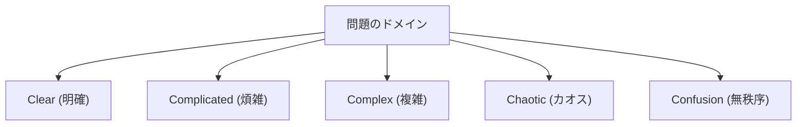

# アジャイル開発：変化を抱擁する現代のソフトウェアエンジニアリング

現代のソフトウェア開発において、「アジャイル（Agile）」という言葉を聞かない日はありません。しかし、アジャイルとは単なるバズワードではなく、ソフトウェア工学、プロジェクトマネジメント、そして人間の組織行動学が交差する深い哲学を持った概念です。本記事では、アジャイル開発の真髄であるスクラム、カンバン、そしてアジャイルソフトウェア開発宣言について、その歴史的背景から複雑系科学の視点まで交えながら詳細に解説します。

## 1. ソフトウェア開発の歴史的背景とテイラー主義の限界

アジャイルを理解するためには、まずその前史を理解する必要があります。20世紀初頭、フレデリック・テイラーによって提唱された「科学的管理法（テイラー主義）」は、製造業に革命をもたらしました。労働者の作業を細分化し、計測可能で予測可能なプロセスとして管理するこの手法は、工場生産において絶大な成果を上げました。

初期のソフトウェア開発（1970年代〜1990年代）においても、このテイラー主義的なアプローチが採用されました。それが「ウォーターフォール・モデル」です。要件定義、基本設計、詳細設計、実装、テスト、運用といった工程を滝が流れ落ちるように一方通行で進めるこの手法は、建設業や製造業のアナロジーとしては理解しやすいものでした。

しかし、ソフトウェアは物理的な実体を持たない「思考の産物」です。構築中に要件が変化するのは常であり、完成して初めてユーザーが真に求めていたものが明らかになることも珍しくありません。テイラー主義的な「計画と実行の分離」は、変化の激しいソフトウェアの世界では、硬直化と莫大な手戻りという悲劇を生み出すことになりました。

## 2. アジャイルソフトウェア開発宣言の誕生

2001年、ユタ州スノーバードのスキーリゾートに、17人のソフトウェア開発のプロセスや方法論の専門家が集まりました。彼らは、重厚長大なプロセスへの反発から、より軽量で適応力の高いソフトウェア開発手法について議論し、ひとつの宣言をまとめ上げました。これが「アジャイルソフトウェア開発宣言（Agile Manifesto）」です。

宣言は以下の4つの価値観を強調しています：

*   プロセスやツールよりも**個人と対話を**
*   包括的なドキュメントよりも**動くソフトウェアを**
*   契約交渉よりも**顧客との協調を**
*   計画に従うことよりも**変化への対応を**

（注：左記の事柄に価値があることを認めながらも、私たちは右記の事柄により価値をおく）

この宣言は、ソフトウェア開発が本質的に「不確実性」を伴うものであり、予測不可能な事態に対して柔軟に適応していくことこそが重要であるという、パラダイムシフトをもたらしました。

## 3. 複雑適応系（Complex Adaptive Systems）とクネビン・フレームワーク

アジャイルの有効性を科学的に説明する上で、複雑系科学の視点は非常に有用です。デイヴィッド・スノードンによって提唱された「クネビン・フレームワーク（Cynefin Framework）」は、問題の性質を5つのドメインに分類します。

*   **Clear（明確）**: 原因と結果の関係が誰にでも分かる状態。ベストプラクティスが通用します。
*   **Complicated（煩雑）**: 原因と結果の関係を分析することで理解できる状態。専門家によるグッドプラクティスが必要です。
*   **Complex（複雑）**: 原因と結果は事後的にしか分からない状態。試行錯誤と創発的な実践（Emergent Practice）が必要です。
*   **Chaotic（カオス）**: 原因と結果の因果関係が存在しない状態。迅速な行動による対応（Novel Practice）が必要です。

ソフトウェア開発の多くは「Complex（複雑）」なドメインに属します。市場のニーズ、技術の進歩、チーム内のコミュニケーションなど、多数の変数が相互に影響し合うため、事前の綿密な計画（ウォーターフォール）は機能しません。アジャイルは、短いサイクルでの「プローブ（試行）→ センス（感知）→ レスポンド（対応）」を繰り返すことで、この複雑なドメインに適応するためのフレームワークなのです。

## 4. スクラム（Scrum）：経験主義に基づくフレームワーク

アジャイル開発を実践するための最もポピュラーなフレームワークが「スクラム」です。スクラムは、ラグビーのスクラムに由来し、チームが一体となって前進することを意味しています。

スクラムは「透明性（Transparency）」「検査（Inspection）」「適応（Adaptation）」という3つの経験主義の柱に支えられています。

### スクラムの役割（Accountabilities）

1.  **プロダクトオーナー（PO）**: プロダクトの価値を最大化する責任を持ちます。何を（What）作るかを決定します。
2.  **スクラムマスター（SM）**: スクラムが正しく理解され、実践されるようにチームを支援するサーバントリーダーです。
3.  **開発者（Developers）**: 実際にインクリメント（価値ある製品の一部）を作成する専門家集団です。どう（How）作るかを決定します。

### スクラムのイベント

スクラムは「スプリント」と呼ばれるタイムボックス（通常1〜4週間）を基本単位として、以下のイベントを実施します。

*   **スプリントプランニング**: スプリントで何を、どのように達成するかを計画します。
*   **デイリースクラム**: 毎日15分で、開発者が進捗を同期し、計画を調整します。
*   **スプリントレビュー**: スプリントの成果物（インクリメント）をステークホルダーに提示し、フィードバックを得ます。
*   **スプリントレトロスペクティブ**: チームのプロセスや関係性を振り返り、次スプリントに向けた改善策（カイゼン）を決定します。

スクラムは非常に軽量なフレームワークですが、「実践するのは非常に困難（Hard to master）」とされています。なぜなら、チームの自己組織化と高い規律を求めるため、従来のトップダウン型の組織文化とは衝突しがちだからです。

## 5. カンバン（Kanban）：フローの最適化

スクラムと並んで重要なアジャイルの実践手法が「カンバン」です。これはトヨタ生産方式（TPS）の「かんばん方式」から派生したものです。

カンバンの核心は「ワークフローの視覚化」と「WIP（Work In Progress：仕掛り品）の制限」にあります。

スクラムがタイムボックス（スプリント）による「イテレーション」を重視するのに対し、カンバンは作業の「フロー（流れ）」を重視します。WIPを制限することで、チームのキャパシティを超えた作業の投入を防ぎ、ボトルネックを顕在化させます。これにより、リトルの法則（Lead Time = WIP / Throughput）に基づき、リードタイムの短縮と品質の向上を実現します。

## 6. 技術的卓越性とXP（エクストリーム・プログラミング）

アジャイルはマネジメントの手法として語られることが多いですが、技術的な裏付けなしには真のアジャイルは実現できません。ここで重要になるのが「XP（エクストリーム・プログラミング）」です。

テスト駆動開発（TDD）、ペアプログラミング、継続的インテグレーション（CI）、リファクタリングなど、現代のソフトウェアエンジニアリングにおいて必須とされるプラクティスの多くは、XPによって体系化されました。

「動くソフトウェアを継続的に提供する」ためには、ソースコードが常にクリーンで、変更に対して安全（テストによって担保されている）でなければなりません。技術的負債（Technical Debt）を放置したままスクラムのプロセスだけを回しても、いずれ変化のスピードにコードベースが耐えられなくなり、破綻します。

## まとめ：変化を抱擁する

アジャイルソフトウェア開発は、特定のプロセスやツールを導入すれば完了するものではありません。それは、不確実で変化の激しい世界において、人間性を尊重し、継続的に学習し、適応し続けるためのマインドセットです。

市場の変化、技術の進化、そして何より人間の創造性という「複雑系」と向き合い、それらをコントロールしようとするのではなく、共に進化していくこと。それこそが、現代のソフトウェアエンジニアリングにおいてアジャイルが不可欠である最大の理由なのです。
