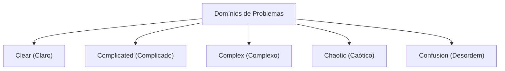

# Desenvolvimento Ágil: A Engenharia de Software Moderna que Abraça a Mudança

No desenvolvimento de software moderno, não passa um dia sem ouvirmos a palavra 'Ágil' (Agile). No entanto, o Ágil não é apenas uma palavra da moda (buzzword), mas um conceito com uma filosofia profunda onde a engenharia de software, o gerenciamento de projetos e o comportamento organizacional humano se cruzam. Neste artigo, explicaremos em detalhes a essência do desenvolvimento ágil: Scrum, Kanban e o Manifesto Ágil para Desenvolvimento de Software, incluindo o seu contexto histórico até a perspectiva da ciência dos sistemas complexos.

## 1. Contexto Histórico do Desenvolvimento de Software e os Limites do Taylorismo

Para entender o Ágil, precisamos primeiro entender a sua pré-história. No início do século XX, a 'Administração Científica (Taylorismo)', proposta por Frederick Taylor, revolucionou a indústria de manufatura. Este método, que dividia o trabalho dos operários e o gerenciava como um processo mensurável e previsível, alcançou resultados tremendos na produção fabril.

No desenvolvimento de software inicial (décadas de 1970 a 1990), essa abordagem taylorista também foi adotada. Esse foi o 'Modelo Cascata (Waterfall)'. Esse método, onde os processos como definição de requisitos, design básico, design detalhado, implementação, testes e operação prosseguem em uma única direção, como uma cachoeira, era fácil de entender como uma analogia para a indústria da construção ou manufatura.

No entanto, o software é um 'produto do pensamento' sem entidade física. É comum que os requisitos mudem durante a construção, e não é raro que o que o usuário realmente desejava só fique claro depois de concluído. A 'separação entre planejamento e execução' taylorista, no mundo em rápida mudança do software, acabou criando a tragédia da rigidez e de enormes retrabalhos.

## 2. O Nascimento do Manifesto Ágil para Desenvolvimento de Software

Em 2001, 17 especialistas em processos e metodologias de desenvolvimento de software reuniram-se em um resort de esqui em Snowbird, Utah. Em resposta à oposição aos processos pesados, eles discutiram metodologias de desenvolvimento de software mais leves e adaptáveis, e elaboraram um manifesto. Este é o 'Manifesto Ágil para Desenvolvimento de Software (Agile Manifesto)'.

O manifesto enfatiza os seguintes quatro valores:

*   **Indivíduos e interações** mais que processos e ferramentas
*   **Software em funcionamento** mais que documentação abrangente
*   **Colaboração com o cliente** mais que negociação de contratos
*   **Responder a mudanças** mais que seguir um plano

(Nota: Ou seja, mesmo havendo valor nos itens à direita, nós valorizamos mais os itens à esquerda)

Este manifesto trouxe uma mudança de paradigma: o desenvolvimento de software envolve inerentemente 'incerteza' e que o mais importante é adaptar-se de forma flexível a situações imprevisíveis.

## 3. Sistemas Adaptativos Complexos (Complex Adaptive Systems) e o Framework Cynefin

Ao explicar cientificamente a eficácia do Ágil, a perspectiva da ciência dos sistemas complexos é extremamente útil. O 'Framework Cynefin', proposto por David Snowden, classifica a natureza dos problemas em cinco domínios.

*   **Clear (Claro)**: Um estado onde a relação de causa e efeito é compreensível para qualquer um. As melhores práticas (best practices) se aplicam.
*   **Complicated (Complicado)**: Um estado que pode ser entendido analisando a relação entre causa e efeito. São necessárias boas práticas (good practices) por parte de especialistas.
*   **Complex (Complexo)**: Um estado onde a causa e o efeito só são conhecidos retrospectivamente. É necessária tentativa e erro e uma prática emergente (Emergent Practice).
*   **Chaotic (Caótico)**: Um estado onde não existe uma relação causal de causa e efeito. É necessária uma resposta através de ação rápida (Novel Practice).

A maior parte do desenvolvimento de software pertence ao domínio 'Complex (Complexo)'. Como muitas variáveis, tais como necessidades do mercado, avanços tecnológicos e comunicação dentro da equipe se influenciam mutuamente, um planejamento prévio cuidadoso (cascata) não funciona. O Ágil é um framework para se adaptar a esse domínio complexo, repetindo o ciclo de 'probar (tentativa) -> sentir (percepção) -> responder (resposta)' em ciclos curtos.

## 4. Scrum: Um Framework Baseado no Empirismo

O framework mais popular para praticar o desenvolvimento ágil é o 'Scrum'. O Scrum deriva da formação de scrum no rugby, e significa que a equipe avança como uma unidade.

O Scrum é apoiado por três pilares do empirismo: 'Transparência (Transparency)', 'Inspeção (Inspection)' e 'Adaptação (Adaptation)'.

### Papéis do Scrum (Accountabilities)

1.  **Product Owner (PO)**: Tem a responsabilidade de maximizar o valor do produto. Decide o que (What) criar.
2.  **Scrum Master (SM)**: É um líder servidor (servant leader) que apoia a equipe para garantir que o Scrum seja compreendido e praticado corretamente.
3.  **Desenvolvedores (Developers)**: É o grupo de especialistas que realmente cria o incremento (uma parte do produto com valor). Decidem como (How) criar.

### Eventos do Scrum

O Scrum utiliza um bloco de tempo (timebox) chamado 'Sprint' (geralmente de 1 a 4 semanas) como unidade básica, e realiza os seguintes eventos.

*   **Sprint Planning (Planejamento da Sprint)**: Planeja o que será alcançado e como durante a sprint.
*   **Daily Scrum (Scrum Diário)**: Durante 15 minutos todos os dias, os desenvolvedores sincronizam o progresso e ajustam o plano.
*   **Sprint Review (Revisão da Sprint)**: Apresenta os resultados (incremento) da sprint aos stakeholders (partes interessadas) e obtém feedback.
*   **Sprint Retrospective (Retrospectiva da Sprint)**: Reflete sobre os processos e relações da equipe e decide medidas de melhoria (kaizen) para a próxima sprint.

O Scrum é um framework muito leve, mas é considerado 'muito difícil de dominar (Hard to master)'. Isso ocorre porque requer auto-organização da equipe e alta disciplina, e tende a entrar em conflito com a cultura organizacional tradicional do tipo top-down.

## 5. Kanban: Otimização do Fluxo

Juntamente com o Scrum, uma prática ágil importante é o 'Kanban'. Esta é derivada do 'Sistema Kanban' do Sistema Toyota de Produção (TPS).

O núcleo do Kanban reside na 'visualização do fluxo de trabalho (workflow)' e na 'limitação do WIP (Work In Progress: trabalho em andamento)'.

Enquanto o Scrum enfatiza a 'iteração' através de timeboxes (sprints), o Kanban enfatiza o 'fluxo' do trabalho. Ao limitar o WIP, evita-se a inserção de trabalhos que ultrapassam a capacidade da equipe e traz à tona os gargalos. Com isso, baseado na Lei de Little (Lead Time = WIP / Throughput), alcança-se a redução do tempo de ciclo (lead time) e a melhoria da qualidade.

## 6. Excelência Técnica e XP (Extreme Programming)

O Ágil é muitas vezes discutido como um método de gerenciamento, mas o verdadeiro Ágil não pode ser alcançado sem o devido apoio técnico. Aqui, o 'XP (Extreme Programming)' torna-se importante.

Muitas das práticas consideradas essenciais na engenharia de software moderna, como Desenvolvimento Orientado a Testes (TDD), Programação em Par (Pair Programming), Integração Contínua (CI) e Refatoração, foram sistematizadas pelo XP.

Para 'entregar software funcionando continuamente', o código-fonte deve estar sempre limpo e seguro contra alterações (garantido por testes). Se você executar apenas o processo Scrum deixando a dívida técnica (Technical Debt) intocada, a base de código eventualmente será incapaz de suportar a velocidade das mudanças e falhará.

## Conclusão: Abraçando a Mudança

O desenvolvimento de software ágil não é concluído simplesmente pela introdução de processos ou ferramentas específicas. É uma mentalidade (mindset) de respeito à humanidade, aprendizado contínuo e adaptação constante em um mundo incerto e em rápida mudança.

Enfrentar o 'sistema complexo' das mudanças do mercado, da evolução tecnológica e, acima de tudo, da criatividade humana, não tentar controlá-los, mas sim evoluir junto com eles. Essa é a maior razão pela qual o Ágil é indispensável na engenharia de software moderna.
