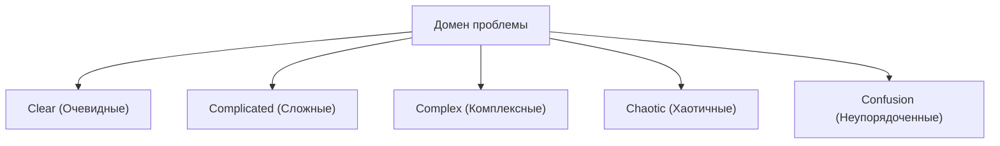

# Гибкая разработка: Современная программная инженерия, принимающая изменения

В современной разработке программного обеспечения нет ни дня, чтобы вы не услышали слово "Agile" (гибкая методология). Однако Agile — это не просто модное слово, а концепция с глубокой философией на стыке программной инженерии, управления проектами и организационного поведения человека. В этой статье мы подробно рассмотрим суть гибкой разработки: Scrum, Kanban и Agile-манифест разработки программного обеспечения, от их исторического контекста до точки зрения теории сложных систем.

## 1. Исторический контекст разработки программного обеспечения и пределы тейлоризма

Чтобы понять Agile, необходимо сначала понять его предысторию. В начале 20-го века "научный менеджмент (тейлоризм)", предложенный Фредериком Тейлором, произвел революцию в производстве. Этот метод, который разделял работу рабочих на мелкие части и управлял ею как измеримым и предсказуемым процессом, достиг огромных результатов в фабричном производстве.

В ранней разработке программного обеспечения (с 1970-х по 1990-е годы) также применялся этот тейлористский подход. Это "каскадная модель (Waterfall)". Этот метод, при котором такие этапы, как определение требований, базовое проектирование, детальное проектирование, реализация, тестирование и эксплуатация, проходят в одном направлении, подобно водопаду, было легко понять как аналогию со строительством или производством.

Однако программное обеспечение — это "продукт мысли", не имеющий физической сущности. Требования часто меняются во время разработки, и нередко то, что действительно нужно пользователям, становится ясным только после завершения. Тейлористское "разделение планирования и исполнения" в быстро меняющемся мире программного обеспечения привело к трагедии жесткости и огромного количества переделок.

## 2. Рождение Agile-манифеста разработки программного обеспечения

В 2001 году 17 экспертов по процессам и методологиям разработки программного обеспечения собрались на горнолыжном курорте Сноуберд в штате Юта. В ответ на тяжеловесные процессы они обсудили более легкие и адаптируемые методы разработки программного обеспечения и составили единый манифест. Это "Agile-манифест разработки программного обеспечения (Agile Manifesto)".

Манифест подчеркивает следующие четыре ценности:

*   **Люди и взаимодействие** важнее процессов и инструментов
*   **Работающее программное обеспечение** важнее исчерпывающей документации
*   **Сотрудничество с заказчиком** важнее согласования условий контракта
*   **Готовность к изменениям** важнее следования первоначальному плану

(Примечание: То есть, не отрицая важности того, что справа, мы все-таки больше ценим то, что слева.)

Этот манифест привел к сдвигу парадигмы, признав, что разработка программного обеспечения по своей сути сопряжена с "неопределенностью", и что гибкая адаптация к непредсказуемым ситуациям является самым важным.

## 3. Сложные адаптивные системы (Complex Adaptive Systems) и фреймворк Кеневин (Cynefin Framework)

С точки зрения науки о сложных системах очень полезно научно объяснить эффективность Agile. "Фреймворк Кеневин (Cynefin Framework)", предложенный Дэвидом Сноуденом, классифицирует природу проблем на пять доменов.

*   **Clear (Очевидные)**: Состояние, при котором причинно-следственные связи понятны всем. Применимы лучшие практики (Best Practices).
*   **Complicated (Сложные)**: Состояние, которое можно понять, проанализировав причинно-следственные связи. Требуются хорошие практики (Good Practices) экспертов.
*   **Complex (Комплексные)**: Состояние, при котором причины и следствия становятся известны только постфактум. Требуются метод проб и ошибок и эмерджентные практики (Emergent Practice).
*   **Chaotic (Хаотичные)**: Состояние, при котором отсутствуют причинно-следственные связи. Требуются быстрые действия и инновационные практики (Novel Practice).

Большая часть разработки программного обеспечения относится к домену "Complex (Комплексные)". Поскольку множество переменных, таких как потребности рынка, технологический прогресс и общение в команде, взаимодействуют друг с другом, тщательное предварительное планирование (каскадная модель) не работает. Agile — это фреймворк для адаптации к этому комплексному домену путем повторения коротких циклов "исследование (Probe) → восприятие (Sense) → реагирование (Respond)".

## 4. Scrum: Фреймворк, основанный на эмпиризме

Самым популярным фреймворком для практики гибкой разработки является "Scrum". Название Scrum происходит от схватки в регби и означает, что команда движется вперед как единое целое.

Scrum опирается на три столпа эмпиризма: "Прозрачность (Transparency)", "Инспекция (Inspection)" и "Адаптация (Adaptation)".

### Роли в Scrum (Accountabilities)

1.  **Владелец продукта (Product Owner, PO)**: Несет ответственность за максимизацию ценности продукта. Определяет, *что* (What) создавать.
2.  **Скрам-мастер (Scrum Master, SM)**: Лидер-слуга, который помогает команде понять и применять Scrum на практике.
3.  **Разработчики (Developers)**: Группа экспертов, которые фактически создают инкремент (полезную часть продукта). Определяют, *как* (How) создавать.

### События в Scrum

Scrum использует временные рамки, называемые "спринтами" (обычно от 1 до 4 недель), как базовую единицу, и проводит следующие события:

*   **Планирование спринта (Sprint Planning)**: Планирование того, что и как будет достигнуто в спринте.
*   **Ежедневный Scrum (Daily Scrum)**: 15 минут каждый день для разработчиков, чтобы синхронизировать прогресс и скорректировать план.
*   **Обзор спринта (Sprint Review)**: Демонстрация результатов спринта (инкремента) заинтересованным сторонам и получение обратной связи.
*   **Ретроспектива спринта (Sprint Retrospective)**: Анализ процессов и отношений в команде, определение улучшений (Kaizen) для следующего спринта.

Scrum — это очень легкий фреймворк, но считается, что его "трудно освоить (Hard to master)". Поскольку он требует самоорганизации команды и высокой дисциплины, он часто вступает в конфликт с традиционной организационной культурой "сверху вниз".

## 5. Kanban: Оптимизация потока

Наряду со Scrum, еще одним важным методом применения Agile является "Kanban". Он произошел от "системы канбан" Производственной системы Toyota (TPS).

Суть Kanban заключается в "визуализации рабочего процесса" и "ограничении незавершенной работы (WIP: Work In Progress)".

В то время как Scrum фокусируется на "итерациях" через временные рамки (спринты), Kanban фокусируется на "потоке" работы. Ограничение WIP предотвращает поступление работы сверх возможностей команды и выявляет узкие места. На основе Закона Литтла (Время выполнения = WIP / Пропускная способность) это позволяет сократить время выполнения (Lead Time) и повысить качество.

## 6. Техническое совершенство и XP (Экстремальное программирование)

Agile часто обсуждается как метод управления, но настоящий Agile не может быть реализован без технической основы. Здесь важную роль играет "XP (Экстремальное программирование)".

Многие практики, считающиеся необходимыми в современной программной инженерии, такие как разработка через тестирование (TDD), парное программирование, непрерывная интеграция (CI) и рефакторинг, были систематизированы в XP.

Чтобы "непрерывно поставлять работающее программное обеспечение", исходный код должен всегда оставаться чистым и безопасным для изменений (что гарантируется тестами). Если вы просто следуете процессу Scrum, игнорируя технический долг (Technical Debt), кодовая база в конечном итоге не выдержит скорости изменений, и проект потерпит крах.

## Заключение: Принятие изменений

Гибкая разработка программного обеспечения не заканчивается внедрением определенного процесса или инструмента. Это образ мышления, направленный на уважение человеческой природы, постоянное обучение и адаптацию в неопределенном и быстро меняющемся мире.

Вместо того чтобы пытаться контролировать "сложные системы", такие как изменения рынка, развитие технологий и, прежде всего, человеческое творчество, мы должны развиваться вместе с ними. Именно в этом заключается главная причина, почему Agile так необходим в современной программной инженерии.
