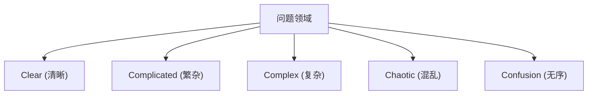

# 敏捷开发：拥抱变化的现代软件工程

在现代软件开发中，没有一天听不到“敏捷（Agile）”这个词。然而，敏捷并不仅仅是一个流行语，而是一个融合了软件工程、项目管理以及人类组织行为学的深层哲学的概念。本文将详细探讨敏捷开发的精髓——Scrum、看板以及敏捷软件开发宣言，并结合其历史背景和复杂系统科学的视角进行深入解析。

## 1. 软件开发的历史背景与泰勒主义的局限性

为了理解敏捷，我们首先需要了解它的前史。在20世纪初，弗雷德里克·泰勒（Frederick Taylor）提出的“科学管理法（泰勒主义）”为制造业带来了一场革命。这种将工人的工作细分、作为可测量和可预测的过程进行管理的方法，在工厂生产中取得了巨大的成果。

早期的软件开发（1970年代至1990年代）也采用了这种泰勒主义的方法。这就是“瀑布模型”。将需求定义、基本设计、详细设计、实现、测试、运维等工程像瀑布一样单向推进的这种方法，作为建筑业或制造业的类比是很容易理解的。

然而，软件是没有物理实体的“思考的产物”。在构建过程中需求发生变化是常态，直到完成后才发现用户真正想要的东西的情况也屡见不鲜。泰勒主义的“计划与执行分离”，在变化剧烈的软件世界中，造成了僵化和巨大返工的悲剧。

## 2. 敏捷软件开发宣言的诞生

2001年，17位软件开发过程和方法论专家聚集在犹他州雪鸟（Snowbird）的滑雪胜地。由于对繁重过程的反感，他们讨论了更轻量、适应性更强的软件开发方法，并汇集成了一份宣言。这就是“敏捷软件开发宣言（Agile Manifesto）”。

该宣言强调了以下四个价值观：

*   **个体和互动** 高于 流程和工具
*   **工作的软件** 高于 详尽的文档
*   **客户合作** 高于 合同谈判
*   **响应变化** 高于 遵循计划

（注：也就是说，尽管右项有其价值，我们更重视左项的价值。）

这一宣言带来了一场范式转变：软件开发本质上伴随着“不确定性”，而对不可预测的情况进行灵活适应才是最重要的。

## 3. 复杂适应系统（Complex Adaptive Systems）与 Cynefin 框架

在科学地解释敏捷的有效性时，复杂系统科学的视角非常有用。戴维·斯诺登（David Snowden）提出的“Cynefin 框架（Cynefin Framework）”将问题的性质分为五个领域。

*   **Clear（清晰）**: 因果关系对任何人来说都清晰可见的状态。适用最佳实践（Best Practice）。
*   **Complicated（繁杂）**: 通过分析因果关系才能理解的状态。需要专家的良好实践（Good Practice）。
*   **Complex（复杂）**: 因果关系只能在事后才可知的状态。需要试错和涌现实践（Emergent Practice）。
*   **Chaotic（混乱）**: 不存在因果关系的状态。需要通过迅速行动来应对（Novel Practice）。

许多软件开发都属于“Complex（复杂）”领域。市场需求、技术进步、团队内部沟通等众多变量相互影响，因此事先的周密计划（瀑布模型）是无效的。敏捷是通过反复进行“探测（Probe）→ 感知（Sense）→ 响应（Respond）”的短周期循环，来适应这个复杂领域的框架。

## 4. Scrum：基于经验主义的框架

实践敏捷开发最流行的框架是“Scrum”。Scrum 一词来源于橄榄球中的争球，意味着团队作为一个整体向前迈进。

Scrum 由三个经验主义支柱支撑：“透明度（Transparency）”、“检验（Inspection）”和“适应（Adaptation）”。

### Scrum 的角色（Accountabilities）

1.  **产品负责人（PO）**: 负责将产品的价值最大化。决定要做什么（What）。
2.  **Scrum Master（SM）**: 是一位服务型领导者，帮助团队正确理解和实践 Scrum。
3.  **开发者（Developers）**: 实际创建增量（有价值的产品部分）的专家群体。决定如何做（How）。

### Scrum 的事件

Scrum 以被称为“Sprint”的时间盒（通常为1到4周）为基本单位，执行以下事件：

*   **Sprint 计划会议**: 计划在 Sprint 中要达成什么以及如何达成。
*   **每日 Scrum**: 每天15分钟，开发者同步进度并调整计划。
*   **Sprint 评审会议**: 向利益相关者展示 Sprint 的成果（增量）并获得反馈。
*   **Sprint 回顾会议**: 回顾团队的流程和关系，决定面向下一个 Sprint 的改进措施（Kaizen）。

Scrum 是一个非常轻量级的框架，但被认为“难以精通（Hard to master）”。因为它要求团队具有自组织和高度纪律性，这往往会与传统的自上而下的组织文化产生冲突。

## 5. 看板（Kanban）：优化心流

与 Scrum 并列的另一个重要的敏捷实践方法是“看板”。它衍生自丰田生产方式（TPS）的“看板方式”。

看板的核心在于“工作流可视化”和“限制 WIP（Work In Progress：在制品）”。

与 Scrum 强调基于时间盒（Sprint）的“迭代”不同，看板强调工作的“流动（Flow）”。通过限制 WIP，可以防止投入超出团队能力的工作，从而使瓶颈显现出来。基于利特尔法则（Lead Time = WIP / Throughput），这实现了交付周期的缩短和质量的提高。

## 6. 技术卓越与 XP（极限编程）

敏捷经常被作为一种管理方法来讨论，但如果没有技术支持，就无法实现真正的敏捷。在这里，“XP（极限编程）”变得至关重要。

测试驱动开发（TDD）、结陪编程、持续集成（CI）、重构等现代软件工程中不可或缺的许多实践，都是由 XP 体系化的。

为了“持续交付工作的软件”，源代码必须始终保持整洁，并且对更改是安全的（由测试提供保障）。如果放任技术债务（Technical Debt）而仅仅运转 Scrum 的流程，代码库迟早会无法承受变化的速度，最终走向崩溃。

## 总结：拥抱变化

敏捷软件开发并不是引入特定的流程或工具就能完成的。它是一种在不确定和剧烈变化的世界中，尊重人性、持续学习并不断适应的心智模式。

面对市场变化、技术演进以及最重要的人类创造力这个“复杂系统”，不去试图控制它们，而是与它们共同进化。这才是敏捷在现代软件工程中不可或缺的最大理由。
