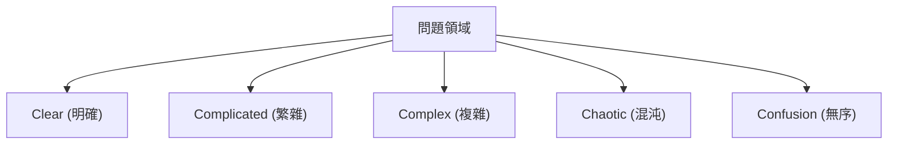
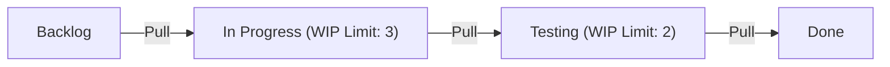

# 敏捷開發：擁抱變化的現代軟體工程

在現代軟體開發中，沒有一天聽不到「敏捷（Agile）」這個詞。然而，敏捷不僅僅是一個流行語，它是一個結合了軟體工程、專案管理與人類組織行為學深層哲學的概念。本文將詳細解說敏捷開發的精髓：Scrum、看板以及敏捷軟體開發宣言，並從歷史背景到複雜系統科學的角度進行探討。

## 1. 軟體開發的歷史背景與泰勒主義的侷限

要理解敏捷，首先必須了解其前身。20 世紀初，弗雷德里克·泰勒（Frederick Taylor）提出的「科學管理（泰勒主義）」為製造業帶來了革命。這種將工人的任務細分，並將其作為可衡量、可預測的流程進行管理的方法，在工廠生產中取得了巨大的成果。

在早期的軟體開發（1970 年代到 1990 年代），也採用了這種泰勒主義的方法。這就是「瀑布模型（Waterfall Model）」。需求定義、基本設計、詳細設計、實作、測試、營運等階段如同瀑布般單向進行，這種方法作為建築業或製造業的類比是很容易理解的。

然而，軟體是沒有實體存在的「思考產物」。在建構過程中需求發生變化是常態，通常要到完成後，用戶真正想要的東西才會浮現。泰勒主義「計畫與執行分離」的方法，在變化劇烈的軟體世界中，造成了僵化與巨大重工的悲劇。

## 2. 敏捷軟體開發宣言的誕生

2001 年，在猶他州雪鳥（Snowbird）的滑雪勝地，17 位軟體開發流程與方法論專家齊聚一堂。出於對笨重流程的反彈，他們討論了更輕量、適應性更高的軟體開發方法，並共同起草了一份宣言。這就是「敏捷軟體開發宣言（Agile Manifesto）」。

宣言強調了以下四個核心價值：

*   **個人與互動**重於流程與工具
*   **可用的軟體**重於詳盡的文件
*   **與客戶合作**重於合約協商
*   **回應變化**重於遵循計畫

（註：也就是說，雖然右側的項目有其價值，但我們更重視左側的項目）

這份宣言帶來了典範轉移，認知到軟體開發本質上伴隨著「不確定性」，靈活適應不可預測的情況才是最重要的。

## 3. 複雜適應系統（Complex Adaptive Systems）與 Cynefin 框架

從複雜系統科學的角度來科學地解釋敏捷的有效性是非常有用的。大衛·斯諾登（David Snowden）提出的「Cynefin 框架（Cynefin Framework）」將問題的性質分為五個領域。

*   **Clear（明確）**：因果關係對每個人都很明顯的狀態。適用最佳實踐（Best Practice）。
*   **Complicated（繁雜）**：可以透過分析因果關係來理解的狀態。需要專家提供良好實踐（Good Practice）。
*   **Complex（複雜）**：因果關係只能在事後理解的狀態。需要試錯與湧現性實踐（Emergent Practice）。
*   **Chaotic（混沌）**：不存在因果關係的狀態。需要透過迅速行動來應對的新穎實踐（Novel Practice）。

大多數的軟體開發屬於「Complex（複雜）」領域。市場需求、技術進步、團隊溝通等眾多變數相互影響，因此事前縝密的計畫（瀑布模型）是行不通的。敏捷正是透過反覆進行短週期的「探測（Probe）→ 感知（Sense）→ 回應（Respond）」，來適應這個複雜領域的框架。

## 4. Scrum：基於經驗主義的框架

實踐敏捷開發最受歡迎的框架就是「Scrum」。Scrum 一詞源自橄欖球的爭球，意味著團隊團結一致向前邁進。

Scrum 建立在三大經驗主義支柱之上：「透明度（Transparency）」、「檢驗（Inspection）」與「適應（Adaptation）」。

### Scrum 的角色（Accountabilities）

1.  **產品負責人（PO）**：負責最大化產品的價值。決定要做「什麼（What）」。
2.  **Scrum Master（SM）**：作為僕人式領導者，協助團隊正確理解並實踐 Scrum。
3.  **開發人員（Developers）**：實際創建增量（有價值的產品部分）的專家團隊。決定「如何（How）」做。

### Scrum 的事件

Scrum 以稱為「衝刺（Sprint）」的時間盒（通常為 1 到 4 週）為基本單位，並執行以下事件：

*   **衝刺規劃（Sprint Planning）**：計畫在衝刺中要達成什麼以及如何達成。
*   **每日 Scrum（Daily Scrum）**：每天 15 分鐘，開發人員同步進度並調整計畫。
*   **衝刺檢閱（Sprint Review）**：向利害關係人展示衝刺的成果（增量），並獲取反饋。
*   **衝刺回顧（Sprint Retrospective）**：回顧團隊的流程與關係，並決定下個衝刺的改進措施（Kaizen）。

Scrum 是一個非常輕量級的框架，但被認為「難以精通（Hard to master）」。因為它需要團隊的自我組織與高度紀律，這往往會與傳統的由上而下的組織文化產生衝突。

## 5. 看板（Kanban）：流程的最佳化

與 Scrum 並列，另一個重要的敏捷實踐方法是「看板」。它源自豐田生產方式（TPS）的「看板系統」。

看板的核心在於「工作流程視覺化」以及「限制 WIP（Work In Progress：半成品）」。

Scrum 強調基於時間盒（衝刺）的「迭代」，而看板則強調工作的「流程（Flow）」。透過限制 WIP，可以防止投入超出團隊負荷的工作，並讓瓶頸顯現出來。基於利特爾法則（Little's Law：Lead Time = WIP / Throughput），這能縮短前置時間（Lead Time）並提升品質。

## 6. 技術卓越與 XP（極限程式設計）

敏捷經常被視為一種管理方法，但如果沒有技術上的支持，就無法實現真正的敏捷。在這裡，「XP（極限程式設計）」變得非常重要。

測試驅動開發（TDD）、結對程式設計（Pair Programming）、持續整合（CI）、重構等現代軟體工程中不可或缺的實踐，很多都是由 XP 系統化整理出來的。

為了「持續提供可用的軟體」，原始碼必須隨時保持整潔，且修改必須是安全的（有測試作為保證）。如果放任技術債（Technical Debt）累積，只是一味執行 Scrum 流程，程式碼庫遲早會承受不住變化的速度而崩潰。

## 總結：擁抱變化

敏捷軟體開發不是只要導入特定的流程或工具就大功告成了。它是一種心態，讓人在充滿不確定與快速變化的世界中，尊重人性、持續學習並不斷適應。

面對市場變化、技術演進，以及最重要的人類創造力這個「複雜系統」，不要試圖去控制它們，而是與它們共同進化。這正是現代軟體工程中不可或缺敏捷的最大理由。
