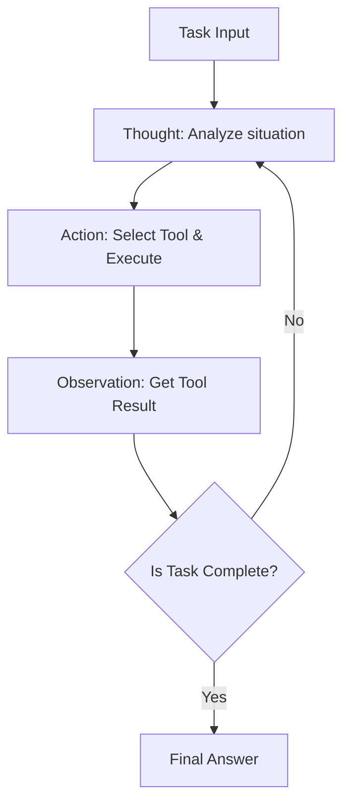
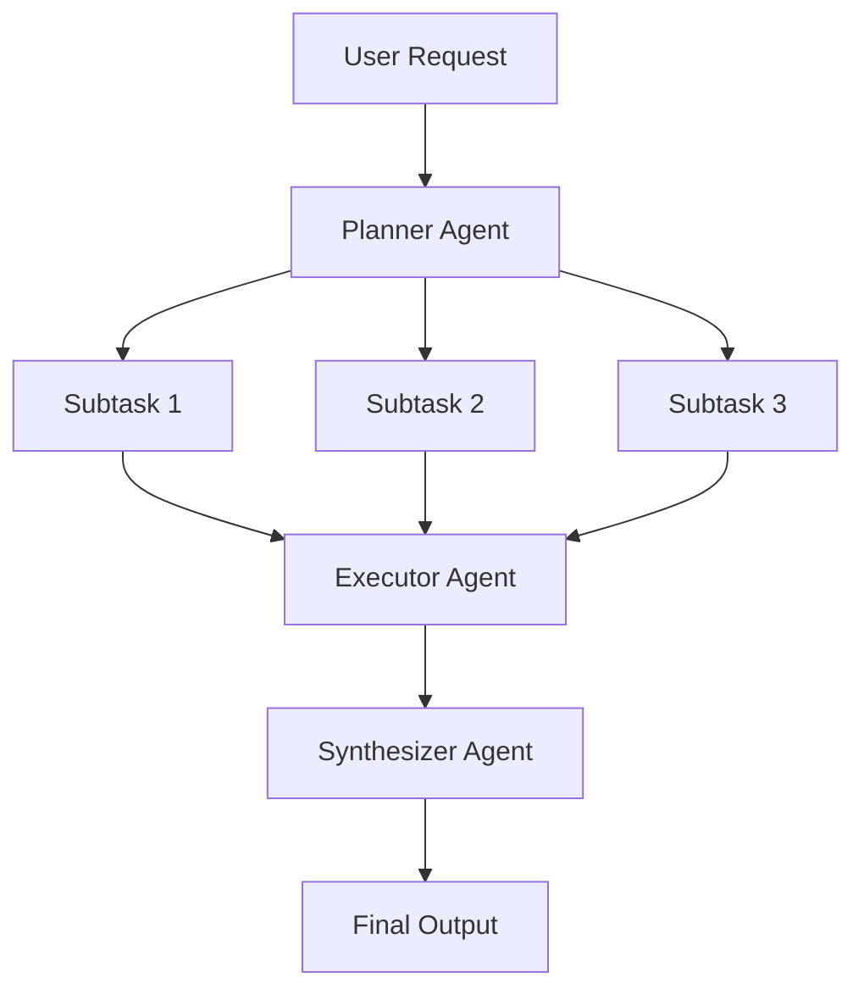
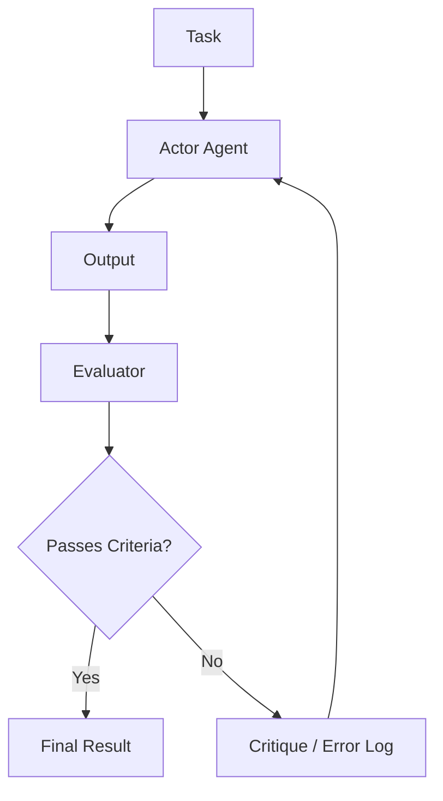

# تعمّق في تصميم بنية وكيل الذكاء الاصطناعي: من التلقين إلى الوكلاء المتعددين المستقلين

في هندسة البرمجيات الحديثة، أصبح تصميم وكلاء الذكاء الاصطناعي المتمركزين حول النماذج اللغوية الكبيرة (LLMs) من أكثر المجالات التي تحظى بالاهتمام. لقد انتهت مرحلة بناء "روبوتات الدردشة الذكية" البسيطة، ونشهد نقلة نوعية نحو تطوير "وكلاء مستقلين" (Autonomous Agents) حيث يقوم النظام نفسه بإدراك بيئته، ووضع الخطط، واستخدام الأدوات، وتصحيح أخطائه ذاتياً أثناء تنفيذ المهام المعقدة.

في هذا المقال، سنشرح بشكل شامل وتفصيلي تطور بنية وكلاء الذكاء الاصطناعي وأنماط التصميم الأساسية الخاصة بها، بدءاً من عصر التلقين (Prompting) البسيط وصولاً إلى أحدث أنظمة الوكلاء المتعددين.

## 1. النقلة النوعية: التطور من التلقين إلى الوكيل المستقل

كانت الاستخدامات المبكرة للنماذج اللغوية الكبيرة (LLMs)، كما يتضح من التلقين بدون أمثلة (Zero-shot prompting) والتلقين بأمثلة قليلة (Few-shot prompting)، بمثابة نموذج أقرب إلى "استدعاء دالة" (Function Call)، حيث يقوم النموذج بإرجاع نص محتمل إحصائياً رداً على استعلام واحد. ومع ذلك، كان لهذا النهج بعض القيود القاتلة:

* **نسيان السياق ونقص الاستدلال طويل المدى**: نظراً لاكتمال العملية في إدخال وإخراج واحد، كان من الصعب الحفاظ على استدلال متسق يعتمد على الخطوات السابقة في المهام المعقدة متعددة المراحل.
* **عدم القدرة على التحكم في الهلوسة**: بسبب عدم وجود آلية للتحقق من البيانات الواقعية الخارجية، كان هناك خطر من إخراج معلومات خاطئة بثقة تامة.
* **الافتقار إلى القدرة على العمل**: لم يكن لدى النماذج وسائل للتفاعل الإيجابي مع العالم الرقمي (مثل واجهات برمجة التطبيقات، وأنظمة الملفات، وقواعد البيانات).

ولحل هذه التحديات، ظهر مفهوم "الوكيل" (Agent). يتعامل الوكيل مع النموذج اللغوي الكبير ليس كمجرد "مولد نصوص"، بل كـ "عقل النظام (محرك الاستدلال)".

### المكونات الأساسية لبنية الوكيل

يتكون وكيل الذكاء الاصطناعي المستقل النموذجي من المكونات الأساسية التالية:

1. **الملف الشخصي / الشخصية (Profile / Persona)**: يحدد دور الوكيل وهدفه والقيود المفروضة عليه.
2. **وحدة التخطيط (Planning Module)**: تقوم بتقسيم المهمة إلى مهام فرعية وتضع خطة تنفيذ.
3. **نظام الذاكرة (Memory System)**: يدير الذاكرة قصيرة المدى (داخل نافذة السياق) والذاكرة طويلة المدى (قواعد البيانات الخارجية)، ويراكم الخبرات.
4. **الأدوات / الإجراءات (Tools / Actions)**: واجهات للتأثير على البيئة، مثل استدعاءات واجهة برمجة التطبيقات (API)، وتنفيذ التعليمات البرمجية، وعمليات البحث على الويب.
5. **وحدة التأمل (Reflection Module)**: آلية تفكير ذاتي تقيّم نتائج التنفيذ وتعدل الخطة إذا لزم الأمر.

كيفية ربط هذه المكونات معاً هي ما يبرز مهارة تصميم البنية.

## 2. دمج الاستدلال والعمل: أساسيات وتطبيقات نمط ReAct

يُعد نمط "ReAct (Reasoning and Acting)" من أهم النماذج التي تمثل حجر الأساس لوكلاء الذكاء الاصطناعي. تتيح هذه الطريقة، التي اقترحها باحثون من جامعة برينستون وGoogle Research، للوكيل حل المهام المعقدة عن طريق التناوب بين "التفكير (Thought)" و "الفعل (Action)".

### آلية عمل ReAct

عادةً ما تتقدم حلقة ReAct في الدورة التالية:

1. **التفكير (Thought)**: يحلل النموذج اللغوي الكبير الموقف الحالي ويستنتج باللغة الطبيعية ما يجب فعله بعد ذلك.
2. **الفعل (Action)**: بناءً على الاستدلال، يتم اختيار الأداة المتاحة (مثل: بحث الويب، والآلة الحاسبة، وواجهة برمجة التطبيقات) وتحديد المعلمات وتنفيذها.
3. **الملاحظة (Observation)**: يتم استقبال نتائج تنفيذ الأداة من النظام.

### مزايا وقيود ReAct

**المزايا:**
* **شفافية الاستدلال**: نظراً لأن عملية التفكير التي تشرح "لماذا تم اتخاذ هذا الإجراء" تكون مرئية، تصبح عملية تصحيح الأخطاء أسهل.
* **القدرة على التكيف مع البيئة**: من خلال القيام بالتفكير التالي بناءً على نتيجة العمل (الملاحظة)، يمكن التعامل بمرونة مع الأخطاء غير المتوقعة أو التغيرات البيئية الديناميكية.

**القيود:**
* **زيادة استهلاك الرموز (Tokens)**: مع كل تكرار للحلقة، يجب تضمين السجل الماضي (التفكير، الفعل، الملاحظة) في السياق، مما يستهلك نافذة السياق بسرعة.
* **الحلقات قصيرة النظر**: هناك خطر الوقوع في "حلقة لا نهائية" من تكرار نفس الإجراء، بسبب التركيز المفرط على الإجراء الحالي وفقدان الهدف العام.

ولحل مشكلة "الحلقات قصيرة النظر"، تم تقديم نهج "الخطة والحل" (Plan-and-Solve) الذي سنشرحه في القسم التالي.

## 3. امتلاك رؤية شاملة: نهج الخطة والحل (Plan-and-Solve)

إذا كان ReAct هو نهج "التفكير أثناء المشي"، فإن Plan-and-Solve (أو Plan-and-Execute) هو نهج "رسم الخريطة قبل المشي". في المهام المعقدة، يعد التخطيط الدقيق المسبق ضرورياً بدلاً من التصرف العشوائي.

### عملية Plan-and-Solve

تقوم هذه البنية بفصل النظام إلى "مخطط" (Planner) و "منفذ" (Executor).

1. **التخطيط (Planning)**:
    * يتلقى المخطط طلب المستخدم ويقسمه إلى مهام فرعية متعددة مستقلة أو مترابطة.
    * في بعض الأحيان يتم تحديد ترتيب تنفيذ المهام في شكل رسم بياني موجه غير دوري (DAG).
2. **الحل/التنفيذ (Solving/Executing)**:
    * يقوم المنفذ بمعالجة كل مهمة فرعية بالتسلسل (أو بالتوازي).
    * غالباً ما يعمل المنفذ هنا كوكيل ReAct صغير.

### أهمية التخطيط الديناميكي (Replanning)

في مهام العالم الحقيقي، غالباً لا تسير الأمور وفقاً للخطة الموضوعة. على سبيل المثال، قد تجعل نتائج البحث على الويب في المهمة الفرعية 1 المعالجة المخطط لها في المهمة الفرعية 2 غير ضرورية، أو قد تتطلب نهجاً جديداً تماماً.

لذلك، تتضمن هياكل Plan-and-Solve المتقدمة **آلية لتقييم النتائج في نهاية كل مهمة فرعية وتعديل الخطة المتبقية ديناميكياً (Replanning)**. وهذا يتيح التصرف بمرونة مع عدم إغفال الهدف العام.

## 4. تحويل الماضي إلى قوة: دمج الذاكرة قصيرة وطويلة المدى

تعتبر "الذاكرة" أمراً بالغ الأهمية للوكلاء المستقلين. وكما يستخدم البشر تجاربهم السابقة لاتخاذ القرارات الحالية، يمكن للوكيل تحسين أدائه بشكل كبير من خلال الاستفادة من سجل التفاعلات السابقة والمعرفة الخارجية.

عادة ما يُصمم نظام الذاكرة للوكيل بهيكل من طبقتين: "ذاكرة قصيرة المدى" و"ذاكرة طويلة المدى".

### الذاكرة قصيرة المدى (Short-term Memory)

الذاكرة قصيرة المدى هي المعلومات المحتفظ بها **داخل نافذة السياق الخاصة بالنموذج اللغوي الكبير**. وهذا يشمل سجل المحادثة الحالي، وسجل أحدث حلقة ReAct، وسياق المهمة الحالية.

* **التحديات**: هناك حد أقصى لنافذة السياق (مثلاً: 128K أو 1M رمز)، وفي المهام الطويلة والمعقدة تمتلئ بسرعة.
* **الحلول**: تصبح استراتيجيات إدارة السياق ضرورية، مثل تلخيص المعلومات القديمة والاحتفاظ بها (Summary Buffer Memory)، أو حذف السجلات الأقل أهمية.

### الذاكرة طويلة المدى (Long-term Memory) وقواعد البيانات المتجهة

الذاكرة طويلة المدى هي آلية لتخزين كميات هائلة من الخبرات والمعارف بشكل دائم وتجاوز حدود نافذة السياق. وهنا تلعب **قواعد البيانات المتجهة (Vector Database)** دوراً رئيسياً.

1. **تخزين الذاكرة**: عند اكتمال مهمة، يتم استخراج المعارف المكتسبة، أو مقتطفات الأكواد الناجحة، أو تفضيلات المستخدم كنص، وتُحوّل إلى متجهات عالية الأبعاد باستخدام نموذج التضمين (Embedding Model)، ثم تُحفظ في قاعدة بيانات متجهة.
2. **استرجاع الذاكرة (RAG: Retrieval-Augmented Generation)**: عند بدء مهمة جديدة، يتم تحويل الموقف الحالي أو الاستعلام إلى متجهات، ويتم إجراء بحث تشابه في قاعدة البيانات المتجهة.
3. **الاستفادة من الذاكرة**: يتم تقديم الذكريات السابقة ذات الصلة التي تم استرجاعها كسياق للنموذج اللغوي، مما يشجع على استدلال أكثر دقة.

### تصميم موجه الذاكرة (Memory Router)

في الأنظمة المتقدمة، يتم تنفيذ "وحدة موجه الذاكرة" لتقرير المعلومات التي يجب حفظها كذاكرة ومتى يجب البحث عنها. لا يقتصر الأمر على استدعاء الوكيل "لأداة البحث عن المعرفة" بشكل صريح، بل توجد أيضاً هياكل يقوم فيها النظام بحقن المعلومات ذات الصلة ضمناً في التلقين.

## 5. الطريق نحو التطور الذاتي: آلية التأمل الذاتي (Reflection)

من الصعب نجاح التلقين من المحاولة الأولى، ويمكن للوكلاء أيضاً أن يفشلوا في إجراءاتهم الأولية. الوكلاء المستقلون حقاً يتمتعون بالقدرة على التعلم من الفشل وتصحيح نهجهم، وهي آلية تُعرف بـ "التأمل (Reflection)".

### الأنماط الأساسية لـ Reflection

يتحقق Reflection من خلال بناء حلقة "عمل" ← "تقييم" ← "تحسين".

1. **المنفذ (Actor)**: يقوم بإنشاء الحل الأولي أو التعليمات البرمجية.
2. **المقيم (Evaluator)**: يقيّم مخرجات المنفذ. يمكن أن يشمل ذلك فحصاً منطقياً عن طريق طلب آخر من النموذج اللغوي، أو فحصاً تركيبياً من خلال مترجم البرامج، أو إجراء اختبارات الوحدة.
3. **النقد (Critique)**: يقدم تغذية راجعة على شكل "نقد" باللغة الطبيعية حول المشكلات ومجالات التحسين التي وجدها المقيم.
4. **التحسين (Refinement)**: يتلقى المنفذ التعليمات الأصلية مع النقد، ويقوم بإنشاء حل جديد ومحسن.

### Self-Refine و Reflexion

من أبرز الأساليب المستخدمة:

* **Self-Refine**: حيث يلعب نموذج لغوي واحد دور كل من المنفذ والمقيم، ليقوم بـ "نقد ذاتي" لمخرجاته ويكرر عملية التحسين.
* **Reflexion**: بنية متقدمة يتلقى فيها الوكيل تغذية راجعة من البيئة (مثال: نقاط في لعبة أو رسائل خطأ من API)، وبناءً عليها يقوم بصياغة "درس مستفاد" (ذاكرة عرضية) حول "سبب الفشل" لفظياً، ويستفيد منه في المحاولة القادمة.

من المتوقع أن يؤدي تنفيذ Reflection إلى تقليل الهلوسة وزيادة معدل النجاح في مهام البرمجة المعقدة بشكل كبير.

## 6. الجبهة القادمة: بناء وممارسة أنظمة الوكلاء المتعددين

تصل طريقة إسناد كل شيء إلى وكيل واحد (God Agent) إلى حدودها القصوى مع زيادة تعقيد المهام. لذا، أصبح "نظام الوكلاء المتعددين" (Multi-Agent System)، حيث يتعاون وكلاء متخصصون في مجالات معينة، هو الاتجاه السائد حالياً.

### التعاون من خلال تقسيم الأدوار

في أنظمة الوكلاء المتعددين، يتم تقسيم الأدوار تماماً كما في فريق تطوير البرمجيات.

* **وكيل مدير المنتج (Product Manager Agent)**: مسؤول عن تحديد المتطلبات وتقسيم المهام.
* **وكيل الباحث (Researcher Agent)**: مسؤول عن البحث عن المعلومات المطلوبة وتلخيصها.
* **وكيل المبرمج (Coder Agent)**: مسؤول عن كتابة التعليمات البرمجية الفعلية.
* **وكيل ضمان الجودة/المراجع (QA/Reviewer Agent)**: مسؤول عن فحص جودة التعليمات البرمجية والاختبار.

وهكذا، يمكن لكل وكيل التركيز على مجال تخصصه (التلقين النظامي والأدوات الخاصة به)، مما يعزز الجودة الشاملة.

### أطر العمل الرائدة: LangGraph و AutoGen

تتطور أطر العمل (Frameworks) الخاصة ببناء الوكلاء المتعددين بوتيرة سريعة.

**1. LangGraph (نظام LangChain البيئي)**
يتخذ LangGraph نهجاً يعرّف صراحة تدفق عمل الوكلاء في شكل **رسم بياني (عقد وحواف)**. نظراً لإمكانية تمرير الحالات (States) بين العقد وبناء رسوم بيانية دورية (حلقات)، يصبح من السهل التحكم في تدفقات ReAct أو Reflection، وهو مناسب لبناء أنظمة قوية بمستوى تجاري.

**2. AutoGen (من Microsoft)**
AutoGen هو إطار عمل للوكلاء المتعددين يعتمد على **المحادثة (Conversation)**. حيث يقوم الوكلاء بإنجاز المهام من خلال تبادل رسائل الدردشة فيما بينهم. يتميز بوجود موجه مُعَد (مثل GroupChatManager) يتحكم في "أي وكيل يجب أن يتحدث تالياً"، مما يسهل خلق سلوك تعاوني طارئ ومبتكر.

### طوبولوجيا بنية الوكلاء المتعددين

توجد عدة أشكال (طوبولوجيا) نموذجية لنمط التعاون بين الوكلاء المتعددين:

1. **متسلسل (Sequential)**: نمط خطوط الأنابيب (Pipeline) حيث يتم تسليم المهام بالترتيب: أ -> ب -> ج.
2. **هرمي (Hierarchical)**: يقوم وكيل مدير بالإشراف على عدة وكلاء عمال، ويقوم بجمع الإرشادات والنتائج.
3. **نقاشي (Debate/Group Chat)**: يتناقش عدة وكلاء خبراء بحرية للوصول إلى توافق في الآراء.

يعد اختيار الطوبولوجيا الأمثل بناءً على طبيعة المهمة المستهدفة مفتاحاً مهماً في تصميم البنية.

## 7. خاتمة: آفاق مستقبل وكلاء الذكاء الاصطناعي المستقلين

بدءاً من عصر هندسة التلقين، ومروراً باكتساب الاستدلال والعمل عبر ReAct، وصولاً إلى التخطيط باستخدام Plan-and-Solve، وتراكم الخبرات من خلال Memory، والتطور الذاتي عن طريق Reflection، وأخيراً التنظيم الجماعي من خلال أنظمة الوكلاء المتعددين. لقد حققت بنية وكلاء الذكاء الاصطناعي تطوراً مذهلاً خلال سنوات قليلة فقط.

من المتوقع أن تشهد المجالات التالية مزيداً من التطور في المستقبل:

* **وكلاء متعددو الوسائط (Multimodal Agents)**: انتشار وكلاء يمكنهم فهم الرؤية والصوت، وليس النص فقط، والتعامل مباشرة مع واجهات المستخدم الرسومية (GUI) (مثل: وكلاء استخدام الكمبيوتر).
* **وكلاء حوسبة الحافة (Edge AI Agents)**: تطوير وكلاء خفيفين يمكنهم إكمال الاستدلال والإجراءات محلياً على الجهاز دون الاعتماد على السحابة.
* **التعاون مع البشر (Human-in-the-Loop)**: بدلاً من الاستقلالية التامة، يتم تحسين الأنظمة الهجينة التي تطلب مساعدة البشر بسلاسة في اتخاذ القرارات المهمة أو في المواقف غير المؤكدة.

إن تصميم بنية وكيل الذكاء الاصطناعي يتجاوز كونه مجرد برمجة؛ فهو تحدٍّ فكري ومثير يتلخص في "كيفية تطبيق النموذج المعرفي كنظام". نأمل أن تساهم الأنماط والمبادئ التي تم شرحها في هذا المقال في مساعدة القراء على بناء أنظمة الجيل القادم.
