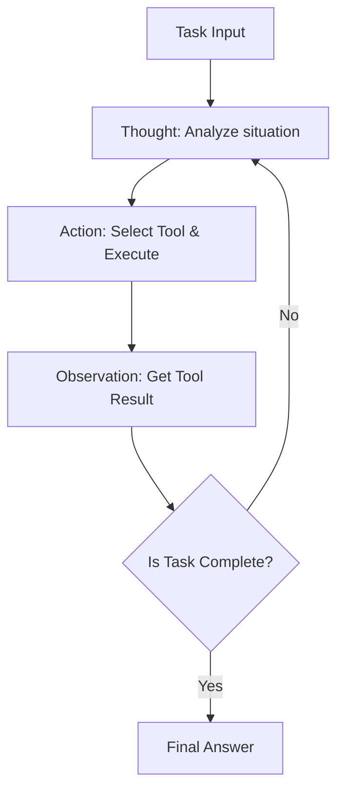
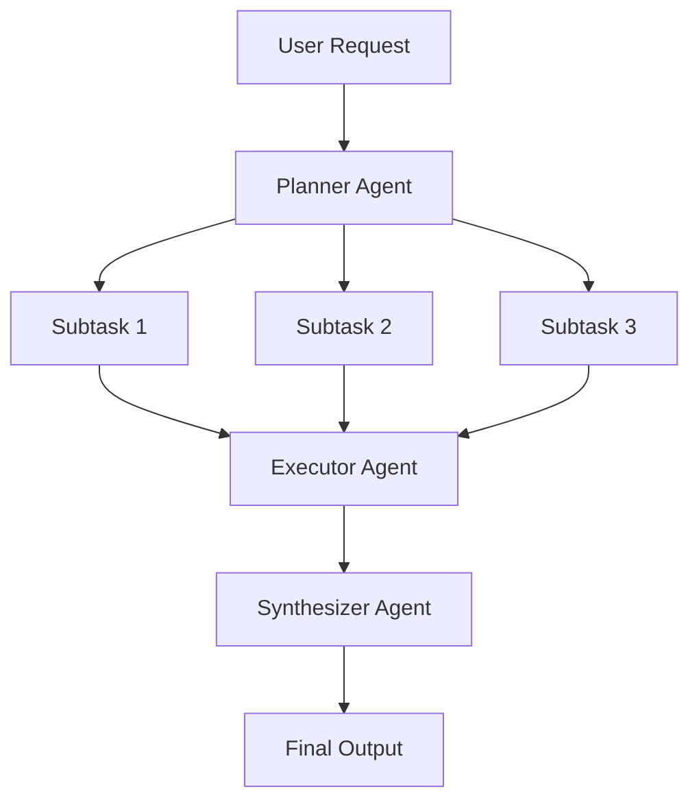
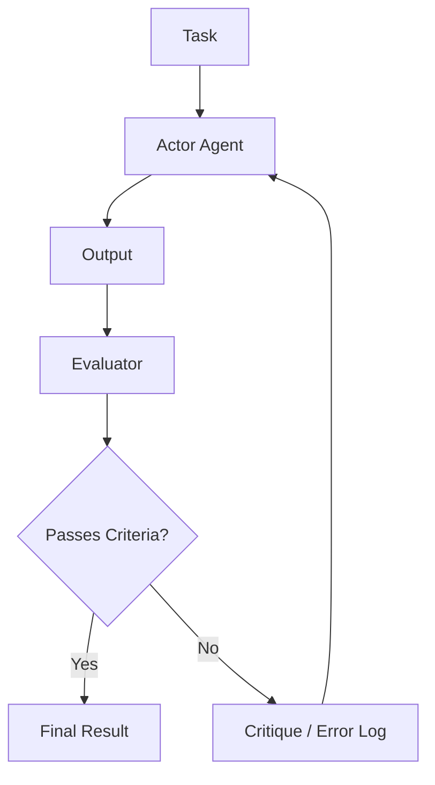

# Die Tiefen des KI-Agenten-Architekturdesigns: Vom Prompting bis zum autonomen Multi-Agenten-System

In der modernen Softwareentwicklung ist das Design von KI-Agenten, das sich um große Sprachmodelle (LLMs) zentriert, einer der Bereiche, die die meiste Aufmerksamkeit erregen. Die Phase des bloßen Erstellens eines "cleveren Chatbots" ist vorbei; es findet ein Paradigmenwechsel hin zur Entwicklung von "autonomen Agenten" statt, bei denen das System selbst die Umgebung wahrnimmt, plant, Werkzeuge einsetzt, sich selbst korrigiert und komplexe Aufgaben ausführt.

In diesem Artikel werden wir die Evolution der KI-Agenten-Architektur und ihre zentralen Entwurfsmuster von der Ära des einfachen Promptings bis hin zu den neuesten Multi-Agenten-Systemen detailliert und umfassend erläutern.

## 1. Paradigmenwechsel: Die Evolution vom Prompting zu autonomen Agenten

Die frühe Nutzung von LLMs, typischerweise durch Zero-Shot- oder Few-Shot-Prompting, war einem "Funktionsaufruf" ähnlich, bei dem das Modell eine probabilistisch plausible Textantwort auf eine einzelne Abfrage zurückgab. Dieser Ansatz hatte jedoch mehrere fatale Einschränkungen:

*   **Verlust des Kontexts und mangelndes langfristiges Schlussfolgern**: Da die Interaktion mit einer einzigen Eingabe und Ausgabe abgeschlossen war, war es bei komplexen, mehrstufigen Aufgaben schwierig, basierend auf früheren Schritten kohärent zu schlussfolgern.
*   **Unkontrollierbare Halluzinationen**: Es gab keinen Mechanismus zum Abgleich mit externen Faktendaten, was das Risiko barg, dass das Modell mit Überzeugung falsche Informationen ausgab.
*   **Fehlende Handlungsfähigkeit**: Es gab keine Möglichkeit, aktiv mit der digitalen Welt (APIs, Dateisysteme, Datenbanken) zu interagieren.

Das Konzept des "Agenten" entstand, um diese Probleme zu lösen. Agenten behandeln das LLM nicht nur als "Textgenerator", sondern als das "Gehirn (Inferenz-Engine) des Systems".

### Grundlegende Bausteine der Agentenarchitektur

Ein typischer autonomer KI-Agent besteht aus den folgenden Kernkomponenten:

1.  **Profil / Persona**: Definiert die Rolle, den Zweck und die Einschränkungen des Agenten.
2.  **Planungsmodul (Planning Module)**: Zerlegt Aufgaben in Teilaufgaben und formuliert Ausführungsschritte.
3.  **Speichersystem (Memory System)**: Verwaltet das Kurzzeitgedächtnis (im Kontextfenster) und das Langzeitgedächtnis (in externen Datenbanken) und sammelt Erfahrungen.
4.  **Werkzeuge / Aktionen (Tools / Actions)**: Schnittstellen zur Interaktion mit der Umgebung, wie API-Aufrufe, Codeausführung und Websuchen.
5.  **Reflexionsmodul (Reflection Module)**: Ein Mechanismus zur Selbstreflexion, der die Ausführungsergebnisse bewertet und den Plan bei Bedarf anpasst.

Die Kunst des Architekturdesigns liegt darin, wie diese Komponenten integriert und koordiniert werden.

## 2. Integration von Schlussfolgern und Handeln: Grundlagen und Praxis des ReAct-Musters

Eines der wichtigsten Paradigmen, das die Grundlage von KI-Agenten bildet, ist das "ReAct (Reasoning and Acting)"-Muster. Dieser Ansatz, der von Forschern der Princeton University und von Google Research vorgeschlagen wurde, ermöglicht es Agenten, komplexe Aufgaben zu lösen, indem sie zwischen "Denken (Thought)" und "Handeln (Action)" abwechseln.

### Der ReAct-Wirkungsmechanismus

Die ReAct-Schleife verläuft typischerweise im folgenden Zyklus:

1.  **Thought (Gedanke)**: Das LLM analysiert in natürlicher Sprache die aktuelle Situation und leitet ab, was als Nächstes zu tun ist.
2.  **Action (Aktion)**: Basierend auf der Schlussfolgerung wählt das LLM ein verfügbares Werkzeug (z. B. Websuche, Taschenrechner, API) aus und führt es mit den angegebenen Argumenten aus.
3.  **Observation (Beobachtung)**: Das Modell erhält das Ausführungsergebnis des Werkzeugs vom System.

### Vorteile und Grenzen von ReAct

**Vorteile:**
*   **Transparenz der Inferenz**: Der Denkprozess ("Warum hat der Agent diese Aktion ausgeführt?") wird sichtbar gemacht, was das Debugging erleichtert.
*   **Anpassungsfähigkeit an die Umgebung**: Da der nächste Gedanke auf den Ergebnissen der Aktion (Beobachtung) basiert, kann das System flexibel auf unerwartete Fehler oder dynamische Umgebungsänderungen reagieren.

**Grenzen:**
*   **Erhöhter Token-Verbrauch**: Bei jedem Durchlauf der Schleife muss die bisherige Historie (Gedanke, Aktion, Beobachtung) in den Kontext aufgenommen werden, was das Kontextfenster schnell erschöpft.
*   **Kurzsichtige Schleifen**: Es besteht das Risiko, sich in "Endlosschleifen" zu verfangen, in denen der Agent das Gesamtziel aus den Augen verliert und dieselbe Aktion wiederholt, weil er sich zu sehr auf die unmittelbare Aufgabe konzentriert.

Um diese "kurzsichtige Schleife" zu überwinden, wurde der "Plan-and-Solve"-Ansatz eingeführt, der im nächsten Abschnitt erläutert wird.

## 3. Die Gesamtperspektive einnehmen: Der Plan-and-Solve-Ansatz

Wenn ReAct der Ansatz ist, "beim Gehen zu denken", dann ist Plan-and-Solve (oder Plan-and-Execute) der Ansatz, "eine Karte zu zeichnen, bevor man losgeht". Bei komplexen Aufgaben ist eine sorgfältige Vorausplanung unerlässlich, anstatt ad hoc zu handeln.

### Der Plan-and-Solve-Prozess

Diese Architektur teilt das System im Wesentlichen in einen "Planer (Planner)" und einen "Ausführer (Executor)" auf.

1.  **Planning (Planungsphase)**:
    *   Der Planer nimmt die Anfrage des Benutzers entgegen und zerlegt sie in mehrere unabhängige oder voneinander abhängige Teilaufgaben.
    *   Die Ausführungsreihenfolge der Aufgaben kann auch in Form eines DAG (Directed Acyclic Graph) bestimmt werden.
2.  **Solving/Executing (Ausführungsphase)**:
    *   Der Executor bearbeitet jede Teilaufgabe nacheinander (oder parallel).
    *   Der Executor selbst fungiert hier oft als kleiner ReAct-Agent.

### Die Bedeutung der dynamischen Planänderung (Replanning)

In der realen Welt laufen Aufgaben oft nicht wie im Voraus geplant ab. Zum Beispiel kann das Ergebnis einer Websuche in Teilaufgabe 1 dazu führen, dass die in Teilaufgabe 2 geplante Verarbeitung unnötig wird oder ein völlig neuer Ansatz erforderlich ist.

Daher beinhalten fortschrittliche Plan-and-Solve-Architekturen einen Mechanismus zur **dynamischen Anpassung des verbleibenden Plans (Replanning)**, bei dem die Ergebnisse am Ende jeder Teilaufgabe bewertet werden. Dies ermöglicht Flexibilität, ohne das Gesamtziel aus den Augen zu verlieren.

## 4. Die Vergangenheit als Stärke nutzen: Integration von Kurzzeit- und Langzeitgedächtnis

Das "Gedächtnis (Memory)" ist für autonome Agenten extrem wichtig. Genau wie Menschen aktuelle Entscheidungen auf der Grundlage vergangener Erfahrungen treffen, können Agenten ihre Leistung drastisch verbessern, indem sie frühere Interaktionshistorien und externes Wissen nutzen.

Das Speichersystem eines Agenten wird im Allgemeinen als zweistufige Struktur konzipiert: "Kurzzeitgedächtnis" und "Langzeitgedächtnis".

### Kurzzeitgedächtnis (Short-term Memory)

Das Kurzzeitgedächtnis sind die Informationen, die **im Kontextfenster des LLMs** gehalten werden. Dies umfasst den aktuellen Gesprächsverlauf, die Historie der jüngsten ReAct-Schleifen und den Kontext der aktuellen Aufgabe.

*   **Herausforderung**: Das Kontextfenster hat eine Obergrenze (z. B. 128K, 1M Token) und läuft bei langen und komplexen Aufgaben schnell über.
*   **Lösung**: Es bedarf Strategien für das Kontextmanagement, wie das Zusammenfassen und Beibehalten alter Informationen (Summary Buffer Memory) oder das Entfernen weniger wichtiger Historien.

### Langzeitgedächtnis (Long-term Memory) und Vektordatenbanken

Das Langzeitgedächtnis ist ein Mechanismus, um riesige Mengen an vergangenen Erfahrungen und Wissen über die Grenzen des Kontextfensters hinaus dauerhaft zu speichern. Hier spielt die **Vektordatenbank (Vector Database)** die Hauptrolle.

1.  **Speichern von Erinnerungen**: Wenn ein Agent eine Aufgabe abschließt, extrahiert er gewonnene Erkenntnisse, erfolgreiche Code-Snippets oder Benutzerpräferenzen als Text, wandelt sie mithilfe eines Embedding-Modells in hochdimensionale Vektoren um und speichert sie in der Vektordatenbank.
2.  **Abrufen von Erinnerungen (RAG: Retrieval-Augmented Generation)**: Wenn eine neue Aufgabe in Angriff genommen wird, wird die aktuelle Situation oder Abfrage vektorisiert und eine Ähnlichkeitssuche in der Vektordatenbank durchgeführt.
3.  **Nutzen von Erinnerungen**: Die abgerufenen, hochgradig relevanten vergangenen Erinnerungen werden dem LLM als Kontext präsentiert, um genauere Schlussfolgerungen zu fördern.

### Design des Memory-Routers

In fortschrittlichen Systemen ist ein "Memory-Router-Modul" implementiert, das entscheidet, welche Informationen als Erinnerung gespeichert werden und wann gesucht werden soll. Es gibt Architekturen, bei denen der Agent nicht nur explizit "Wissensabfrage-Tools" aufruft, sondern das System auch implizit relevante Informationen in den Prompt injiziert.

## 5. Der Weg zur Selbstentwicklung: Der Mechanismus der Reflexion (Reflection)

Es ist schwierig, einen Prompt beim ersten Versuch erfolgreich zu gestalten, und auch Agenten können bei ihren anfänglichen Aktionen scheitern. Ein wirklich autonomer Agent verfügt über die Fähigkeit, aus Fehlern zu lernen und seinen Ansatz zu korrigieren – den Mechanismus der "Reflexion (Reflection)".

### Grundlegendes Muster der Reflexion

Reflexion wird durch den Aufbau einer Schleife aus "Aktion" -> "Bewertung" -> "Verbesserung" realisiert.

1.  **Actor (Akteur)**: Generiert anfängliche Lösungen oder Code.
2.  **Evaluator (Bewerter)**: Bewertet die Ausgabe des Actors. Dies kann logische Überprüfungen durch andere LLM-Prompts, Syntaxprüfungen durch Compiler oder die Ausführung von Unit-Tests umfassen.
3.  **Critique (Kritik)**: Gibt die vom Evaluator gefundenen Probleme und Verbesserungspunkte als Feedback in natürlicher Sprache ("Kritik") zurück.
4.  **Refinement (Verfeinerung)**: Der Actor nimmt die ursprünglichen Anweisungen sowie die Critique entgegen und generiert eine neue, verbesserte Lösung.

### Self-Refine und Reflexion

Zwei repräsentative Methoden sind:

*   **Self-Refine**: Ein einzelnes LLM übernimmt sowohl die Rolle des Actors als auch des Evaluators, führt "Selbstkritik" an der eigenen Ausgabe durch und iteriert Verbesserungen.
*   **Reflexion**: Eine fortschrittliche Architektur, bei der der Agent Feedback aus der Umgebung (z. B. Spielstände, API-Fehlermeldungen) erhält, Lektionen ("Warum bin ich gescheitert?", Episodic Memory) verbalisiert und sie für den nächsten Versuch nutzt.

Durch die Implementierung von Reflexion werden eine Reduzierung von Halluzinationen und eine signifikante Verbesserung der Erfolgsquote bei komplexen Codierungsaufgaben erwartet.

## 6. Die nächste Grenze: Aufbau und Praxis von Multi-Agenten-Systemen

Der Ansatz, alles einem einzigen Agenten zu überlassen (God Agent), stößt an seine Grenzen, wenn Aufgaben komplexer werden. "Multi-Agenten-Systeme", in denen mehrere auf bestimmte Domänen spezialisierte Agenten zusammenarbeiten, werden zum aktuellen Mainstream.

### Koordination durch Aufgabenteilung

In einem Multi-Agenten-System werden die Rollen wie in einem Softwareentwicklungsteam verteilt.

*   **Product Manager Agent**: Verantwortlich für die Anforderungsdefinition und die Aufgabenzerlegung.
*   **Researcher Agent**: Verantwortlich für die Suche und Zusammenfassung notwendiger Informationen.
*   **Coder Agent**: Verantwortlich für die eigentliche Code-Implementierung.
*   **QA/Reviewer Agent**: Verantwortlich für Qualitätsprüfungen des Codes und Tests.

Dadurch kann sich jeder Agent auf seinen Fachbereich (System-Prompt und Werkzeuge) konzentrieren, was die Gesamtqualität verbessert.

### Repräsentative Frameworks: LangGraph und AutoGen

Auch Frameworks zum Aufbau von Multi-Agenten entwickeln sich rasant.

**1. LangGraph (LangChain-Ökosystem)**
LangGraph verfolgt einen Ansatz, bei dem der Workflow des Agenten explizit als **Graph (Knoten und Kanten)** definiert wird. Da Zustände (State) zwischen Knoten übergeben und zyklische Graphen (Schleifen) konstruiert werden können, lassen sich ReAct- und Reflexions-Flows leichter kontrollieren. Dies eignet sich für den Aufbau robuster Systeme auf kommerziellem Niveau.

**2. AutoGen (Microsoft)**
AutoGen ist ein **konversationsbasiertes (Conversation)** Multi-Agenten-Framework. Agenten treiben Aufgaben voran, indem sie Chat-Nachrichten austauschen. Ein konfigurierter Router (wie GroupChatManager) steuert, "welcher Agent als Nächstes sprechen soll", was kollaboratives, emergentes Verhalten begünstigt.

### Topologie der Multi-Agenten-Architektur

Es gibt einige typische Muster (Topologien) für die Multi-Agenten-Koordination:

1.  **Sequenziell (Sequential)**: Ein Pipeline-Typ, bei dem Aufgaben der Reihe nach weitergegeben werden (A -> B -> C).
2.  **Hierarchisch (Hierarchical)**: Ein Manager-Agent beaufsichtigt mehrere Worker-Agenten und übernimmt die Anweisungen und die Aggregation der Ergebnisse.
3.  **Diskursiv (Debate/Group Chat)**: Mehrere Experten-Agenten tauschen frei Meinungen aus und bilden einen Konsens.

Der Schlüssel zum Architekturdesign liegt in der Auswahl der optimalen Topologie je nach Art der Zielaufgabe.

## 7. Fazit: Zukunftsaussichten autonomer KI-Agenten

Angefangen bei der Ära des Prompt-Engineerings über den Erwerb von Schlussfolgern und Handeln durch ReAct, die Planungsfähigkeit durch Plan-and-Solve, die Ansammlung von Erfahrungen durch Memory, die Selbstentwicklung durch Reflexion bis hin zur Organisation durch Multi-Agenten: Die Architektur von KI-Agenten hat in nur wenigen Jahren eine erstaunliche Evolution durchgemacht.

Mit Blick auf die Zukunft wird eine weitere Entwicklung in den folgenden Bereichen erwartet:

*   **Multimodale Agenten**: Die Verbreitung von Agenten, die nicht nur Text, sondern auch Bild und Ton verstehen und direkt mit GUIs interagieren können (z. B. Computer-Use-Agenten).
*   **Edge-KI-Agenten**: Die Entwicklung leichtgewichtiger Agenten, die unabhängig von der Cloud arbeiten und lokal auf Geräten inferenzieren und handeln können.
*   **Mensch-Maschine-Kollaboration (Human-in-the-Loop)**: Die Verfeinerung hybrider Systeme, bei denen Agenten nicht vollständig autonom arbeiten, sondern bei wichtigen Entscheidungen oder in unsicheren Situationen nahtlos menschliche Hilfe anfordern.

Das Design von KI-Agenten-Architekturen geht über bloße Programmierung hinaus; es ist eine hochintelligente und spannende Herausforderung in der Frage, "wie man kognitive Modelle als Systeme implementiert". Wir hoffen, dass die in diesem Artikel erläuterten Muster und Prinzipien den Lesern beim Aufbau von Systemen der nächsten Generation helfen werden.
