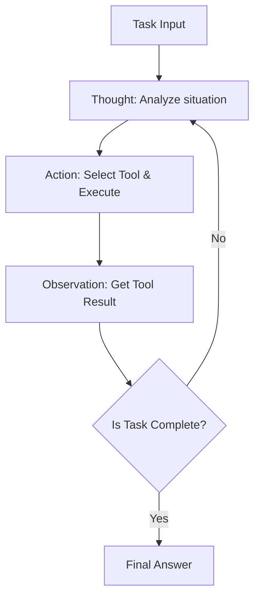
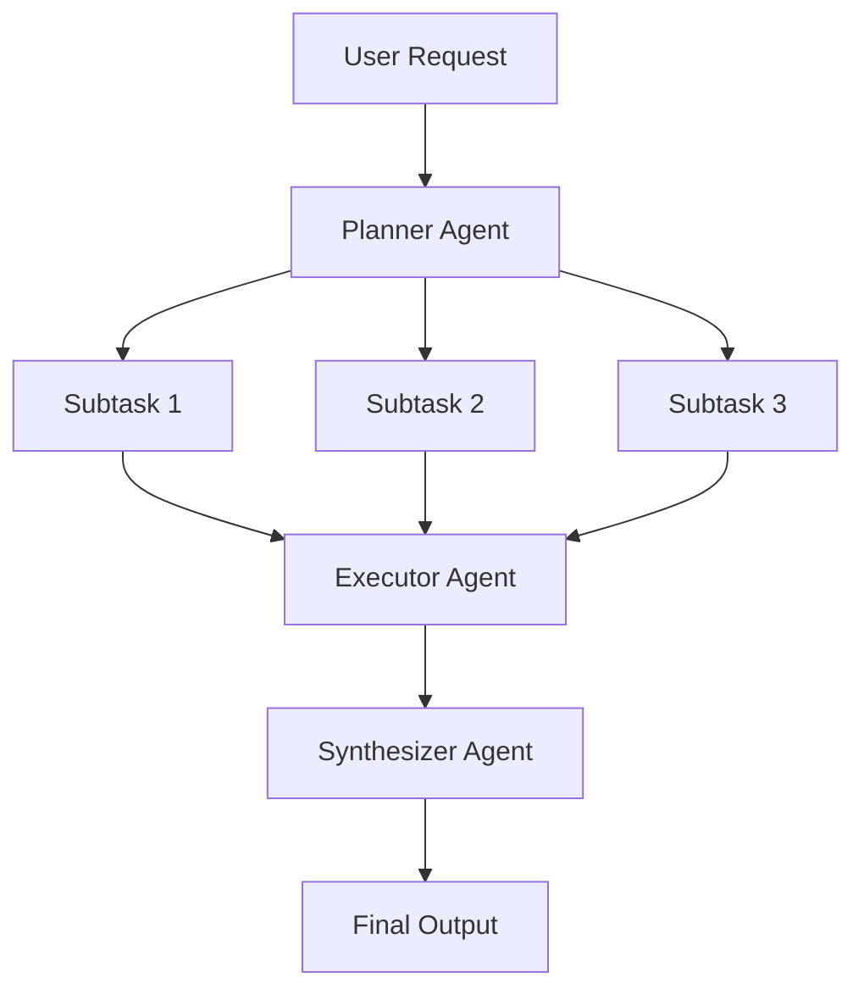
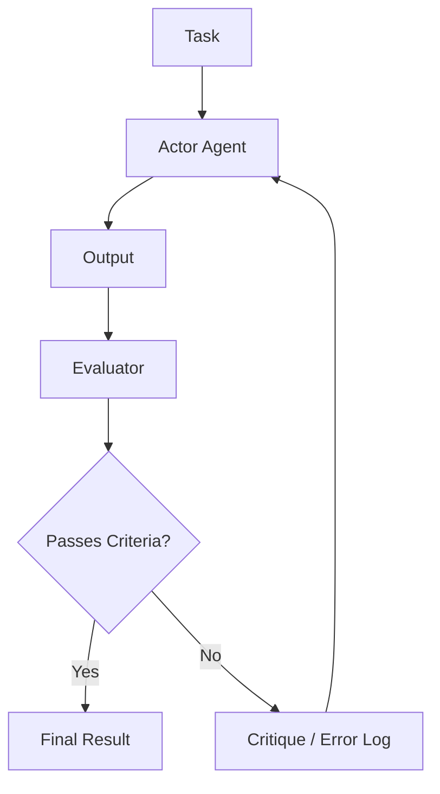

# Deep Dive into AI Agent Architecture Design: From Prompts to Autonomous Multi-Agents

In modern software engineering, the design of AI agents centered around Large Language Models (LLMs) is one of the most highly anticipated areas. We have moved past the stage of simply creating "smart chatbots," experiencing a paradigm shift towards the development of "autonomous agents" where the system itself perceives the environment, makes plans, utilizes tools, and executes complex tasks while self-correcting.

In this article, we will thoroughly and extensively explain the evolution of AI agent architecture and its core design patterns, from the era of simple prompting to the latest multi-agent systems.

## 1. Paradigm Shift: Evolution from Prompting to Autonomous Agents

Early use of LLMs, represented by Zero-shot and Few-shot prompting, was a paradigm akin to "function calling," where the model would return a probabilistically plausible text in response to a single query. However, this approach had several fatal limitations.

*   **Context Forgetting and Lack of Long-term Reasoning**: Because it concluded with a single input/output, it was difficult to maintain consistent reasoning based on past steps in complex, multi-step tasks.
*   **Uncontrollable Hallucination**: Without a mechanism to cross-reference external factual data, there was a risk of outputting incorrect information with absolute certainty.
*   **Lack of Action Capability**: It had no means to actively interact with the digital world (APIs, file systems, databases).

To solve these challenges, the concept of the "agent" emerged. An agent treats the LLM not merely as a "text generator" but as the "brain of the system (reasoning engine)."

### Basic Components of Agent Architecture

A typical autonomous AI agent consists of the following core components:

1.  **Profile / Persona**: Defines the agent's role, objectives, and constraints.
2.  **Planning Module**: Breaks down tasks into subtasks and formulates execution steps.
3.  **Memory System**: Manages short-term memory (within the context window) and long-term memory (external database) to accumulate experience.
4.  **Tools / Actions**: Interfaces to act upon the environment, such as API calls, code execution, and web searches.
5.  **Reflection Module**: A self-reflection mechanism that evaluates execution results and modifies the plan as necessary.

How to coordinate these components is where architectural design skills shine.

## 2. Integrating Reasoning and Acting: Basics and Practice of the ReAct Pattern

One of the most important paradigms underpinning AI agents is the "ReAct (Reasoning and Acting)" pattern. Proposed by researchers at Princeton University and Google Research, this method enables the resolution of complex tasks by having the agent alternate between "Thinking (Thought)" and "Acting (Action)."

### Operating Mechanism of ReAct

The ReAct loop generally proceeds in the following cycle:

1.  **Thought**: The LLM analyzes the current situation and reasons in natural language about what to do next.
2.  **Action**: Based on the reasoning, it selects an available tool (e.g., Web search, calculator, API), specifies arguments, and executes it.
3.  **Observation**: Receives the execution result of the tool from the system.

### Advantages and Limitations of ReAct

**Advantages:**
*   **Reasoning Transparency**: The thought process of "why the agent took that action" is visualized, making debugging easier.
*   **Adaptability to the Environment**: Because the next thought is based on the result of an action (Observation), it can flexibly respond to unexpected errors or dynamic environmental changes.

**Limitations:**
*   **Increased Token Consumption**: Past history (Thought, Action, Observation) must be included in the context every time the loop runs, rapidly consuming the context window.
*   **Myopic Loops**: Focusing too much on the immediate Action can lead to losing sight of the overall goal, risking an "infinite loop" of repeating the same Action.

To solve this "myopic loop," the "Plan-and-Solve" approach, explained in the next section, was introduced.

## 3. Having a Global Perspective: Plan-and-Solve Approach

If ReAct is the approach of "thinking while walking," Plan-and-Solve (or Plan-and-Execute) is the approach of "drawing a map before walking." In complex tasks, careful advance planning is essential rather than haphazard actions.

### The Plan-and-Solve Process

This architecture largely separates the system into a "Planner" and an "Executor."

1.  **Planning Phase**:
    *   The planner receives the user's request and breaks it down into multiple independent or interdependent subtasks.
    *   It may determine the execution order of tasks in the form of a DAG (Directed Acyclic Graph).
2.  **Solving/Executing Phase**:
    *   The executor processes each subtask sequentially (or in parallel).
    *   The executor here typically functions as a small ReAct agent itself.

### The Importance of Dynamic Planning Modification (Replanning)

In real-world tasks, things often don't go according to the advance plan. For example, the result of a web search in subtask 1 might make the processing planned for subtask 2 unnecessary, or require an entirely new approach.

Therefore, advanced Plan-and-Solve architectures incorporate a **mechanism to dynamically modify the remaining plan (Replanning)** by evaluating the results at the end of each subtask. This allows for actions that remain flexible without losing sight of the overarching goal.

## 4. Turning the Past into Power: Integrating Short-term and Long-term Memory

"Memory" is extremely important for autonomous agents. Just as humans make present judgments based on past experiences, agents can dramatically improve their performance by utilizing past interaction history and external knowledge.

An agent's memory system is generally designed with a two-tier structure of "short-term memory" and "long-term memory."

### Short-term Memory

Short-term memory is information held **within the LLM's context window**. This includes the current conversation history, the history of the most recent ReAct loop, and the context of the current task.

*   **Challenge**: The context window has an upper limit (e.g., 128K, 1M tokens, etc.) and will quickly overflow in long, complex tasks.
*   **Countermeasure**: Context management strategies are necessary, such as summarizing and retaining old information (Summary Buffer Memory) or deleting less important history.

### Long-term Memory and Vector Databases

Long-term memory is a mechanism that goes beyond the limits of the context window to persist vast amounts of past experience and knowledge. Here, **Vector Databases** take center stage.

1.  **Storing Memory**: When an agent completes a task, it extracts obtained insights, successful code snippets, or user preferences as text, converts them into high-dimensional vectors using an Embedding Model, and stores them in a vector DB.
2.  **Retrieving Memory (RAG: Retrieval-Augmented Generation)**: When tackling a new task, the current situation or query is vectorized, and a similarity search is performed against the vector DB.
3.  **Utilizing Memory**: The retrieved, highly relevant past memories are presented to the LLM as context, encouraging more accurate reasoning.

### Memory Router Design

Advanced systems implement a "memory router module" that determines what information to save as memory and when to retrieve it. While agents can explicitly call a "tool to search knowledge," there are also architectures where the system implicitly injects relevant information into the prompt.

## 5. The Path to Self-Evolution: Reflection (Self-Reflection and Modification) Mechanism

It is difficult to succeed with a prompt on the first try, and agents can also fail in their initial actions. A truly autonomous agent has the ability to learn from failures and modify its own approach—a "Reflection" mechanism.

### Basic Patterns of Reflection

Reflection is realized by constructing a loop of "Action" -> "Evaluation" -> "Improvement."

1.  **Actor**: Generates an initial solution or code.
2.  **Evaluator**: Evaluates the Actor's output. This includes logical checks using another LLM prompt, syntax checks by a compiler, or running unit tests.
3.  **Critique**: Provides feedback on the problems and areas for improvement found by the Evaluator as a natural language "critique."
4.  **Refinement**: The Actor receives the original instructions and the Critique, and generates a new, improved solution.

### Self-Refine and Reflexion

Two representative methods include the following:

*   **Self-Refine**: A single LLM takes on both the roles of Actor and Evaluator, conducting "self-critique" on its own output and repeatedly making improvements.
*   **Reflexion**: An advanced architecture where the agent receives feedback from the environment (e.g., game score, API error message), verbalizes lessons learned about "why it failed" (Episodic Memory) based on that feedback, and utilizes them in the next attempt.

Implementing Reflection is expected to reduce hallucinations and significantly improve success rates in complex coding tasks.

## 6. The Next Frontier: Composition and Practice of Multi-Agent Systems

The approach of leaving everything to a single agent (God Agent) reaches its limits as tasks become more complex. "Multi-agent systems," where multiple agents specialized in specific domains collaborate, are becoming the current mainstream.

### Collaboration through Role Division

In a multi-agent system, roles are divided much like a software development team.

*   **Product Manager Agent**: Responsible for defining requirements and breaking down tasks.
*   **Researcher Agent**: Responsible for searching and summarizing necessary information.
*   **Coder Agent**: Responsible for the actual code implementation.
*   **QA/Reviewer Agent**: Responsible for checking code quality and testing.

This allows each agent to focus on its own area of expertise (system prompt and tools), improving overall quality.

### Representative Frameworks: LangGraph and AutoGen

Frameworks for building multi-agents are also rapidly evolving.

**1. LangGraph (LangChain Ecosystem)**
LangGraph takes an approach that explicitly defines agent workflows as **graphs (nodes and edges)**. Because state is passed between nodes and cyclic graphs (loops) can be constructed, it is easy to control ReAct and Reflection flows, making it suitable for building robust, commercial-level systems.

**2. AutoGen (Microsoft)**
AutoGen is a **Conversation-based** multi-agent framework. Agents advance tasks by exchanging chat messages with each other. The configured router (like GroupChatManager) controls "which agent should speak next," making it easier to generate emergent collaborative behavior.

### Topologies of Multi-Agent Architecture

There are several typical patterns (topologies) for multi-agent collaboration.

1.  **Sequential**: A pipeline type that hands off tasks in order: A -> B -> C.
2.  **Hierarchical**: A manager agent oversees multiple worker agents and aggregates instructions and results.
3.  **Debate/Group Chat**: Multiple expert agents freely exchange opinions to reach a consensus.

Selecting the optimal topology according to the nature of the target task is the key to architectural design.

## 7. Conclusion: Future Prospects of Autonomous AI Agents

Starting from the era of prompt engineering, to acquiring reasoning and acting with ReAct, planning with Plan-and-Solve, accumulating experience with Memory, self-evolving with Reflection, and organizing with Multi-Agents. The architecture of AI agents has undergone astonishing evolution in just a few years.

As for future prospects, the following areas are expected to develop further.

*   **Multimodal Agents**: The spread of agents that not only understand text but also vision and audio, and directly operate GUIs (e.g., Computer Use Agents).
*   **Edge AI Agents**: The development of lightweight agents that complete reasoning and actions locally on devices without relying on the cloud.
*   **Human-in-the-Loop Collaboration**: The refinement of hybrid systems where agents are not completely autonomous, but seamlessly ask humans for help in important decision-making or uncertain situations.

The design of AI agent architecture goes beyond mere programming; it is an extremely intellectual and exciting challenge of "how to implement cognitive models as a system." We hope the patterns and principles explained in this article will serve as a stepping stone for your next-generation system construction.
