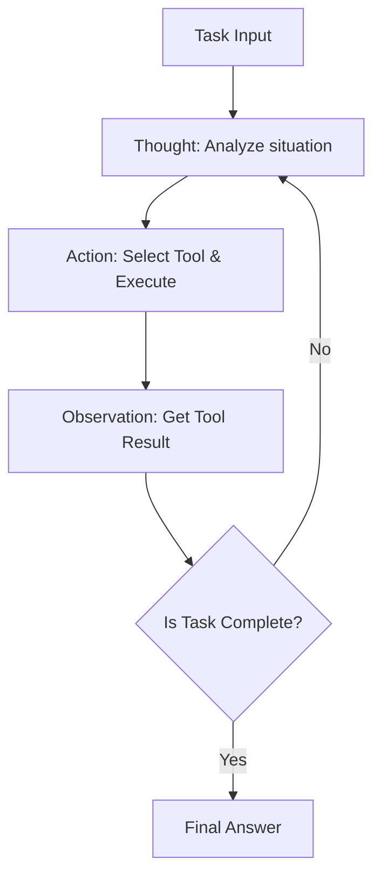
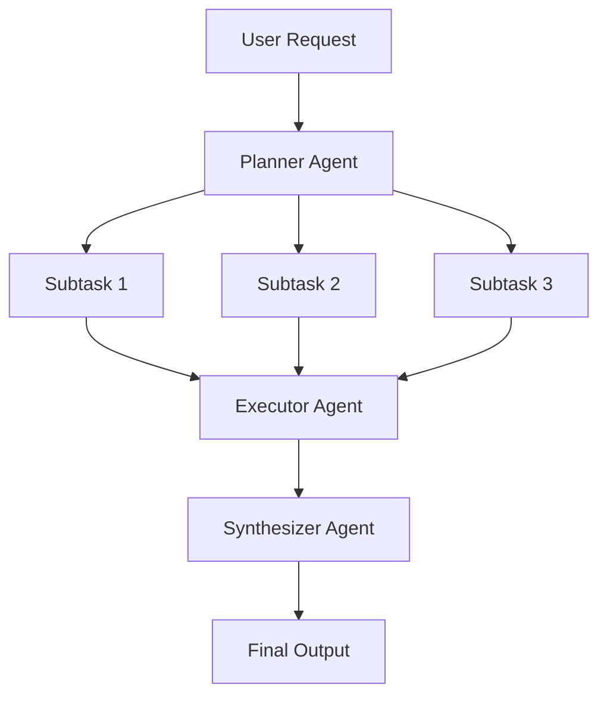
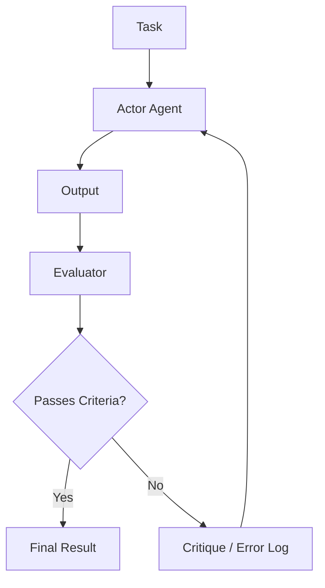

# Profundidades del diseño de la arquitectura de agentes de IA: desde prompts hasta agentes autónomos múltiples

En la ingeniería de software moderna, el diseño de agentes de Inteligencia Artificial (IA) centrados en Modelos de Lenguaje Grande (LLM, por sus siglas en inglés) es una de las áreas más destacadas. La fase de simplemente crear "chatbots inteligentes" ha terminado, y se está produciendo un cambio de paradigma hacia el desarrollo de "agentes autónomos" donde el propio sistema percibe su entorno, planifica, utiliza herramientas y se autocorrige mientras realiza tareas complejas.

En este artículo, explicaremos exhaustivamente con un detalle abrumador la evolución de las arquitecturas de agentes de IA y sus patrones de diseño principales, desde la era del prompting simple hasta los sistemas multiagente más avanzados.

## 1. Cambio de paradigma: Evolución del prompting a agentes autónomos

El uso temprano de los LLM, como se ve en el Zero-shot y el Few-shot prompting, era un paradigma similar a una "llamada a función", donde el modelo devolvía un texto probabilísticamente plausible a una única consulta. Sin embargo, este enfoque tenía varias limitaciones fatales:

*   **Olvido de contexto y falta de razonamiento a largo plazo**: Como se completaba en una única entrada/salida, era difícil mantener un razonamiento consistente basado en pasos pasados en tareas complejas de múltiples etapas.
*   **Alucinaciones incontrolables (Hallucination)**: Sin un mecanismo para verificar datos factuales externos, existía el riesgo de generar información falsa con confianza.
*   **Falta de capacidad de acción**: No tenían medios para interactuar activamente con el mundo digital (APIs, sistemas de archivos, bases de datos).

Para resolver estos problemas surgió el concepto de "agentes". Un agente trata al LLM no solo como un "generador de texto", sino como el "cerebro del sistema (motor de razonamiento)".

### Componentes básicos de la arquitectura de agentes

Un agente de IA autónomo típico consta de los siguientes componentes centrales:

1.  **Perfil / Persona**: Define el rol, el propósito y las restricciones del agente.
2.  **Módulo de planificación**: Descompone las tareas en subtareas y formula los pasos de ejecución.
3.  **Sistema de memoria**: Gestiona la memoria a corto plazo (dentro de la ventana de contexto) y la memoria a largo plazo (base de datos externa), y acumula experiencia.
4.  **Herramientas / Acciones**: Interfaces para actuar sobre el entorno, como llamadas a APIs, ejecución de código, búsqueda web, etc.
5.  **Módulo de reflexión**: Un mecanismo de autoevaluación que evalúa los resultados de la ejecución y modifica el plan si es necesario.

La forma en que se integran estos componentes es donde el diseño de la arquitectura demuestra su valía.

## 2. Integración de razonamiento y acción: Fundamentos y práctica del patrón ReAct

Uno de los paradigmas más importantes que forman la base de los agentes de IA es el patrón "ReAct" (Reasoning and Acting). Este enfoque, propuesto por investigadores de la Universidad de Princeton y Google Research, permite a los agentes resolver tareas complejas alternando entre "pensar (Thought)" y "actuar (Action)".

### Mecanismo de funcionamiento de ReAct

El ciclo ReAct generalmente se desarrolla en las siguientes fases:

1.  **Thought (Pensamiento)**: El LLM analiza la situación actual y razona en lenguaje natural lo que debe hacer a continuación.
2.  **Action (Acción)**: Basándose en el razonamiento, selecciona una herramienta disponible (por ejemplo, búsqueda web, calculadora, API), especifica los argumentos y la ejecuta.
3.  **Observation (Observación)**: Recibe el resultado de la ejecución de la herramienta por parte del sistema.

### Ventajas y limitaciones de ReAct

**Ventajas:**
*   **Transparencia del razonamiento**: Dado que se visualiza el proceso de pensamiento de "por qué el agente tomó esa acción", la depuración es fácil.
*   **Adaptabilidad al entorno**: Como el siguiente pensamiento se basa en el resultado de la acción (Observation), puede responder de manera flexible a errores inesperados o cambios dinámicos en el entorno.

**Limitaciones:**
*   **Aumento en el consumo de tokens**: Cada vez que el bucle se repite, el historial pasado (Thought, Action, Observation) debe incluirse en el contexto, consumiendo rápidamente la ventana de contexto.
*   **Bucle miope**: Existe el riesgo de caer en un "bucle infinito" donde se repite la misma Acción, perdiendo de vista el objetivo general al concentrarse demasiado en la Acción inmediata.

Para resolver este "bucle miope", se introdujo el enfoque "Plan-and-Solve", que se explica en la siguiente sección.

## 3. Tener una visión global: Enfoque Plan-and-Solve

Si ReAct es un enfoque de "pensar mientras se camina", Plan-and-Solve (o Plan-and-Execute) es un enfoque de "dibujar un mapa antes de empezar a caminar". En tareas complejas, una planificación cuidadosa por adelantado es esencial, en lugar de acciones improvisadas.

### El proceso de Plan-and-Solve

Esta arquitectura divide ampliamente el sistema en un "Planificador (Planner)" y un "Ejecutor (Executor)".

1.  **Planning (Fase de planificación)**:
    *   El planificador recibe la solicitud del usuario y la desglosa en múltiples subtareas independientes o dependientes.
    *   A veces, el orden de ejecución de las tareas se determina en forma de un DAG (Grafo Acíclico Dirigido).
2.  **Solving/Executing (Fase de ejecución)**:
    *   El ejecutor procesa cada subtarea de forma secuencial (o en paralelo).
    *   El propio ejecutor generalmente funciona como un pequeño agente ReAct aquí.

### La importancia de la reprogramación dinámica (Replanning)

En las tareas reales, las cosas a menudo no salen según lo planeado. Por ejemplo, el resultado de una búsqueda web en la subtarea 1 puede hacer que el procesamiento planificado para la subtarea 2 sea innecesario, o puede requerir un enfoque completamente nuevo.

Por lo tanto, en las arquitecturas avanzadas Plan-and-Solve, se incorpora un **mecanismo para evaluar dinámicamente los resultados al final de cada subtarea y modificar el plan restante (Replanning)**. Esto permite acciones que mantienen la flexibilidad sin perder de vista el objetivo global.

## 4. Convertir el pasado en poder: Integración de la memoria a corto y largo plazo

Para los agentes autónomos, la "Memoria (Memory)" es extremadamente importante. Al igual que los humanos toman decisiones actuales basadas en experiencias pasadas, los agentes pueden mejorar drásticamente su rendimiento aprovechando el historial de interacción pasado y el conocimiento externo.

Los sistemas de memoria de los agentes generalmente se diseñan en una estructura de dos niveles: "memoria a corto plazo" y "memoria a largo plazo".

### Memoria a corto plazo (Short-term Memory)

La memoria a corto plazo es la información que se retiene **dentro de la ventana de contexto del LLM**. Esto incluye el historial de conversación actual, el historial del bucle ReAct más reciente, el contexto de la tarea actual, etc.

*   **Desafío**: La ventana de contexto tiene un límite (por ejemplo, 128K, 1M tokens), y en tareas largas y complejas, se desbordará rápidamente.
*   **Solución**: Se requieren estrategias de gestión del contexto, como resumir y mantener información antigua (Summary Buffer Memory) y eliminar el historial de menor importancia.

### Memoria a largo plazo (Long-term Memory) y bases de datos vectoriales

La memoria a largo plazo es un mecanismo para persistir grandes cantidades de experiencia pasada y conocimiento más allá de los límites de la ventana de contexto. Aquí, **la base de datos vectorial (Vector Database)** juega un papel principal.

1.  **Almacenamiento de memoria**: Cuando un agente completa una tarea, los conocimientos adquiridos, los fragmentos de código exitosos o las preferencias del usuario se extraen como texto, se convierten en vectores de alta dimensión utilizando un modelo de incrustación (Embedding Model) y se guardan en la base de datos vectorial.
2.  **Recuperación de memoria (RAG: Retrieval-Augmented Generation)**: Al abordar una nueva tarea, la situación actual o la consulta se vectorizan y se realiza una búsqueda de similitud en la base de datos vectorial.
3.  **Utilización de la memoria**: Las memorias pasadas relevantes recuperadas se presentan al LLM como contexto, promoviendo un razonamiento más preciso.

### Diseño del enrutador de memoria

En sistemas avanzados, se implementa un "módulo enrutador de memoria" para determinar qué información guardar como memoria y cuándo buscarla. Existen arquitecturas donde el agente no solo llama explícitamente a una "herramienta para buscar conocimientos", sino donde el sistema inyecta implícitamente información relevante en el prompt.

## 5. El camino hacia la autoevolución: Mecanismos de Reflexión (Reflection)

Es difícil tener éxito con un prompt en el primer intento, y los agentes a menudo fallan en sus acciones iniciales. Un agente verdaderamente autónomo tiene la capacidad de aprender de los fracasos y modificar su propio enfoque, es decir, un mecanismo de "Reflexión (Reflection)".

### Patrón básico de Reflexión

La reflexión se logra construyendo un bucle de "Acción" -> "Evaluación" -> "Mejora".

1.  **Actor (Ejecutor)**: Genera soluciones o código inicial.
2.  **Evaluator (Evaluador)**: Evalúa el output del Actor. Esto puede incluir comprobaciones lógicas mediante otro prompt LLM, comprobaciones de sintaxis por parte del compilador o la ejecución de pruebas unitarias.
3.  **Critique (Crítica)**: Retroalimenta los problemas o áreas de mejora encontrados por el Evaluador como una "crítica" en lenguaje natural.
4.  **Refinement (Refinamiento)**: El Actor recibe la instrucción original y la crítica, y genera una nueva solución mejorada.

### Self-Refine y Reflexion

Dos enfoques representativos son:

*   **Self-Refine**: Un único LLM desempeña los roles tanto de Actor como de Evaluador, realizando una "autocrítica" sobre su propio output y repitiendo la mejora.
*   **Reflexion**: Una arquitectura avanzada donde el agente recibe feedback del entorno (por ejemplo, puntuaciones de juegos, mensajes de error de API), verbaliza la lección de "por qué falló" (Memoria Episódica) basándose en eso, y lo utiliza para el siguiente intento.

Al implementar la reflexión, se espera una reducción en las alucinaciones y una mejora significativa en las tasas de éxito en tareas de codificación complejas.

## 6. La próxima frontera: Configuración y práctica de sistemas multiagente

El enfoque de dejar todo a un solo agente (God Agent) alcanza su límite a medida que las tareas se vuelven más complejas. Los "sistemas multiagente", donde múltiples agentes especializados en dominios específicos colaboran, se están convirtiendo en la tendencia principal actual.

### Cooperación mediante la división de roles

En un sistema multiagente, los roles se dividen de manera similar a un equipo de desarrollo de software.

*   **Product Manager Agent**: Responsable de definir requisitos y desglosar tareas.
*   **Researcher Agent**: Responsable de buscar y resumir la información necesaria.
*   **Coder Agent**: Responsable de la implementación real del código.
*   **QA/Reviewer Agent**: Responsable del control de calidad y las pruebas del código.

Esto permite que cada agente se centre en su propia área de especialización (prompt del sistema y herramientas), mejorando la calidad general.

### Frameworks representativos: LangGraph y AutoGen

Los frameworks para construir multiagentes también están evolucionando rápidamente.

**1. LangGraph (Ecosistema LangChain)**
LangGraph adopta un enfoque de definición explícita del flujo de trabajo del agente como un **grafo (nodos y aristas)**. Al pasar estados entre nodos y construir grafos cíclicos (bucles), los flujos de ReAct o Reflection son fáciles de controlar, lo que lo hace adecuado para construir sistemas robustos de nivel comercial.

**2. AutoGen (Microsoft)**
AutoGen es un framework multiagente basado en **conversaciones (Conversation)**. Los agentes avanzan en las tareas intercambiando mensajes de chat entre ellos. Un enrutador configurado (como GroupChatManager) controla "qué agente debe hablar a continuación", y se caracteriza por la facilidad con la que se generan comportamientos colaborativos emergentes.

### Topologías de la arquitectura multiagente

Existen varios patrones típicos (topologías) de colaboración multiagente:

1.  **Secuencial (Sequential)**: Un tipo de canalización donde las tareas se traspasan en orden como A -> B -> C.
2.  **Jerárquica (Hierarchical)**: Un agente gerente supervisa múltiples agentes trabajadores y consolida instrucciones y resultados.
3.  **Debate (Debate/Group Chat)**: Múltiples agentes expertos intercambian opiniones libremente y llegan a un consenso.

La clave del diseño arquitectónico es seleccionar la topología óptima dependiendo de la naturaleza de la tarea deseada.

## 7. Conclusión: Perspectivas futuras de los agentes de IA autónomos

Comenzando desde la era de la ingeniería de prompts, adquiriendo razonamiento y acción con ReAct, planificación con Plan-and-Solve, acumulación de experiencia mediante Memory, autoevolución a través de Reflection y organización mediante multiagentes; la arquitectura de los agentes de IA ha logrado una evolución asombrosa en solo unos pocos años.

En cuanto a las perspectivas futuras, se espera que las siguientes áreas se desarrollen aún más:

*   **Agentes multimodales**: Expansión de agentes que comprenden no solo texto, sino también visión y audio, y manipulan GUIs directamente (por ejemplo, agentes de uso informático).
*   **Agentes de Edge AI**: Desarrollo de agentes ligeros que no dependen de la nube, completando el razonamiento y la acción localmente en el dispositivo.
*   **Colaboración con humanos (Human-in-the-Loop)**: Refinamiento de sistemas híbridos donde el agente no es completamente autónomo, sino que solicita ayuda humana sin problemas en decisiones importantes o situaciones de incertidumbre.

El diseño de arquitecturas de agentes de IA va más allá de la mera programación; es un desafío muy intelectual y emocionante de "cómo implementar modelos cognitivos como sistemas". Esperamos que los patrones y principios discutidos en este artículo ayuden a nuestros lectores a construir la próxima generación de sistemas.
