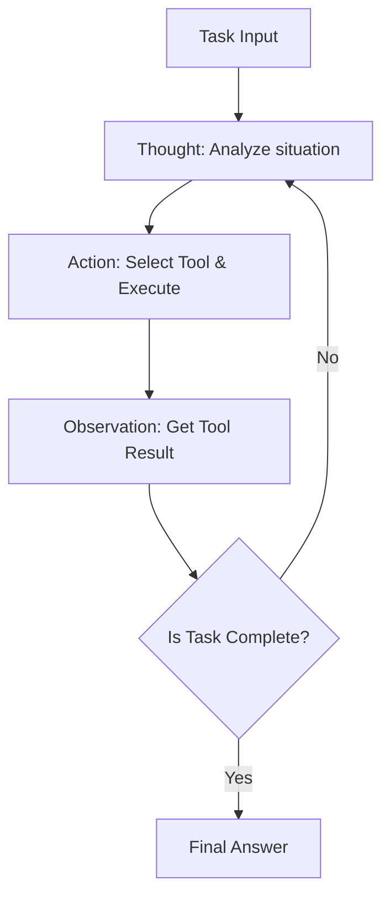
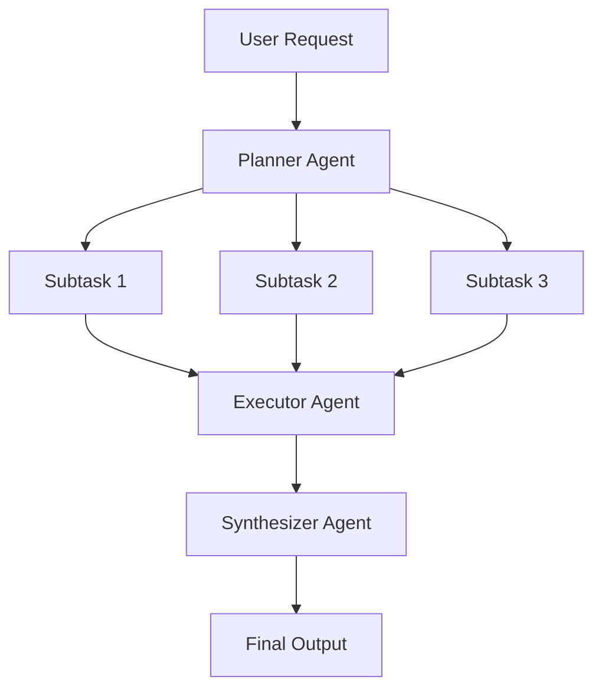
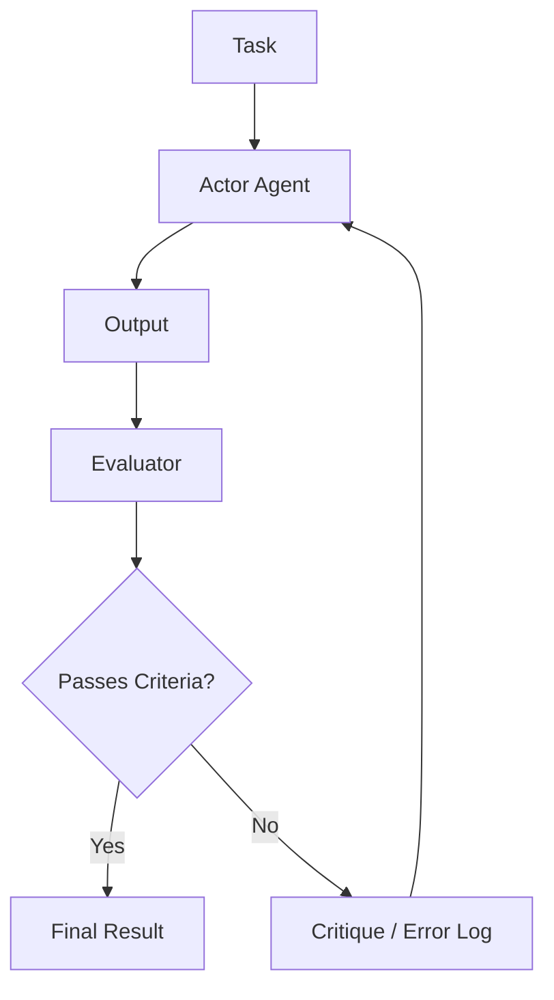

# Au cœur de la conception d'architectures d'agents IA : Des prompts aux systèmes multi-agents autonomes

Dans l'ingénierie logicielle moderne, la conception d'agents IA centrés sur les grands modèles de langage (LLM) est l'un des domaines les plus en vue. Nous avons dépassé le stade de la simple création de "chatbots intelligents" pour assister à un changement de paradigme vers le développement d'"agents autonomes", où le système lui-même perçoit son environnement, planifie, utilise des outils et s'auto-corrige tout en accomplissant des tâches complexes.

Dans cet article, nous allons expliquer en détail l'évolution des architectures d'agents IA et leurs modèles de conception fondamentaux, de l'ère du simple prompt aux derniers systèmes multi-agents.

## 1. Changement de paradigme : L'évolution du prompt vers l'agent autonome

L'utilisation initiale des LLM, représentée par le "Zero-shot prompting" et le "Few-shot prompting", était un paradigme proche de l'"appel de fonction", où le modèle renvoyait un texte probabilistiquement plausible en réponse à une requête unique. Cependant, cette approche présentait plusieurs limites fatales.

*   **Oubli du contexte et absence de raisonnement à long terme** : Comme tout se terminait en une seule entrée/sortie, il était difficile de maintenir un raisonnement cohérent basé sur les étapes précédentes dans des tâches complexes à plusieurs étapes.
*   **Incapacité à contrôler les hallucinations** : Sans mécanisme pour recouper avec des données factuelles externes, il y avait un risque que le modèle produise des informations incorrectes avec certitude.
*   **Absence de capacité d'action** : Ils n'avaient aucun moyen d'interagir activement avec le monde numérique (API, systèmes de fichiers, bases de données).

Le concept d'"agent" a émergé pour résoudre ces problèmes. Un agent traite le LLM non pas comme un simple "générateur de texte", mais comme le "cerveau du système (moteur de raisonnement)".

### Composants fondamentaux de l'architecture d'un agent

Un agent IA autonome typique est composé des éléments principaux suivants :

1.  **Profil / Persona** : Définit le rôle, l'objectif et les contraintes de l'agent.
2.  **Module de planification (Planning)** : Décompose la tâche en sous-tâches et formule les étapes d'exécution.
3.  **Système de mémoire** : Gère la mémoire à court terme (dans la fenêtre de contexte) et la mémoire à long terme (bases de données externes) pour accumuler de l'expérience.
4.  **Outils / Actions (Tools / Actions)** : Interfaces permettant d'agir sur l'environnement, telles que les appels d'API, l'exécution de code ou les recherches sur le Web.
5.  **Module de réflexion (Reflection)** : Un mécanisme d'auto-introspection qui évalue les résultats de l'exécution et modifie le plan si nécessaire.

La manière de coordonner ces composants est ce qui démontre le savoir-faire dans la conception de l'architecture.

## 2. Intégration du raisonnement et de l'action : Bases et pratique du modèle ReAct

L'un des paradigmes les plus importants formant la base des agents IA est le modèle "ReAct (Reasoning and Acting)". Proposée par des chercheurs de l'Université de Princeton et de Google Research, cette méthode permet aux agents de résoudre des tâches complexes en alternant "réflexion (Thought)" et "action (Action)".

### Mécanisme de fonctionnement de ReAct

La boucle ReAct se déroule généralement selon le cycle suivant :

1.  **Thought (Pensée)** : Le LLM analyse la situation actuelle et déduit ce qu'il faut faire ensuite en langage naturel.
2.  **Action** : En se basant sur le raisonnement, il sélectionne un outil disponible (ex : recherche Web, calculatrice, API) et l'exécute en spécifiant les arguments.
3.  **Observation** : Il reçoit le résultat de l'exécution de l'outil de la part du système.

### Avantages et limites de ReAct

**Avantages :**
*   **Transparence du raisonnement** : Le processus de pensée expliquant "pourquoi l'agent a pris cette action" est visualisé, ce qui facilite le débogage.
*   **Adaptabilité à l'environnement** : Comme la pensée suivante est basée sur le résultat de l'action (Observation), il peut réagir de manière flexible aux erreurs inattendues ou aux changements dynamiques de l'environnement.

**Limites :**
*   **Augmentation de la consommation de jetons** : À chaque itération de la boucle, l'historique passé (Thought, Action, Observation) doit être inclus dans le contexte, ce qui consomme rapidement la fenêtre de contexte.
*   **Boucle myope** : En se concentrant trop sur l'Action immédiate, il y a un risque de perdre de vue l'objectif global et de tomber dans une "boucle infinie" en répétant la même Action.

Pour résoudre cette "boucle myope", l'approche "Plan-and-Solve" expliquée dans la section suivante a été introduite.

## 3. Avoir une vision globale : L'approche Plan-and-Solve

Si ReAct est une approche "réfléchir en marchant", Plan-and-Solve (ou Plan-and-Execute) est une approche "dessiner une carte avant de marcher". Pour les tâches complexes, il est essentiel de faire une planification minutieuse à l'avance plutôt que d'agir au hasard.

### Processus de Plan-and-Solve

Cette architecture sépare largement le système en un "Planificateur (Planner)" et un "Exécuteur (Executor)".

1.  **Planning (Phase de planification)** :
    *   Le planificateur reçoit la requête de l'utilisateur et la décompose en plusieurs sous-tâches, indépendantes ou dépendantes.
    *   L'ordre d'exécution des tâches est parfois déterminé sous la forme d'un graphe orienté acyclique (DAG).
2.  **Solving/Executing (Phase d'exécution)** :
    *   L'exécuteur traite chaque sous-tâche de manière séquentielle (ou en parallèle).
    *   Il est courant que l'exécuteur lui-même fonctionne ici comme un petit agent ReAct.

### L'importance de la modification dynamique du plan (Replanning)

Dans les tâches réelles, les choses se déroulent rarement comme prévu initialement. Par exemple, à la suite d'une recherche Web dans la sous-tâche 1, le traitement prévu dans la sous-tâche 2 peut ne plus être nécessaire, ou une approche complètement nouvelle peut être requise.

Par conséquent, les architectures Plan-and-Solve avancées intègrent **un mécanisme pour évaluer les résultats à la fin de chaque sous-tâche et modifier dynamiquement le plan restant (Replanning)**. Cela permet de garder l'objectif global en vue tout en maintenant une flexibilité d'action.

## 4. Transformer le passé en force : Intégration de la mémoire à court et long terme

Pour les agents autonomes, la "Mémoire (Memory)" est extrêmement importante. Tout comme les humains prennent des décisions actuelles basées sur des expériences passées, les agents peuvent améliorer considérablement leurs performances en utilisant l'historique des interactions passées et des connaissances externes.

Le système de mémoire d'un agent est généralement conçu avec une structure à deux niveaux : la "mémoire à court terme" et la "mémoire à long terme".

### Mémoire à court terme (Short-term Memory)

La mémoire à court terme correspond aux informations conservées **dans la fenêtre de contexte du LLM**. Cela inclut l'historique de conversation actuel, l'historique des boucles ReAct récentes et le contexte de la tâche en cours.

*   **Défi** : La fenêtre de contexte a une limite (ex : 128K, 1M de jetons, etc.) et déborde rapidement dans les tâches longues et complexes.
*   **Solution** : Des stratégies de gestion du contexte sont nécessaires, telles que conserver des résumés des anciennes informations (Summary Buffer Memory) ou supprimer les historiques de moindre importance.

### Mémoire à long terme (Long-term Memory) et bases de données vectorielles

La mémoire à long terme est un mécanisme permettant de persister de vastes quantités d'expériences et de connaissances passées, au-delà des limites de la fenêtre de contexte. Ici, les **bases de données vectorielles (Vector Database)** jouent le rôle principal.

1.  **Sauvegarde de la mémoire** : Lorsqu'un agent termine une tâche, les connaissances acquises, les extraits de code réussis ou les préférences de l'utilisateur sont extraits sous forme de texte, convertis en vecteurs de haute dimension à l'aide d'un modèle de plongement (Embedding Model) et stockés dans la base de données vectorielle.
2.  **Recherche de mémoire (RAG : Retrieval-Augmented Generation)** : Lors de la prise en charge d'une nouvelle tâche, la situation actuelle ou la requête est vectorisée et une recherche de similarité est effectuée dans la base de données vectorielle.
3.  **Utilisation de la mémoire** : Les mémoires passées très pertinentes récupérées sont présentées au LLM comme contexte, ce qui encourage un raisonnement plus précis.

### Conception d'un routeur de mémoire

Dans les systèmes avancés, un "module de routeur de mémoire" est implémenté pour déterminer quelles informations doivent être enregistrées en tant que mémoire et quand elles doivent être recherchées. Il existe des architectures où l'agent appelle explicitement un "outil de recherche de connaissances", mais aussi d'autres où le système injecte implicitement des informations pertinentes dans le prompt.

## 5. Le chemin vers l'auto-évolution : Mécanismes de Reflection (Auto-réflexion et correction)

Il est difficile de réussir un prompt du premier coup, et les agents peuvent également échouer dans leurs actions initiales. Les agents véritablement autonomes sont dotés d'une capacité d'apprendre de leurs erreurs et de modifier leur approche, c'est-à-dire d'un mécanisme de "Reflection (Réflexion)".

### Modèles de base de la Reflection

La Reflection est réalisée en construisant une boucle "Action" -> "Évaluation" -> "Amélioration".

1.  **Acteur (Actor)** : Génère la solution initiale ou le code.
2.  **Évaluateur (Evaluator)** : Évalue la sortie de l'Acteur. Cela inclut des vérifications logiques via un autre prompt LLM, des vérifications de syntaxe par un compilateur, ou l'exécution de tests unitaires.
3.  **Critique** : Les problèmes et les points à améliorer découverts par l'Évaluateur sont renvoyés sous forme de "critique" en langage naturel.
4.  **Raffinement (Refinement)** : L'Acteur reçoit les instructions d'origine et la Critique, et génère une nouvelle solution améliorée.

### Self-Refine et Reflexion

Parmi les méthodes représentatives, on peut citer les deux suivantes :

*   **Self-Refine** : Un seul LLM joue à la fois le rôle de l'Acteur et de l'Évaluateur, effectuant une "auto-critique" sur sa propre sortie et itérant des améliorations.
*   **Reflexion** : Une architecture avancée où l'agent reçoit des commentaires de l'environnement (ex : score d'un jeu, message d'erreur d'une API), verbalise la leçon apprise sur "pourquoi cela a échoué" (Mémoire Épisodique - Episodic Memory) et l'applique à la tentative suivante.

L'implémentation de la Reflection devrait réduire les hallucinations et augmenter considérablement les taux de réussite dans les tâches de codage complexes.

## 6. La prochaine frontière : Configuration et pratique des systèmes multi-agents

L'approche consistant à tout confier à un seul agent (God Agent) atteint ses limites à mesure que les tâches deviennent plus complexes. Les "systèmes multi-agents", où plusieurs agents spécialisés dans des domaines spécifiques collaborent, sont en passe de devenir la norme.

### Coopération par la division des rôles

Dans un système multi-agents, les rôles sont divisés, un peu comme dans une équipe de développement logiciel.

*   **Product Manager Agent** : Responsable de la définition des exigences et de la décomposition des tâches.
*   **Researcher Agent** : Responsable de la recherche et du résumé des informations nécessaires.
*   **Coder Agent** : Responsable de l'implémentation réelle du code.
*   **QA/Reviewer Agent** : Responsable du contrôle qualité du code et des tests.

Ainsi, chaque agent peut se concentrer sur son domaine d'expertise (prompts système et outils), ce qui améliore la qualité globale.

### Frameworks représentatifs : LangGraph et AutoGen

Les frameworks pour construire des systèmes multi-agents évoluent également rapidement.

**1. LangGraph (Écosystème LangChain)**
LangGraph adopte une approche où le flux de travail de l'agent est explicitement défini sous forme de **graphe (nœuds et arêtes)**. L'état (state) est transmis entre les nœuds, ce qui permet de construire des graphes cycliques (boucles) et facilite le contrôle des flux ReAct ou de Reflection, ce qui le rend adapté à la construction de systèmes robustes de niveau commercial.

**2. AutoGen (Microsoft)**
AutoGen est un framework multi-agents basé sur la **conversation**. Les agents accomplissent des tâches en échangeant des messages de chat. Un routeur configuré (comme GroupChatManager) contrôle "quel agent doit parler ensuite", ce qui favorise l'émergence de comportements de coopération spontanés.

### Topologies des architectures multi-agents

Il existe plusieurs modèles typiques de coordination (topologies) pour les multi-agents.

1.  **Séquentiel (Sequential)** : De type pipeline où les tâches sont transmises dans l'ordre A -> B -> C.
2.  **Hiérarchique (Hierarchical)** : Un agent manager supervise plusieurs agents workers, agrégeant les instructions et les résultats.
3.  **Débat (Debate/Group Chat)** : Plusieurs agents experts échangent librement des opinions pour parvenir à un consensus.

Le choix de la topologie optimale en fonction de la nature de la tâche ciblée est la clé de la conception de l'architecture.

## 7. Conclusion : Perspectives d'avenir pour les agents IA autonomes

De l'ère de l'ingénierie des prompts à l'acquisition du raisonnement et de l'action avec ReAct, de la capacité de planification avec Plan-and-Solve, de l'accumulation d'expérience avec la mémoire (Memory), de l'auto-évolution avec la réflexion (Reflection) et de l'organisation via les systèmes multi-agents, l'architecture des agents IA a connu une évolution phénoménale en seulement quelques années.

Pour l'avenir, on s'attend à ce que les domaines suivants se développent davantage :

*   **Agents multimodaux** : La démocratisation d'agents capables de comprendre non seulement le texte, mais aussi la vision et l'audio, et de manipuler directement les interfaces graphiques (ex : agents d'utilisation d'ordinateurs).
*   **Agents Edge AI** : Le développement d'agents légers qui peuvent effectuer des raisonnements et des actions localement sur l'appareil sans dépendre du cloud.
*   **Collaboration avec les humains (Human-in-the-Loop)** : Le perfectionnement de systèmes hybrides où l'agent n'est pas complètement autonome, mais demande de l'aide aux humains de manière transparente dans des prises de décisions importantes ou des situations incertaines.

La conception de l'architecture des agents IA va au-delà de la simple programmation ; c'est un défi extrêmement intellectuel et passionnant de "comment implémenter un modèle cognitif en tant que système". Nous espérons que les modèles et principes expliqués dans cet article vous aideront à construire vos systèmes de nouvelle génération.
