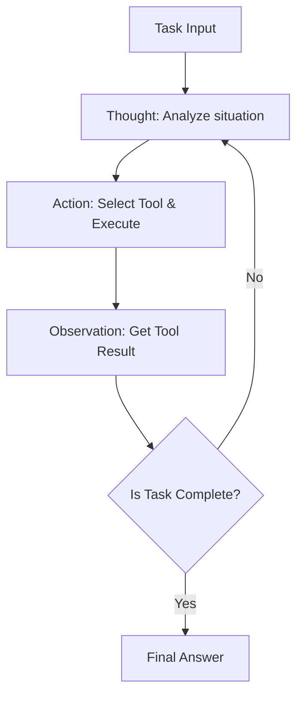
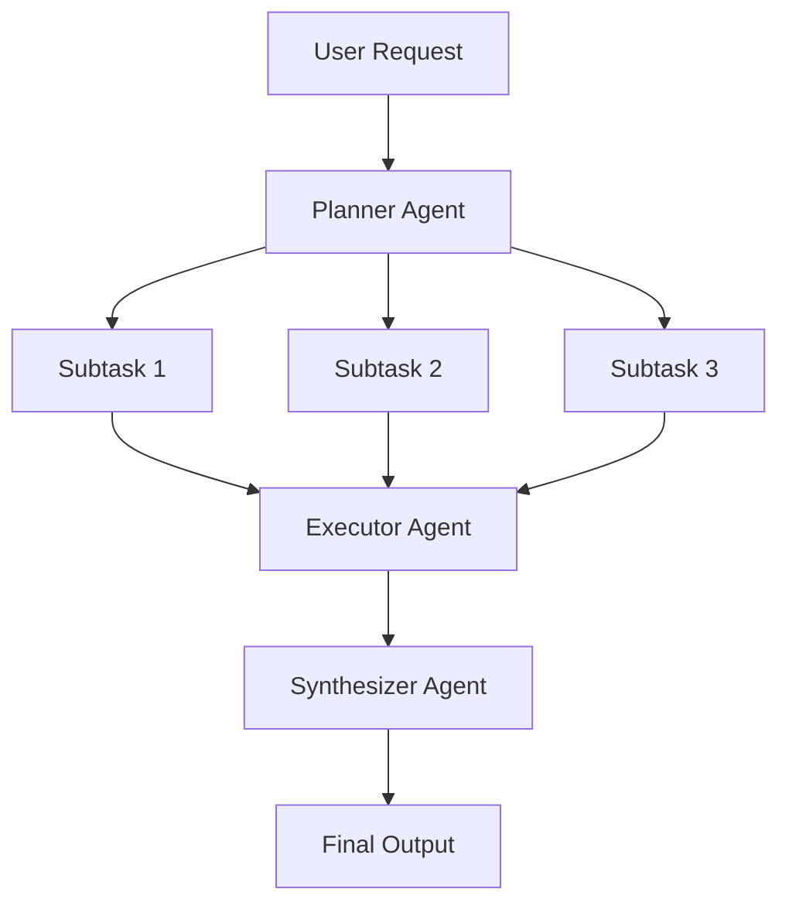
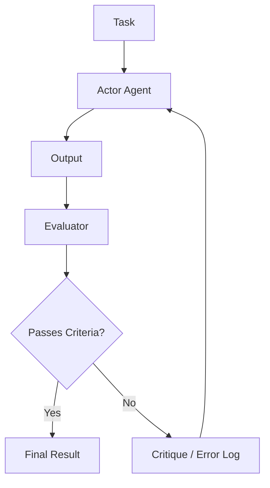

# एआई एजेंट आर्किटेक्चर डिज़ाइन की गहराई: प्रॉम्प्ट्स से लेकर ऑटोनॉमस मल्टी-एजेंट तक

आधुनिक सॉफ्टवेयर इंजीनियरिंग में, लार्ज लैंग्वेज मॉडल (LLM) पर केंद्रित एआई एजेंट का डिज़ाइन सबसे अधिक ध्यान आकर्षित करने वाले क्षेत्रों में से एक है। केवल एक "स्मार्ट चैटबॉट" बनाने का चरण समाप्त हो गया है, और अब "ऑटोनॉमस (स्वायत्त) एजेंट" के विकास की ओर एक पैराडाइम शिफ्ट हो रहा है - ऐसी प्रणालियां जो अपने वातावरण को पहचान सकती हैं, योजना बना सकती हैं, उपकरणों का उपयोग कर सकती हैं और जटिल कार्यों को निष्पादित करते हुए खुद को सुधार सकती हैं।

इस लेख में, हम एआई एजेंट आर्किटेक्चर के विकास और इसके मूल डिज़ाइन पैटर्न को, साधारण प्रॉम्प्टिंग के युग से लेकर नवीनतम मल्टी-एजेंट सिस्टम तक, अत्यधिक विस्तार के साथ गहराई से समझाएंगे।

## 1. पैराडाइम शिफ्ट: प्रॉम्प्टिंग से ऑटोनॉमस एजेंट तक का विकास

प्रारंभिक LLM का उपयोग, जैसे कि Zero-shot प्रॉम्प्टिंग और Few-shot प्रॉम्प्टिंग, एक "फंक्शन कॉल" पैराडाइम के करीब था, जहां मॉडल एक सिंगल क्वेरी के लिए संभाव्य रूप से प्रशंसनीय पाठ लौटाता था। हालाँकि, इस दृष्टिकोण की कुछ गंभीर सीमाएँ थीं:

*   **संदर्भ भूलना और दीर्घकालिक तर्क का अभाव**: चूँकि यह एक ही इनपुट/आउटपुट में पूरा हो जाता था, इसलिए जटिल, बहु-चरणीय कार्यों में पिछले चरणों के आधार पर निरंतर तर्क करना मुश्किल था।
*   **मतिभ्रम (Hallucination) पर नियंत्रण की कमी**: बाहरी तथ्यात्मक डेटा को क्रॉस-चेक करने के लिए कोई तंत्र नहीं होने के कारण, आत्मविश्वास के साथ गलत जानकारी आउटपुट करने का जोखिम था।
*   **कार्रवाई करने की क्षमता का अभाव**: डिजिटल दुनिया (API, फाइल सिस्टम, डेटाबेस) के साथ सक्रिय रूप से बातचीत करने का कोई साधन नहीं था।

इन चुनौतियों का समाधान करने के लिए, "एजेंट" की अवधारणा उभरी। एक एजेंट LLM को केवल एक "टेक्स्ट जनरेटर" के रूप में नहीं, बल्कि "सिस्टम के मस्तिष्क (तर्क इंजन)" के रूप में मानता है।

### एजेंट आर्किटेक्चर के मुख्य घटक

एक सामान्य ऑटोनॉमस एआई एजेंट निम्नलिखित मुख्य घटकों से बना होता है:

1.  **प्रोफाइल / परसोना**: एजेंट की भूमिका, उद्देश्य और बाधाओं को परिभाषित करता है।
2.  **प्लानिंग मॉड्यूल**: कार्यों को उप-कार्यों में विभाजित करता है और निष्पादन प्रक्रिया तैयार करता है।
3.  **मेमोरी सिस्टम**: अनुभव संचित करने के लिए शॉर्ट-टर्म मेमोरी (कंटेक्स्ट विंडो के भीतर) और लॉन्ग-टर्म मेमोरी (बाहरी डेटाबेस) का प्रबंधन करता है।
4.  **टूल्स / एक्शन्स**: पर्यावरण के साथ बातचीत करने के लिए इंटरफेस, जैसे API कॉल, कोड निष्पादन और वेब खोज।
5.  **रिफ्लेक्शन मॉड्यूल**: एक आत्म-प्रतिबिंब तंत्र जो निष्पादन परिणामों का मूल्यांकन करता है और यदि आवश्यक हो तो योजनाओं को संशोधित करता है।

इन घटकों को एक साथ कैसे एकीकृत किया जाए, यह आर्किटेक्चर डिज़ाइन के कौशल को दर्शाता है।

## 2. तर्क और कार्रवाई का एकीकरण: ReAct पैटर्न के मूल सिद्धांत और अभ्यास

एआई एजेंटों के लिए सबसे महत्वपूर्ण आधारभूत प्रतिमानों में से एक "ReAct (Reasoning and Acting)" पैटर्न है। प्रिंसटन यूनिवर्सिटी और Google Research के शोधकर्ताओं द्वारा प्रस्तावित यह दृष्टिकोण एजेंटों को "सोचने (Thought)" और "कार्य करने (Action)" के बीच बारी-बारी से जटिल कार्यों को हल करने की अनुमति देता है।

### ReAct का कार्य तंत्र

ReAct लूप आम तौर पर निम्नलिखित चक्र में आगे बढ़ता है:

1.  **Thought (सोचना)**: वर्तमान स्थिति का विश्लेषण करता है और LLM प्राकृतिक भाषा में तर्क करता है कि आगे क्या करना है।
2.  **Action (कार्रवाई)**: तर्क के आधार पर, यह उपलब्ध उपकरणों (उदा. वेब खोज, कैलकुलेटर, API) का चयन करता है, तर्क (arguments) निर्दिष्ट करता है, और उन्हें निष्पादित करता है।
3.  **Observation (अवलोकन)**: सिस्टम से टूल के निष्पादन परिणाम प्राप्त करता है।

### ReAct के लाभ और सीमाएँ

**लाभ:**
*   **तर्क में पारदर्शिता**: एजेंट की विचार प्रक्रिया को देखा जा सकता है ("उसने वह कार्रवाई क्यों की"), जिससे डिबगिंग आसान हो जाती है।
*   **पर्यावरण के अनुकूलन क्षमता**: चूँकि अगली सोच कार्रवाई के परिणामों (Observation) पर आधारित होती है, यह अप्रत्याशित त्रुटियों या गतिशील पर्यावरणीय परिवर्तनों को लचीले ढंग से संभाल सकता है。

**सीमाएँ:**
*   **बढ़ी हुई टोकन खपत**: प्रत्येक लूप के साथ, पिछले इतिहास (Thought, Action, Observation) को संदर्भ में शामिल किया जाना चाहिए, जो तेजी से कंटेक्स्ट विंडो की खपत करता है।
*   **अदूरदर्शी लूप**: हाथ में मौजूद Action पर बहुत अधिक ध्यान केंद्रित करके समग्र लक्ष्य को खोने और एक "अनंत लूप" में गिरने का जोखिम है, जो एक ही Action को दोहराता है।

इस "अदूरदर्शी लूप" को हल करने के लिए, "Plan-and-Solve" दृष्टिकोण पेश किया गया था, जिसकी चर्चा अगले भाग में की गई है।

## 3. व्यापक दृष्टिकोण: Plan-and-Solve दृष्टिकोण

अगर ReAct एक "चलते-चलते सोचना" दृष्टिकोण है, तो Plan-and-Solve (या Plan-and-Execute) "चलने से पहले नक्शा बनाना" दृष्टिकोण है। जटिल कार्यों के लिए, बेतरतीब कार्यों के बजाय सावधानीपूर्वक पूर्व योजना बनाना आवश्यक है।

### Plan-and-Solve प्रक्रिया

यह आर्किटेक्चर सिस्टम को मोटे तौर पर "प्लानर (योजनाकार)" और "एक्ज़ीक्यूटर (निष्पादक)" में विभाजित करता है।

1.  **Planning (योजना चरण)**:
    *   प्लानर उपयोगकर्ता के अनुरोध को प्राप्त करता है और इसे कई स्वतंत्र या आश्रित उप-कार्यों (subtasks) में तोड़ देता है।
    *   यह कार्यों के निष्पादन के क्रम को DAG (Directed Acyclic Graph) के रूप में भी निर्धारित कर सकता है।
2.  **Solving/Executing (निष्पादन चरण)**:
    *   एक्ज़ीक्यूटर प्रत्येक उप-कार्य को क्रमिक रूप से (या समानांतर में) संसाधित करता है।
    *   यहाँ एक्ज़ीक्यूटर स्वयं एक छोटे ReAct एजेंट के रूप में कार्य करना आम बात है।

### डायनेमिक रीप्लानिंग (Replanning) का महत्व

वास्तविक दुनिया के कार्यों में, चीजें अक्सर योजना के अनुसार नहीं होती हैं। उदाहरण के लिए, उप-कार्य 1 में वेब खोज करने के बाद, उप-कार्य 2 के लिए योजनाबद्ध प्रसंस्करण अनावश्यक हो सकता है, या पूरी तरह से नए दृष्टिकोण की आवश्यकता हो सकती है।

इसलिए, उन्नत Plan-and-Solve आर्किटेक्चर प्रत्येक उप-कार्य के अंत में परिणामों का मूल्यांकन करने और **शेष योजना को गतिशील रूप से संशोधित (Replanning) करने के लिए एक तंत्र** को शामिल करते हैं। यह समग्र लक्ष्य को खोए बिना लचीली कार्रवाई की अनुमति देता है।

## 4. अतीत को शक्ति में बदलना: शॉर्ट-टर्म और लॉन्ग-टर्म मेमोरी का एकीकरण

ऑटोनॉमस एजेंटों के लिए "मेमोरी (Memory)" बहुत महत्वपूर्ण है। जिस तरह मनुष्य पिछले अनुभवों के आधार पर वर्तमान निर्णय लेते हैं, उसी तरह एजेंट पिछले इंटरेक्शन इतिहास या बाहरी ज्ञान का उपयोग करके अपने प्रदर्शन में काफी सुधार कर सकते हैं।

एजेंट के मेमोरी सिस्टम को आम तौर पर "शॉर्ट-टर्म मेमोरी" और "लॉन्ग-टर्म मेमोरी" की दो-स्तरीय संरचना में डिज़ाइन किया गया है।

### शॉर्ट-टर्म मेमोरी (Short-term Memory)

शॉर्ट-टर्म मेमोरी वह जानकारी है जिसे **LLM की कंटेक्स्ट विंडो के भीतर** रखा जाता है। इसमें वर्तमान वार्तालाप इतिहास, हालिया ReAct लूप इतिहास और वर्तमान कार्य का संदर्भ शामिल है।

*   **चुनौती**: कंटेक्स्ट विंडो की एक ऊपरी सीमा (उदा. 128K, 1M टोकन, आदि) होती है और यह लंबे और जटिल कार्यों में जल्दी भर जाती है।
*   **उपाय**: संदर्भ प्रबंधन रणनीतियों की आवश्यकता होती है, जैसे पुरानी जानकारी को सारांशित करके रखना (Summary Buffer Memory) या कम महत्व के इतिहास को हटाना।

### लॉन्ग-टर्म मेमोरी (Long-term Memory) और वेक्टर डेटाबेस

लॉन्ग-टर्म मेमोरी कंटेक्स्ट विंडो की सीमाओं को पार करने और बड़ी मात्रा में पिछले अनुभवों और ज्ञान को बनाए रखने का एक तंत्र है। यहाँ **वेक्टर डेटाबेस (Vector Database)** प्रमुख भूमिका निभाता है।

1.  **मेमोरी सहेजना**: जब कोई एजेंट किसी कार्य को पूरा करता है, तो प्राप्त ज्ञान, सफल कोड स्निपेट्स या उपयोगकर्ता की प्राथमिकताओं को पाठ के रूप में निकाला जाता है, एम्बेडिंग मॉडल (Embedding Model) का उपयोग करके उच्च-आयामी वैक्टर में परिवर्तित किया जाता है, और वेक्टर डीबी में सहेजा जाता है।
2.  **मेमोरी खोजना (RAG: Retrieval-Augmented Generation)**: एक नए कार्य से निपटते समय, वर्तमान स्थिति या क्वेरी को वेक्टराइज़ किया जाता है और वेक्टर डीबी के विरुद्ध समानता खोज की जाती है।
3.  **मेमोरी का उपयोग**: खोजी गई अत्यधिक प्रासंगिक पिछली यादों को संदर्भ के रूप में LLM के समक्ष प्रस्तुत किया जाता है, जिससे अधिक सटीक तर्क को बढ़ावा मिलता है।

### मेमोरी राउटर का डिज़ाइन

उन्नत प्रणालियों में, यह निर्धारित करने के लिए एक "मेमोरी राउटर मॉड्यूल" लागू किया जाता है कि कौन सी जानकारी मेमोरी के रूप में सहेजी जानी चाहिए और इसे कब खोजा जाना चाहिए। न केवल एजेंट स्पष्ट रूप से "ज्ञान खोजने के लिए उपकरण" को कॉल करता है, बल्कि ऐसे आर्किटेक्चर भी हैं जहां सिस्टम अंतर्निहित रूप से प्रॉम्प्ट में प्रासंगिक जानकारी को इंजेक्ट करता है।

## 5. आत्म-विकास का मार्ग: Reflection (आत्म-प्रतिबिंब और सुधार) तंत्र

प्रॉम्प्ट को एक ही प्रयास में सफल बनाना मुश्किल है, और एजेंट भी अपनी प्रारंभिक कार्रवाइयों में विफल हो सकते हैं। सही मायने में ऑटोनॉमस एजेंटों में विफलता से सीखने और अपने दृष्टिकोण को सही करने की क्षमता होती है, जिसे "Reflection (प्रतिबिंब)" तंत्र के रूप में जाना जाता है।

### Reflection के मूल पैटर्न

Reflection को "कार्रवाई" -> "मूल्यांकन" -> "सुधार" का लूप बनाकर साकार किया जाता है।

1.  **Actor (अभिनेता/निष्पादक)**: प्रारंभिक समाधान या कोड उत्पन्न करता है।
2.  **Evaluator (मूल्यांकनकर्ता)**: Actor के आउटपुट का मूल्यांकन करता है। इसमें एक अन्य LLM प्रॉम्प्ट द्वारा तार्किक जांच, कंपाइलर द्वारा सिंटैक्स जांच या यूनिट परीक्षणों का निष्पादन शामिल है।
3.  **Critique (समीक्षा)**: Evaluator द्वारा पहचानी गई समस्याओं या सुधार के क्षेत्रों को प्राकृतिक भाषा में "आलोचना" के रूप में फीडबैक किया जाता है।
4.  **Refinement (सुधार)**: Actor मूल निर्देशों और Critique को प्राप्त करता है और एक बेहतर, नया समाधान उत्पन्न करता है।

### Self-Refine और Reflexion

प्रमुख विधियों में निम्नलिखित दो शामिल हैं:

*   **Self-Refine**: एक एकल LLM Actor और Evaluator दोनों की भूमिका निभाता है, अपने स्वयं के आउटपुट की "आत्म-समीक्षा" करता है और लगातार सुधार करता है।
*   **Reflexion**: एक उन्नत आर्किटेक्चर जहां एजेंट पर्यावरण से प्रतिक्रिया (उदा. गेम स्कोर, API त्रुटि संदेश) प्राप्त करता है, उसके आधार पर यह स्पष्ट करता है कि "यह क्यों विफल हुआ" (एपिडिक मेमोरी/Episodic Memory), और इस सबक का उपयोग अगले प्रयास में करता है।

Reflection को लागू करने से मतिभ्रम (Hallucination) में कमी आने और जटिल कोडिंग कार्यों में सफलता दर में उल्लेखनीय सुधार होने की उम्मीद है।

## 6. अगला फ्रंटियर: मल्टी-एजेंट सिस्टम की संरचना और अभ्यास

जैसे-जैसे कार्य अधिक जटिल होते जाते हैं, हर चीज के लिए एकल एजेंट (God Agent) पर निर्भर रहने का दृष्टिकोण अपनी सीमाओं तक पहुंच जाता है। विशिष्ट डोमेन में विशेषज्ञता रखने वाले कई एजेंटों के सहयोग से काम करने वाला "मल्टी-एजेंट सिस्टम" अब मुख्यधारा बनता जा रहा है।

### भूमिका विभाजन के माध्यम से सहयोग

एक मल्टी-एजेंट सिस्टम में, भूमिकाएं एक सॉफ्टवेयर डेवलपमेंट टीम की तरह विभाजित की जाती हैं।

*   **Product Manager Agent**: आवश्यकता परिभाषा और कार्य विभाजन का प्रभारी।
*   **Researcher Agent**: आवश्यक जानकारी खोजने और संक्षेप करने का प्रभारी।
*   **Coder Agent**: वास्तविक कोड कार्यान्वयन का प्रभारी।
*   **QA/Reviewer Agent**: कोड गुणवत्ता जांच और परीक्षण का प्रभारी।

यह प्रत्येक एजेंट को अपनी विशेषज्ञता के क्षेत्र (सिस्टम प्रॉम्प्ट और टूल्स) पर ध्यान केंद्रित करने की अनुमति देता है, जिससे समग्र गुणवत्ता में सुधार होता है।

### विशिष्ट फ्रेमवर्क: LangGraph और AutoGen

मल्टी-एजेंट बनाने के लिए फ्रेमवर्क भी तेजी से विकसित हो रहे हैं।

**1. LangGraph (LangChain इकोसिस्टम)**
LangGraph एक ऐसे दृष्टिकोण को अपनाता है जहां एजेंट वर्कफ़्लो को स्पष्ट रूप से **ग्राफ़ (नोड्स और एजेज़)** के रूप में परिभाषित किया जाता है। स्थिति (State) को नोड्स के बीच पारित किया जा सकता है और चक्रीय ग्राफ़ (लूप) बनाए जा सकते हैं, जिससे ReAct या Reflection प्रवाह को नियंत्रित करना आसान हो जाता है, और यह वाणिज्यिक स्तर के मजबूत सिस्टम बनाने के लिए उपयुक्त है।

**2. AutoGen (Microsoft)**
AutoGen एक **वार्तालाप (Conversation)** आधारित मल्टी-एजेंट फ्रेमवर्क है। एजेंट कार्यों को आगे बढ़ाने के लिए एक दूसरे के साथ चैट संदेशों का आदान-प्रदान करते हैं। एक कॉन्फ़िगर किया गया राउटर (जैसे GroupChatManager) यह नियंत्रित करता है कि "आगे कौन सा एजेंट बोलेगा," और यह ऐसी विशेषताएँ रखता है जो उभरते सहयोगी व्यवहारों को जन्म देने में आसान हैं।

### मल्टी-एजेंट आर्किटेक्चर की टोपोलॉजी

मल्टी-एजेंट सहयोग पैटर्न (टोपोलॉजी) के कई विशिष्ट रूप हैं।

1.  **अनुक्रमिक (Sequential)**: एक पाइपलाइन प्रकार जहां कार्यों को क्रम में A -> B -> C से पारित किया जाता है।
2.  **पदानुक्रमित (Hierarchical)**: एक प्रबंधक एजेंट कई कार्यकर्ता एजेंटों की देखरेख करता है, निर्देश देता है और परिणामों को एकत्र करता है।
3.  **बहस प्रकार (Debate/Group Chat)**: कई विशेषज्ञ एजेंट स्वतंत्र रूप से विचारों का आदान-प्रदान करते हैं और आम सहमति तक पहुंचते हैं।

लक्ष्य कार्य की प्रकृति के आधार पर सर्वोत्तम टोपोलॉजी चुनना आर्किटेक्चर डिज़ाइन की कुंजी है।

## 7. निष्कर्ष: ऑटोनॉमस एआई एजेंटों का भविष्य परिप्रेक्ष्य

प्रॉम्प्ट इंजीनियरिंग के युग से शुरू होकर, ReAct के माध्यम से तर्क और कार्रवाई का अधिग्रहण, Plan-and-Solve के माध्यम से योजना, Memory के माध्यम से अनुभव का संचय, Reflection के माध्यम से आत्म-विकास, और मल्टी-एजेंट के माध्यम से संगठन। एआई एजेंटों के आर्किटेक्चर ने कुछ ही वर्षों में एक आश्चर्यजनक विकास किया है।

भविष्य के दृष्टिकोण के रूप में, निम्नलिखित क्षेत्रों के और विकसित होने की उम्मीद है:

*   **मल्टी-मोडल एजेंट**: ऐसे एजेंट जो न केवल पाठ को समझते हैं बल्कि दृष्टि और ध्वनि को भी समझते हैं और सीधे GUI संचालित करते हैं (उदा. कंप्यूटर उपयोग एजेंट)।
*   **एज एआई एजेंट**: हल्के एजेंटों का विकास जो क्लाउड पर निर्भर किए बिना डिवाइस के भीतर तर्क और कार्रवाई को पूरा करते हैं।
*   **मनुष्य के साथ सहयोग (Human-in-the-Loop)**: संकर प्रणालियों (हाइब्रिड सिस्टम) का परिष्करण जहां एजेंट पूरी तरह से ऑटोनॉमस होने के बजाय महत्वपूर्ण निर्णय लेने या अनिश्चित स्थितियों में सहज रूप से मनुष्यों से मदद मांगते हैं।

एआई एजेंट आर्किटेक्चर का डिज़ाइन केवल प्रोग्रामिंग से परे है; यह "एक सिस्टम के रूप में संज्ञानात्मक मॉडल को कैसे लागू किया जाए" की एक बहुत ही बौद्धिक और रोमांचक चुनौती है। हमें उम्मीद है कि इस लेख में बताए गए पैटर्न और सिद्धांत पाठकों को अगली पीढ़ी के सिस्टम बनाने में मदद करेंगे।
