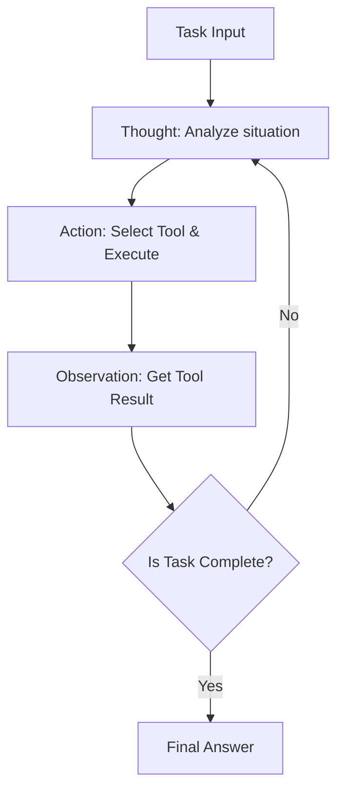
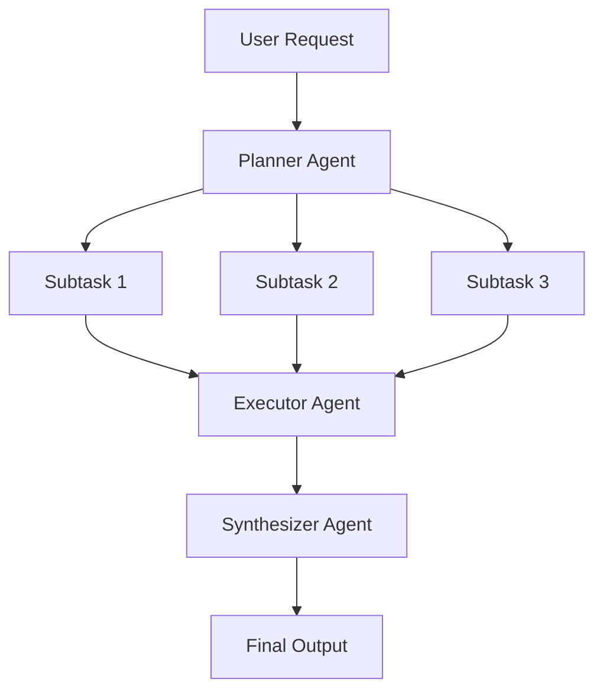
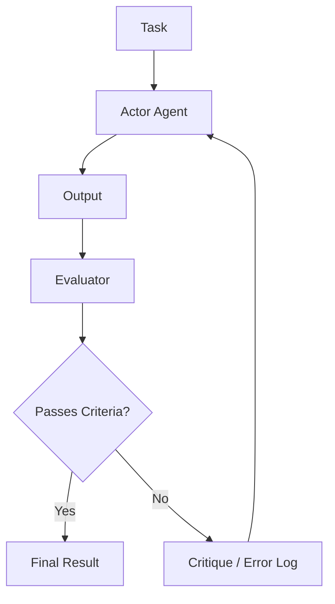

# Mendalami Desain Arsitektur Agen AI: Dari Prompt hingga Agen Multi-Otonom

Dalam rekayasa perangkat lunak modern, desain agen AI yang berpusat pada Large Language Models (LLM) adalah salah satu bidang yang paling menarik perhatian. Fase pembuatan sekadar "chatbot pintar" telah berlalu, dan terjadi pergeseran paradigma menuju pengembangan "agen otonom" di mana sistem itu sendiri yang mengenali lingkungan, menyusun rencana, memanfaatkan alat, dan melakukan koreksi mandiri sambil menjalankan tugas-tugas kompleks.

Artikel ini memberikan panduan yang sangat mendetail dan komprehensif mengenai evolusi arsitektur agen AI, mulai dari era prompting sederhana hingga sistem multi-agen modern, beserta pola desain intinya.

## 1. Pergeseran Paradigma: Evolusi dari Prompting ke Agen Otonom

Penggunaan awal LLM pada dasarnya mirip dengan "pemanggilan fungsi", di mana model mengembalikan teks yang secara probabilistik masuk akal sebagai respons terhadap kueri tunggal, seperti yang terlihat pada Zero-shot dan Few-shot prompting. Namun, pendekatan ini memiliki beberapa keterbatasan yang fatal.

*   **Melupakan Konteks dan Kurangnya Penalaran Jangka Panjang**: Karena prosesnya selesai dalam satu siklus input/output, sulit untuk mempertahankan penalaran yang konsisten berdasarkan langkah-langkah sebelumnya dalam tugas multi-tahap yang kompleks.
*   **Halusinasi yang Tidak Terkendali**: Karena tidak ada mekanisme untuk memverifikasi dengan data fakta eksternal, terdapat risiko model menghasilkan informasi yang salah dengan tingkat keyakinan tinggi.
*   **Kurangnya Kemampuan Bertindak**: Model tidak memiliki sarana untuk secara aktif berinteraksi dengan dunia digital (API, sistem file, basis data).

Untuk mengatasi masalah ini, konsep "agen" muncul. Agen memperlakukan LLM bukan sekadar "generator teks", melainkan sebagai "otak sistem" (mesin penalaran).

### Komponen Dasar Arsitektur Agen

Agen AI otonom umumnya terdiri dari komponen inti berikut:

1.  **Profil / Persona**: Mendefinisikan peran, tujuan, dan batasan agen.
2.  **Modul Perencanaan (Planning)**: Memecah tugas menjadi sub-tugas dan merumuskan langkah-langkah eksekusi.
3.  **Sistem Memori (Memory)**: Mengelola memori jangka pendek (dalam context window) dan memori jangka panjang (basis data eksternal), serta mengakumulasi pengalaman.
4.  **Alat / Aksi (Tools / Actions)**: Antarmuka untuk berinteraksi dengan lingkungan, seperti pemanggilan API, eksekusi kode, dan pencarian web.
5.  **Modul Refleksi (Reflection)**: Mekanisme refleksi diri yang mengevaluasi hasil eksekusi dan memodifikasi rencana jika diperlukan.

Bagaimana menghubungkan komponen-komponen ini adalah kunci utama dalam desain arsitektur.

## 2. Integrasi Penalaran dan Tindakan: Dasar dan Praktik Pola ReAct

Salah satu paradigma paling penting yang menjadi fondasi agen AI adalah pola "ReAct (Reasoning and Acting)". Diusulkan oleh para peneliti dari Universitas Princeton dan Google Research, metode ini memungkinkan agen untuk memecahkan tugas kompleks dengan secara bergantian mengulangi proses "Berpikir" (Thought) dan "Bertindak" (Action).

### Mekanisme Kerja ReAct

Siklus ReAct umumnya berjalan dalam urutan berikut:

1.  **Thought (Pemikiran)**: LLM menganalisis situasi saat ini dalam bahasa alami untuk menyimpulkan apa yang harus dilakukan selanjutnya.
2.  **Action (Tindakan)**: Berdasarkan penalaran tersebut, agen memilih alat yang tersedia (misalnya, pencarian web, kalkulator, API) dan menjalankannya dengan argumen tertentu.
3.  **Observation (Observasi)**: Menerima hasil eksekusi alat dari sistem.

### Keuntungan dan Keterbatasan ReAct

**Keuntungan:**
*   **Transparansi Penalaran**: Proses pemikiran di balik "mengapa agen mengambil tindakan tersebut" divisualisasikan, sehingga mempermudah proses debugging.
*   **Kemampuan Adaptasi terhadap Lingkungan**: Karena langkah pemikiran berikutnya didasarkan pada hasil tindakan (Observation), agen dapat beradaptasi secara fleksibel terhadap kesalahan tak terduga atau perubahan lingkungan yang dinamis.

**Keterbatasan:**
*   **Peningkatan Konsumsi Token**: Setiap kali siklus berulang, riwayat masa lalu (Thought, Action, Observation) harus disertakan dalam konteks, yang dengan cepat menghabiskan context window.
*   **Siklus Jangka Pendek (Miopik)**: Terlalu fokus pada Action yang ada di depan mata berisiko membuat agen kehilangan pandangan terhadap tujuan keseluruhan, terjebak dalam "loop tak terbatas" di mana ia terus mengulangi Action yang sama.

Untuk mengatasi "siklus miopik" ini, pendekatan "Plan-and-Solve" diperkenalkan, yang akan dibahas pada bagian berikutnya.

## 3. Memiliki Perspektif Makro: Pendekatan Plan-and-Solve

Jika ReAct adalah pendekatan "berpikir sambil berjalan", Plan-and-Solve (atau Plan-and-Execute) adalah pendekatan "menggambar peta sebelum mulai berjalan". Untuk tugas-tugas kompleks, perencanaan yang matang sebelumnya sangatlah penting alih-alih bertindak tanpa arah.

### Proses Plan-and-Solve

Arsitektur ini secara garis besar membagi sistem menjadi "Perencana" (Planner) dan "Pelaksana" (Executor).

1.  **Planning (Tahap Perencanaan)**:
    *   Planner menerima permintaan pengguna dan memecahnya menjadi beberapa sub-tugas yang independen atau saling bergantung.
    *   Terkadang urutan eksekusi tugas ditentukan dalam bentuk DAG (Directed Acyclic Graph).
2.  **Solving/Executing (Tahap Eksekusi)**:
    *   Executor memproses setiap sub-tugas secara berurutan (atau paralel).
    *   Umumnya, Executor itu sendiri berfungsi sebagai agen ReAct kecil.

### Pentingnya Modifikasi Rencana Dinamis (Replanning)

Dalam tugas di dunia nyata, sering kali hal-hal tidak berjalan sesuai rencana awal. Misalnya, hasil pencarian web di Sub-tugas 1 mungkin membuat pemrosesan yang direncanakan di Sub-tugas 2 menjadi tidak perlu, atau mungkin memerlukan pendekatan yang sama sekali baru.

Oleh karena itu, dalam arsitektur Plan-and-Solve tingkat lanjut, **mekanisme untuk memodifikasi rencana yang tersisa secara dinamis (Replanning)** diintegrasikan dengan mengevaluasi hasil pada akhir setiap sub-tugas. Ini memungkinkan agen bertindak secara fleksibel tanpa kehilangan fokus pada tujuan akhir.

## 4. Mengubah Masa Lalu Menjadi Kekuatan: Integrasi Memori Jangka Pendek dan Jangka Panjang

"Memori" (Memory) sangat krusial bagi agen otonom. Sama seperti manusia yang membuat keputusan saat ini berdasarkan pengalaman masa lalu, agen dapat secara dramatis meningkatkan kinerjanya dengan memanfaatkan riwayat interaksi masa lalu atau pengetahuan eksternal.

Sistem memori agen umumnya dirancang dalam struktur dua lapis: "memori jangka pendek" dan "memori jangka panjang".

### Memori Jangka Pendek (Short-term Memory)

Memori jangka pendek adalah informasi yang disimpan **di dalam context window LLM**. Ini mencakup riwayat percakapan saat ini, riwayat siklus ReAct terbaru, dan konteks tugas yang sedang berjalan.

*   **Tantangan**: Context window memiliki batas atas (misalnya, 128K atau 1M token), dan akan cepat penuh dalam tugas yang panjang dan kompleks.
*   **Solusi**: Strategi manajemen konteks diperlukan, seperti menyimpan ringkasan informasi lama (Summary Buffer Memory) atau menghapus riwayat yang kurang penting.

### Memori Jangka Panjang (Long-term Memory) dan Basis Data Vektor

Memori jangka panjang adalah mekanisme untuk melanggengkan sejumlah besar pengalaman dan pengetahuan masa lalu melebihi batasan context window. Di sini, **Basis Data Vektor (Vector Database)** memainkan peran utama.

1.  **Menyimpan Memori**: Ketika agen menyelesaikan tugas, wawasan yang diperoleh, cuplikan kode yang berhasil, atau preferensi pengguna diekstraksi sebagai teks, diubah menjadi vektor berdimensi tinggi menggunakan Model Embedding, dan disimpan dalam Vector DB.
2.  **Mencari Memori (RAG: Retrieval-Augmented Generation)**: Saat menangani tugas baru, agen melakukan vektorisasi pada situasi atau kueri saat ini dan melakukan pencarian kemiripan terhadap Vector DB.
3.  **Memanfaatkan Memori**: Kenangan relevan dari masa lalu yang ditemukan disajikan kepada LLM sebagai konteks untuk mendorong penalaran yang lebih akurat.

### Desain Router Memori

Dalam sistem tingkat lanjut, "modul router memori" diimplementasikan untuk menentukan informasi apa yang harus disimpan sebagai memori dan kapan harus dicari. Agen tidak hanya memanggil "alat pencarian pengetahuan" secara eksplisit, tetapi ada juga arsitektur di mana sistem secara implisit menyuntikkan informasi terkait ke dalam prompt.

## 5. Jalan Menuju Evolusi Mandiri: Mekanisme Refleksi (Reflection)

Sangat sulit untuk menyempurnakan prompt dalam satu percobaan, dan agen juga sering gagal dalam tindakan awalnya. Agen yang benar-benar otonom memiliki kemampuan untuk belajar dari kegagalan dan memodifikasi pendekatannya sendiri, yang dikenal sebagai mekanisme "Refleksi" (Reflection).

### Pola Dasar Reflection

Reflection diwujudkan dengan membangun siklus "Tindakan" (Action) -> "Evaluasi" (Evaluation) -> "Perbaikan" (Refinement).

1.  **Actor (Pelaksana)**: Menghasilkan solusi atau kode awal.
2.  **Evaluator (Pengevaluasi)**: Mengevaluasi output dari Actor. Ini dapat mencakup pemeriksaan logis oleh prompt LLM lain, pemeriksaan sintaks oleh kompiler, atau eksekusi pengujian unit.
3.  **Critique (Kritik)**: Memberikan umpan balik mengenai masalah atau area yang perlu ditingkatkan yang ditemukan oleh Evaluator, yang diungkapkan sebagai "kritik" dalam bahasa alami.
4.  **Refinement (Perbaikan)**: Actor menerima instruksi asli dan Kritik, lalu menghasilkan solusi baru yang telah disempurnakan.

### Self-Refine dan Reflexion

Dua pendekatan umum meliputi:

*   **Self-Refine**: LLM tunggal bertindak sebagai Actor dan Evaluator, melakukan "kritik diri" pada outputnya sendiri, dan mengulangi proses perbaikan.
*   **Reflexion**: Sebuah arsitektur canggih di mana agen menerima umpan balik dari lingkungan (misalnya, skor permainan, pesan kesalahan API), menggunakan itu untuk merumuskan pelajaran tentang "mengapa sistem ini gagal" dalam bahasa alami (Memori Episodik), dan menerapkannya pada percobaan berikutnya.

Penerapan Reflection diharapkan dapat secara signifikan mengurangi halusinasi dan meningkatkan tingkat keberhasilan dalam tugas pengkodean yang kompleks.

## 6. Frontier Berikutnya: Komposisi dan Praktik Sistem Multi-Agen

Pendekatan yang menyerahkan segalanya kepada satu agen tunggal (God Agent) akan mencapai batasnya seiring dengan meningkatnya kompleksitas tugas. "Sistem Multi-Agen", di mana beberapa agen yang berspesialisasi dalam domain tertentu bekerja sama, kini menjadi tren utama.

### Kolaborasi melalui Pembagian Peran

Dalam sistem multi-agen, peran dibagi-bagi seperti halnya dalam tim pengembangan perangkat lunak.

*   **Product Manager Agent**: Bertanggung jawab atas definisi persyaratan dan pembagian tugas.
*   **Researcher Agent**: Bertanggung jawab untuk mencari dan meringkas informasi yang diperlukan.
*   **Coder Agent**: Bertanggung jawab atas implementasi kode aktual.
*   **QA/Reviewer Agent**: Bertanggung jawab atas pemeriksaan kualitas kode dan pengujian.

Hal ini memungkinkan setiap agen untuk fokus pada bidang keahliannya sendiri (system prompt dan alatnya), yang pada akhirnya meningkatkan kualitas keseluruhan.

### Framework Terkemuka: LangGraph dan AutoGen

Framework untuk membangun sistem multi-agen juga berkembang pesat.

**1. LangGraph (Ekosistem LangChain)**
LangGraph mengambil pendekatan dengan secara eksplisit mendefinisikan alur kerja agen sebagai **grafik (node dan edge)**. Ia mengoper state (status) antar node dan mampu membangun grafik siklik (loop). Hal ini memudahkan pengontrolan alur ReAct atau Reflection, sehingga ideal untuk membangun sistem level komersial yang tangguh.

**2. AutoGen (Microsoft)**
AutoGen adalah framework multi-agen berbasis **percakapan (Conversation)**. Agen menyelesaikan tugas dengan saling bertukar pesan obrolan. Router yang dikonfigurasi (seperti GroupChatManager) mengontrol "agen mana yang harus berbicara selanjutnya", yang merupakan karakteristik pemicu lahirnya perilaku kooperatif yang kolaboratif.

### Topologi Arsitektur Multi-Agen

Ada beberapa pola (topologi) tipikal untuk kolaborasi multi-agen.

1.  **Sekuensial (Sequential)**: Tipe pipeline di mana tugas dialihkan secara berurutan, seperti A -> B -> C.
2.  **Hierarkis (Hierarchical)**: Agen manajer mengawasi beberapa agen pekerja, mendistribusikan instruksi, dan mengumpulkan hasil.
3.  **Debat (Debate/Group Chat)**: Beberapa agen ahli dengan bebas bertukar pendapat untuk mencapai konsensus.

Kunci desain arsitektur ini adalah memilih topologi yang optimal berdasarkan sifat tugas yang dihadapi.

## 7. Penutup: Prospek Masa Depan Agen AI Otonom

Dimulai dengan era prompt engineering, akuisisi penalaran dan tindakan melalui ReAct, perencanaan melalui Plan-and-Solve, akumulasi pengalaman melalui Memory, evolusi mandiri melalui Reflection, dan pengorganisasian melalui multi-agen. Arsitektur agen AI telah mengalami evolusi yang mencengangkan hanya dalam beberapa tahun.

Ke depannya, area-area berikut ini diharapkan akan berkembang lebih jauh.

*   **Agen Multi-Modal**: Penyebaran agen yang tidak hanya memahami teks tetapi juga penglihatan dan suara, serta dapat mengoperasikan GUI secara langsung (misalnya, agen operasi komputer).
*   **Agen AI Edge**: Pengembangan agen ringan yang menyelesaikan proses penalaran dan tindakan secara lokal di perangkat tanpa bergantung pada cloud.
*   **Kolaborasi dengan Manusia (Human-in-the-Loop)**: Penyempurnaan sistem hybrid di mana agen tidak sepenuhnya otonom, melainkan meminta bantuan manusia secara mulus dalam pengambilan keputusan penting atau situasi yang tidak pasti.

Merancang arsitektur agen AI lebih dari sekadar pemrograman belaka; ini adalah tantangan yang sangat intelektual dan menarik tentang "bagaimana mengimplementasikan model kognitif sebagai sebuah sistem". Kami berharap pola dan prinsip yang dibahas dalam artikel ini dapat membantu Anda dalam membangun sistem generasi berikutnya.
