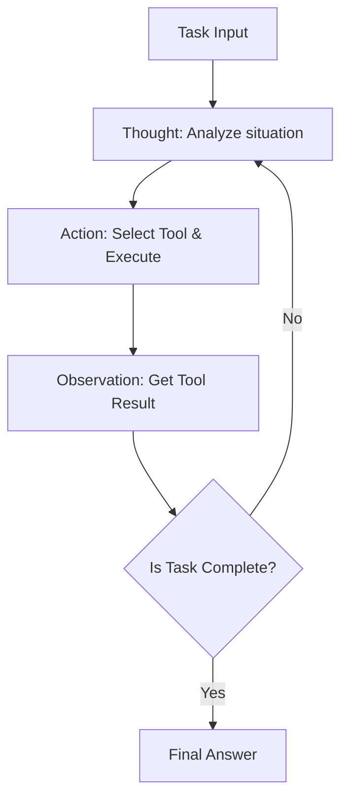
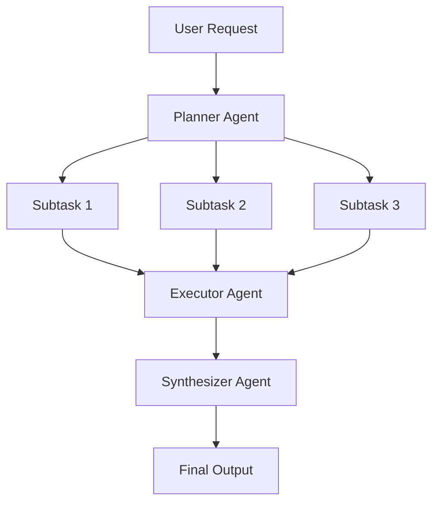
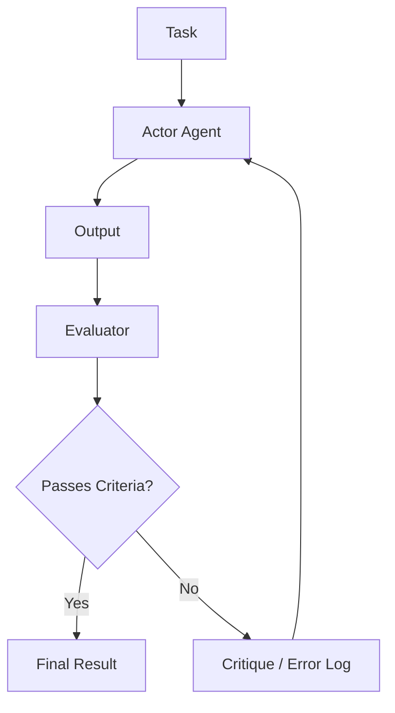

# AI 에이전트 아키텍처 설계의 심층: 프롬프트에서 자율형 멀티 에이전트까지

현대 소프트웨어 엔지니어링에서 대규모 언어 모델(LLM)을 중심으로 한 AI 에이전트 설계는 가장 주목받는 영역 중 하나입니다. 단순히 '똑똑한 챗봇'을 만드는 단계는 끝나고, 시스템 스스로 환경을 인식하고, 계획을 세우며, 도구를 활용하고, 스스로 수정해가며 복잡한 과제를 수행하는 '자율형 에이전트' 개발로 패러다임 전환이 일어나고 있습니다.

이 글에서는 단순한 프롬프팅 시대부터 최신 멀티 에이전트 시스템에 이르기까지 AI 에이전트 아키텍처의 진화와 그 핵심이 되는 설계 패턴을 압도적으로 자세히 파헤쳐 보겠습니다.

## 1. 패러다임 전환: 프롬프팅에서 자율형 에이전트로의 진화

초기 LLM 활용은 Zero-shot 프롬프팅이나 Few-shot 프롬프팅으로 대표되듯, 단발성 쿼리에 대해 모델이 확률적으로 그럴싸한 텍스트를 반환하는 일종의 '함수 호출'에 가까운 패러다임이었습니다. 그러나 이 접근법에는 몇 가지 치명적인 한계가 존재했습니다.

*   **컨텍스트 망각과 장기적 추론의 부재**: 한 번의 입출력으로 완결되기 때문에 복잡한 다단계 작업에서 과거 단계를 바탕으로 한 일관된 추론이 어려웠습니다.
*   **환각(할루시네이션)의 통제 불가**: 외부의 사실 데이터와 대조하는 메커니즘이 없어 잘못된 정보를 확신을 가지고 출력해 버릴 위험이 있었습니다.
*   **행동 능력의 부재**: 디지털 세계(API, 파일 시스템, 데이터베이스)에 능동적으로 작용할 수단을 갖지 못했습니다.

이러한 과제들을 해결하기 위해 등장한 것이 '에이전트'라는 개념입니다. 에이전트는 LLM을 단순한 '텍스트 생성기'가 아니라 '시스템의 뇌(추론 엔진)'로 다룹니다.

### 에이전트 아키텍처의 기본 구성 요소

일반적인 자율형 AI 에이전트는 다음의 핵심 컴포넌트로 구성됩니다.

1.  **프로필 / 페르소나**: 에이전트의 역할, 목적, 제약 사항을 정의합니다.
2.  **플래닝 모듈**: 작업을 하위 작업(subtask)으로 분해하고 실행 절차를 수립합니다.
3.  **메모리 시스템**: 단기 기억(컨텍스트 윈도우 내)과 장기 기억(외부 데이터베이스)을 관리하고 경험을 축적합니다.
4.  **도구 / 액션**: API 호출, 코드 실행, 웹 검색 등 환경에 작용하는 인터페이스입니다.
5.  **리플렉션 모듈**: 실행 결과를 평가하고 필요에 따라 계획을 수정하는 자기 반성 메커니즘입니다.

이러한 컴포넌트들을 어떻게 연계시킬지가 아키텍처 설계의 묘미입니다.

## 2. 추론과 행동의 통합: ReAct 패턴의 기초와 실천

AI 에이전트의 기반이 되는 가장 중요한 패러다임 중 하나가 'ReAct (Reasoning and Acting)' 패턴입니다. 프린스턴 대학교와 Google Research의 연구자들이 제안한 이 기법은 에이전트가 '생각하기(Thought)'와 '행동하기(Action)'를 번갈아 반복함으로써 복잡한 작업을 해결할 수 있게 합니다.

### ReAct의 동작 메커니즘

ReAct 루프는 일반적으로 다음 사이클로 진행됩니다.

1.  **Thought (사고)**: 현재 상황을 분석하고 다음에 무엇을 해야 할지 LLM이 자연어로 추론합니다.
2.  **Action (행동)**: 추론을 바탕으로 이용 가능한 도구(예: 웹 검색, 계산기, API)를 선택하고 인수를 지정하여 실행합니다.
3.  **Observation (관찰)**: 도구의 실행 결과를 시스템으로부터 받습니다.

### ReAct의 장점과 한계

**장점:**
*   **추론의 투명성**: 에이전트가 '왜 그런 행동을 했는지'에 대한 사고 과정이 시각화되므로 디버깅이 용이합니다.
*   **환경에 대한 적응성**: 행동의 결과(Observation)를 바탕으로 다음 사고를 진행하기 때문에 예기치 못한 에러나 동적인 환경 변화에 유연하게 대응할 수 있습니다.

**한계:**
*   **토큰 소비의 증가**: 루프가 돌 때마다 과거의 기록(Thought, Action, Observation)을 컨텍스트에 포함시켜야 하므로 컨텍스트 윈도우를 급속히 소비합니다.
*   **근시안적인 루프**: 눈앞의 Action에 너무 집중한 나머지 전체적인 목표를 잃어버리고 같은 Action을 반복하는 '무한 루프'에 빠질 위험이 있습니다.

이러한 '근시안적인 루프'를 해결하기 위해 도입된 것이 다음 항목에서 설명할 'Plan-and-Solve' 접근법입니다.

## 3. 대국적인 시야를 가지다: Plan-and-Solve 접근법

ReAct가 '걸어가면서 생각하는' 접근법이라면, Plan-and-Solve(또는 Plan-and-Execute)는 '지도를 그리고 나서 걷기 시작하는' 접근법입니다. 복잡한 작업에서는 임기응변식 행동이 아니라 사전에 치밀한 계획을 세우는 것이 필수적입니다.

### Plan-and-Solve의 프로세스

이 아키텍처는 시스템을 크게 '플래너(계획자)'와 '익스큐터(실행자)'로 분리합니다.

1.  **Planning (계획 단계)**:
    *   플래너가 사용자의 요청을 받아 그것을 여러 개의 독립적이거나 의존성이 있는 하위 작업으로 분해합니다.
    *   DAG(방향성 비순환 그래프) 형태로 작업의 실행 순서를 결정하기도 합니다.
2.  **Solving/Executing (실행 단계)**:
    *   익스큐터가 각 하위 작업을 순차적으로(또는 병렬로) 처리합니다.
    *   여기서 익스큐터 자체가 작은 ReAct 에이전트로서 기능하는 것이 일반적입니다.

### 동적 계획 변경(Replanning)의 중요성

현실의 작업에서는 사전 계획대로 진행되지 않는 경우가 많습니다. 예를 들어, 하위 작업 1에서 웹 검색을 한 결과, 하위 작업 2에서 예정했던 처리가 불필요해지거나 아예 새로운 접근법이 필요해지는 경우입니다.

따라서 고도화된 Plan-and-Solve 아키텍처에서는 각 하위 작업 종료 시 결과를 평가하고 **남은 계획을 동적으로 수정(Replanning)하는 메커니즘**이 통합됩니다. 이를 통해 대국적인 목표를 잃지 않으면서도 유연성을 유지하는 행동이 가능해집니다.

## 4. 과거를 힘으로 바꾸다: 단기 기억과 장기 기억의 통합

자율형 에이전트에게 '기억(Memory)'은 매우 중요합니다. 인간이 과거의 경험을 바탕으로 현재의 판단을 내리는 것처럼, 에이전트도 과거의 상호작용 기록이나 외부 지식을 활용함으로써 성능을 비약적으로 향상시킬 수 있습니다.

에이전트의 기억 시스템은 일반적으로 '단기 기억'과 '장기 기억'의 2계층 구조로 설계됩니다.

### 단기 기억 (Short-term Memory)

단기 기억은 **LLM의 컨텍스트 윈도우 내**에 유지되는 정보입니다. 현재의 대화 기록, 가장 최근의 ReAct 루프 기록, 현재 작업의 컨텍스트 등이 여기에 해당합니다.

*   **과제**: 컨텍스트 윈도우에는 상한(예: 128K, 1M 토큰 등)이 있어 길고 복잡한 작업에서는 금방 넘쳐버립니다.
*   **대책**: 오래된 정보를 요약해서 보존하거나(Summary Buffer Memory), 중요도가 낮은 기록을 삭제하는 등의 컨텍스트 관리 전략이 필요해집니다.

### 장기 기억 (Long-term Memory)과 벡터 데이터베이스

장기 기억은 컨텍스트 윈도우의 제한을 넘어 방대한 과거 경험이나 지식을 영구화하는 메커니즘입니다. 여기서는 **벡터 데이터베이스(Vector Database)**가 주역이 됩니다.

1.  **기억의 저장**: 에이전트가 작업을 완료했을 때 얻은 지식, 성공한 코드 스니펫, 또는 사용자의 취향 등을 텍스트로 추출하고, 임베딩 모델(Embedding Model)을 사용해 고차원 벡터로 변환하여 벡터 DB에 저장합니다.
2.  **기억의 검색 (RAG: Retrieval-Augmented Generation)**: 새로운 작업에 착수할 때 현재 상황이나 쿼리를 벡터화하고 벡터 DB에 대해 유사도 검색을 수행합니다.
3.  **기억의 활용**: 검색된 관련성 높은 과거의 기억을 컨텍스트로서 LLM에 제시하여 더 정확도 높은 추론을 유도합니다.

### 메모리 라우터의 설계

고도화된 시스템에서는 어떤 정보를 기억으로 저장하고 언제 검색해야 할지 판단하는 '메모리 라우터 모듈'이 구현됩니다. 에이전트가 '지식을 검색하는 도구'를 명시적으로 호출할 뿐만 아니라, 시스템이 암묵적으로 관련 정보를 프롬프트에 주입하는 아키텍처도 존재합니다.

## 5. 자기 진화의 길: Reflection (자기 반성·수정) 메커니즘

프롬프트를 단번에 성공시키는 것은 어려우며, 에이전트도 초기 행동에서 실패할 수 있습니다. 진정으로 자율적인 에이전트는 실패로부터 배우고 자신의 접근법을 수정하는 능력, 즉 'Reflection(반성)' 메커니즘을 갖추고 있습니다.

### Reflection의 기본 패턴

Reflection은 '행동' -> '평가' -> '개선'의 루프를 구축함으로써 실현됩니다.

1.  **Actor (실행자)**: 초기의 해결책이나 코드를 생성합니다.
2.  **Evaluator (평가자)**: Actor의 출력을 평가합니다. 여기에는 다른 LLM 프롬프트에 의한 논리적 검사, 컴파일러에 의한 구문 검사, 또는 단위 테스트 실행 등이 포함됩니다.
3.  **Critique (비평)**: Evaluator가 발견한 문제점이나 개선해야 할 점을 자연어로 된 '비평'으로서 피드백합니다.
4.  **Refinement (수정)**: Actor는 원래의 지시와 Critique을 받아 개선된 새로운 해결책을 생성합니다.

### Self-Refine과 Reflexion

대표적인 기법으로 다음의 두 가지를 들 수 있습니다.

*   **Self-Refine**: 단일 LLM이 Actor와 Evaluator의 역할을 모두 담당하여 자신의 출력에 대해 '자기 비평'을 수행하고 개선을 반복합니다.
*   **Reflexion**: 에이전트가 환경으로부터의 피드백(예: 게임 점수, API의 에러 메시지)을 받아 그것을 바탕으로 '왜 실패했는가'라는 교훈(Episodic Memory)을 언어화하고, 다음 시도에 활용하는 고도의 아키텍처입니다.

Reflection의 구현을 통해 할루시네이션의 감소나 복잡한 코딩 작업에서의 성공률을 대폭 향상시킬 수 있을 것으로 기대됩니다.

## 6. 다음 개척지: 멀티 에이전트 시스템의 구성과 실천

단일 에이전트에게 모든 것을 맡기는(God Agent) 접근법은 작업이 복잡해질수록 한계를 맞이합니다. 특정 도메인에 특화된 여러 에이전트가 협조하여 일하는 '멀티 에이전트 시스템'이 현재 주류가 되어가고 있습니다.

### 역할 분담에 의한 협조

멀티 에이전트 시스템에서는 소프트웨어 개발 팀처럼 역할을 분담합니다.

*   **Product Manager Agent**: 요구사항 정의와 작업 분해를 담당합니다.
*   **Researcher Agent**: 필요한 정보의 검색과 요약을 담당합니다.
*   **Coder Agent**: 실제 코드 구현을 담당합니다.
*   **QA/Reviewer Agent**: 코드의 품질 검사와 테스트를 담당합니다.

이를 통해 각 에이전트는 자신의 전문 영역(시스템 프롬프트와 도구)에 집중할 수 있어 전체적인 품질이 향상됩니다.

### 대표적인 프레임워크: LangGraph와 AutoGen

멀티 에이전트를 구축하기 위한 프레임워크도 빠르게 진화하고 있습니다.

**1. LangGraph (LangChain 에코시스템)**
LangGraph는 에이전트의 워크플로우를 **그래프(노드와 엣지)**로서 명시적으로 정의하는 접근법을 취합니다. 상태(State)를 노드 간에 전달하고 순환적인 그래프(루프)를 구축할 수 있기 때문에 ReAct나 Reflection의 흐름을 제어하기 쉬워 상업용 수준의 견고한 시스템 구축에 적합합니다.

**2. AutoGen (Microsoft)**
AutoGen은 **대화(Conversation)**를 기반으로 한 멀티 에이전트 프레임워크입니다. 에이전트끼리 채팅 메시지를 주고받음으로써 작업을 진행합니다. 설정된 라우터(GroupChatManager 등)가 '다음에 어떤 에이전트가 발언해야 할지'를 제어하여 창발적인 협조 행동을 이끌어내기 쉬운 특징이 있습니다.

### 멀티 에이전트 아키텍처의 토폴로지

멀티 에이전트의 연계 패턴(토폴로지)에는 몇 가지 전형적인 형태가 있습니다.

1.  **순차형 (Sequential)**: A -> B -> C로 순서대로 작업을 인계하는 파이프라인 형태입니다.
2.  **계층형 (Hierarchical)**: 매니저 에이전트가 여러 워커 에이전트를 총괄하고 지시와 결과의 집계를 수행합니다.
3.  **토론형 (Debate/Group Chat)**: 여러 전문가 에이전트가 자유롭게 의견을 나누고 합의를 형성합니다.

목적으로 하는 작업의 성질에 따라 최적의 토폴로지를 선택하는 것이 아키텍처 설계의 열쇠가 됩니다.

## 7. 맺음말: 자율형 AI 에이전트의 미래 전망

프롬프트 엔지니어링의 시대부터 시작하여, ReAct를 통한 추론과 행동의 획득, Plan-and-Solve를 통한 계획성, Memory를 통한 경험의 축적, Reflection을 통한 자기 진화, 그리고 멀티 에이전트를 통한 조직화까지. AI 에이전트의 아키텍처는 불과 몇 년 사이에 경이로운 진화를 이룩했습니다.

향후 전망으로는 다음과 같은 영역이 더욱 발전해 나갈 것으로 예상됩니다.

*   **멀티모달 에이전트**: 텍스트뿐만 아니라 시각이나 음성을 이해하고 GUI를 직접 조작하는 에이전트의 보급(예: 컴퓨터 이용 에이전트).
*   **엣지 AI 에이전트**: 클라우드에 의존하지 않고 디바이스 로컬에서 추론과 행동을 완결시키는 경량 에이전트의 발전.
*   **인간과의 협조 (Human-in-the-Loop)**: 에이전트가 완전히 자율화하는 것이 아니라 중요한 의사결정이나 불확실한 상황에서 매끄럽게 인간에게 도움을 요청하는 하이브리드 시스템의 정교화.

AI 에이전트 아키텍처의 설계는 단순한 프로그래밍을 넘어 '인지 모델을 어떻게 시스템으로 구현할 것인가'라는 매우 지적이고 흥미진진한 도전입니다. 이 글에서 설명한 패턴과 원칙이 독자 여러분의 차세대 시스템 구축에 도움이 되기를 바랍니다.
