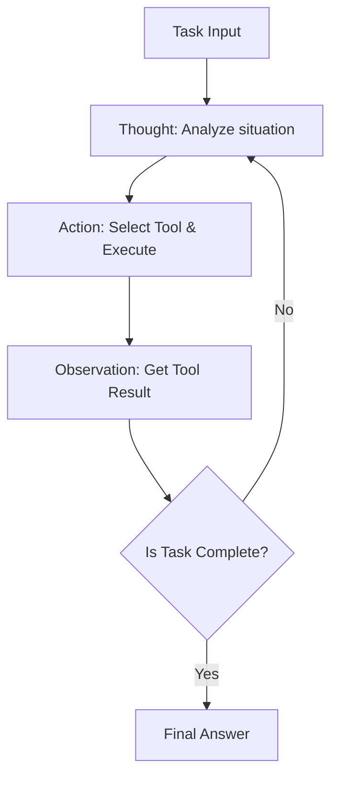
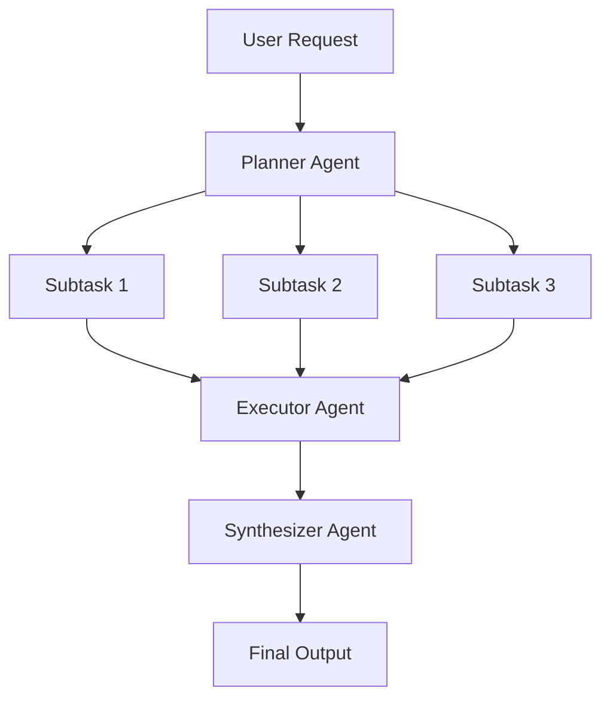
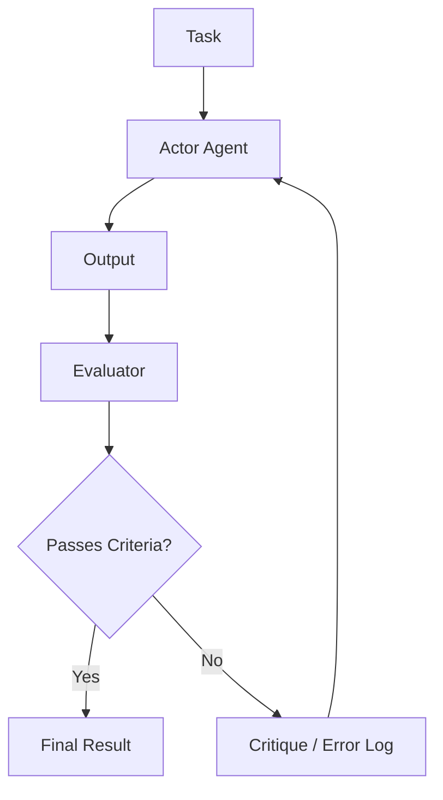

# AIエージェントアーキテクチャ設計の深層：プロンプトから自律型マルチエージェントまで

現代のソフトウェアエンジニアリングにおいて、大規模言語モデル（LLM）を中心としたAIエージェントの設計は最も注目される領域の一つです。単に「賢いチャットボット」を作る段階は終わり、システム自身が環境を認識し、計画を立て、ツールを駆使し、自己修正しながら複雑なタスクを遂行する「自律型エージェント」の開発へとパラダイムシフトが起きています。

本記事では、単純なプロンプティングの時代から最新のマルチエージェントシステムに至るまで、AIエージェントアーキテクチャの進化とその中核となる設計パターンを、圧倒的な詳しさで徹底的に解説します。

## 1. パラダイムシフト：プロンプティングから自律型エージェントへの進化

初期のLLM利用は、Zero-shotプロンプティングやFew-shotプロンプティングに代表されるように、単発のクエリに対してモデルが確率的に尤もらしいテキストを返すという、いわば「関数呼び出し」に近いパラダイムでした。しかし、このアプローチにはいくつかの致命的な限界が存在しました。

*   **コンテキストの忘却と長期的推論の欠如**: 一度の入出力で完結するため、複雑な多段階タスクにおいて過去のステップを踏まえた一貫した推論が困難でした。
*   **幻覚（ハルシネーション）の制御不能**: 外部の事実データと照合する仕組みがないため、誤った情報を確信を持って出力してしまうリスクがありました。
*   **行動能力の欠如**: デジタル世界（API、ファイルシステム、データベース）に対して能動的に働きかける手段を持ちませんでした。

これらの課題を解決するために登場したのが、「エージェント」という概念です。エージェントはLLMを単なる「テキスト生成器」としてではなく、「システムの脳（推論エンジン）」として扱います。

### エージェントアーキテクチャの基本構成要素

一般的な自律型AIエージェントは、以下のコアコンポーネントで構成されます。

1.  **プロファイル / ペルソナ**: エージェントの役割、目的、制約事項を定義します。
2.  **プランニングモジュール**: タスクをサブタスクに分解し、実行手順を策定します。
3.  **メモリシステム**: 短期記憶（コンテキストウィンドウ内）と長期記憶（外部データベース）を管理し、経験を蓄積します。
4.  **ツール / アクション**: API呼び出し、コード実行、Web検索など、環境に対して作用するインターフェースです。
5.  **リフレクションモジュール**: 実行結果を評価し、必要に応じて計画を修正する自己反省機構です。

これらのコンポーネントをどのように連携させるかが、アーキテクチャ設計の腕の見せ所となります。

## 2. 推論と行動の統合：ReActパターンの基礎と実践

AIエージェントの基盤となる最も重要なパラダイムの一つが「ReAct (Reasoning and Acting)」パターンです。プリンストン大学とGoogle Researchの研究者によって提唱されたこの手法は、エージェントが「考えること（Thought）」と「行動すること（Action）」を交互に繰り返すことで、複雑なタスクを解決可能にします。

### ReActの動作メカニズム

ReActループは、一般的に以下のサイクルで進行します。

1.  **Thought (思考)**: 現在の状況を分析し、次に何をすべきかをLLMが自然言語で推論します。
2.  **Action (行動)**: 推論に基づき、利用可能なツール（例：Web検索、計算機、API）を選択し、引数を指定して実行します。
3.  **Observation (観察)**: ツールの実行結果をシステムから受け取ります。

### ReActの利点と限界

**利点:**
*   **推論の透明性**: エージェントが「なぜその行動をとったのか」という思考プロセスが可視化されるため、デバッグが容易になります。
*   **環境への適応性**: 行動の結果（Observation）に基づいて次の思考を行うため、予期せぬエラーや動的な環境変化に柔軟に対応できます。

**限界:**
*   **トークン消費の増大**: ループが回るたびに過去の履歴（Thought, Action, Observation）をコンテキストに含める必要があり、コンテキストウィンドウを急速に消費します。
*   **近視眼的なループ**: 目の前のActionに集中しすぎるあまり、全体的な目標を見失い、同じActionを繰り返す「無限ループ」に陥るリスクがあります。

この「近視眼的なループ」を解決するために導入されたのが、次項で解説する「Plan-and-Solve」アプローチです。

## 3. 大局的な視野を持つ：Plan-and-Solve アプローチ

ReActが「歩きながら考える」アプローチだとすれば、Plan-and-Solve（あるいはPlan-and-Execute）は「地図を描いてから歩き出す」アプローチです。複雑なタスクにおいては、行き当たりばったりの行動ではなく、事前に入念な計画を立てることが不可欠です。

### Plan-and-Solveのプロセス

このアーキテクチャは、システムを大きく「プランナー（計画者）」と「エグゼキューター（実行者）」に分離します。

1.  **Planning (計画段階)**:
    *   プランナーがユーザーの要求を受け取り、それを複数の独立した、あるいは依存関係のあるサブタスクに分解します。
    *   DAG（有向非巡回グラフ）の形でタスクの実行順序を決定することもあります。
2.  **Solving/Executing (実行段階)**:
    *   エグゼキューターが各サブタスクを順次（または並行して）処理します。
    *   ここでのエグゼキューター自体が、小さなReActエージェントとして機能することが一般的です。

### 動的計画変更（Replanning）の重要性

現実のタスクでは、事前の計画通りに進まないことが多々あります。例えば、サブタスク1でWeb検索を行った結果、サブタスク2で予定していた処理が不要になる、あるいは全く新しいアプローチが必要になるケースです。

そのため、高度なPlan-and-Solveアーキテクチャでは、各サブタスクの終了時に結果を評価し、**残りの計画を動的に修正（Replanning）するメカニズム**が組み込まれます。これにより、大局的な目標を見失わず、かつ柔軟性を保った行動が可能になります。

## 4. 過去を力に変える：短期記憶と長期記憶の統合

自律型エージェントにとって「記憶（Memory）」は極めて重要です。人間が過去の経験に基づいて現在の判断を下すように、エージェントも過去のインタラクション履歴や外部知識を活用することで、パフォーマンスを飛躍的に向上させることができます。

エージェントの記憶システムは、一般的に「短期記憶」と「長期記憶」の二層構造で設計されます。

### 短期記憶 (Short-term Memory)

短期記憶は、**LLMのコンテキストウィンドウ内**に保持される情報です。現在の会話履歴、直近のReActループの履歴、現在のタスクのコンテキストなどが該当します。

*   **課題**: コンテキストウィンドウには上限（例：128K, 1Mトークンなど）があり、長く複雑なタスクではすぐに溢れてしまいます。
*   **対策**: 古い情報を要約して保持する（Summary Buffer Memory）、重要度の低い履歴を削除するなどのコンテキスト管理戦略が必要になります。

### 長期記憶 (Long-term Memory)とベクトルデータベース

長期記憶は、コンテキストウィンドウの制限を超えて、膨大な過去の経験や知識を永続化する仕組みです。ここでは**ベクトルデータベース（Vector Database）**が主役となります。

1.  **記憶の保存**: エージェントがタスクを完了した際、得られた知見、成功したコードスニペット、あるいはユーザーの好みなどをテキストとして抽出し、埋め込みモデル（Embedding Model）を用いて高次元ベクトルに変換し、ベクトルDBに保存します。
2.  **記憶の検索 (RAG: Retrieval-Augmented Generation)**: 新しいタスクに取り組む際、現在の状況やクエリをベクトル化し、ベクトルDBに対して類似度検索を行います。
3.  **記憶の活用**: 検索された関連性の高い過去の記憶をコンテキストとしてLLMに提示し、より精度の高い推論を促します。

### メモリルーターの設計

高度なシステムでは、どのような情報を記憶として保存し、いつ検索すべきかを判断する「メモリルーターモジュール」が実装されます。エージェントは「知識を検索するツール」を明示的に呼び出すだけでなく、システムが暗黙的に関連情報をプロンプトに注入するアーキテクチャも存在します。

## 5. 自己進化への道：Reflection (自己反省・修正) メカニズム

プロンプトを一発で成功させることは困難であり、エージェントも初期の行動で失敗することがあります。真に自律的なエージェントは、失敗から学び、自身のアプローチを修正する能力、すなわち「Reflection（反省）」のメカニズムを備えています。

### Reflectionの基本パターン

Reflectionは、「行動」→「評価」→「改善」のループを構築することで実現されます。

1.  **Actor (実行者)**: 初期の解決策やコードを生成します。
2.  **Evaluator (評価者)**: Actorの出力を評価します。これには、別のLLMプロンプトによる論理的チェック、コンパイラによる構文チェック、あるいは単体テストの実行などが含まれます。
3.  **Critique (批評)**: Evaluatorが発見した問題点や改善すべき点を、自然言語による「批評」としてフィードバックします。
4.  **Refinement (修正)**: Actorは、元の指示とCritiqueを受け取り、改善された新しい解決策を生成します。

### Self-Refine と Reflexion

代表的な手法として、以下の2つが挙げられます。

*   **Self-Refine**: 単一のLLMがActorとEvaluatorの両方の役割を担い、自分自身の出力に対して「自己批評」を行い、改善を繰り返します。
*   **Reflexion**: エージェントが環境からのフィードバック（例：ゲームのスコア、APIのエラーメッセージ）を受け取り、それに基づいて「なぜ失敗したのか」という教訓（Episodic Memory）を言語化し、次回の試行に活かす高度なアーキテクチャです。

Reflectionの実装により、ハルシネーションの削減や、複雑なコーディングタスクにおける成功率の大幅な向上が見込まれます。

## 6. 次のフロンティア：マルチエージェントシステムの構成と実践

単一のエージェントにすべてを任せる（God Agent）アプローチは、タスクが複雑になるにつれて限界を迎えます。特定のドメインに特化した複数のエージェントが協調して働く「マルチエージェントシステム」が、現在の主流になりつつあります。

### 役割分担による協調

マルチエージェントシステムでは、ソフトウェア開発チームのように役割を分担します。

*   **Product Manager Agent**: 要件定義とタスク分解を担当。
*   **Researcher Agent**: 必要な情報の検索と要約を担当。
*   **Coder Agent**: 実際のコード実装を担当。
*   **QA/Reviewer Agent**: コードの品質チェックとテストを担当。

これにより、各エージェントは自身の専門領域（システムプロンプトとツール）に集中でき、全体の品質が向上します。

### 代表的なフレームワーク：LangGraph と AutoGen

マルチエージェントを構築するためのフレームワークも急速に進化しています。

**1. LangGraph (LangChainエコシステム)**
LangGraphは、エージェントのワークフローを**グラフ（ノードとエッジ）**として明示的に定義するアプローチをとります。ステート（状態）をノード間で受け渡し、サイクリックなグラフ（ループ）を構築できるため、ReActやReflectionのフローを制御しやすく、商用レベルの堅牢なシステム構築に向いています。

**2. AutoGen (Microsoft)**
AutoGenは、**会話（Conversation）**をベースにしたマルチエージェントフレームワークです。エージェント同士がチャットメッセージをやり取りすることでタスクを進めます。設定されたルーター（GroupChatManagerなど）が「次にどのエージェントが発言すべきか」を制御し、創発的な協調行動を生み出しやすい特徴があります。

### マルチエージェントアーキテクチャのトポロジー

マルチエージェントの連携パターン（トポロジー）には、いくつかの典型的な形があります。

1.  **シーケンシャル (Sequential)**: A -> B -> C と順番にタスクを引き継ぐパイプライン型。
2.  **階層型 (Hierarchical)**: マネージャーエージェントが複数のワーカーエージェントを統括し、指示と結果の集約を行う。
3.  **議論型 (Debate/Group Chat)**: 複数の専門家エージェントが自由に意見を交わし、合意形成を行う。

目的とするタスクの性質に応じて、最適なトポロジーを選択することがアーキテクチャ設計の鍵となります。

## 7. おわりに：自律型AIエージェントの未来展望

プロンプトエンジニアリングの時代から始まり、ReActによる推論と行動の獲得、Plan-and-Solveによる計画性、Memoryによる経験の蓄積、Reflectionによる自己進化、そしてマルチエージェントによる組織化。AIエージェントのアーキテクチャは、わずか数年の間に驚異的な進化を遂げました。

今後の展望としては、以下の領域がさらに発展していくと予想されます。

*   **マルチモーダルエージェント**: テキストだけでなく、視覚や音声を理解し、GUIを直接操作するエージェントの普及（例：コンピュータ利用エージェント）。
*   **エッジAIエージェント**: クラウドに依存せず、デバイスローカルで推論と行動を完結させる軽量エージェントの発展。
*   **人間との協調 (Human-in-the-Loop)**: エージェントが完全に自律するのではなく、重要な意思決定や不確実な状況において、シームレスに人間に助けを求めるハイブリッドシステムの洗練。

AIエージェントアーキテクチャの設計は、単なるプログラミングを超え、「認知モデルをどのようにシステムとして実装するか」という、非常に知的でエキサイティングな挑戦です。本記事で解説したパターンと原則が、読者の皆様の次世代システム構築の一助となれば幸いです。
