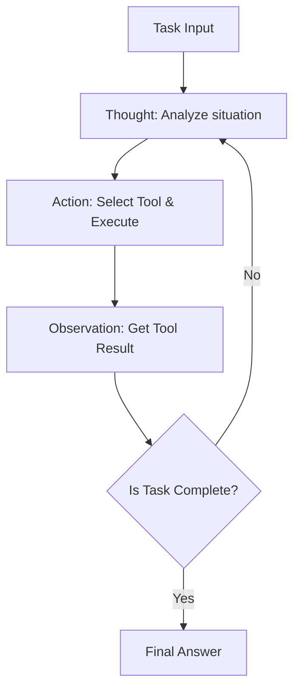
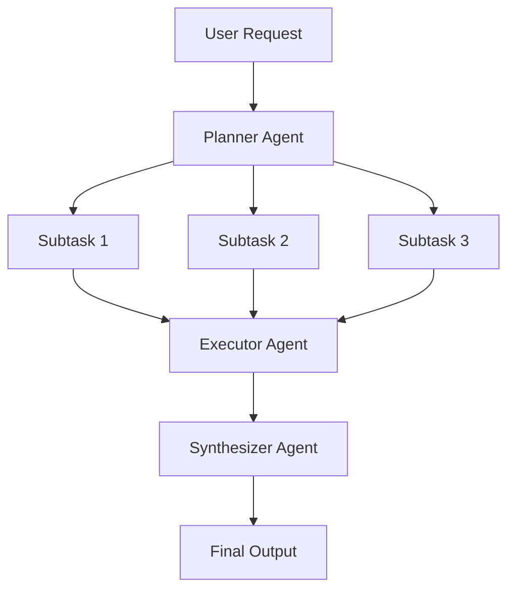
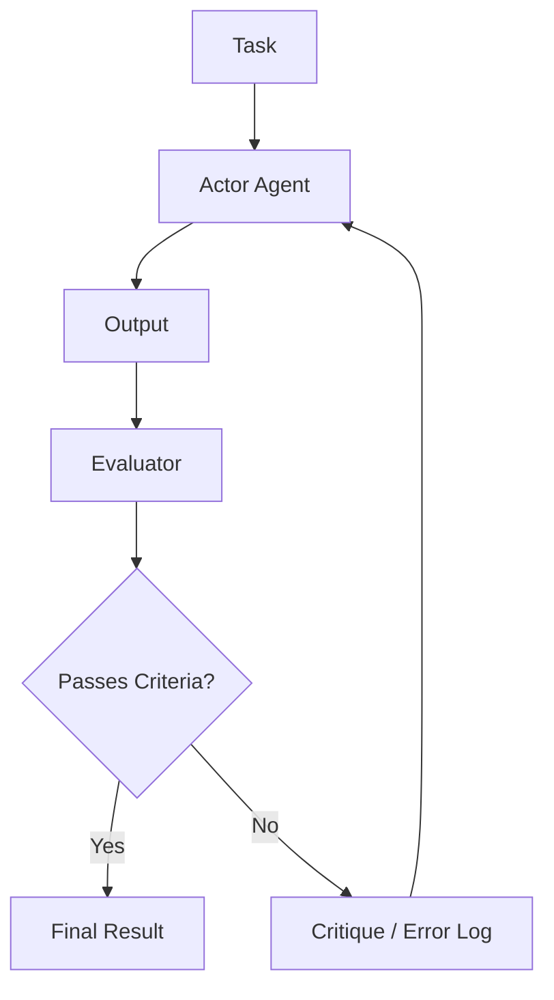

# A Profundeza do Design de Arquitetura de Agentes de IA: De Prompts a Multiagentes Autônomos

Na engenharia de software moderna, o design de agentes de IA centrados em Modelos de Linguagem de Grande Escala (LLMs) é uma das áreas que mais chama atenção. A fase de simplesmente criar um "chatbot inteligente" acabou, e ocorreu uma mudança de paradigma em direção ao desenvolvimento de "agentes autônomos", onde o próprio sistema reconhece o ambiente, planeja, utiliza ferramentas e se autocorrige enquanto executa tarefas complexas.

Neste artigo, explicaremos exaustivamente a evolução da arquitetura de agentes de IA e seus padrões de design centrais com um nível avassalador de detalhes, desde a era dos prompts simples até os mais recentes sistemas multiagentes.

## 1. Mudança de Paradigma: A Evolução de Prompts para Agentes Autônomos

O uso inicial de LLMs era um paradigma próximo a uma "chamada de função", como exemplificado por *Zero-shot prompting* e *Few-shot prompting*, onde o modelo retornava textos probabilisticamente plausíveis para consultas isoladas. No entanto, essa abordagem apresentava várias limitações fatais.

*   **Esquecimento de Contexto e Falta de Raciocínio a Longo Prazo**: Como a interação era concluída em uma única entrada e saída, era difícil manter um raciocínio consistente considerando etapas anteriores em tarefas complexas de múltiplas etapas.
*   **Alucinações Incontroláveis**: Como não havia mecanismo para verificar informações com dados factuais externos, existia o risco de o modelo gerar informações falsas com confiança.
*   **Falta de Capacidade de Ação**: O modelo não tinha meios de agir ativamente sobre o mundo digital (APIs, sistemas de arquivos, bancos de dados).

O conceito de "agente" surgiu para resolver esses problemas. Um agente trata o LLM não apenas como um "gerador de texto", mas como o "cérebro (motor de raciocínio) do sistema".

### Componentes Básicos da Arquitetura de um Agente

Um agente autônomo de IA típico consiste nos seguintes componentes principais:

1.  **Perfil / Persona**: Define o papel, propósito e restrições do agente.
2.  **Módulo de Planejamento**: Divide a tarefa em subtarefas e formula os procedimentos de execução.
3.  **Sistema de Memória**: Gerencia a memória de curto prazo (dentro da janela de contexto) e a memória de longo prazo (banco de dados externo) para acumular experiência.
4.  **Ferramentas / Ações**: Interfaces que atuam sobre o ambiente, como chamadas de API, execução de código e pesquisa na web.
5.  **Módulo de Reflexão (Reflection)**: Um mecanismo de autorreflexão que avalia os resultados da execução e ajusta o plano conforme necessário.

Como integrar esses componentes é o principal desafio na arquitetura e design do sistema.

## 2. Integração de Raciocínio e Ação: Fundamentos e Prática do Padrão ReAct

Um dos paradigmas mais importantes que formam a base dos agentes de IA é o padrão "ReAct (Reasoning and Acting)". Proposto por pesquisadores da Universidade de Princeton e do Google Research, esse método permite que os agentes resolvam tarefas complexas alternando entre "Pensar (Thought)" e "Agir (Action)".

### Mecanismo de Funcionamento do ReAct

O ciclo ReAct geralmente progride da seguinte forma:

1.  **Pensamento (Thought)**: O LLM raciocina em linguagem natural sobre como analisar a situação atual e o que fazer a seguir.
2.  **Ação (Action)**: Com base no raciocínio, ele seleciona uma ferramenta disponível (ex: pesquisa na web, calculadora, API), especifica os argumentos e a executa.
3.  **Observação (Observation)**: Recebe do sistema o resultado da execução da ferramenta.

### Vantagens e Limitações do ReAct

**Vantagens:**
*   **Transparência no Raciocínio**: Como o processo de pensamento ("por que tomou tal ação") do agente é visualizado, a depuração (debugging) se torna mais fácil.
*   **Adaptabilidade ao Ambiente**: Como o próximo pensamento é baseado no resultado da ação (Observação), o sistema pode responder de forma flexível a erros inesperados e mudanças dinâmicas no ambiente.

**Limitações:**
*   **Aumento no Consumo de Tokens**: O histórico passado (Thought, Action, Observation) precisa ser incluído no contexto a cada ciclo, consumindo rapidamente a janela de contexto.
*   **Loop Míope**: Há o risco de focar demais na Ação imediata, perder de vista o objetivo geral e cair em um "loop infinito" repetindo a mesma Ação.

Para resolver esse "loop míope", a abordagem "Plan-and-Solve" explicada na próxima seção foi introduzida.

## 3. Adquirindo uma Perspectiva Global: Abordagem Plan-and-Solve

Se o ReAct é a abordagem de "pensar enquanto caminha", o Plan-and-Solve (ou Plan-and-Execute) é a abordagem de "desenhar um mapa antes de começar a andar". Em tarefas complexas, em vez de ações ao acaso, é essencial formular um plano cuidadoso com antecedência.

### O Processo Plan-and-Solve

Esta arquitetura divide amplamente o sistema em "Planejador (Planner)" e "Executor".

1.  **Planejamento (Planning)**:
    *   O planejador recebe a solicitação do usuário e a decompõe em várias subtarefas independentes ou dependentes.
    *   A ordem de execução das tarefas pode ser determinada na forma de um DAG (Grafo Acíclico Direcionado).
2.  **Solução/Execução (Solving/Executing)**:
    *   O executor processa cada subtarefa sequencialmente (ou em paralelo).
    *   O próprio executor aqui geralmente funciona como um pequeno agente ReAct.

### A Importância de Mudar Planos Dinamicamente (Replanning)

Em tarefas do mundo real, as coisas muitas vezes não saem conforme planejado. Por exemplo, como resultado de uma pesquisa na web na subtarefa 1, o processamento planejado para a subtarefa 2 pode se tornar desnecessário ou pode ser necessária uma abordagem totalmente nova.

Portanto, em arquiteturas avançadas de Plan-and-Solve, os resultados são avaliados ao final de cada subtarefa e é incorporado um **mecanismo de ajuste dinâmico do resto do plano (Replanning)**. Isso permite agir de forma flexível sem perder de vista o objetivo global.

## 4. Transformando o Passado em Poder: A Integração da Memória de Curto e Longo Prazo

A "Memória (Memory)" é extremamente importante para agentes autônomos. Assim como os humanos tomam decisões baseadas em experiências passadas, os agentes podem melhorar drasticamente seu desempenho aproveitando históricos de interação e conhecimento externo.

O sistema de memória dos agentes é geralmente projetado em uma estrutura de duas camadas: "memória de curto prazo" e "memória de longo prazo".

### Memória de Curto Prazo (Short-term Memory)

A memória de curto prazo consiste em informações retidas **dentro da janela de contexto do LLM**. Isso inclui o histórico da conversa atual, o histórico do ciclo ReAct mais recente e o contexto da tarefa atual.

*   **Desafio**: As janelas de contexto têm um limite (ex: 128K, 1M de tokens) e se esgotam rapidamente em tarefas longas e complexas.
*   **Solução**: São necessárias estratégias de gerenciamento de contexto, como resumir e reter informações antigas (Summary Buffer Memory) ou excluir históricos de baixa importância.

### Memória de Longo Prazo (Long-term Memory) e Bancos de Dados Vetoriais

A memória de longo prazo é um mecanismo que vai além da restrição da janela de contexto para persistir enormes quantidades de experiências e conhecimentos passados. Aqui, os **Bancos de Dados Vetoriais (Vector Databases)** desempenham o papel principal.

1.  **Salvando a Memória**: Quando o agente conclui uma tarefa, extrai os insights obtidos, fragmentos de código (snippets) bem-sucedidos ou as preferências do usuário como texto, e utiliza um Modelo de Incorporação (Embedding Model) para convertê-los em vetores de alta dimensionalidade para salvar no DB Vetorial.
2.  **Pesquisando a Memória (RAG: Retrieval-Augmented Generation)**: Ao abordar uma nova tarefa, ele vetoriza a situação ou consulta atual e realiza uma busca por similaridade no banco de dados vetorial.
3.  **Utilizando a Memória**: A memória passada relevante encontrada é apresentada ao LLM como contexto, incentivando um raciocínio mais preciso.

### Design do Roteador de Memória

Em sistemas avançados, um "módulo roteador de memória" é implementado para determinar que informações devem ser salvas como memória e quando devem ser recuperadas. Existem arquiteturas onde os agentes não apenas chamam explicitamente uma "ferramenta de busca de conhecimento", mas o sistema injeta implicitamente as informações relevantes no prompt.

## 5. O Caminho para a Autoevolução: O Mecanismo de Reflexão (Reflection)

Fazer um prompt dar certo de primeira é difícil, e os agentes também podem falhar em suas ações iniciais. Um agente verdadeiramente autônomo possui a capacidade de aprender com seus erros e corrigir sua própria abordagem, ou seja, um mecanismo de "Reflexão (Reflection)".

### Padrões Básicos da Reflexão

A Reflexão é alcançada construindo um ciclo de "Ação" -> "Avaliação" -> "Melhoria".

1.  **Ator (Actor)**: Gera uma solução ou código inicial.
2.  **Avaliador (Evaluator)**: Avalia a saída do Ator. Isso inclui verificações lógicas usando outros prompts de LLM, verificações de sintaxe pelo compilador ou a execução de testes unitários.
3.  **Crítica (Critique)**: Fornece feedback em linguagem natural (crítica) sobre problemas ou áreas de melhoria encontradas pelo Avaliador.
4.  **Refinamento (Refinement)**: O Ator recebe a instrução original e a Crítica, e gera uma solução nova e melhorada.

### Self-Refine e Reflexion

As duas técnicas representativas são:

*   **Self-Refine (Autorefinamento)**: Um único LLM atua tanto como Ator quanto como Avaliador, realizando "autocrítica" de seus próprios resultados e repetindo a melhoria.
*   **Reflexion**: Uma arquitetura avançada onde o agente recebe feedback do ambiente (ex: pontuação de um jogo, mensagem de erro de API), verbaliza as lições (Memória Episódica) de "por que falhou" com base nisso, e as aplica à próxima tentativa.

Espera-se que a implementação da Reflexão reduza drasticamente as alucinações e aumente muito as taxas de sucesso em tarefas complexas de programação.

## 6. A Próxima Fronteira: Composição e Prática de Sistemas Multiagentes

A abordagem de deixar tudo nas mãos de um único agente (God Agent) atinge seu limite à medida que a tarefa se torna mais complexa. Um "sistema multiagentes", onde vários agentes especializados em domínios específicos trabalham em cooperação, está se tornando a principal tendência.

### Colaboração por Divisão de Tarefas

No sistema multiagentes, os papéis são divididos de forma semelhante a uma equipe de desenvolvimento de software.

*   **Agente Gerente de Produto (Product Manager Agent)**: Encarregado da definição de requisitos e decomposição de tarefas.
*   **Agente Pesquisador (Researcher Agent)**: Encarregado da busca e resumo de informações necessárias.
*   **Agente Codificador (Coder Agent)**: Encarregado da implementação real do código.
*   **Agente de QA/Revisor (QA/Reviewer Agent)**: Encarregado da verificação da qualidade do código e testes.

Isso permite que cada agente se concentre em sua própria área de especialização (prompt de sistema e ferramentas), melhorando a qualidade geral.

### Frameworks Representativos: LangGraph e AutoGen

Os frameworks para a construção de sistemas multiagentes também estão evoluindo rapidamente.

**1. LangGraph (Ecossistema LangChain)**
O LangGraph adota uma abordagem que define explicitamente o fluxo de trabalho do agente como um **grafo (nós e arestas)**. Como estados podem ser passados entre nós e grafos cíclicos (loops) podem ser construídos, é mais fácil controlar fluxos de ReAct e Reflexão, o que o torna adequado para a construção de sistemas robustos em nível comercial.

**2. AutoGen (Microsoft)**
O AutoGen é um framework multiagentes baseado em **conversas (Conversation)**. Os agentes avançam na tarefa trocando mensagens de chat entre si. Possui a característica de um roteador configurado (como o GroupChatManager) que controla "qual agente deve falar em seguida", o que facilita o surgimento de comportamentos cooperativos emergentes.

### Topologias de Arquitetura Multiagentes

Existem várias formas típicas para os padrões de cooperação (topologia) de multiagentes.

1.  **Sequencial (Sequential)**: Um formato de pipeline onde as tarefas são passadas sequencialmente, A -> B -> C.
2.  **Hierárquico (Hierarchical)**: Um agente gerente supervisiona vários agentes trabalhadores, agregando instruções e resultados.
3.  **Debate (Debate/Group Chat)**: Vários agentes especialistas trocam opiniões livremente para chegar a um consenso.

A chave para o design da arquitetura é selecionar a topologia ideal, dependendo da natureza da tarefa alvo.

## 7. Conclusão: O Futuro dos Agentes Autônomos de IA

Começando pela era da engenharia de prompts, a obtenção de raciocínio e ação através do ReAct, a capacidade de planejar do Plan-and-Solve, a acumulação de experiências via Memória (Memory), a autoevolução por meio da Reflexão (Reflection), e a organização através de multiagentes. A arquitetura de agentes de IA passou por uma evolução assustadora em apenas alguns anos.

No futuro, espera-se que as seguintes áreas se desenvolvam ainda mais:

*   **Agentes Multimodais**: A disseminação de agentes que não apenas processam texto, mas também entendem a visão e o áudio, podendo operar GUIs diretamente (ex: agentes que utilizam computadores).
*   **Agentes de IA de Borda (Edge AI Agents)**: O desenvolvimento de agentes leves que processam raciocínio e ação localmente no dispositivo sem depender da nuvem.
*   **Cooperação Humana (Human-in-the-Loop)**: O refinamento de sistemas híbridos onde os agentes não são totalmente autônomos, mas buscam ajuda humana de forma contínua em decisões críticas ou situações incertas.

O design da arquitetura de agentes de IA vai muito além da simples programação; é um desafio intelectual e empolgante sobre "como implementar modelos cognitivos como sistemas". Esperamos que os padrões e princípios abordados neste artigo auxiliem os leitores na construção da próxima geração de sistemas.
