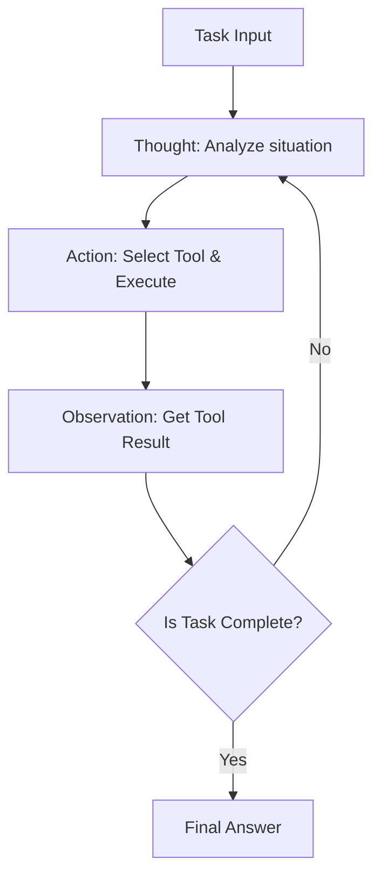
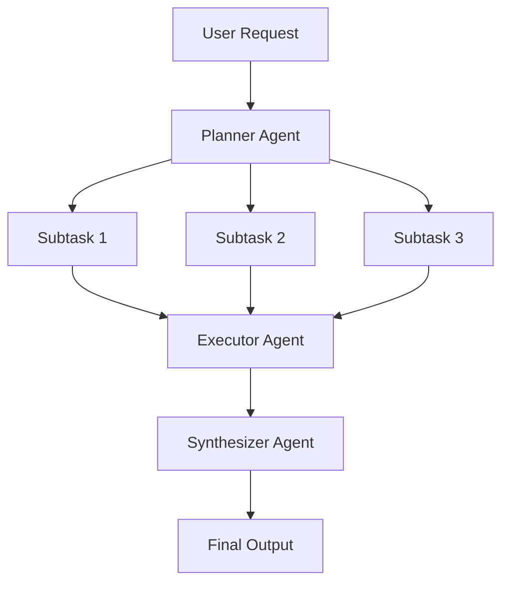
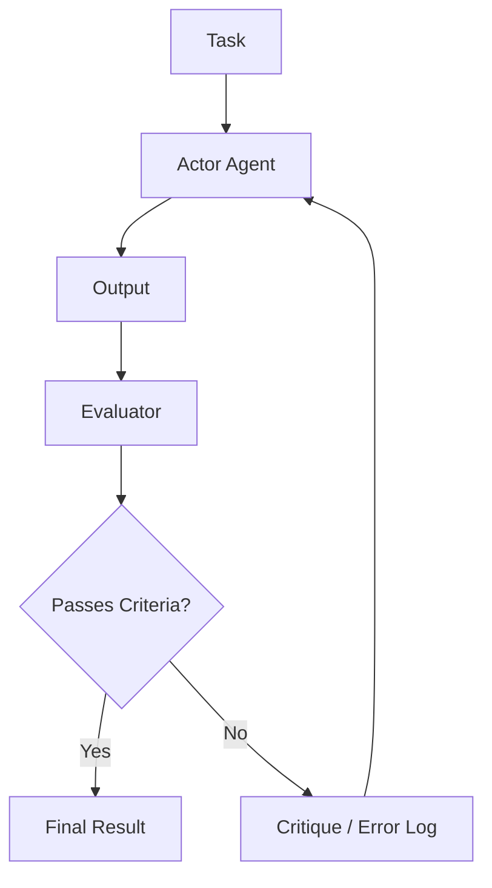

# Глубины проектирования архитектуры ИИ-агентов: от промптов до автономных мультиагентных систем

В современной программной инженерии проектирование ИИ-агентов, основанных на больших языковых моделях (LLM), является одной из самых привлекающих внимание областей. Этап создания просто "умных чат-ботов" завершен, и происходит сдвиг парадигмы в сторону разработки "автономных агентов", где система сама осознает среду, строит планы, мастерски использует инструменты и выполняет сложные задачи, корректируя собственные действия.

В этой статье мы максимально подробно и основательно рассмотрим эволюцию архитектуры ИИ-агентов и ее ключевые паттерны проектирования, начиная с эпохи простых промптов и заканчивая новейшими мультиагентными системами.

## 1. Сдвиг парадигмы: эволюция от промптинга к автономным агентам

На ранних этапах использования LLM, как, например, в Zero-shot и Few-shot промптинге, парадигма была близка к "вызову функции", когда модель в ответ на одиночный запрос возвращала вероятностно правдоподобный текст. Однако этот подход имел несколько фатальных ограничений.

*   **Потеря контекста и отсутствие долгосрочного рассуждения**: Поскольку все ограничивалось одним циклом ввода-вывода, было сложно обеспечить последовательное рассуждение с учетом прошлых шагов в сложных многоэтапных задачах.
*   **Неконтролируемые галлюцинации**: Отсутствие механизма сверки с внешними фактическими данными создавало риск того, что модель с уверенностью выдаст ошибочную информацию.
*   **Отсутствие способности к действию**: Модели не имели средств для активного взаимодействия с цифровым миром (API, файловые системы, базы данных).

Для решения этих проблем и появилась концепция "агента". Агент использует LLM не просто как "генератор текста", а как "мозг системы (движок рассуждений)".

### Базовые компоненты архитектуры агента

Типичный автономный ИИ-агент состоит из следующих ключевых компонентов:

1.  **Профиль / Персона**: Определяет роль, цель и ограничения агента.
2.  **Модуль планирования**: Разбивает задачу на подзадачи и формулирует порядок выполнения.
3.  **Система памяти**: Управляет краткосрочной (в пределах контекстного окна) и долгосрочной памятью (внешние базы данных) для накопления опыта.
4.  **Инструменты / Действия (Tools / Actions)**: Интерфейсы взаимодействия со средой, такие как вызовы API, выполнение кода, веб-поиск.
5.  **Модуль рефлексии (Reflection)**: Механизм самоанализа, который оценивает результаты выполнения и при необходимости корректирует план.

Мастерство проектирования архитектуры заключается в том, как именно объединить эти компоненты.

## 2. Интеграция рассуждений и действий: основы и практика паттерна ReAct

Одним из важнейших парадигмальных сдвигов, лежащих в основе ИИ-агентов, является паттерн "ReAct (Reasoning and Acting)". Этот метод, предложенный исследователями Принстонского университета и Google Research, позволяет агенту решать сложные задачи путем чередования "размышлений (Thought)" и "действий (Action)".

### Механизм работы ReAct

Цикл ReAct обычно протекает следующим образом:

1.  **Thought (Мысль/Рассуждение)**: LLM на естественном языке анализирует текущую ситуацию и решает, что делать дальше.
2.  **Action (Действие)**: На основе рассуждений выбирается доступный инструмент (например, веб-поиск, калькулятор, API), задаются аргументы и он выполняется.
3.  **Observation (Наблюдение)**: Система получает результат выполнения инструмента.

### Преимущества и ограничения ReAct

**Преимущества:**
*   **Прозрачность рассуждений**: Процесс мышления агента ("почему он совершил это действие") визуализируется, что упрощает отладку.
*   **Адаптивность к среде**: Поскольку следующая мысль базируется на результатах действий (Observation), агент может гибко реагировать на непредвиденные ошибки и динамичные изменения среды.

**Ограничения:**
*   **Увеличение расхода токенов**: При каждом обороте цикла необходимо включать в контекст прошлую историю (Thought, Action, Observation), что быстро расходует контекстное окно.
*   **Близорукий цикл**: Слишком фокусируясь на текущем действии, агент рискует потерять из виду общую цель и попасть в "бесконечный цикл" повторения одних и тех же действий.

Для решения проблемы этого "близорукого цикла" был внедрен подход "Plan-and-Solve", который мы рассмотрим в следующем разделе.

## 3. Глобальное видение: подход Plan-and-Solve

Если ReAct — это подход "думать на ходу", то Plan-and-Solve (или Plan-and-Execute) — это подход "сначала нарисовать карту, а потом идти". В сложных задачах необходимо не действовать наугад, а предварительно составить тщательный план.

### Процесс Plan-and-Solve

Эта архитектура делит систему на две крупные части: "планировщик (Planner)" и "исполнитель (Executor)".

1.  **Planning (Этап планирования)**:
    *   Планировщик принимает запрос пользователя и разбивает его на несколько независимых или взаимозависимых подзадач.
    *   Порядок выполнения задач может определяться в виде DAG (направленного ациклического графа).
2.  **Solving/Executing (Этап выполнения)**:
    *   Исполнитель обрабатывает каждую подзадачу последовательно (или параллельно).
    *   Сам исполнитель на этом этапе часто функционирует как небольшой агент ReAct.

### Важность динамического изменения плана (Replanning)

В реальных задачах все часто идет не по плану. Например, в результате веб-поиска в подзадаче 1 выясняется, что запланированная обработка в подзадаче 2 больше не нужна, или требуется совершенно иной подход.

Поэтому в продвинутые архитектуры Plan-and-Solve встраивается **механизм динамической корректировки оставшегося плана (Replanning)**, который оценивает результаты по завершении каждой подзадачи. Это позволяет не терять из виду глобальную цель, сохраняя при этом гибкость действий.

## 4. Превращение прошлого в силу: интеграция краткосрочной и долгосрочной памяти

Для автономного агента "память (Memory)" имеет решающее значение. Подобно тому, как человек принимает текущие решения на основе прошлого опыта, агент может значительно повысить свою эффективность, используя историю прошлых взаимодействий и внешние знания.

Система памяти агента обычно проектируется как двухуровневая структура: "краткосрочная память" и "долгосрочная память".

### Краткосрочная память (Short-term Memory)

Краткосрочная память — это информация, хранящаяся **в пределах контекстного окна LLM**. Сюда входит текущая история чата, история последних циклов ReAct, контекст текущей задачи и т. д.

*   **Проблема**: У контекстного окна есть предел (например, 128K, 1M токенов), и в длинных и сложных задачах оно быстро переполняется.
*   **Решение**: Требуются стратегии управления контекстом, такие как хранение старой информации в виде краткого изложения (Summary Buffer Memory) или удаление менее важных фрагментов истории.

### Долгосрочная память (Long-term Memory) и векторные базы данных

Долгосрочная память — это механизм сохранения огромного количества прошлого опыта и знаний за пределами ограничений контекстного окна. Главную роль здесь играют **векторные базы данных (Vector Database)**.

1.  **Сохранение памяти**: Когда агент завершает задачу, полученные знания, успешные фрагменты кода или предпочтения пользователя извлекаются в виде текста, преобразуются в многомерные векторы с помощью модели встраивания (Embedding Model) и сохраняются в векторной БД.
2.  **Поиск в памяти (RAG: Retrieval-Augmented Generation)**: Приступая к новой задаче, текущая ситуация или запрос векторизуются, и выполняется поиск по сходству в векторной БД.
3.  **Использование памяти**: Найденные релевантные прошлые воспоминания предоставляются LLM в качестве контекста для повышения точности рассуждений.

### Проектирование маршрутизатора памяти

В продвинутых системах реализуется "модуль маршрутизатора памяти", который решает, какую информацию сохранить в качестве воспоминаний и когда ее искать. Существуют архитектуры, в которых агент не только явно вызывает "инструмент поиска знаний", но и система сама неявно внедряет релевантную информацию в промпт.

## 5. Путь к саморазвитию: механизм рефлексии (Reflection)

Создать идеальный промпт с первой попытки сложно, и агенты также могут ошибаться на начальных этапах. Поистине автономный агент обладает способностью учиться на ошибках и корректировать свой подход, то есть механизмом "рефлексии (Reflection)".

### Базовые паттерны Reflection

Reflection реализуется путем создания цикла: "Действие" -> "Оценка" -> "Улучшение".

1.  **Actor (Исполнитель)**: Генерирует первоначальное решение или код.
2.  **Evaluator (Оценщик)**: Оценивает вывод Actor. Это может включать логическую проверку с помощью другого промпта LLM, проверку синтаксиса компилятором или выполнение модульных тестов.
3.  **Critique (Критика)**: Проблемы и области для улучшения, обнаруженные Evaluator, возвращаются в виде "критики" на естественном языке.
4.  **Refinement (Доработка)**: Actor получает исходные инструкции и Critique, и генерирует новое, улучшенное решение.

### Self-Refine и Reflexion

В качестве типичных методов можно выделить следующие два:

*   **Self-Refine**: Единая LLM берет на себя роли как Actor, так и Evaluator, выполняя "самокритику" своих же результатов и повторяя улучшения.
*   **Reflexion**: Продвинутая архитектура, в которой агент получает обратную связь от среды (например, счет в игре, сообщения об ошибках API), на ее основе формулирует уроки ("почему я потерпел неудачу") в виде эпизодической памяти (Episodic Memory) и использует их в следующей попытке.

Внедрение Reflection значительно снижает количество галлюцинаций и повышает процент успеха в сложных задачах программирования.

## 6. Следующий рубеж: структура и практика мультиагентных систем

Подход, при котором все доверяется одному агенту (God Agent), достигает своего предела по мере усложнения задач. "Мультиагентные системы", в которых совместно работают несколько специализированных в конкретных областях агентов, становятся новым мейнстримом.

### Координация через распределение ролей

В мультиагентных системах роли распределяются подобно тому, как это происходит в командах разработчиков программного обеспечения.

*   **Product Manager Agent**: Отвечает за определение требований и декомпозицию задач.
*   **Researcher Agent**: Отвечает за поиск и обобщение необходимой информации.
*   **Coder Agent**: Отвечает за фактическую реализацию кода.
*   **QA/Reviewer Agent**: Отвечает за проверку качества кода и тестирование.

Благодаря этому каждый агент может сосредоточиться на своей области компетенции (системные промпты и инструменты), что повышает общее качество.

### Популярные фреймворки: LangGraph и AutoGen

Фреймворки для создания мультиагентных систем также стремительно развиваются.

**1. LangGraph (Экосистема LangChain)**
LangGraph использует подход, при котором рабочий процесс агентов явно определяется как **граф (узлы и ребра)**. Поскольку состояние (state) передается между узлами, и можно строить циклические графы (циклы), это облегчает управление потоками ReAct и Reflection и подходит для создания надежных систем коммерческого уровня.

**2. AutoGen (Microsoft)**
AutoGen — это мультиагентный фреймворк, основанный на **разговорах (Conversation)**. Агенты продвигаются в решении задач, обмениваясь сообщениями в чате. Настроенный маршрутизатор (например, GroupChatManager) контролирует, "какой агент должен говорить следующим", что способствует возникновению эмерджентного скоординированного поведения.

### Топология мультиагентных архитектур

Существует несколько типичных шаблонов связи (топологий) для мультиагентных систем.

1.  **Последовательная (Sequential)**: Конвейерного типа, где задачи передаются по очереди: A -> B -> C.
2.  **Иерархическая (Hierarchical)**: Агент-менеджер руководит несколькими агентами-рабочими, отдавая поручения и собирая результаты.
3.  **Дискуссионная (Debate/Group Chat)**: Несколько агентов-экспертов свободно обмениваются мнениями для достижения консенсуса.

Ключом к проектированию архитектуры является выбор оптимальной топологии в зависимости от характера целевой задачи.

## 7. Заключение: перспективы развития автономных ИИ-агентов

Начав с эпохи инженерии промптов, мы пришли к приобретению навыков рассуждения и действий через ReAct, способности к планированию через Plan-and-Solve, накоплению опыта с помощью Memory, саморазвитию через Reflection и, наконец, к организации в мультиагентные системы. Архитектура ИИ-агентов претерпела поразительную эволюцию всего за несколько лет.

В будущем ожидается дальнейшее развитие следующих направлений:

*   **Мультимодальные агенты**: Распространение агентов, которые понимают не только текст, но и визуальную и звуковую информацию, а также напрямую управляют графическим интерфейсом (например, агенты для использования компьютера).
*   **Edge ИИ-агенты**: Развитие легковесных агентов, которые выполняют рассуждения и действия локально на устройствах, не завися от облака.
*   **Взаимодействие с человеком (Human-in-the-Loop)**: Совершенствование гибридных систем, в которых агент не полностью автономен, а бесшовно обращается за помощью к человеку для принятия важных решений или в неопределенных ситуациях.

Проектирование архитектуры ИИ-агентов выходит за рамки простого программирования; это чрезвычайно интеллектуальный и увлекательный вызов на тему "как реализовать когнитивную модель в виде системы". Надеемся, что паттерны и принципы, описанные в этой статье, помогут читателям в создании систем следующего поколения.
