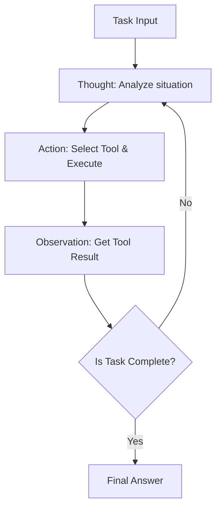
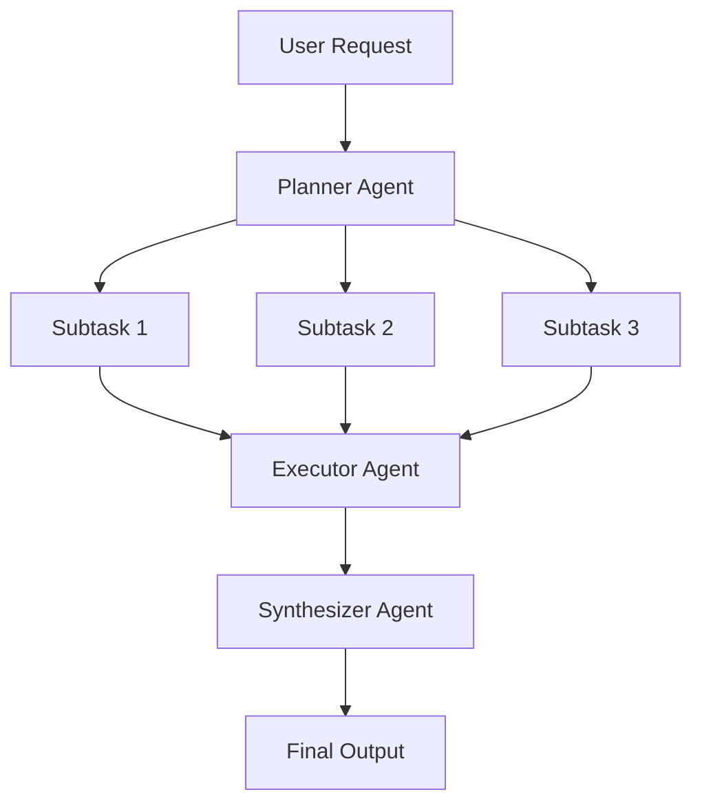
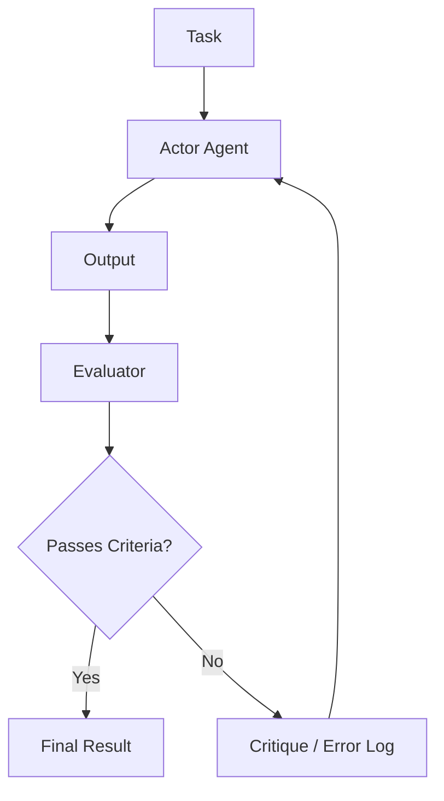

# AI Agent 架构设计的深度剖析：从 Prompt 到自主多智能体系统

在现代软件工程中，以大型语言模型（LLM）为核心的 AI Agent 设计是最受瞩目的领域之一。仅仅制造“聪明的聊天机器人”的阶段已经过去，当前的范式正向开发“自主智能体（Autonomous Agent）”转变，这些系统能够自行感知环境、制定计划、利用工具，并在自我修正的过程中完成复杂的任务。

本文将从简单的 Prompting 时代直至最新的多智能体系统，以极其详尽的篇幅，深入探讨 AI Agent 架构的演进及其核心设计模式。

## 1. 范式转变：从 Prompting 到自主智能体的进化

早期的 LLM 应用，如 Zero-shot Prompting 和 Few-shot Prompting 所代表的，更接近于一种“函数调用”的范式：针对单次查询，模型概率性地返回合理的文本。然而，这种方法存在几个致命的局限性：

*   **上下文遗忘与缺乏长期推理**: 由于过程在单次输入输出中结束，在复杂的多阶段任务中很难基于过去的步骤进行连贯的推理。
*   **无法控制幻觉（Hallucination）**: 由于缺乏与外部事实数据核对的机制，存在言之凿凿地输出错误信息的风险。
*   **缺乏行动能力**: 没有主动作用于数字世界（API、文件系统、数据库）的手段。

为了解决这些问题，“Agent（智能体）”的概念应运而生。Agent 不再仅仅将 LLM 视为“文本生成器”，而是将其作为“系统的首脑（推理引擎）”。

### Agent 架构的基本组成部分

一般而言，自主型 AI Agent 由以下核心组件构成：

1.  **画像 / 人设 (Profile / Persona)**: 定义 Agent 的角色、目标和约束条件。
2.  **计划模块 (Planning Module)**: 将任务分解为子任务，并制定执行步骤。
3.  **记忆系统 (Memory System)**: 管理短期记忆（上下文窗口内）和长期记忆（外部数据库），积累经验。
4.  **工具 / 动作 (Tools / Actions)**: 调用 API、执行代码、Web 搜索等，是作用于环境的接口。
5.  **反思模块 (Reflection Module)**: 评估执行结果并在必要时修改计划的自我反省机制。

如何协调这些组件，正是考验架构设计功力的地方。

## 2. 推理与行动的整合：ReAct 模式的基础与实践

作为 AI Agent 基础的最重要的范式之一是“ReAct (Reasoning and Acting)”模式。由普林斯顿大学和 Google Research 的研究人员提出的这种方法，通过让 Agent 交替进行“思考（Thought）”和“行动（Action）”，从而能够解决复杂的任务。

### ReAct 的工作机制

ReAct 循环通常按以下周期进行：

1.  **Thought (思考)**: LLM 分析当前情况，用自然语言推理接下来应该做什么。
2.  **Action (行动)**: 基于推理，选择可用的工具（例如：Web 搜索、计算器、API），指定参数并执行。
3.  **Observation (观察)**: 从系统接收工具执行的结果。

### ReAct 的优势与局限

**优势:**
*   **推理的透明度**: Agent 的思考过程（“为什么采取那个行动”）被可视化，因此易于调试。
*   **对环境的适应性**: 基于行动结果（Observation）进行下一步思考，能灵活应对意外错误和动态的环境变化。

**局限:**
*   **Token 消耗激增**: 每次循环都需要将过去的历史（Thought, Action, Observation）包含在上下文中，这会迅速消耗上下文窗口。
*   **短视循环**: 过度专注于眼前的 Action，可能导致失去总体目标，陷入重复相同 Action 的“无限循环”风险。

为了解决这种“短视循环”，引入了下一节将要讲解的“Plan-and-Solve”方法。

## 3. 具备全局视野：Plan-and-Solve 方法

如果说 ReAct 是“边走边想”的方法，那么 Plan-and-Solve（或者 Plan-and-Execute）就是“画好地图再出发”的方法。对于复杂的任务，绝不能采取随机应变的行动，而必须事先制定周密的计划。

### Plan-and-Solve 的流程

这种架构将系统大致分为“计划者（Planner）”和“执行者（Executor）”。

1.  **Planning (计划阶段)**:
    *   计划者接收用户的请求，将其分解为多个独立或存在依赖关系的子任务。
    *   有时也会以 DAG（有向无环图）的形式确定任务的执行顺序。
2.  **Solving/Executing (执行阶段)**:
    *   执行者依次（或并行）处理每个子任务。
    *   这里的执行者本身通常作为一个小型的 ReAct Agent 来运作。

### 动态计划变更（Replanning）的重要性

在现实任务中，很多时候无法完全按照预先的计划进行。例如，在子任务 1 进行 Web 搜索后，发现子任务 2 预定的处理不再需要，或者需要采用全新的方法。

因此，在高级的 Plan-and-Solve 架构中，会包含在每个子任务结束时评估结果并**动态修改剩余计划（Replanning）的机制**。这使得 Agent 不会迷失总体目标，同时又能保持行动的灵活性。

## 4. 将过去转化为力量：短期记忆与长期记忆的整合

对于自主型 Agent 来说，“记忆（Memory）”极其重要。就像人类根据过去的经验做出当前的判断一样，Agent 也可以利用过去的交互历史和外部知识，实现性能的飞跃性提升。

Agent 的记忆系统通常被设计为“短期记忆”和“长期记忆”的双层结构。

### 短期记忆 (Short-term Memory)

短期记忆是保存在 **LLM 上下文窗口内** 的信息。这包括当前的对话历史、最近的 ReAct 循环历史、当前任务的上下文等。

*   **挑战**: 上下文窗口有上限（例如：128K、1M tokens 等），在漫长复杂的任务中很快就会溢出。
*   **对策**: 需要上下文管理策略，例如对旧信息进行摘要保留（Summary Buffer Memory），或删除重要性较低的历史记录。

### 长期记忆 (Long-term Memory) 与向量数据库

长期记忆是一种超越上下文窗口限制、将大量过去经验和知识持久化的机制。在这里，**向量数据库（Vector Database）**扮演着核心角色。

1.  **记忆保存**: 当 Agent 完成任务时，将获得的知识、成功的代码片段或用户的偏好等提取为文本，利用嵌入模型（Embedding Model）将其转换为高维向量，并保存在向量数据库中。
2.  **记忆检索 (RAG: Retrieval-Augmented Generation)**: 在处理新任务时，将当前情况或查询向量化，并对向量数据库进行相似度检索。
3.  **记忆利用**: 将检索到的高度相关的过去记忆作为上下文提供给 LLM，以促进更高精度的推理。

### 记忆路由器的设计

在高级系统中，会实现一个“记忆路由器模块”，负责判断哪些信息应当作为记忆保存，以及何时应当进行检索。不仅 Agent 可以显式调用“检索知识的工具”，系统中也存在隐式地将相关信息注入提示词的架构。

## 5. 自我进化之路：Reflection (自我反省·修正) 机制

通过一次 Prompt 就能成功执行是很困难的，Agent 在早期的行动中也可能失败。真正自主的 Agent 具备从失败中学习并修正自身方法的机制，即“Reflection（反省）”。

### Reflection 的基本模式

Reflection 是通过构建“行动”→“评估”→“改进”的循环来实现的。

1.  **Actor (执行者)**: 生成初步的解决方案或代码。
2.  **Evaluator (评估者)**: 评估 Actor 的输出。这包括通过另一个 LLM 提示词进行逻辑检查、通过编译器进行语法检查，或者执行单元测试等。
3.  **Critique (批评)**: 将 Evaluator 发现的问题点和需要改进的地方，用自然语言作为“批评”反馈出来。
4.  **Refinement (修正)**: Actor 接收原始指令和 Critique，生成改进后的新解决方案。

### Self-Refine 与 Reflexion

作为代表性的方法，有以下两种：

*   **Self-Refine**: 单个 LLM 兼任 Actor 和 Evaluator 的角色，对自身的输出进行“自我批评”，并不断迭代改进。
*   **Reflexion**: 一种高级架构，Agent 从环境（如：游戏分数、API 错误信息）接收反馈，据此用语言表达“为什么会失败”的教训（情景记忆 Episodic Memory），并将其运用到下一次尝试中。

通过实现 Reflection，有望显著减少幻觉，并大幅提高复杂编程任务的成功率。

## 6. 下一个前沿：多智能体系统（Multi-Agent System）的构成与实践

将一切交给单一 Agent（God Agent）的方法，随着任务变得复杂将面临瓶颈。让专注于特定领域的多个 Agent 协同工作的“多智能体系统”正逐渐成为主流。

### 通过角色分工进行协同

在多智能体系统中，就像软件开发团队一样进行角色分工。

*   **Product Manager Agent (产品经理)**: 负责需求定义和任务分解。
*   **Researcher Agent (研究员)**: 负责必要信息的检索和总结。
*   **Coder Agent (程序员)**: 负责实际代码实现。
*   **QA/Reviewer Agent (测试/审核员)**: 负责代码质量检查和测试。

这样一来，每个 Agent 都能专注于自身的专业领域（系统提示词和工具），从而提高整体质量。

### 代表性框架：LangGraph 和 AutoGen

构建多智能体的框架也在快速发展。

**1. LangGraph (LangChain 生态系统)**
LangGraph 采用将 Agent 的工作流显式定义为**图（节点和边）**的方法。在节点之间传递状态，能够构建包含循环的图，因此便于控制 ReAct 或 Reflection 的流程，非常适合构建商业级别的健壮系统。

**2. AutoGen (Microsoft)**
AutoGen 是一个基于**对话（Conversation）**的多智能体框架。Agent 之间通过互相发送聊天消息来推进任务。设置好的路由器（如 GroupChatManager）控制“接下来该哪个 Agent 发言”，具有容易产生涌现性协作行为的特点。

### 多智能体架构的拓扑结构

多智能体的协作模式（拓扑结构）有几种典型的形式。

1.  **顺序型 (Sequential)**: A -> B -> C，按顺序交接任务的流水线模式。
2.  **层级型 (Hierarchical)**: 管理员 Agent 统辖多个工作者 Agent，负责指令下达和结果汇总。
3.  **讨论型 (Debate/Group Chat)**: 多个专家 Agent 自由交换意见，达成共识。

根据目标任务的性质选择最合适的拓扑结构，是架构设计的关键。

## 7. 结语：自主型 AI Agent 的未来展望

从 Prompt 工程时代开始，经历了 ReAct 带来的推理与行动的获得，Plan-and-Solve 带来的计划性，Memory 带来的经验积累，Reflection 带来的自我进化，直至多智能体带来的组织化。AI Agent 的架构在短短几年内取得了惊人的发展。

展望未来，预计以下领域将得到进一步发展：

*   **多模态 Agent (Multimodal Agent)**: 不仅理解文本，还能理解视觉和听觉，并直接操作 GUI 的 Agent 的普及（例如：计算机操作 Agent）。
*   **边缘 AI Agent (Edge AI Agent)**: 不依赖云端，在设备本地完成推理和行动的轻量级 Agent 的发展。
*   **人机协同 (Human-in-the-Loop)**: Agent 并非完全自主，而是在重要决策或不确定情况下无缝向人类寻求帮助的混合系统的完善。

AI Agent 架构的设计超越了单纯的编程，是一项关于“如何将认知模型作为系统来实现”的充满智慧且令人兴奋的挑战。希望本文所讲解的模式和原则，能为读者构建下一代系统提供助力。
