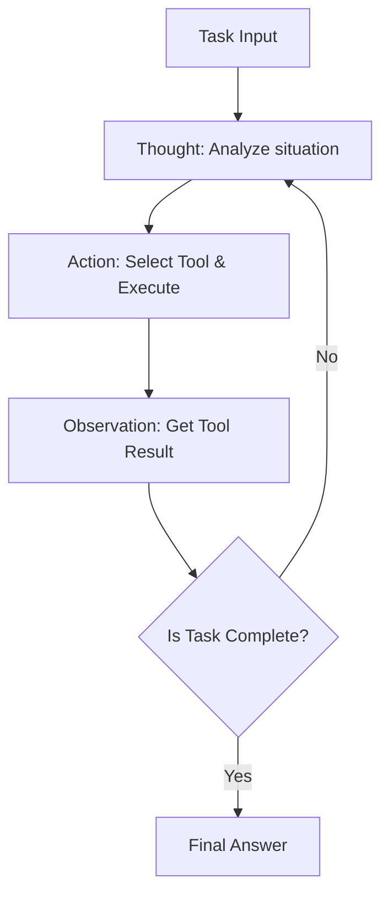
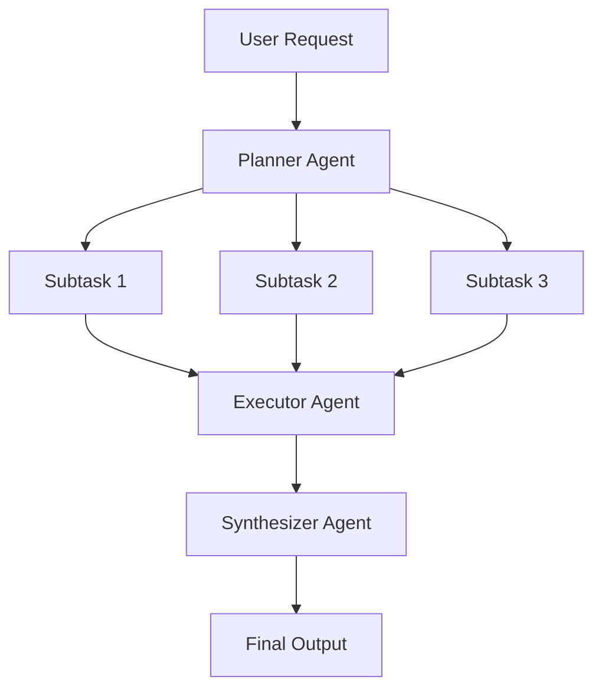
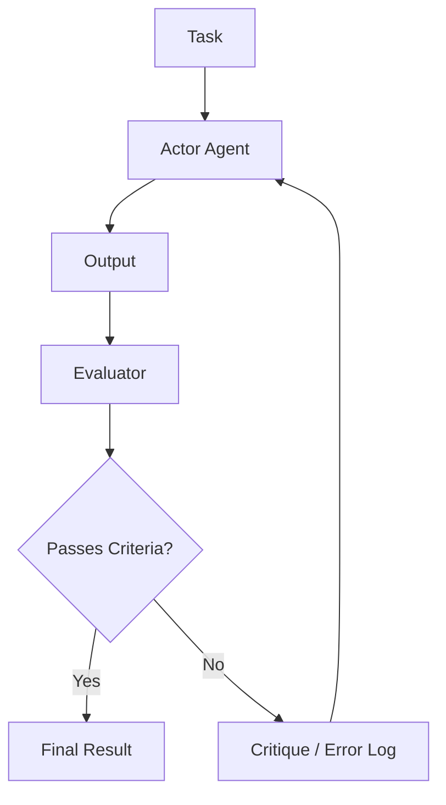

# AI 代理架構設計的深層探討：從提示詞到自主型多代理系統

在現代軟體工程中，以大型語言模型（LLM）為核心的 AI 代理設計是最受矚目的領域之一。僅僅打造「聰明聊天機器人」的階段已經結束，現在正發生著典範轉移，朝向開發能夠自主感知環境、制定計畫、運用工具，並在執行複雜任務時進行自我修正的「自主型代理（Autonomous Agent）」。

本文將從單純的提示詞（Prompting）時代到最新的多代理系統，以壓倒性的詳細程度，徹底解說 AI 代理架構的演進及其核心設計模式。

## 1. 典範轉移：從提示詞到自主型代理的進化

早期的 LLM 應用，如 Zero-shot 提示詞或 Few-shot 提示詞所代表的，對於單次查詢，模型會機率性地回傳看似合理的文字，這可以說是一種接近「函式呼叫」的典範。然而，這種方法存在幾個致命的局限性。

*   **遺忘上下文與缺乏長期推論**: 因為是在一次輸入輸出中完成，所以很難在複雜的多階段任務中，基於過去的步驟進行連貫的推論。
*   **無法控制的幻覺（Hallucination）**: 由於缺乏與外部事實資料比對的機制，存在著模型確信地輸出錯誤資訊的風險。
*   **缺乏行動能力**: 沒有主動對數位世界（API、檔案系統、資料庫）採取行動的手段。

為了解決這些問題，「代理（Agent）」的概念應運而生。代理不只是將 LLM 視為單純的「文字生成器」，而是將其作為「系統的大腦（推論引擎）」來對待。

### 代理架構的基本組成要素

一般的自主型 AI 代理，由以下核心元件構成：

1.  **個人檔案 / 角色設定 (Profile / Persona)**: 定義代理的角色、目的與限制事項。
2.  **計畫模組 (Planning Module)**: 將任務分解為子任務，並制定執行步驟。
3.  **記憶系統 (Memory System)**: 管理短期記憶（在上下文視窗內）和長期記憶（外部資料庫），並累積經驗。
4.  **工具 / 行動 (Tools / Action)**: 對環境產生作用的介面，例如呼叫 API、執行程式碼、網頁搜尋等。
5.  **反思模組 (Reflection Module)**: 評估執行結果，並在必要時修正計畫的自我反省機制。

如何將這些元件協同運作，正是架構設計展現技術的所在。

## 2. 整合推論與行動：ReAct 模式的基礎與實踐

AI 代理基礎中最重要的一個典範就是「ReAct (Reasoning and Acting)」模式。由普林斯頓大學與 Google Research 研究人員提出的這種方法，讓代理透過交替進行「思考（Thought）」和「行動（Action）」，使其能夠解決複雜的任務。

### ReAct 的運作機制

ReAct 迴圈通常依以下週期進行：

1.  **Thought (思考)**: 分析當前狀況，由 LLM 以自然語言推論接下來該做什麼。
2.  **Action (行動)**: 根據推論，選擇可用的工具（例如：網頁搜尋、計算機、API），指定參數並執行。
3.  **Observation (觀察)**: 從系統接收工具的執行結果。

### ReAct 的優點與局限

**優點:**
*   **推論的透明性**: 由於代理「為何採取該行動」的思考過程被視覺化，因此更容易進行除錯。
*   **對環境的適應性**: 因為是基於行動結果（Observation）來進行下一次思考，所以能靈活應對意外錯誤或動態環境變化。

**局限:**
*   **Token 消耗增加**: 每次迴圈都需要將過去的歷史紀錄（Thought, Action, Observation）包含在上下文中，會迅速消耗上下文視窗。
*   **短視的迴圈**: 可能因為過度專注於眼前的 Action，而失去整體目標，陷入重複相同 Action 的「無限迴圈」風險。

為了解決這個「短視的迴圈」，導入了下一節將解說的「Plan-and-Solve」方法。

## 3. 具備大局觀：Plan-and-Solve 方法

如果說 ReAct 是「邊走邊想」的方法，那麼 Plan-and-Solve（或稱 Plan-and-Execute）就是「先畫好地圖再出發」的方法。在複雜的任務中，事前的縝密計畫是不可或缺的，而不是走一步算一步。

### Plan-and-Solve 的流程

這個架構將系統主要分為「計畫者（Planner）」和「執行者（Executor）」。

1.  **Planning (計畫階段)**:
    *   計畫者接收使用者的請求，將其分解為多個獨立或有依賴關係的子任務。
    *   有時會以 DAG（有向無環圖）的形式決定任務的執行順序。
2.  **Solving/Executing (執行階段)**:
    *   執行者依序（或平行）處理各個子任務。
    *   在這裡的執行者本身通常會作為一個小型的 ReAct 代理來運作。

### 動態變更計畫（Replanning）的重要性

在現實任務中，往往無法如事前計畫般進行。例如，在子任務 1 進行網頁搜尋的結果，可能使得子任務 2 預定的處理變得不需要，或者需要採用全新的方法。

因此，在進階的 Plan-and-Solve 架構中，會內建**動態修正剩餘計畫（Replanning）的機制**，在各個子任務結束時評估結果。如此一來，就能在不失去大局目標的情況下，保持行動的靈活性。

## 4. 將過去轉化為力量：短期記憶與長期記憶的整合

對於自主型代理來說，「記憶（Memory）」是極為重要的。就像人類會根據過去的經驗做出當前判斷一樣，代理也能透過活用過去的互動歷史和外部知識，大幅提升效能。

代理的記憶系統通常被設計為「短期記憶」與「長期記憶」的雙層結構。

### 短期記憶 (Short-term Memory)

短期記憶是保持在 **LLM 上下文視窗內** 的資訊。這包括當前的對話紀錄、最近的 ReAct 迴圈紀錄、當前任務的上下文等。

*   **課題**: 上下文視窗有其上限（例如：128K, 1M token 等），在冗長複雜的任務中很快就會溢出。
*   **對策**: 需要導入上下文管理策略，例如摘要保留舊資訊（Summary Buffer Memory），或是刪除重要度較低的紀錄。

### 長期記憶 (Long-term Memory) 與向量資料庫

長期記憶是超越上下文視窗限制，將龐大的過去經驗與知識持久化的機制。在這裡，**向量資料庫（Vector Database）**扮演了主要角色。

1.  **記憶的儲存**: 當代理完成任務時，會將獲得的見解、成功的程式碼片段或使用者的偏好等萃取為文字，並使用嵌入模型（Embedding Model）轉換為高維度向量，儲存至向量資料庫中。
2.  **記憶的檢索 (RAG: Retrieval-Augmented Generation)**: 在著手新任務時，將當前狀況或查詢進行向量化，並對向量資料庫進行相似度檢索。
3.  **記憶的活用**: 將檢索到相關性高的過去記憶作為上下文提供給 LLM，促進更精準的推論。

### 記憶路由器的設計

在進階系統中，會實作「記憶路由器模組」來判斷應該將什麼樣的資訊作為記憶儲存，以及何時該進行檢索。除了代碼明確呼叫「檢索知識的工具」之外，也存在由系統隱式地將相關資訊注入提示詞的架構。

## 5. 通往自我進化之路：Reflection (自我反思與修正) 機制

要讓提示詞一次就成功是困難的，代理在初期的行動中也可能會失敗。真正自主的代理具備從失敗中學習，並修正自身方法的能力，這就是「Reflection（反思）」機制。

### Reflection 的基本模式

Reflection 是透過建立「行動」→「評估」→「改善」的迴圈來實現的。

1.  **Actor (行動者)**: 生成初步的解決方案或程式碼。
2.  **Evaluator (評估者)**: 評估 Actor 的輸出。這包含透過另一個 LLM 提示詞進行邏輯檢查、編譯器的語法檢查，或是執行單元測試等。
3.  **Critique (評論)**: 將 Evaluator 發現的問題點或應改善之處，以自然語言的「評論」形式回饋。
4.  **Refinement (修正)**: Actor 接收原始指示與 Critique，生成改善後的新解決方案。

### Self-Refine 與 Reflexion

代表性的手法包含以下兩種：

*   **Self-Refine**: 由單一 LLM 同時擔任 Actor 與 Evaluator 的角色，對自己的輸出進行「自我評論」並不斷改善。
*   **Reflexion**: 這是一個進階的架構，代理接收來自環境的回饋（例如：遊戲分數、API 的錯誤訊息），基於此將「為什麼會失敗」的教訓（Episodic Memory，情節記憶）轉化為語言，並應用在下一次的嘗試中。

透過實作 Reflection，可以預期能減少幻覺，並大幅提升複雜寫程式任務的成功率。

## 6. 下一個前沿領域：多代理系統的構成與實踐

隨著任務變得複雜，將一切交給單一代理（God Agent）的方法會達到極限。由專精於特定領域的多個代理協同工作的「多代理系統（Multi-Agent System）」，正逐漸成為目前的主流。

### 透過角色分工進行協作

在多代理系統中，就像軟體開發團隊一樣進行角色分工。

*   **Product Manager Agent**: 負責需求定義與任務分解。
*   **Researcher Agent**: 負責所需資訊的搜尋與摘要。
*   **Coder Agent**: 負責實際的程式碼實作。
*   **QA/Reviewer Agent**: 負責程式碼的品質檢查與測試。

如此一來，每個代理就能專注於自身的專業領域（系統提示詞與工具），進而提升整體的品質。

### 代表性的框架：LangGraph 與 AutoGen

建構多代理系統的框架也正急速演進。

**1. LangGraph (LangChain 生態系)**
LangGraph 採取將代理的工作流程明確定義為**圖（節點與邊）**的方法。因為可以在節點間傳遞狀態（State）並建構循環圖（迴圈），所以容易控制 ReAct 或 Reflection 的流程，適合建構商業級的強健系統。

**2. AutoGen (Microsoft)**
AutoGen 是一個基於**對話（Conversation）**的多代理框架。代理之間透過互傳聊天訊息來推進任務。設定好的路由器（如 GroupChatManager 等）會控制「接下來該由哪個代理發言」，具有容易產生創發性協同行為的特徵。

### 多代理架構的拓撲結構

多代理的協作模式（拓撲結構）有幾種典型的形式。

1.  **循序型 (Sequential)**: A -> B -> C 依序交接任務的管線型。
2.  **階層型 (Hierarchical)**: 經理代理統籌多個工作者代理，進行指示與結果的彙整。
3.  **討論型 (Debate/Group Chat)**: 多個專家代理自由交流意見，達成共識。

根據目標任務的性質，選擇最適合的拓撲結構是架構設計的關鍵。

## 7. 結語：自主型 AI 代理的未來展望

從提示詞工程的時代開始，歷經透過 ReAct 獲得推論與行動能力、Plan-and-Solve 帶來的計畫性、Memory 的經驗累積、Reflection 帶來的自我進化，直到多代理系統的組織化。AI 代理的架構在短短數年間取得了驚人的進化。

針對未來的展望，預期以下領域將會進一步發展：

*   **多模態代理 (Multimodal Agent)**: 不僅能理解文字，還能理解視覺與語音，並直接操作 GUI 的代理將會普及（例如：Computer Use Agent）。
*   **邊緣 AI 代理 (Edge AI Agent)**: 不依賴雲端，在設備本地端就能完成推論與行動的輕量級代理的發展。
*   **與人類協作 (Human-in-the-Loop)**: 代理並非完全自主，而是在重要的決策或不確定的情況下，無縫地向人類尋求幫助的混合系統將更為精鍊。

AI 代理架構的設計，已經超越了單純的寫程式，而是「如何將認知模型實作為系統」這種非常知性且令人興奮的挑戰。希望本文所解說的模式與原則，能為各位讀者在建構次世代系統時提供一臂之力。
