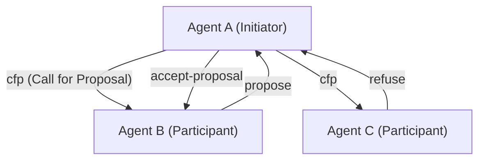
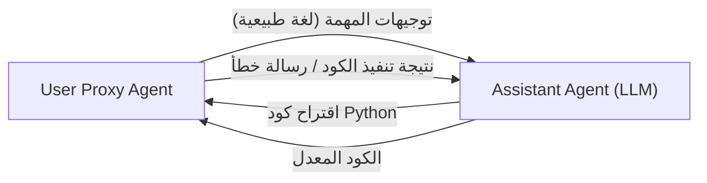

# تاريخ بروتوكولات الاتصال بين وكلاء الذكاء الاصطناعي

في تاريخ الذكاء الاصطناعي، لم يكن مفهوم **نظام الوكلاء المتعددين (MAS)**، حيث يتجمع عدد من الوكلاء الذين يمثلون "كيانات برمجية تعمل بشكل مستقل" ويتعاونون لحل مهام معقدة، جديدًا على الإطلاق. ومع ذلك، مع ظهور النماذج اللغوية الكبيرة (LLM)، تحسنت قدرات الوكلاء بشكل كبير، واكتسبت أنظمة MAS الحديثة مرونة وقدرة على التكيف لم يسبق لها مثيل.

في هذا المقال، سنشرح بالتفصيل تاريخ تطور بروتوكولات الاتصال بين وكلاء الذكاء الاصطناعي، بدءًا من بروتوكولات الاتصال الكلاسيكية مثل FIPA-ACL و KQML، وصولاً إلى آليات المراسلة في أطر عمل الوكلاء المتعددين الحديثة القائمة على LLM (مثل AutoGen و CrewAI)، بالإضافة إلى الآفاق المستقبلية نحو التوحيد القياسي.

## 1. فجر اتصالات الوكلاء: مشاركة المعرفة ونقل النوايا

في التسعينيات، ومع ازدهار الأبحاث في هندسة البرمجيات الموجهة نحو الوكلاء، تم البحث عن طرق اتصال قياسية للسماح لوكلاء متعددين بمشاركة المعرفة والتصرف بشكل تعاوني.

### KQML (لغة الاستعلام ومعالجة المعرفة)

KQML هي لغة وبروتوكول لتبادل المعلومات بين الوكلاء، تم تطويرها من خلال مشروع مدعوم من DARPA. الميزة الأكبر لـ KQML هي فصلها بين محتوى الرسالة (الحمولة) و"نية" تلك الرسالة (Performative).
على سبيل المثال، من خلال إرفاق علامات تشير إلى النية مثل `ask-if` (سؤال)، `tell` (إشعار)، `subscribe` (اشتراك) بالرسالة، يمكن للوكيل تفسير الإجراء الذي يطلبه الطرف الآخر.

### FIPA-ACL (مؤسسة الوكلاء الماديين الأذكياء - لغة اتصال الوكلاء)

ظهر **FIPA-ACL** للتغلب على قيود KQML وتوفير دلالات (semantics) أكثر صرامة. تم تصميم هذا البروتوكول، الذي وحدته FIPA (والذي تم دمجه لاحقًا في IEEE)، بناءً على نظرية أفعال الكلام (Speech Act Theory).

يتكون هيكل رسالة FIPA-ACL بشكل أساسي من العناصر التالية:

- **Performative**: نية الاتصال مثل `inform`، `request`، `propose`، `cfp` (دعوة لتقديم العطاءات).
- **Sender / Receiver**: معرفات المرسل والمستقبل.
- **Content**: المحتوى الفعلي للرسالة.
- **Language / Ontology**: اللغة المستخدمة لوصف المحتوى (مثل KIF، SL) والأنطولوجيا المشار إليها.
- **Protocol**: بروتوكول الحوار الجاري (مثل Contract Net Protocol).

ما سبق هو مثال لبروتوكول **Contract Net Protocol (CNP)** الشهير. كانت هناك عملية تعاونية محددة بوضوح حيث يطلب الوكيل الذي يرغب في تفويض مهمة (Initiator) مقترحات من وكلاء آخرين (Participants) من خلال (cfp)، ثم يخصص المهمة للوكيل الذي قدم أفضل اقتراح (accept-proposal).

## 2. نقطة التحول نحو العصر الحديث: الخدمات المصغرة و REST/gRPC

من أواخر العقد الأول من القرن الحادي والعشرين وحتى العقد الثاني، مع تطور الويب، انتقلت بنية البرمجيات من البنية الموجهة للخدمات (SOA) إلى **بنية الخدمات المصغرة**.
خلال هذا العصر، أصبح الاتصال بين الوكلاء يعتمد بشكل أكبر على تقنيات الويب القياسية (HTTP/REST، WebSockets، طوابير الرسائل، ولاحقًا gRPC) بدلاً من البروتوكولات الخاصة (مثل FIPA-ACL).

أصبح تبادل البيانات بتنسيق JSON هو السائد، وتتواصل كل خدمة (وكيل) من خلال واجهة برمجة التطبيقات (API). أدى ذلك إلى تحسين التطبيق العملي للأنظمة بشكل كبير، ولكن في الوقت نفسه فقدنا التعريف الدقيق لـ "النية" أو "الأنطولوجيا"، وأصبحنا نعتمد على مخطط (Schema) كل API.

## 3. صعود LLM والاتصال بين الوكلاء باللغة الطبيعية

في العشرينيات من القرن الحالي، مع ظهور نماذج لغوية كبيرة (LLM) عالية الأداء مثل GPT-4 و Claude 3، تغير تعريف الوكيل بحد ذاته بشكل جذري. أصبح "وكيل الذكاء الاصطناعي" الحديث كيانًا لا يعمل فقط بناءً على خوارزميات ثابتة، بل يمكنه فهم اللغة الطبيعية، والاستنتاج، واستخدام الأدوات (استدعاء الدوال).

ونتيجة لذلك، بدأت بروتوكولات الاتصال بين الوكلاء **تعود من "البيانات المنظمة (JSON/XML)" إلى "مطالبات اللغة الطبيعية"**.

### نموذج الحوار مع AutoGen

**AutoGen**، الذي طورته Microsoft، هو إطار عمل حيث يتعاون عدة وكلاء LLM لحل المهام من خلال الحوار. في AutoGen، يرسل الوكلاء رسائل لبعضهم البعض باستخدام اللغة الطبيعية.

لا يتم تعريف "البروتوكول" في AutoGen من خلال مخطط JSON صريح، بل من خلال **الدور (Role) وقواعد السلوك المكتوبة في المطالبة النظامية (System Prompt) للوكيل**. يستخدم الوكلاء سجل المحادثة (نافذة السياق) كذاكرة مشتركة، ويستنتجون السياق لتحديد الخطوة التالية.

### CrewAI والتعاون القائم على الأدوار

**CrewAI** هو إطار عمل يمنح الوكلاء "دورًا (Role)"، "هدفًا (Goal)"، و"قصة خلفية (Backstory)" محددة، ويجعلهم يعملون كفريق.
يتمحور الاتصال في CrewAI حول **تفويض المهام (Delegation)** و**تسليم النتائج**. عند تبادل المعلومات بين الوكلاء، يكون الأساس هو اللغة الطبيعية، ويتم دمج المخرجات المنظمة (مثل نماذج Pydantic) عند الضرورة لربطها بالعمليات اللاحقة.

### التحكم في الحالة باستخدام LangGraph

يتبنى **LangGraph** نهجًا لتعريف سير تحكم الوكيل كبنية رسم بياني (عقد وحواف) وإدارة حالته (State).
يتم تمثيل الاتصال بين الوكلاء كتحديث "للحالة (State object)" التي تدور داخل الرسم البياني. حيث تقوم إحدى العقد (الوكيل) بتحديث الحالة، وتقرأ العقدة التالية تلك الحالة وتنفذ العملية، وهي بنية تشبه نموذج السبورة السوداء (Blackboard).

## 4. تحديات الاتصال التي تواجه أنظمة MAS الحديثة

يُعد الاتصال المعتمد على اللغة الطبيعية باستخدام LLM مرنًا للغاية وسهل الفهم للبشر، ولكنه يطرح العديد من التحديات من منظور هندسة النظم.

1. **عدم الحتمية والغموض في التفسير**: نظرًا لأن اللغة الطبيعية تتضمن الغموض، فهناك دائمًا خطر أن يسيء الوكيل المتلقي فهم نية الرسالة (بما في ذلك الهلوسة). ويرجع ذلك إلى عدم وجود نية صارمة (Performative) كما كان الحال في FIPA-ACL.
2. **استنفاد نافذة السياق**: عند التواصل في شكل حوار، إذا أصبح سجل المحادثة طويلًا، فإنه يضغط على نافذة السياق لـ LLM، مما يزيد من تكلفة المعالجة (استهلاك التوكنات) ويؤدي إلى مشكلة ضياع المعلومات المهمة (Lost in the Middle).
3. **غياب التوحيد القياسي للاتصال**: في الوقت الحاضر، تختلف آليات الاتصال وإدارة الحالة من إطار عمل إلى آخر، مثل AutoGen و CrewAI و LangChain، ولا توجد طريقة قياسية لربط الوكلاء المبنيين باستخدام أطر عمل مختلفة ببعضهم البعض.

## 5. آفاق نحو بروتوكول قياسي جديد

لحل هذه التحديات، بدأت الجهود للبحث عن بروتوكولات اتصال من الجيل التالي لوكلاء الذكاء الاصطناعي.

### مزيج من البيانات المنظمة واللغة الطبيعية

من المتوقع أن يتطور الاتصال بين وكلاء الذكاء الاصطناعي إلى مزيج بين "البيانات الوصفية المنظمة سهلة المعالجة آليًا (JSON، Schema)" و"اللغة الطبيعية السهلة الاستنتاج بواسطة LLM (Context)".
على سبيل المثال، يمكن أن يكون للرسالة رأس JSON قياسي كغلاف (المرسل، النية، معرف المهمة المرجعي، إلخ)، وأن تحتوي الحمولة على خطوات الاستنتاج باللغة الطبيعية أو الكود.

### إمكانات MCP (Model Context Protocol)

مؤخرًا، حظي **MCP (Model Context Protocol)** باهتمام كبير كمعيار لربط نماذج LLM بالأدوات الخارجية ومصادر البيانات. في الوقت الحالي، يركز بشكل أساسي على الربط بين LLM والأدوات، ولكن هناك احتمال أن يتم توسيع مثل هذه البروتوكولات لتصبح معايير لاكتشاف القدرات (Discovery) وتفويض الصلاحيات في اتصال "وكيل لوكيل".

### شبكة الوكلاء اللامركزية

مع الارتباط بتقنيات Web3 والتقنيات اللامركزية، تستمر البروتوكولات (مثل إطار عمل AEA الخاص بـ Fetch.ai) في التطور لتمكين الوكلاء المستقلين من التواصل والتفاوض وإجراء المدفوعات بأمان عبر حدود المؤسسات والشركات. هنا، تصبح ضمان هوية الوكيل من خلال التوقيعات المشفرة والمراسلة المقاومة للتلاعب أساسًا مهمًا.

## خاتمة

بدأت بروتوكولات الاتصال بين وكلاء الذكاء الاصطناعي من أنظمة منطقية صارمة مثل FIPA-ACL، مرورًا بعصر Web API، ووصولًا إلى الحوارات المرنة المعتمدة على اللغة الطبيعية بواسطة LLM.

في المستقبل، مع الحفاظ على هذه المرونة، هناك حاجة إلى "بروتوكول قياسي من الجيل التالي" لضمان قوة النظام وقابليته للتشغيل البيني وكفاءته. إن المستقبل الذي يتفاعل فيه الوكلاء ذوو الفلسفات التصميمية المختلفة بشكل مستقل وبلغة وبروتوكول مشترك، أصبح قريبًا جدًا.
