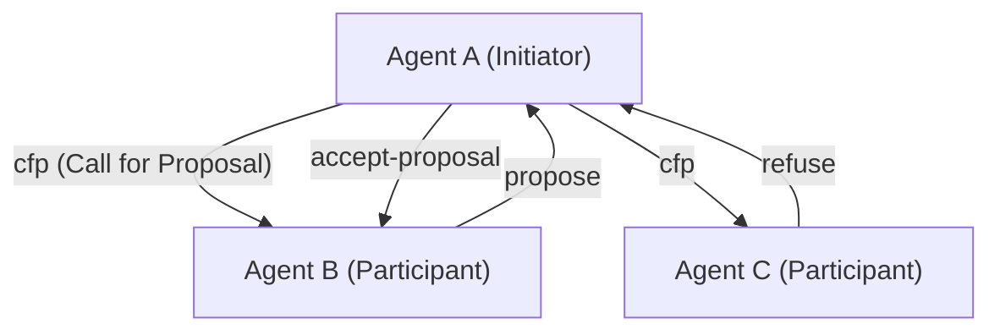
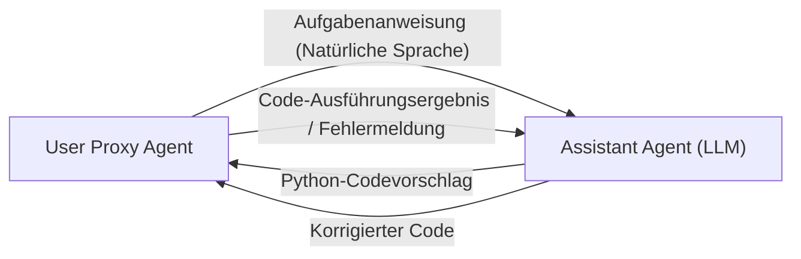

# Geschichte der Kommunikationsprotokolle zwischen KI-Agenten

In der Geschichte der Künstlichen Intelligenz ist das Konzept eines **Multi-Agenten-Systems (MAS)**, in dem mehrere Agenten – „autonom handelnde Software-Entitäten“ – zusammenkommen, um gemeinsam komplexe Aufgaben zu lösen, keineswegs neu. Mit dem Aufkommen von Large Language Models (LLMs) haben sich die Fähigkeiten von Agenten jedoch drastisch verbessert, und moderne MAS haben eine beispiellose Flexibilität und Anpassungsfähigkeit erlangt.

Dieser Artikel erklärt ausführlich die Entwicklungsgeschichte der Kommunikationsprotokolle zwischen KI-Agenten, von klassischen Agenten-Kommunikationsprotokollen wie FIPA-ACL und KQML bis hin zu den Messaging-Mechanismen in modernen LLM-basierten Multi-Agenten-Frameworks (wie AutoGen, CrewAI), und gibt einen Ausblick auf die zukünftige Standardisierung.

## 1. Die Anfänge der Agentenkommunikation: Wissensaustausch und Absichtsübermittlung

In den 1990er Jahren, als das agentenorientierte Software-Engineering intensiv erforscht wurde, suchte man nach Standard-Kommunikationsmethoden, mit denen mehrere Agenten Wissen miteinander teilen und koordinierte Aktionen ausführen konnten.

### KQML (Knowledge Query and Manipulation Language)

KQML ist eine Sprache und ein Protokoll zum Informationsaustausch zwischen Agenten, entwickelt von einem von DARPA unterstützten Projekt. Das wichtigste Merkmal von KQML war die Trennung des Nachrichteninhalts (Payload) von der „Absicht“ (Performative) der Nachricht.
Zum Beispiel konnten Agenten interpretieren, welche Aktion die andere Partei anforderte, indem sie Nachrichten mit Tags vorsahen, die eine Absicht wie `ask-if` (Fragen), `tell` (Benachrichtigen) oder `subscribe` (Abonnieren) anzeigten.

### FIPA-ACL (Foundation for Intelligent Physical Agents - Agent Communication Language)

Um die Einschränkungen von KQML zu überwinden und eine strengere Semantik bereitzustellen, wurde **FIPA-ACL** eingeführt. Dieses von FIPA (später in IEEE integriert) standardisierte Protokoll wurde auf der Grundlage der Sprechakttheorie (Speech Act Theory) entworfen.

Die Struktur einer FIPA-ACL-Nachricht besteht hauptsächlich aus den folgenden Elementen:

- **Performative**: Die Kommunikationsabsicht wie `inform`, `request`, `propose`, `cfp` (Call for Proposal).
- **Sender / Receiver**: Die Identifikatoren von Sender und Empfänger.
- **Content**: Der spezifische Inhalt der Nachricht.
- **Language / Ontology**: Die Sprache (z. B. KIF, SL), die zur Beschreibung des Inhalts (Content) verwendet wird, und die referenzierte Ontologie.
- **Protocol**: Das laufende Dialogprotokoll (z. B. Contract Net Protocol).

Das obige ist ein Beispiel für das berühmte **Contract Net Protocol (CNP)**. Es definierte klar einen kooperativen Prozess, bei dem der Agent, der eine Aufgabe delegieren möchte (Initiator), Vorschläge von anderen Agenten (Participants) anfordert (cfp) und die Aufgabe dem Agenten zuweist, der den besten Vorschlag gemacht hat (accept-proposal).

## 2. Der Übergang in die moderne Ära: Microservices und REST/gRPC

Von den späten 2000er bis zu den 2010er Jahren wandelte sich die Softwarearchitektur zusammen mit der Entwicklung des Web von der SOA (Service-orientierte Architektur) zur **Microservice-Architektur**.
In dieser Zeit stützte sich die Kommunikation zwischen Agenten zunehmend auf standardmäßige Web-Technologien (HTTP/REST, WebSockets, Message Queues, später gRPC) anstatt auf proprietäre Protokolle (wie FIPA-ACL).

Der Datenaustausch im JSON-Format wurde zum Mainstream, und jeder Dienst (Agent) kommunizierte über APIs. Dies verbesserte die Praktikabilität des Systems erheblich, gleichzeitig gingen jedoch die strikten Definitionen von „Absicht“ und „Ontologie“ verloren, wodurch eine Abhängigkeit vom Schema jeder API entstand.

## 3. Der Aufstieg von LLMs und Agentenkommunikation durch natürliche Sprache

In den 2020er Jahren veränderte sich mit dem Erscheinen leistungsstarker Large Language Models (LLMs) wie GPT-4 und Claude 3 die Definition eines Agenten dramatisch. Moderne „KI-Agenten“ arbeiten nicht mehr nur nach festen Algorithmen, sondern sind Entitäten, die natürliche Sprache verstehen, argumentieren und Werkzeuge (Funktionsaufrufe) verwenden können.

Damit einhergehend **kehren die Kommunikationsprotokolle zwischen Agenten zunehmend von „strukturierten Daten (JSON/XML)“ zu „natürlichsprachlichen Prompts“ zurück**.

### Das Dialog-Paradigma durch AutoGen

**AutoGen**, entwickelt von Microsoft, ist ein Framework, in dem mehrere LLM-Agenten Aufgaben durch Dialog lösen. In AutoGen senden sich Agenten gegenseitig Nachrichten in natürlicher Sprache.

Das „Protokoll“ in AutoGen ist kein explizites JSON-Schema, sondern **wird durch die in den Systemprompts der Agenten beschriebenen Rollen (Role) und Verhaltensregeln definiert**. Die Agenten nutzen den Gesprächsverlauf (Context Window) als gemeinsamen Speicher und entscheiden über ihre nächste Aktion, indem sie den Kontext erschließen.

### CrewAI und rollenbasierte Zusammenarbeit

**CrewAI** ist ein Framework, das Agenten klare „Rollen (Role)“, „Ziele (Goal)“ und „Hintergrundgeschichten (Backstory)“ gibt und sie als Team agieren lässt.
Die Kommunikation in CrewAI dreht sich um die **Delegation von Aufgaben (Delegation)** und die **Übergabe von Ergebnissen**. Wenn Agenten Informationen austauschen, ist die Basis ebenfalls natürliche Sprache, die bei Bedarf mit strukturierten Ausgaben (wie Pydantic-Modellen) kombiniert wird, um nachfolgende Prozesse anzustoßen.

### Zustandsbehaftete Steuerung durch LangGraph

**LangGraph** verfolgt den Ansatz, den Kontrollfluss von Agenten als Graphstruktur (Knoten und Kanten) zu definieren und den Zustand (State) zu verwalten.
Die Kommunikation zwischen Agenten wird als Aktualisierung des „States (Zustandsobjekts)“ dargestellt, das durch den Graphen zirkuliert. Es nimmt eine Architektur ähnlich dem Blackboard-Modell (Tafelmodell) an, bei der ein Knoten (Agent) den Zustand aktualisiert und der nächste Knoten diesen Zustand liest und verarbeitet.

## 4. Kommunikationsherausforderungen moderner MAS

Obwohl die natürlichsprachliche Kommunikation mit LLMs extrem flexibel und für Menschen leicht verständlich ist, ergeben sich aus der Perspektive des Systems-Engineerings einige Herausforderungen.

1. **Nicht-Determinismus und Interpretationsabweichungen**: Da natürliche Sprache Mehrdeutigkeiten enthält, besteht immer das Risiko, dass der empfangende Agent die Absicht der Nachricht missversteht (einschließlich Halluzinationen). Dies liegt daran, dass es kein striktes Performative wie bei FIPA-ACL gibt.
2. **Erschöpfung des Kontextfensters**: Wenn die Kommunikation in Form eines Dialogs erfolgt und der Gesprächsverlauf zu lang wird, belastet dies das Kontextfenster des LLMs. Dies erhöht die Verarbeitungskosten (Token-Verbrauch) und führt zu dem Problem, dass wichtige Informationen verloren gehen (Lost in the Middle).
3. **Mangelnde Standardisierung der Kommunikation**: Derzeit haben Frameworks wie AutoGen, CrewAI und LangChain jeweils unterschiedliche Mechanismen für Kommunikation und Zustandsverwaltung, und es gibt keinen Standardweg, um Agenten, die mit unterschiedlichen Frameworks erstellt wurden, miteinander zu verbinden.

## 5. Ausblick auf neue Standardprotokolle

Um diese Herausforderungen zu lösen, hat die Suche nach Kommunikationsprotokollen für KI-Agenten der nächsten Generation begonnen.

### Hybrid aus strukturierten Daten und natürlicher Sprache

Es wird erwartet, dass sich die Kommunikation zwischen KI-Agenten zu einem Hybrid aus „maschinenlesbaren strukturierten Metadaten (JSON, Schema)“ und „für LLMs leicht zu schlussfolgernder natürlicher Sprache (Context)“ entwickelt.
Zum Beispiel ein Format, das einen standardisierten JSON-Header (Sender, Absicht, Referenz-Task-ID usw.) als Wrapper für die Nachricht hat und natürliche Sprache für den Schlussfolgerungsprozess und Code als Payload enthält.

### Das Potenzial des MCP (Model Context Protocol)

In letzter Zeit hat das **MCP (Model Context Protocol)** als Standard für die Verbindung von LLMs mit externen Werkzeugen und Datenquellen an Aufmerksamkeit gewonnen. Derzeit liegt der Schwerpunkt auf der Verbindung zwischen LLMs und Werkzeugen, aber es ist möglich, dass solche Protokolle erweitert werden und zu einem Standard für die Offenlegung von Fähigkeiten (Discovery) und die Delegation von Autorität in der „Agent-zu-Agent“-Kommunikation werden.

### Dezentrale Agentennetzwerke

In Verbindung mit Web3 und dezentralen Technologien entwickeln sich auch Protokolle (z. B. das AEA-Framework von Fetch.ai) weiter, die es autonomen Agenten ermöglichen, über die Grenzen von Organisationen und Unternehmen hinweg sicher zu kommunizieren, zu verhandeln und Transaktionen durchzuführen. Hierbei bilden Identitätsgarantien von Agenten durch kryptografische Signaturen und manipulationssicheres Messaging eine wichtige Grundlage.

## Fazit

Die Kommunikationsprotokolle zwischen KI-Agenten begannen mit strengen logischen Systemen wie FIPA-ACL, durchliefen die Ära der Web-APIs und sind heute beim flexiblen, natürlichsprachlichen Dialog mittels LLMs angelangt.

In Zukunft werden „Standardprotokolle der nächsten Generation“ benötigt, die diese Flexibilität beibehalten und gleichzeitig die Robustheit, Interoperabilität und Effizienz als System gewährleisten. Eine Zukunft, in der Agenten mit unterschiedlichen Designphilosophien autonom in einer gemeinsamen Sprache und mit gemeinsamen Protokollen orchestriert werden, steht kurz bevor.
